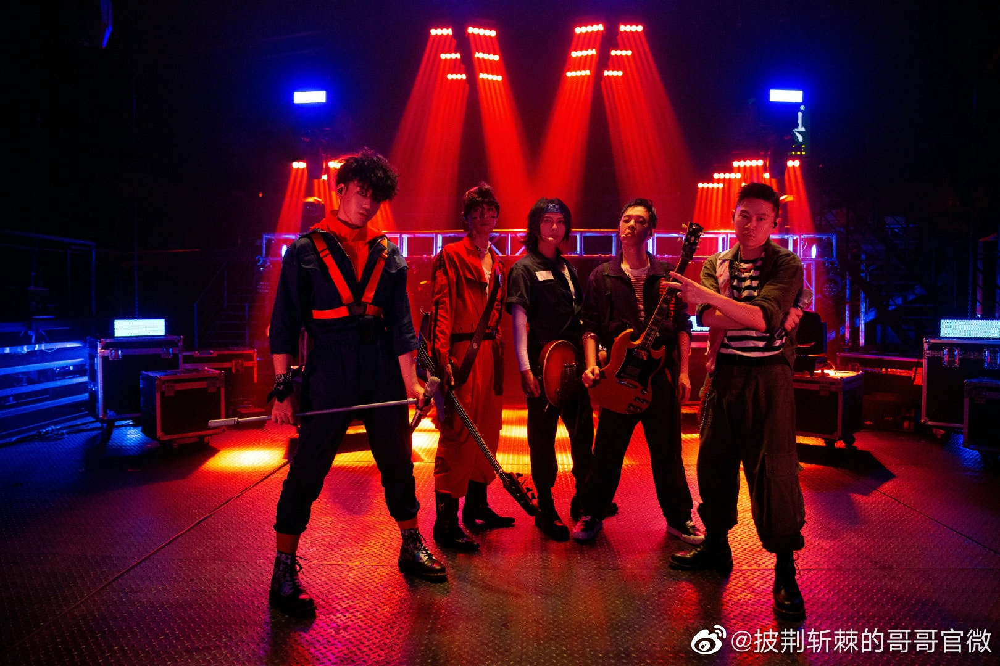
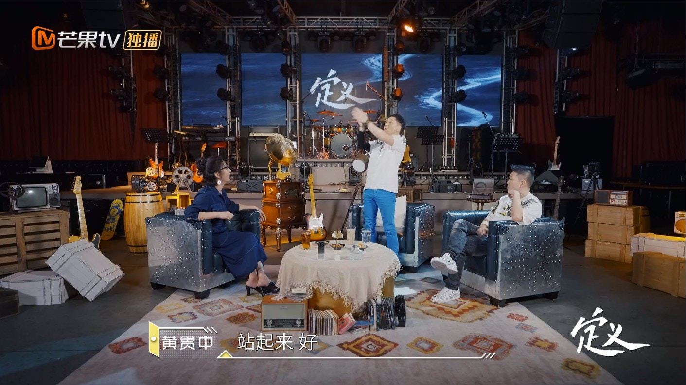
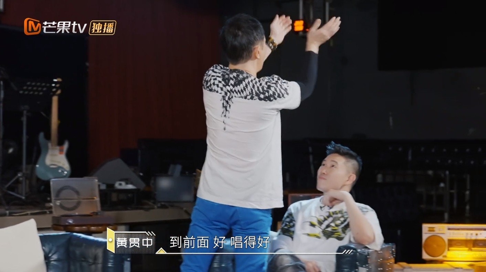
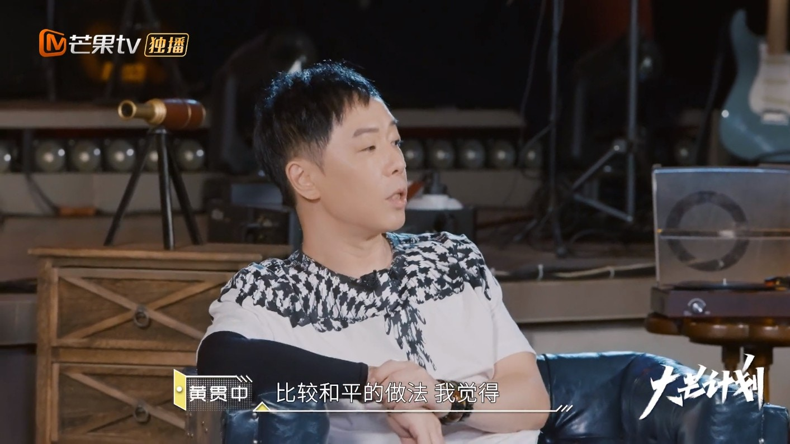
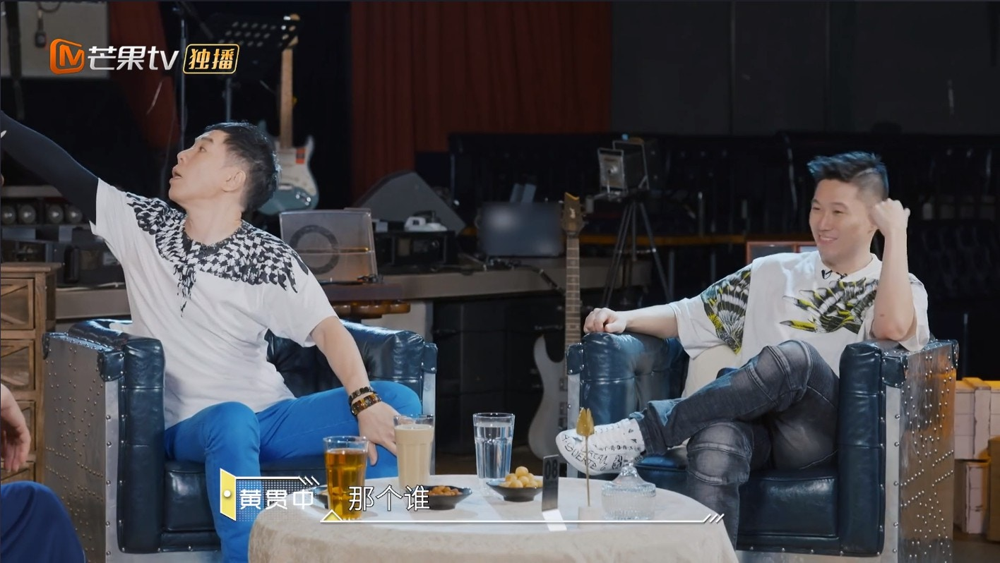
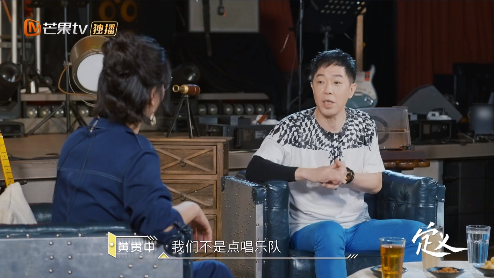
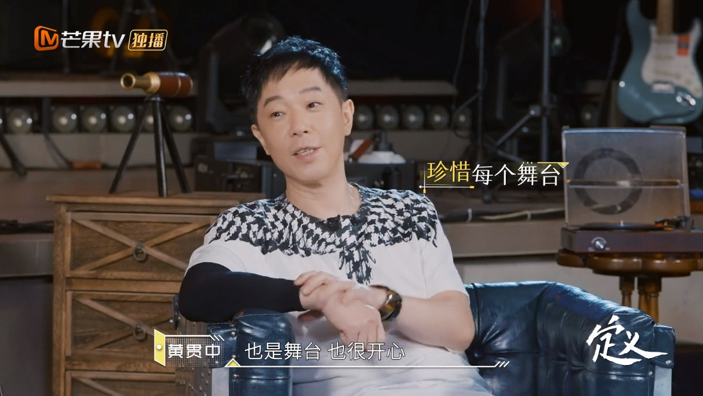
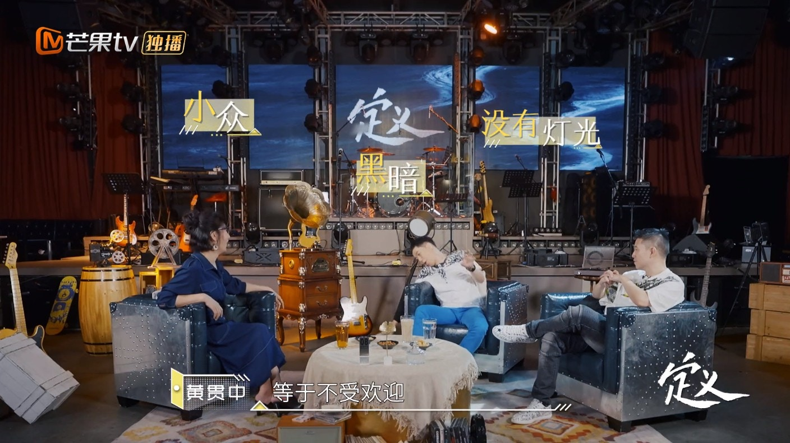
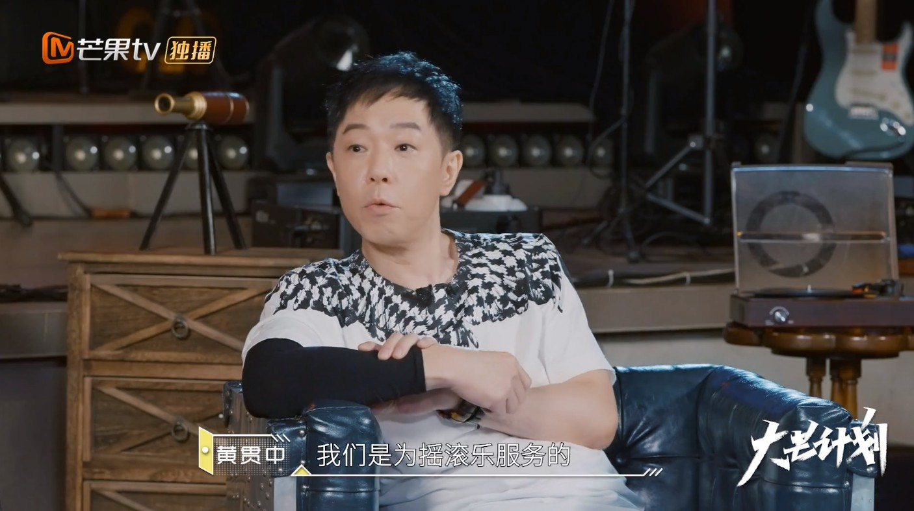

Paul同MC JIN多次組隊，感情非常好。（微博@披荊斬棘的哥哥官微）

講起在酒吧表演，Paul同MC JIN都曾經經歷過，兩人都呼籲大家在消遣的同時，不要忘記尊重舞台以及表演者。如果覺得別人太沒有禮貌時，譬如大聲猜拳或者喧嘩等，Paul表示自己通常會做一個動作：「站起來，（拍手掌）好，到（無禮貌的人）前面，（拍手掌）好，唱得好。他就會很尷尬。因為我沒有影響到你嘛，我拍手掌不行嗎？」他認為這樣是比較和平的做法。

Paul演示自己面對不禮貌的人的做法。（視頻截圖）

Paul演示自己面對不禮貌的人的做法。（視頻截圖）

比較折衷的方式。（視頻截圖）

除了作為觀眾之外，其實Paul也曾面對過不被台下客人尊重的情況：「太多了。因為早期很多時候都在玩酒吧，live house，下面確實沒有人理你的，不管你聲嘶力竭地唱什麼，他們還是不會理你。」他口中所講的，正是當年的Beyond。Paul續指道：「（客人）偶爾會拿一張紙，寫個歌名，唱這首，那個誰。然後看，什麼歌，完全不懂這首歌。給旁邊的人看，他們說，沒有看過，不會，下面的人（催你）趕快唱！（當事人）就直接會說，不好意思大哥，不會唱這首，我們是駐場樂隊，我們不是點唱樂隊，沒辦法。」

Beyond曾在酒吧駐唱，被台下觀眾忽略。（視頻截圖）

禮貌回絕客人要求。（視頻截圖）

不過，Paul坦言這樣並不會激怒自己，只是覺得這樣不禮貌：「因為我們是駐場演出的，不是卡拉OK一樣點歌的。但是他們很喜歡這樣，有的時候紙都沒有，直接喊出來。」結果就會被客人罵：「不會玩怎麼出來！為什麼要出來！做咩呀，你點搵食呀？」儘管如此，Paul還是很感恩有舞台唱自己創作的歌，也很珍惜這樣的機會。

Paul很珍惜有舞台演出。（視頻截圖）

Paul解釋當年的搖滾樂地位。（視頻截圖）

Paul拒絕表演大眾流行歌曲。（視頻截圖）
