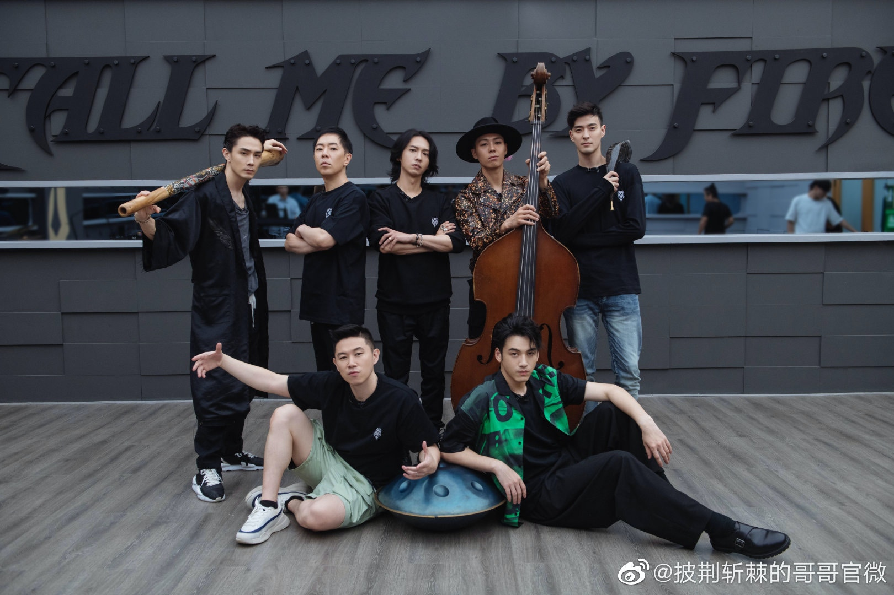
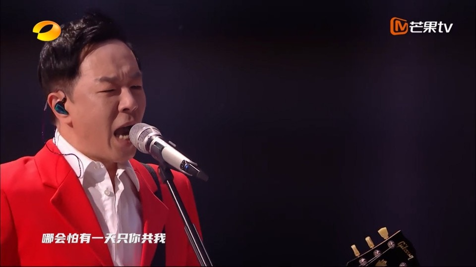
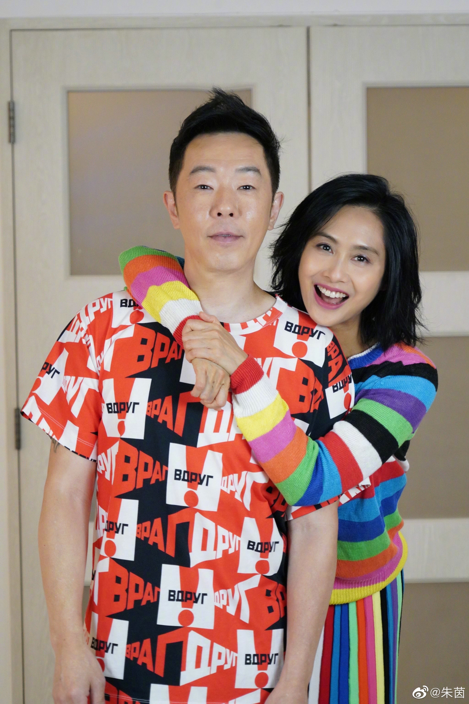
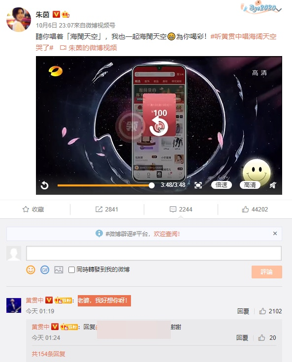
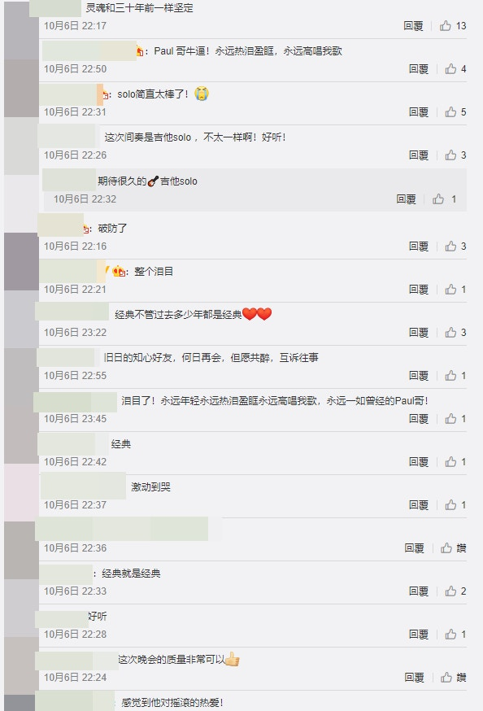

現年57歲的黃貫中最近參加內地綜藝節目《披荊斬棘的哥哥》人氣再度急升，昨（6日）更獲邀請參加支持國貨晚會《小芒種花夜》，大曬唱功演繹Beyond經典名曲《海闊天空》掀起高潮，連老婆朱茵都被他的歌聲感動到喊。

黃貫中參加《披荊斬棘的哥哥》人氣再度急升。（《披荊斬棘的哥哥》微博圖片）

身穿紅色西裝的黃貫中非常有型，一開始同內地歌手張淇共同演繹Beyond經典名曲《光輝歲月》，二人全程真聲演唱，歌聲嘹亮高音激昂，且二人聲音相當夾，令在場觀眾聽得投入，掀起了高潮。隨後，黃貫中就獨自留在台上表演彈奏結他，前奏聲音一出已經勾起不少人的回憶，事關他再次演繹Beyond名曲《海闊天空》魅力依舊，渾厚的聲音唱出不少人的青春，將整首歌的情緒發揮得相當好，令在場所有觀眾一起揮着手上的燈光棒聽他唱歌，形成閃閃花海相當漂亮，最後他還親吻手上的吉他，此舉動亦感動不少網友。

同張淇一起唱《光輝歲月》。（影片截圖）

黃貫中的歌聲掀起全場高潮。（影片截圖）

而他的歌聲除了感動觀眾之外，老婆朱茵都被他感動，在微博貼文道：「聽你唱着《海闊天空》，我也一起海闊天空，為你喝彩！」還揚言聽老公唱這首歌聽到喊。而黃貫中亦第一時間回覆對方道：「老婆，我好想你呀！」隔空放閃羨慕不少網友。而亦有不少網友大讚他是次表演相當感動人心，直言他的靈魂同三十年前一樣堅定，仍舊感覺到他對搖滾的熱愛。

另外，目前人氣高漲的他微博粉絲人數超過200萬人追蹤，在多位大灣區哥哥中排行第三位。第一位是男神代表張智霖超過2000萬人追蹤，第二位則是陳小春有超過1000萬人追蹤，而謝天華有超過160萬人追蹤 ，梁漢文有超過90萬人追蹤 ，林曉峰有超過20萬人追蹤，目前他們還沒有被淘汰，人氣相當之高。

朱茵都聽到喊。（朱茵微博圖片）

同張淇一起唱《光輝歲月》。（影片截圖）

黃貫中真聲演唱。（影片截圖）

唱得好瀲昂。（影片截圖）

（影片截圖）

（影片截圖）

全場觀眾一起揮着手上的燈光棒聽他唱歌。（影片截圖）

整個舞台好靚。（影片截圖）

（影片截圖）

最後親吻吉他。（影片截圖）

（微博圖片）

（微博圖片）
