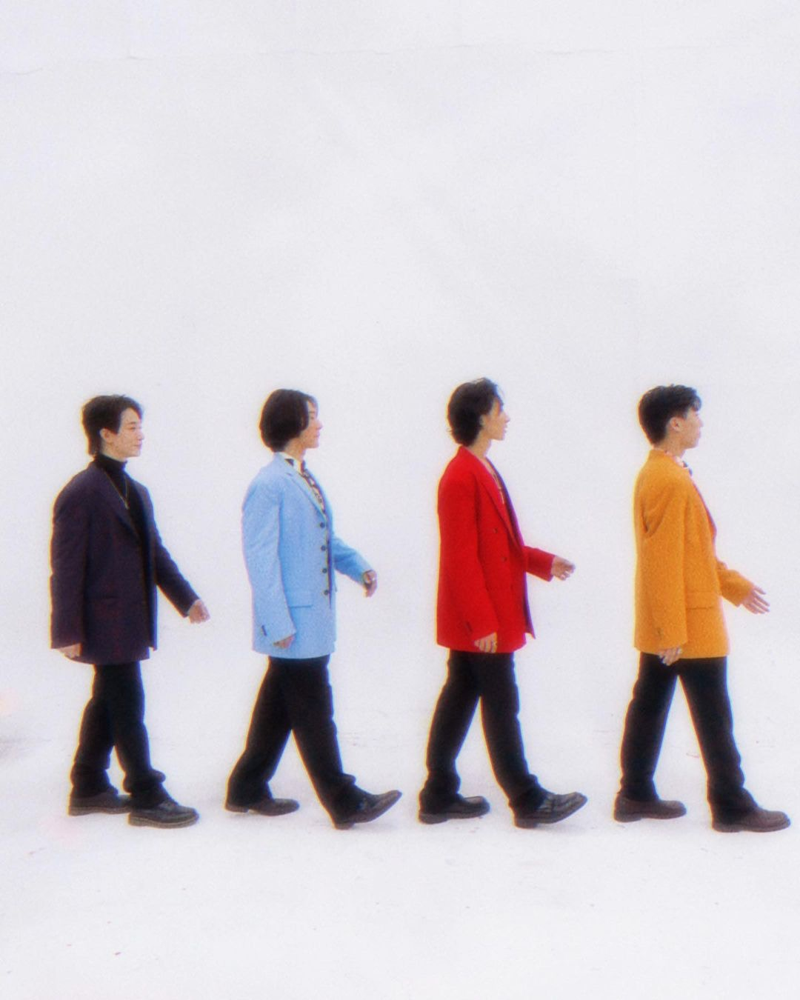
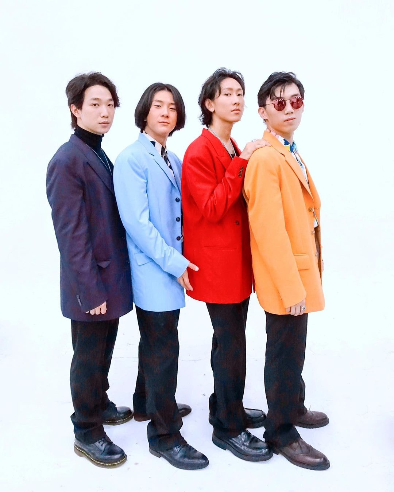
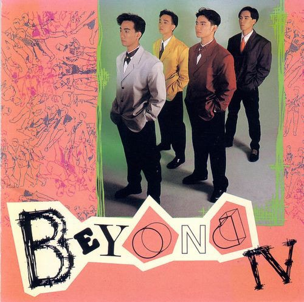
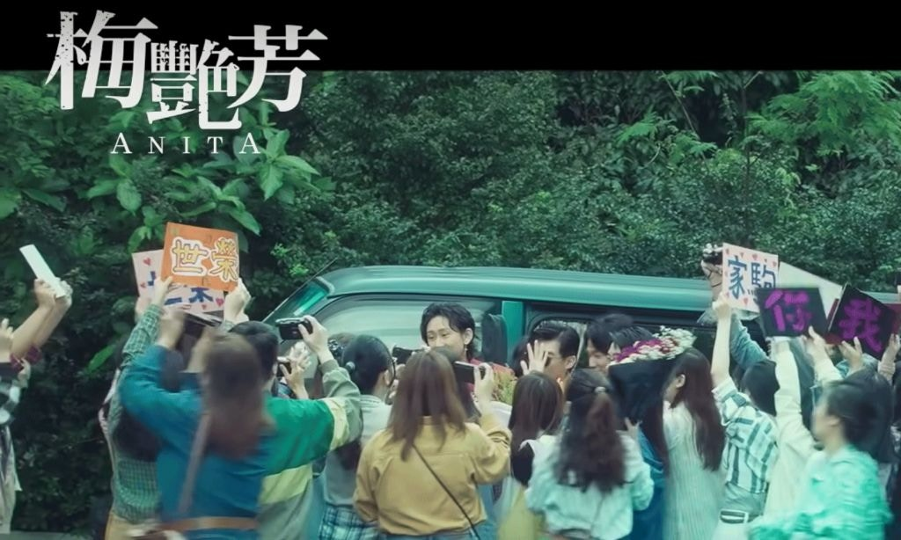

歌手張進翹（Manson），參加完《全民造星III》後，已累積了不少粉絲。事實上他早在參加《造星》前，已有參與電影拍攝工作，當中包括電影《梅艷芳》。日前，Manson就在IG上載了兩張扮演Beyond的造型照，向來被指貌似黃家駒的他，當然是飾演家駒，而《教束》周漢寧，便飾演弟弟黃家強。

從造型推敲，幾位是扮演《Beyond IV》的造型。（Manson@IG相片）

Manson（右二）扮演家駒，周漢寧（右一）扮演黃家強。（Manson@IG相片）

《Beyond IV》大碟造型。(網上圖片)

日前Manson在IG出文，更附上兩張扮演Beyond時的造型照，文中寫上︰「很榮幸有機會參與電影《梅艷芳 ANITA》，還能飾演我的偶像，這是超越夢想的經歷。」大家有看過《梅艷芳》，都會奇怪為何沒有Beyond出現，原來有關片段都已被刪走，而Manson亦有在貼文中交代︰「相信現在的《梅艷芳》，是導演認為在這個階段最適合和最好的版本，我也和很多影迷一樣，希望能夠看到未曝光的片段，讓我們一起期待。」

早在第二條預告，Manson都有閃現，但到正片就被剪走。（影片截圖）
