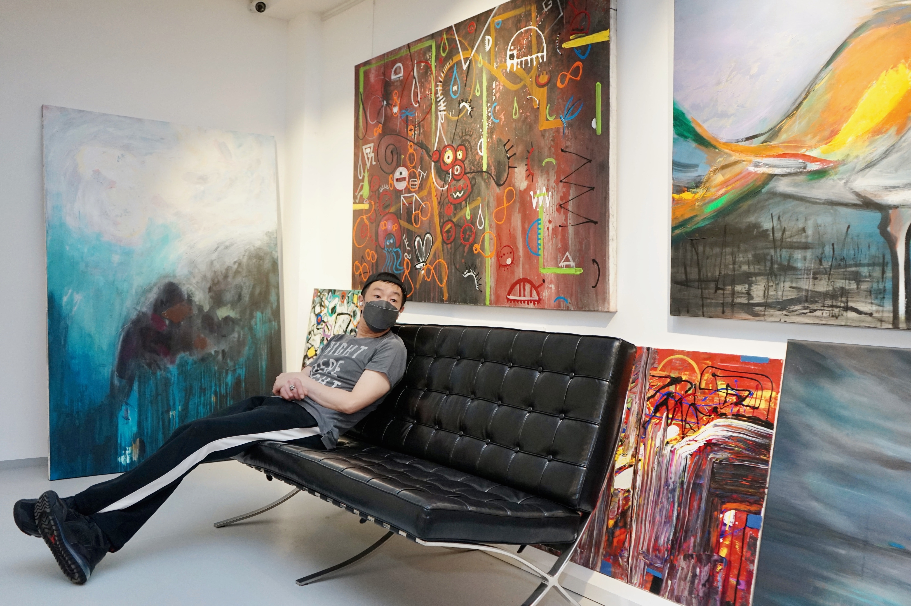
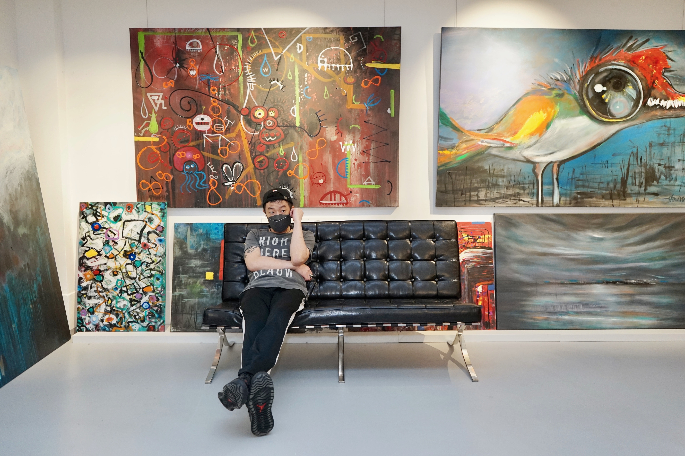
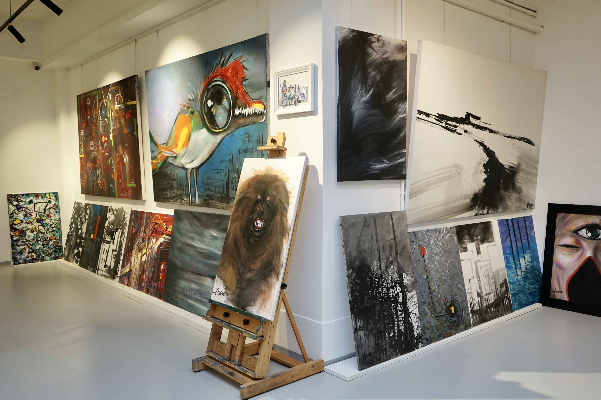
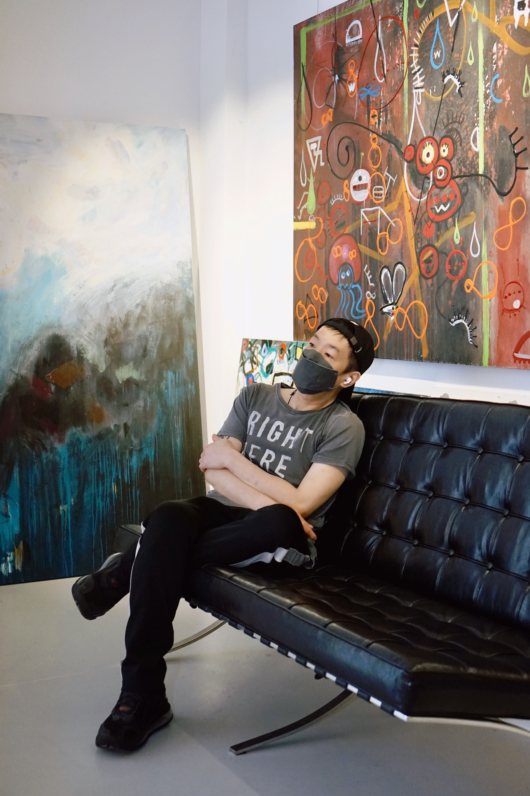
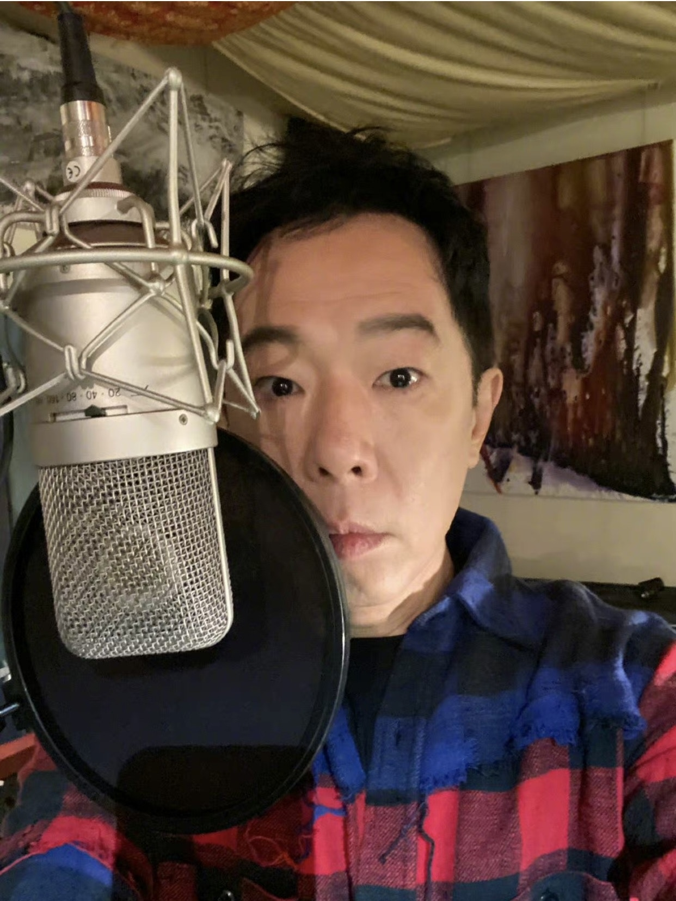

繼月初發行首支NFT音樂作品《彗星》後，「搖滾教父」黃貫中（Paul）宣告強勢回歸！近日Paul為《黄貫中歌曲翻唱大賽》擔任線上評審，不但暖男上身逐一回應粉絲提問，也寄語參賽者盡情享受舞台；席間還預告有望於年內推出全新實體專輯，用音樂回饋「中粉」。

黃貫中（Paul）日前在個人畫室為《黄貫中歌曲翻唱大賽》擔任線上評審。

黃貫中（Paul）日前在個人畫室為《黄貫中歌曲翻唱大賽》擔任線上評審

黃貫中（Paul）向來愛畫畫。

黃貫中（Paul）畫室的作品只是冰山一角。

黃貫中（Paul）認真聆聽參賽者演繹，並給予評價。

作為首位融合AI科技呈現原創歌曲並發行NFT的華語歌手，「搖滾頑童」Paul直呼好玩，也笑言與HarmoniXX的AI「合作」愉快，撞出新滋味！談到出自他手筆的《彗星》封面均與狗有緣，他笑言歌迷看到的四大結晶只是冰山一角，原來他竟親自繪畫了近六十幅畫作任君選擇：「我由出世到依家一直都有養狗，所以好鍾意畫狗，今次就順理成章做埋NFT。其實我準備咗五、六十幅畀佢哋揀，多到佢哋叫我唔好再畫，所以最後揀咗四幅。」

Paul為NFT歌曲《彗星》親自繪畫近六十個封面。

從傳統歌壇踩入NFT市場，Paul認為元宇宙的創作環境廣闊多元，有助音樂人建構更多可能性：「做音樂做咗幾十年，突然面對一個新媒體，我哋都會緊張，一開始都會有啲擔心，唔知大家接唔接受；不過NFT音樂係一種全新面貌，見到一個全新嘅音樂展現，我覺得好興奮！」他也笑言正因為音樂NFT《彗星》限量發行2000枚，更突顯每個「寶貝」獨一無二，令他一度不捨「女兒出嫁」：「我好鍾意其中幾個版本，同事都叫我自己買番，我真係有諗過買㗎！不過後來又諗，出歌都係想畀大家聽到，冇理由仲要同歌迷爭，我老婆都鬧我：『你唔好啦，搶人哋啲嘢！』」

Paul曾想購入自家NFT，卻遭到老婆朱茵反對。（微博/@黃貫中）

有人辭官歸故里、有人漏夜趕科場，人人都說唱片業式微、專輯沒落，Paul卻反其道而行，向廣大「中粉」投下震撼彈──有望於年內推出實體唱片！回溯上一隻個人專輯，已經是2013年發行的精選輯；十年磨一劍，全因為堅持做靚聲、重現音樂精神：「由作曲開始已經構思好每一粒音，呢隻碟做咗幾年喇，希望一路修正，可以喺今年內推出；中間有歌做好都會派台、儲夠就出碟，可能一隻、又或者兩隻，三隻都有機會㗎。」

暌違多年，Paul有望於年內推出全新實體專輯！（微博/@黃貫中）

至於新碟概念，Paul視它為一個交代、一份回顧，也希望藉此傳承下去：「對我嚟講係一張成績表、係我呢一生人做音樂嘅成績表，我由八幾年開始出唱片，就快四十年喇，我都希望自己有一個里程碑。有啲人會話：『你做咗幾十年仲出唱片？』因為呢個年頭出唱片真係一個好勇敢嘅行為，但係我認為我唔可以唔出，因為我係一個音樂人，希望呢隻唱片對自己有個交代。他日真係老到結他都彈唔到，我就會叫大家：『聽呢隻啦！』希望新專輯可以扮演呢個角色。」他更透露有意再出書，實行以音樂和文字為歌迷送上最窩心的禮物。
