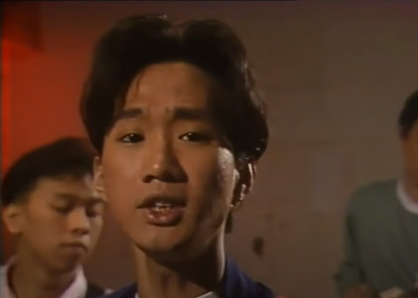
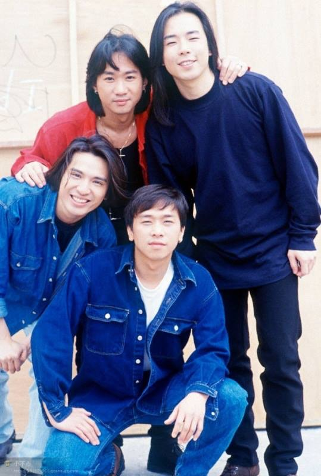
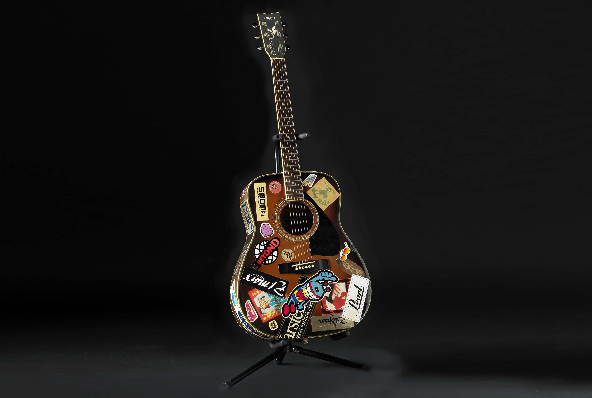
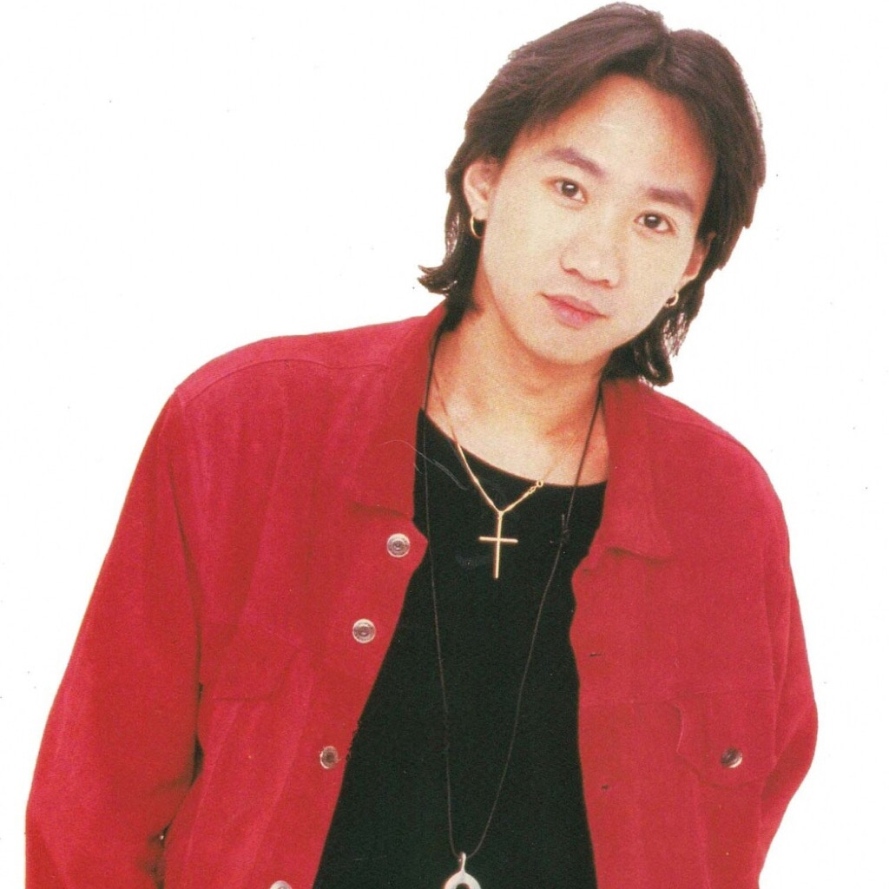
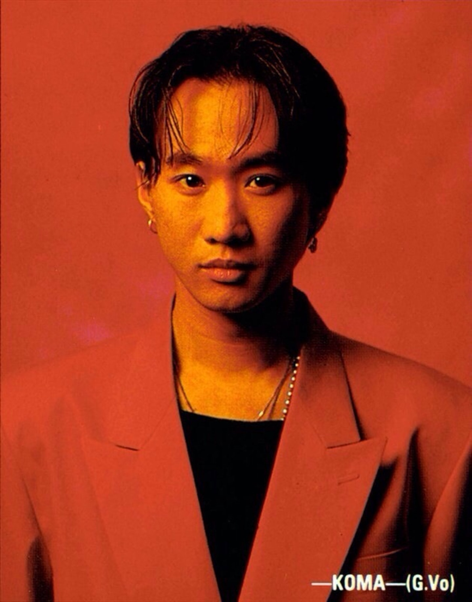
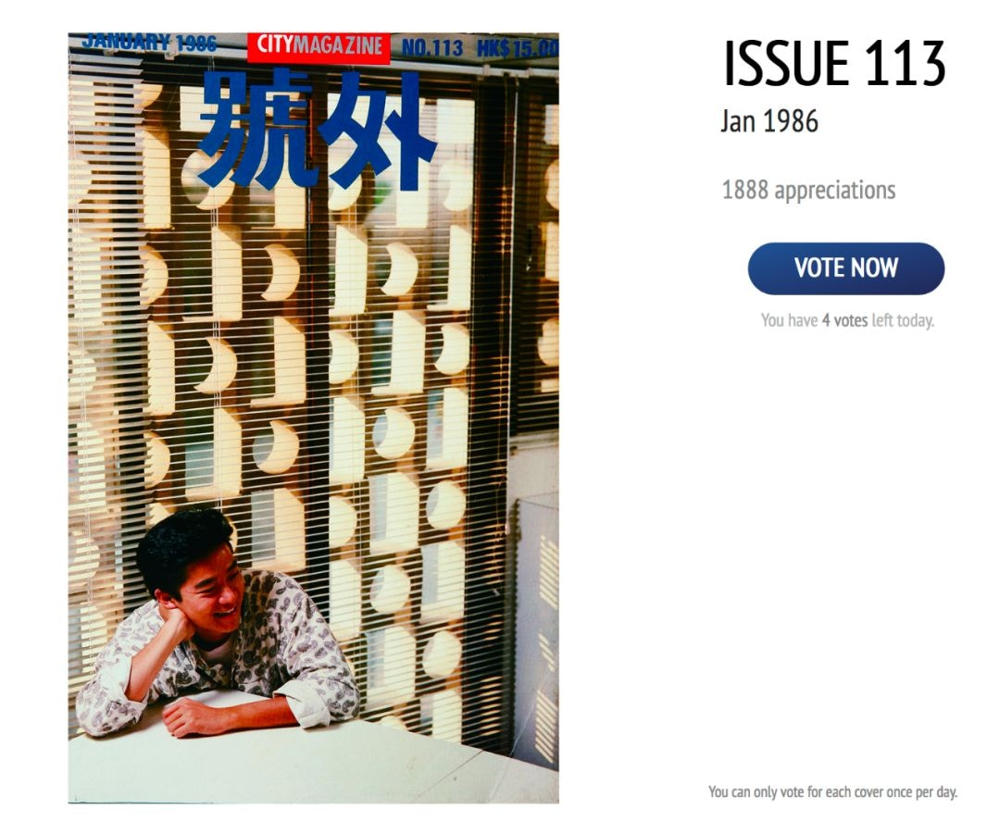

香港男歌手黃家駒（Koma）於1993年在日本離世，家駒是華語樂壇的搖滾樂代表人物，與黃家強、葉世榮和陳時安組成Beyond，後期因為陳時安離團再加入黃貫中，在Beyond中家駒擔任作曲、填詞、結他和主唱，家駒的一生中創作過數百首歌曲，大多數歌曲都流芳百世，叫人百聽不厭。家駒更是Beyond中的靈魂人物，當時更大膽批評香港樂壇，家駒的敢作敢言令人十分敬佩。家駒1993年時在日本參與電視台遊戲節目拍攝時意外受傷，留院6天後，與世長辭，終年31歲。

Paul自認沒辦法同黃家駒比較。（影片截圖）

談到Beyond的音樂，一定離不開《喜歡你》、《真的愛你》、《光輝歲月》、《海闊天空》、《誰伴我闖蕩》、《不再猶豫》等一首首扣人心弦的歌曲，Beyond的音樂對整個華語樂壇都有著舉足輕重的影響，亦是一個年代的人青春記憶，雖然隨著時間的流逝，那個時代的人已經慢慢老去，但仍然抹不掉對家駒的思念。

Beyond的音樂至今仍對樂壇有著舉足輕重的影響，亦記載了一個年代的青春記憶。（網上圖片）

今日（10日）是家駒的60歲冥壽，家駒已經離開了大家29年，但這29年大家都未有忘記過家駒，各方的好友都在家駒的冥壽時懷愐一下故人。

今日是黃家駒逝世28周年。（黃家強Facebook圖片）

黃家駒

黃家駒唱得寫得還愛心滿瀉，真的是一位巨星。(微博圖片)

2012年6月10日，黄家强上传微博。家駒，生日快樂! 50大壽! YEAH! （图源：@黃家強SteveWong）

2013年6月30日，黄家强上传微博。無論是昨天、今天、明天，無論是十年、二十年、三十年，只要是我有生之年，黃家駒這個名字，永遠都不會讓人遺忘，二哥你已經是我的信仰和信念，我相信你，就好比上帝給予世人的指示，永遠懷念你！ 這畫像我很喜歡，希望原創人不要介意我不問自取。 （图源：@黃家強SteveWong）

黃家駒已經離開大家接近25年。（黃家強微博）

黃家駒的木結他，1970年代後期，黃家強先生捐贈

黃貫中指黃家駒一直在大家心中。（黃貫中微博）

葉世榮零時零分發微博悼念黃家駒。（葉世榮微博）

Beyond主音黃家駒在日本拍攝節目時因意外離世，享年31歲。遺體運回香港後，於北角香港殯儀館設靈。同日晚上香港商業電台舉行「永遠懷念家駒」悼念音樂會，全場坐滿2600人外，大部分參與者情緒激動。翌日，靈車駛出殯儀館時，行人路上數千名樂迷衝出馬路圍着靈車，情況一度混亂。（影片截圖）

黃家駒（網上圖片）

已故Beyond樂隊主音歌手黃家駒及其弟黃家強也曾在蘇屋邨長大的知名兄弟班樂隊。(kwkpbeyond@IG)

8. 黃家駒。（網上圖片）

8. 黃家駒在日本錄影節目時從高處跌下後腦着地，留醫六天後於日本時間1993年6月30日逝世，終年31歲。（網上圖片）

16. 黃家駒一共參與過九齣電影的演出及配樂，演出中往往離不開Beyond的影子，如《開心鬼救開心鬼》飾演Behind樂隊的阿文、《Beyond日記之莫欺少年窮》中的吳駒。《籠民》的毛仔則是他的最後演出，這部電影獲得第12屆金像獎最佳影片、導演、編劇和男配角（廖啟智）四個大獎。 (電影劇照)

5. 1985年前後，黃家駒與Beyond經常在band房練習，更不時被鄰居投訴，但最後卻在那裡創作了很多成名曲。 (網絡圖片)

不少歌迷在黃家駒的生辰、忌日亦會前去拜祭。（網絡圖片）

省善真堂內亦擺放着黃家駒的靈位。（網絡圖片）

1993 年，黃家駒和陳百強相繼去世（外灘提供）

家駒私下原來都被Beyond成員們稱為「黃伯」，因為他年紀輕輕已經愛管事，更愛講人生道理，十足一位有經歷的老人。（網上圖片）

家駒私下原來都被Beyond成員們稱為「黃伯」，因為他年紀輕輕已經愛管事，更愛講人生道理，十足一位有經歷的老人。（網上圖片）

家駒私下原來都被Beyond成員們稱為「黃伯」，因為他年紀輕輕已經愛管事，更愛講人生道理，十足一位有經歷的老人。（網上圖片）

「香港沒有樂壇，只有娛樂圈」，其實這句常被媒體引用的家駒名句，並不完全合乎事實。1993年5月，Beyond在旺角的排練室接受採訪，曾經提到的原句應是「香港沒有樂壇，只有歌壇」不過媒體為了把標題放大亦稍作修改。 (網絡圖片)

黃家駒一共參與過九齣電影的演出及配樂，演出中往往離不開Beyond的影子，如《開心鬼救開心鬼》飾演Behind樂隊的阿文、《Beyond日記之莫欺少年窮》中的吳駒。《籠民》的毛仔則是他的最後演出，這部電影獲得第12屆金像獎最佳影片、導演、編劇和男配角（廖啟智）四個大獎。 (電影劇照)

「香港沒有樂壇，只有娛樂圈」，其實這句常被媒體引用的家駒名句，並不完全合乎事實。1993年5月，Beyond在旺角的排練室接受採訪，曾經提到的原句應是「香港沒有樂壇，只有歌壇」不過媒體為了把標題放大亦稍作修改。 (網絡圖片)

《樂與怒》(1993年)是Beyond轉投華納的專輯。（網上圖片）

1985年前後，黃家駒與Beyond經常在band房練習，更不時被鄰居投訴，但最後卻在那裡創作了很多成名曲。 (網絡圖片)

Beyond的作品中，不少也是跟「理想」有關，屈指一算，足足有32首作品也出現了「理想」一詞。當中包括：《海闊天空》、《真的愛你》、《喜歡你》、《大地》、《再見理想》、《誰伴我闖蕩》等等。 (網絡圖片)

Beyond的作品中，不少也是跟「理想」有關，屈指一算，足足有32首作品也出現了「理想」一詞。當中包括：《海闊天空》、《真的愛你》、《喜歡你》、《大地》、《再見理想》、《誰伴我闖蕩》等等。 (網絡圖片)

家強曾於區瑞強主持的節目《我們都是這樣唱大的II》中，透露《喜歡你》是哥哥家駒寫給初戀女友。（影片截圖）

家強曾於區瑞強主持的節目《我們都是這樣唱大的II》中，透露《喜歡你》是哥哥家駒寫給初戀女友。（影片截圖）

家強曾於區瑞強主持的節目《我們都是這樣唱大的II》中，透露《喜歡你》是哥哥家駒寫給初戀女友。（影片截圖）

家強曾於區瑞強主持的節目《我們都是這樣唱大的II》中，透露《喜歡你》是哥哥家駒寫給初戀女友。（影片截圖）
