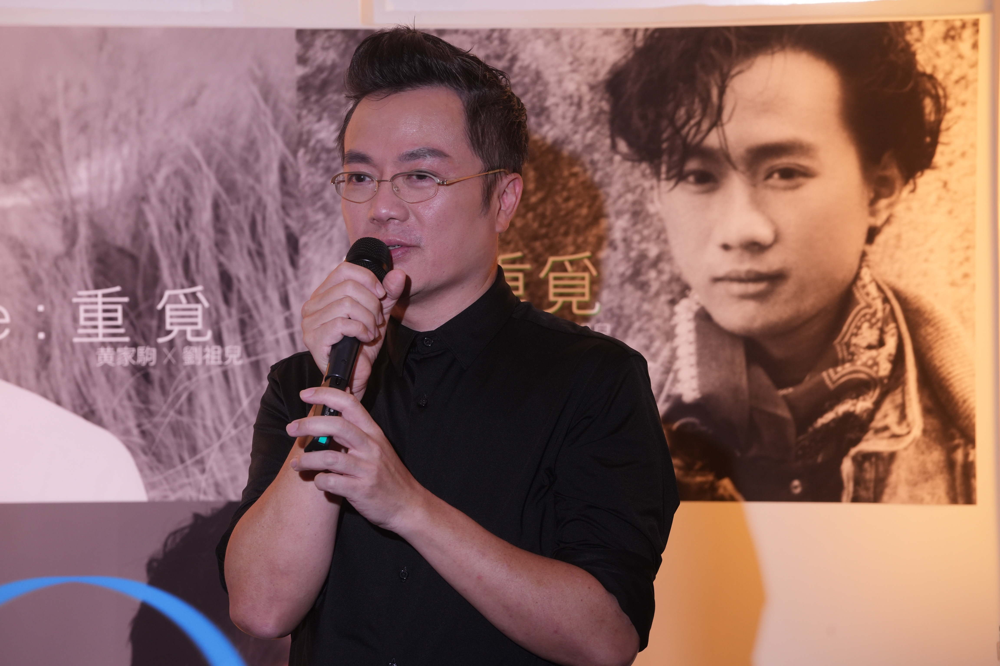
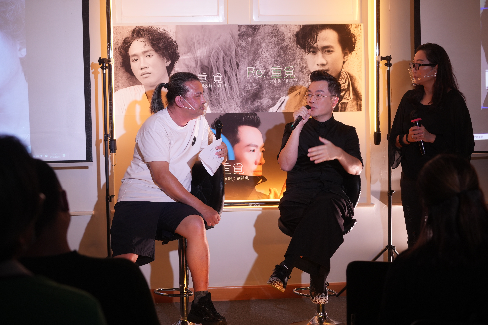

黃家駒昨日（30/6）逝世29周年，各地粉絲均有不同悼念活動，而曾於樂壇只「閃現」樂壇兩年的劉祖兒（Joi），亦藉此將黃家駒生前寫給他的歌曲《RE: 重覓》重新灌錄，更於日前舉行歌曲首播，與一眾家駒Fans及Joi的朋友分享過往與家駒相處的往事以及圓夢的感想。

劉祖兒重新灌錄黃家駒生前寫給他的歌曲《RE: 重覓》。

今次歌曲首播，Joi即場獻唱歌曲外，他坦言今次能夠推出30年前家駒寫給他的作品，圓夢之餘更鬆了一口氣，他於台上講到眼濕濕︰「每個人都應該去追夢，出呢首歌唔係要消費或者搵錢，只係覺得人生中，要完成呢件事，呢首歌嘅歌詞令我諗起好多嘢。」Joi自言自己不適合娛樂圈，亦無意「復出」做歌手，坦言很多年輕一代歌手的唱功比自己好。

劉祖兒講到眼濕濕。

提到重新灌錄這首歌，Joi找來90後音樂人為他編曲和填詞，他直言要將家駒愛幫助年輕一輩音樂人追夢的想法傳承，他說︰「他當年幫助我這位年輕人，到現在我想藉他的作品，去幫助現在的年輕人追夢，所以呢首歌特別有意思。」他同時感謝朋友特地前來捧場：「今晚係一班志同道合的人聚首，一齊講下往事，懷緬過去，真係好開心。」

劉祖兒直言要將家駒愛幫助年輕一輩音樂人追夢的想法傳承。

此外，Joi亦藉此感謝Beyond前經理人Leslie Chan，直言對方聽完《Re: 重覓》後留下訊息：「非常感動，當年家駒為Joi寫的歌，可以在今年家駒60歲生日面世。如果問，這首歌是否很重家駒的風格？我覺得不是的，反而其實比較為Joi 度身訂做，因為家駒以往寫歌時，會更考慮那位歌手比較適合什麼風格、如何演繹。」
