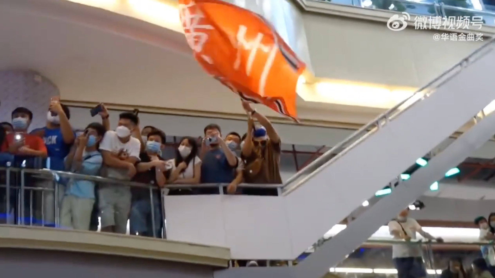
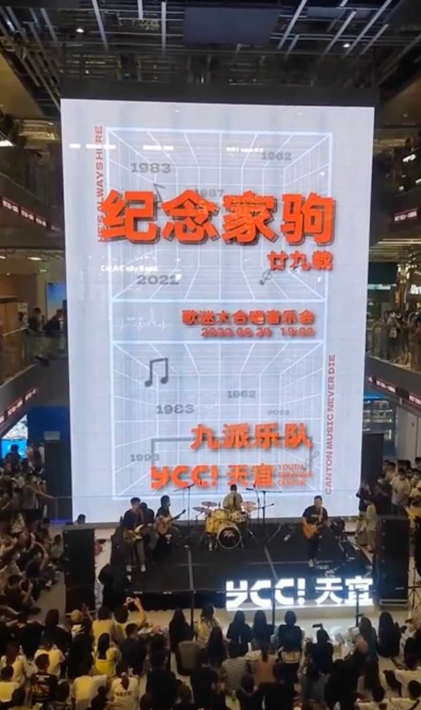
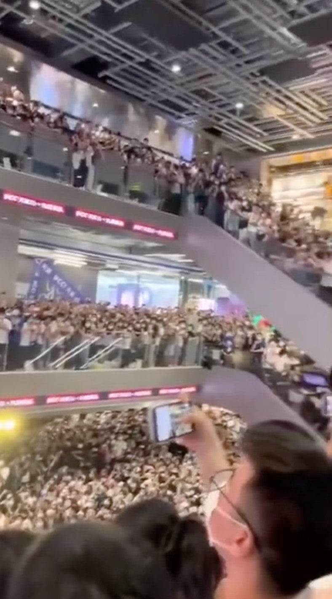
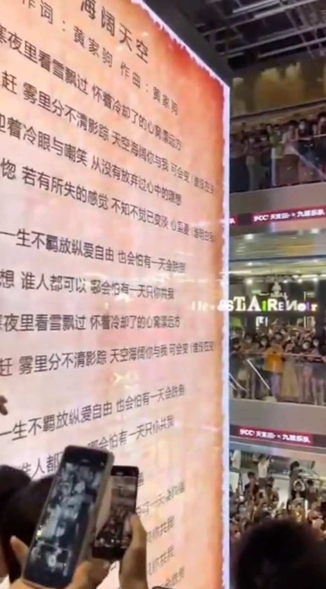
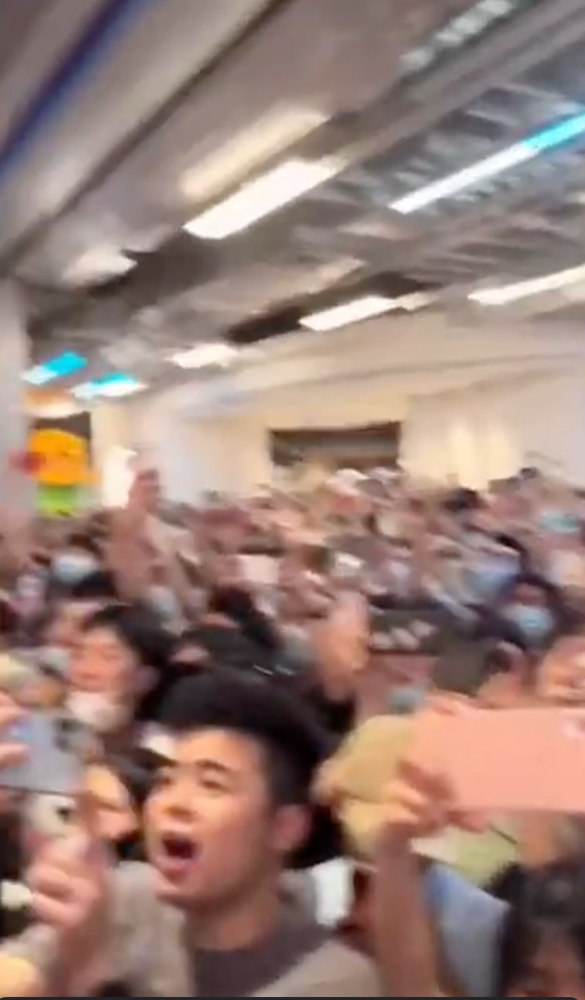
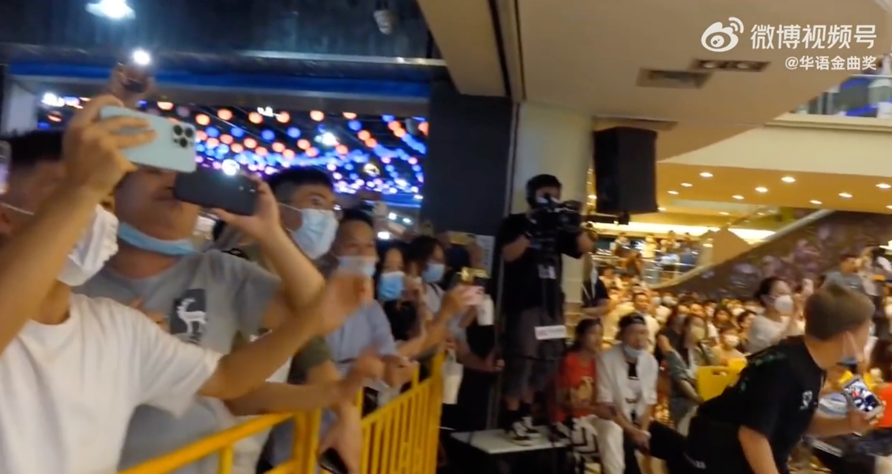
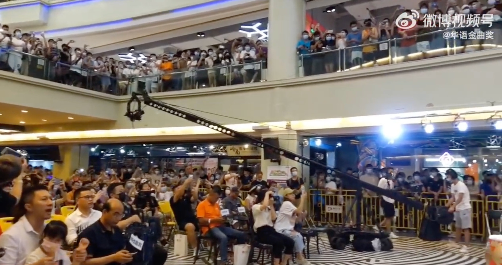
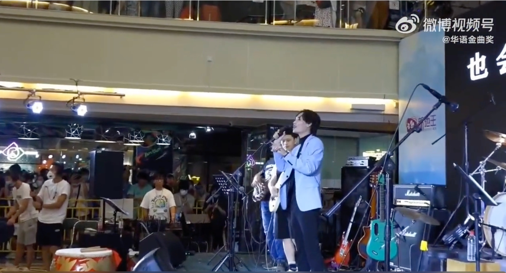
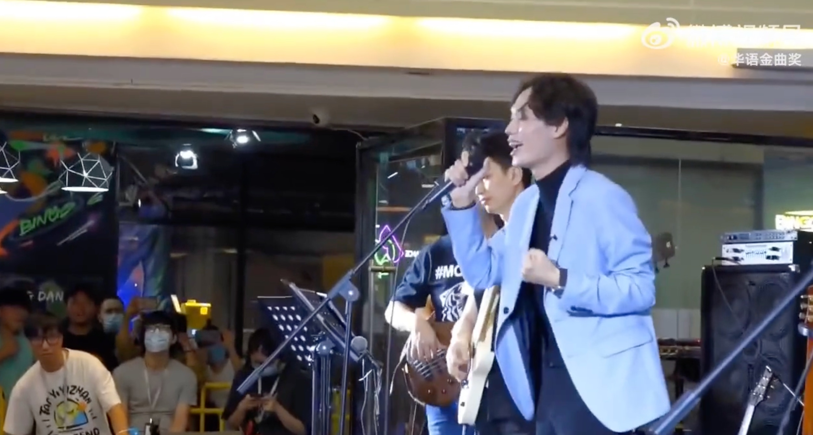
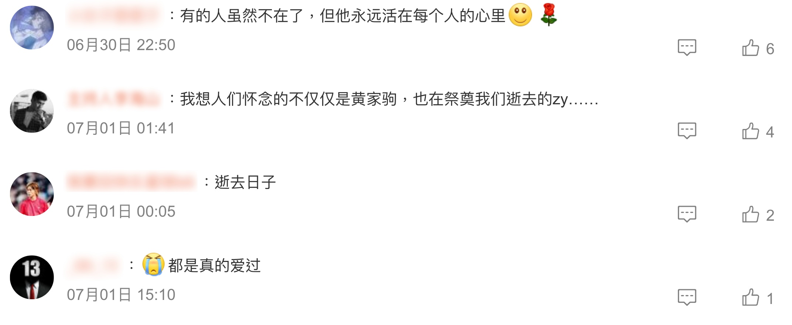

> 原諒我這一生不羈放縱愛自由，也會怕有一天會跌倒……

> 6月30日是黃家駒逝世29周年。廣州兩間商場近日舉行的黃家駒紀念活動上，都有市民集體合唱Beyond的《海闊天空》，影片上傳網絡後引起討論。

合唱《海闊天空》的兩間商場分別是YCC天宜及地王廣場。其中YCC天宜舉辦的「紀念家駒廿九載——歌迷大合唱音樂會」，海報寫著「CANTON MUSIC NEVER DIE」（廣州音樂不死），台上有樂隊和歌手領唱，台下及樓上兩層的顧客也都集體合唱，並拿出手機拍照錄影。同場活動還合唱了Beyond另一首成名曲《光輝歲月》。

「地王廣場」舉辦的《海闊天空》合唱。（影片截圖）

「YCC天宜」舉辦的黃家駒紀念合唱會。（影片截圖）

「YCC天宜」舉辦的黃家駒紀念合唱會。（影片截圖）

「YCC天宜」舉辦的黃家駒紀念合唱會。（影片截圖）

「YCC天宜」舉辦的黃家駒紀念合唱會。（影片截圖）

「YCC天宜」舉辦的黃家駒紀念合唱會。（影片截圖）

「地王廣場」舉辦的《海闊天空》合唱。（影片截圖）

「地王廣場」舉辦的《海闊天空》合唱。（影片截圖）

「地王廣場」舉辦的《海闊天空》合唱。（影片截圖）

「地王廣場」舉辦的《海闊天空》合唱。（影片截圖）

地王廣場的活動規模相似，不過領唱者的歌聲就更加突出，其歌唱時廣東話帶有明顯口音，唱畢一段後則用普通話向台下呼喚：「尖叫聲在哪裏！？」席間有觀眾帶有寫有繁體字「廣州」的旗幟揮舞。

**影片引發討論，不少網民都對黃家駒表達懷念：**

> 「有的人雖然不在了，但他永遠活在每個人的心裏」
> 「我想人們懷念的不僅僅是黃家駒，也在祭奠我們逝去的zy……」
> 「黃家駒不在，音樂傳達的精神還在」

值得一提是，官媒央視新聞6月29日亦釋出一段影片，是由北京、廣州、深圳、香港四地的音樂愛好者，用結他、鋼琴、嗩吶等多種樂器，雲端合奏「記憶中的香江旋律」，當中亦包括《海闊天空》一曲，另外還有《東方之珠》、《愛你一萬年》、《滄海一聲笑》和《紅日》。

《海闊天空》於1993年創作，作曲、作詞及主音均為樂隊主唱黃家駒。歌曲以追求音樂夢想為主題，也滲入了Beyond成立10年的感情。Beyond同時亦錄製了日文版，但製作完成後不足2個月，黃家駒於日本意外身故，成為其絕響作。

《海闊天空》此後見於籌款節目等多種場合，並曾一度成為香港示威運動中的常見合唱曲目，至今仍然在香港及華人地區保持極高知名度。2013年11月9日，亞足聯冠軍聯賽決賽開始前，全場五萬人高唱Beyond《海闊天空》，紀念黃家駒，同時對廣州恆大加油打氣。
