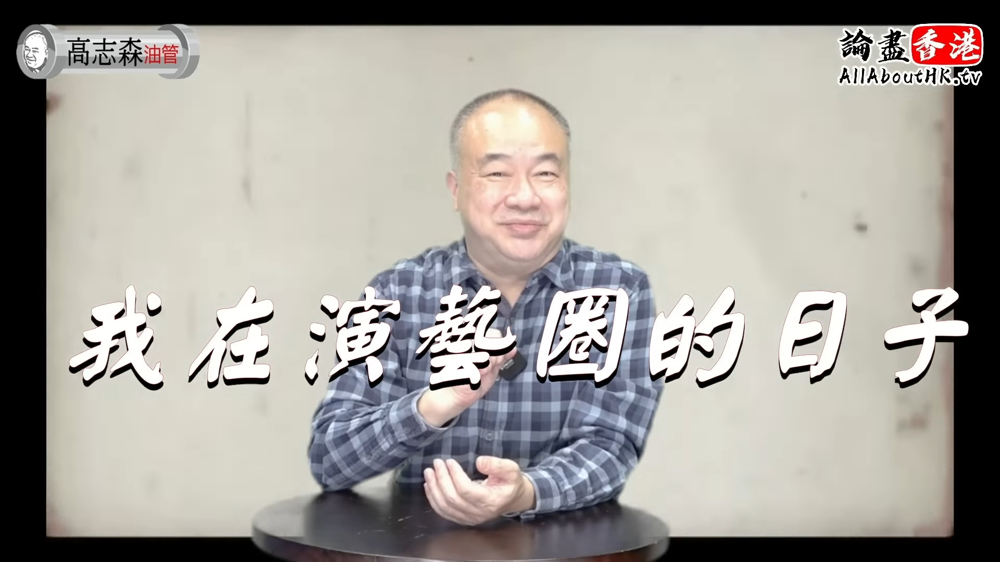
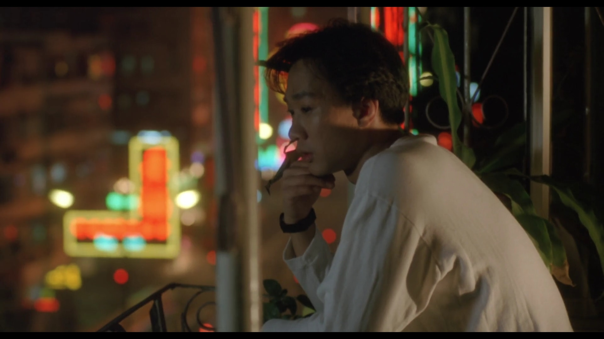
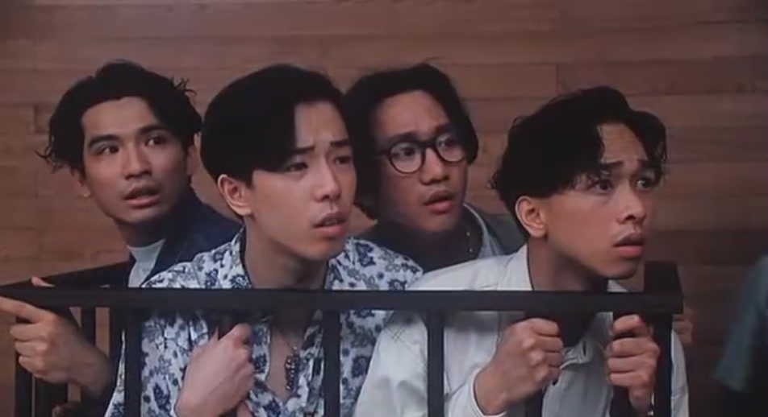

高志森提到跟Beyond合作過兩部電影，分別是《開心鬼救開心鬼》與《Beyond日記之莫欺少年窮》。其實當年Beyond參與的電影不多，高志森自稱是跟他們合作得最緊密的導演，尤其跟領軍人物家駒溝通最緊密，從工作上了解了家駒的為人。

高志森拍片分享跟不同藝人合作的經歷。（影片截圖）

家駒凡事都親力親為，對於劇本、拍攝通告、服裝造型、配樂及宣傳都一絲不苛，跟高志森有商有量，高對他的評價是：「說話不多，但直接到位，為人決斷、不囉嗦，十分為人著想」，高認為以前或現代的年輕人，都未必會先替對方著想，但當年只得廿幾歲的家騎卻做得到，所以感受好強烈。

高志森大讚家駒有領袖風範。（電影截圖）

高志森亦提到家駒十分照顧弟弟家強，記得有一場戲家強被倒吊在窗外，先後拍了4個Take，每次一嗌Cut，家駒都會立即衝去捉實家強，高形容成件事：「好著緊，有一種愛喺裡面」。

當年Beyond爆紅工作滿檔，靠家駒安排日程。（電影截圖）

Beyond出道時予人反叛的形象，然而高志森指出家駒其他非常守規矩，當年他們到新加坡宣傳電影，Beyond四子想去吸煙，當地工作人員表示要到禁煙區，但亦可「隻眼開、隻眼閉」讓他們到後樓梯吸煙，家駒聽罷堅持要去禁煙區，就算地方狹小又當眼都沒所謂。
