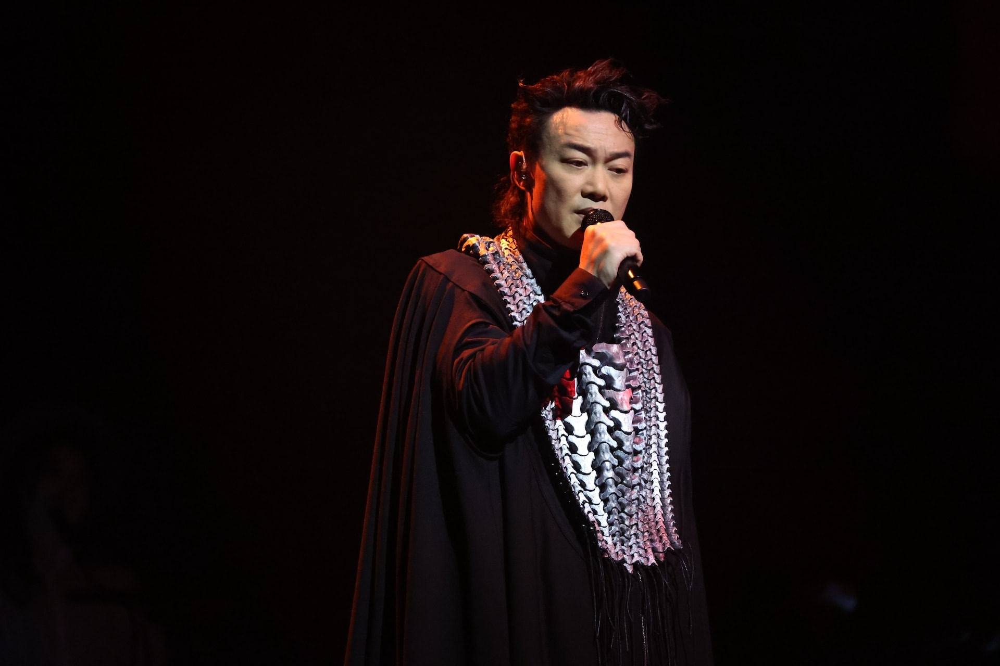
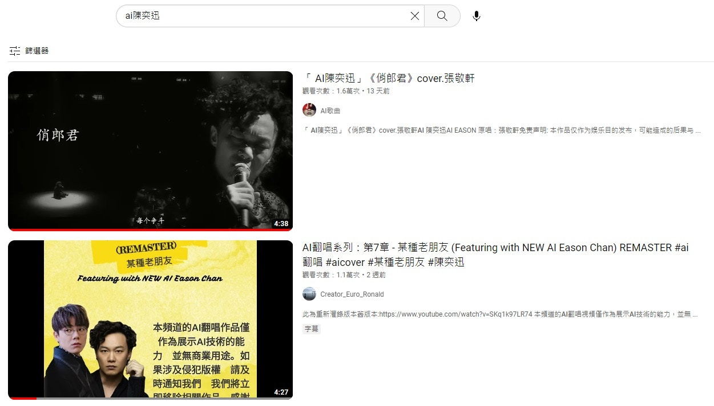
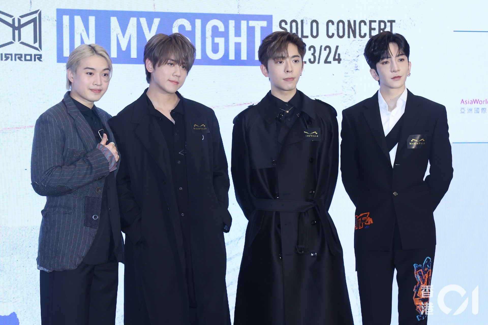

AI崛起，很多人都說各行各業日後都會被人工智能取代和淘汰，歌手又得唔得呢？早前「AI孫燕姿」在網絡引起熱話，以幾乎跟孫燕姿一模一樣的聲線，翻唱其他歌手的歌曲，粉絲聽完激讚「連換氣聲都能清晰聽到」，就連孫燕姿本人聽完都自嘲是「冷門歌手」，並說：「而我的AI角色也成為了目前所謂的頂流，畢竟該怎麼跟一個每幾分鐘就能推出一張新專輯的『人』比呢？」又指凡事皆有可能，「我認為思想純淨、做自己，已然足夠。」

AI孫燕姿網上爆紅，孫燕姿曾撰長文剖白心聲，自嘲已是「冷門歌手」，AI才是頂流。（fb@孫燕姿 Sun Yanzi ）

而近日這種現象都蔓延到香港歌手，AI陳奕迅（Eason）已經「出道」，有人用AI技術，把Eason的聲線翻唱多首大熱歌曲。由於林家謙《某種老朋友》推出時，很多樂迷都說歌曲的唏噓感很適合Eason唱，有網民因而製作出AI Eason版的《某種老朋友》，以及張敬軒《俏郎君》等等。Eason一向是樂迷心目中的「原唱殺手」、「感染王」，有人聽完就在討論區開Post，指只要將所有歌都換成AI Eason翻唱，就立即變神作，甚至誇張指出「將全部歌換晒陳奕迅唱，就係香港樂壇未來嘅出路！」

網絡上愈來愈多AI陳奕迅翻唱歌。（資料圖片／陳順禎攝）

於網上打「AI陳奕迅」，會有很多歌曲，部分點擊過萬。（網上圖片）

有網民留言說Eason的聲底唱咩都好聽，又稱：「陳奕迅要失業了！」不過亦有人說即使形似，神都不似，雖然聲線聽落都真係幾可亂真，不過咬字以及Eason的強項感情等，似乎仍有好大進步空間，某些歌像是Siri唱歌般逐個字吐出，聽起來不順耳；有些歌更是有鄉音，網民都問：「大陸版陳奕迅？」「聽耐咗怪怪哋。」「似布志綸多啲。」不少人貪得意留言點唱其他翻唱歌，當中最多人提名的就是MIRROR，希望聽到Eason翻唱姜濤、盧瀚霆等，想對比兩者唱功。

網民表示最想聽AI Eason翻唱MIRROR歌曲。（資料圖片／梁碧玲攝）

除了Eason外，甚至連已故歌手的AI都有，包括：AI黃家駒、AI張國榮，其中AI黃家駒翻唱Dear Jane的《到底發生過什麼事》就獲得不錯點擊，有Beyond粉絲邊聽邊喊，藉此懷緬即將踏入61歲生忌的家駒。儘管這種技術連死人都可以翻生，但短期內似乎仍未能取代原有歌手，至少在感情上還未可以。不過，以科技一日千里的發展速度，也不排除有日AI連這個問題都解決得到。

YouTube上有名為「家駒AI」的頻道。（網上截圖）

不少Beyond粉絲聽到家駒的翻唱歌都超級感動，有人甚至邊聽邊喊。（網上截圖）
