1993年6月30日，Beyond靈魂人物黃家駒從高台跌下，離開了我們。沒有家駒的日子已三十年，但Beyond的音樂仍對樂壇有著舉足輕重的影響，亦記載了一個年時代的青春記憶。昨晚（24日）無綫播出特備節目《永遠光輝 黃家駒》，記錄了不少Beyond與家駒生前的珍貴片段。

沒有家駒的日子已三十年。（節目畫面）

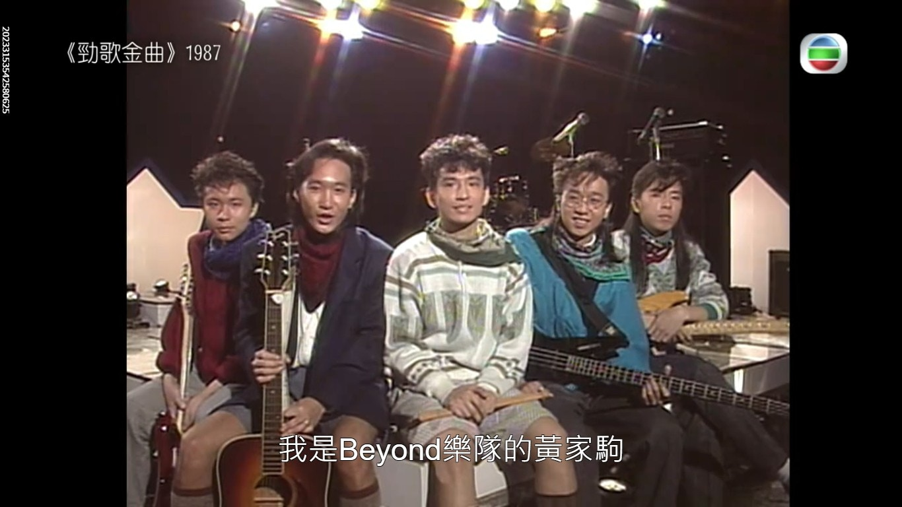
Beyond的音樂仍對樂壇有著舉足輕重的影響，亦記載了一個年時代的青春記憶。（節目畫面）

節目除了回故樂家駒及Beyond的經典作品，亦記錄了Beyond的非洲親善之旅，這一趟遠行不但成立了「Beyond第三世界基金」，亦是家駒創作了《誰伴我闖蕩》、《Amani》等歌曲的靈感。

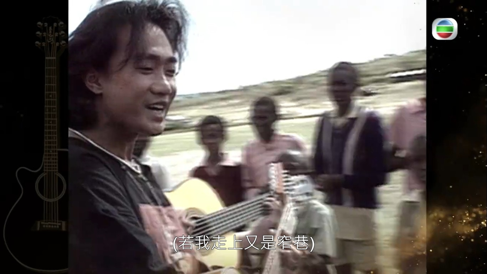
家駒生前熱心公益，更到非洲探訪。（節目畫面）

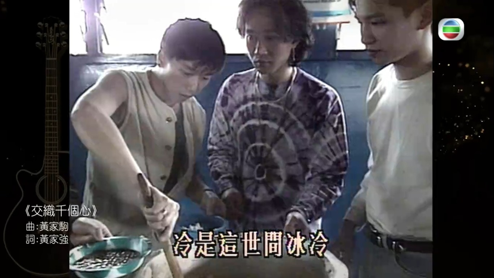
家駒生前熱心公益，更到非洲探訪。（節目畫面）

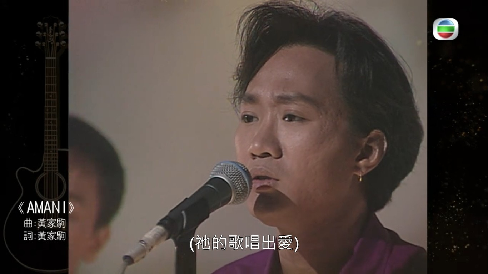
家駒生前熱心公益，更到非洲探訪。（節目畫面）

雖然家駒已經離開了我們30年，但我們仍能夠聽到家駒未曾面世的作品。肥媽在節目中透露黃家強找她，表示哥哥家駒生前寫過一首歌給自己，當時一直未有發布歌曲，並希望為早前了紀念黃家駒而將歌曲全球發行：「其實這個故事我聽了很多年，都有十幾廿年前，家強有日同我講，其實家駒寫了首歌給你。我話，真係好，如果有機會唱就好。」

家駒生前曾為肥媽寫下未發布遺作《感激這對手》。（節目畫面）

肥媽指自己在錄音時，一直都想著Beyond及家駒，哽咽說：「其實我都有同家駒講，因為我真係冇時間聽呢首歌，我淨係（錄音）前兩日聽過一次，我同家駒講『你幫幫我』，我聽咗兩次入去（錄音）就得，我覺得佢都有幫我。我諗唔到佢會寫呢隻歌畀我，好觸動到我嘅心，真係我嘅榮幸。」

今年年初有報道指，肥媽在開騷前要先錄製一首歌，這首正正就是黃家駒為肥媽撰寫的歌，經過一年多的傾談及修改歌詞，終於取得內地發行許可，正式可以錄音，並希望能於演唱會唱出來。

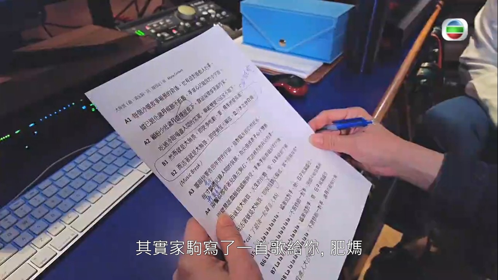
今年年初有報道指，肥媽在開騷前要先錄製一首歌，這首正正就是黃家駒為肥媽撰寫的歌，經過一年多的傾談及修改歌詞，終於取得內地發行許可，正式可以錄音。（節目畫面）

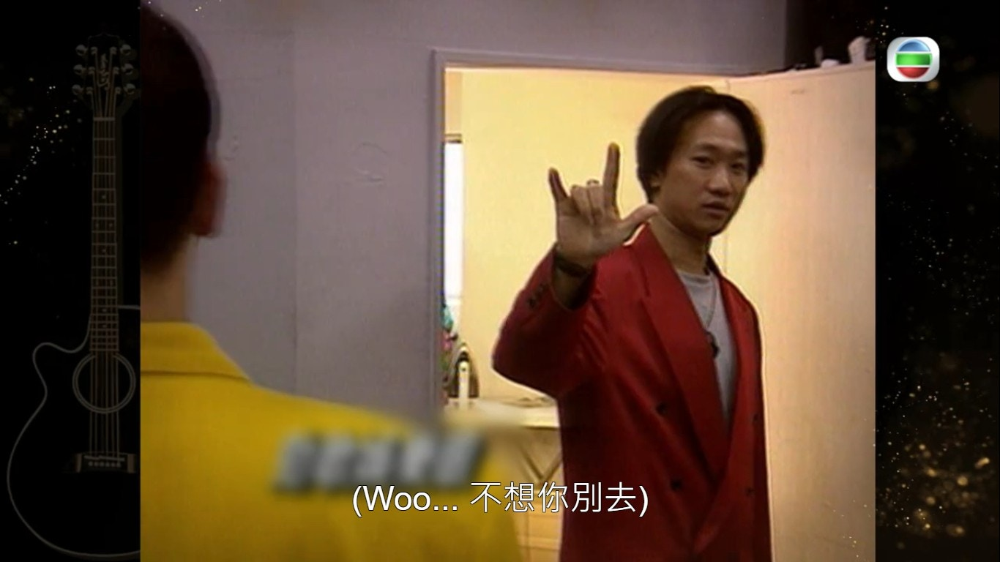
Beyond的音樂仍對樂壇有著舉足輕重的影響。（節目畫面）

點擊下圖看更多黃家駒及Beyond的珍貴片段：

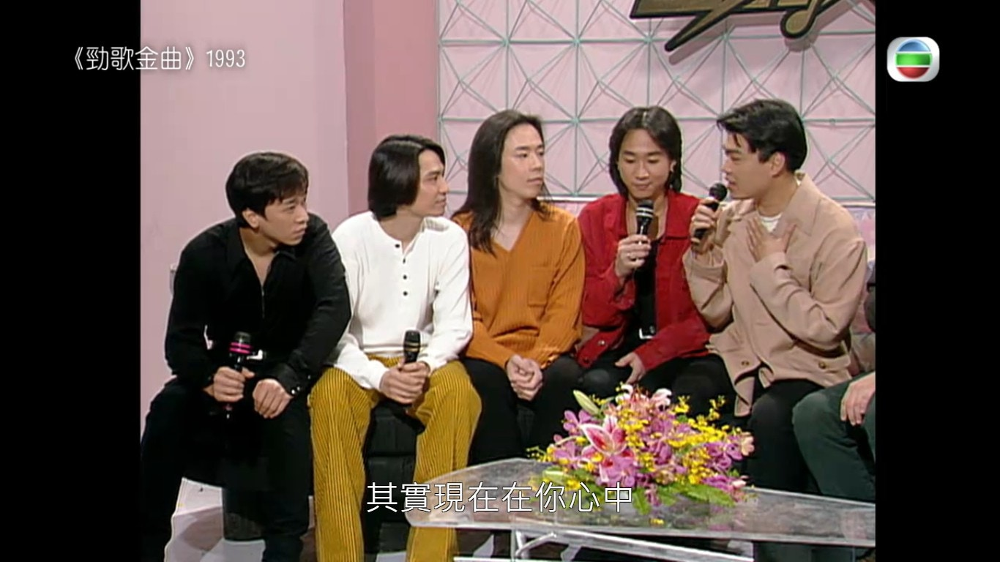
節目中記錄了不少Beyond及家駒的珍貴昔日片段。（節目畫面）

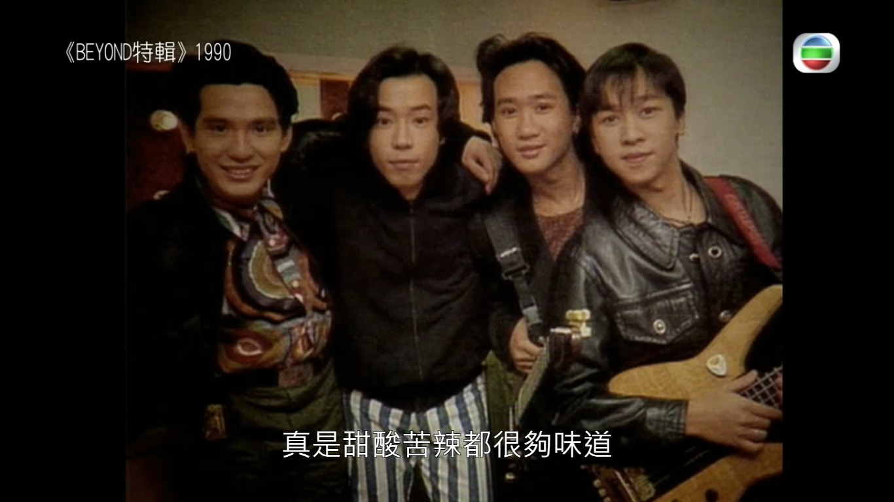
節目中記錄了不少Beyond及家駒的珍貴昔日片段。（節目畫面）

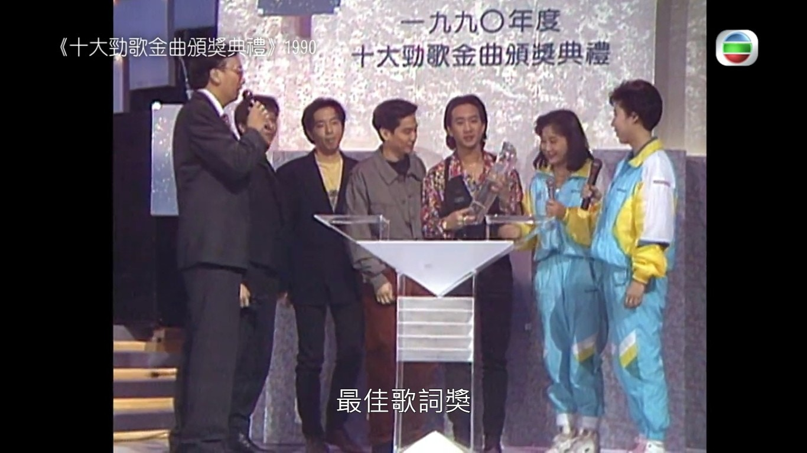
節目中記錄了不少Beyond及家駒的珍貴昔日片段。（節目畫面）

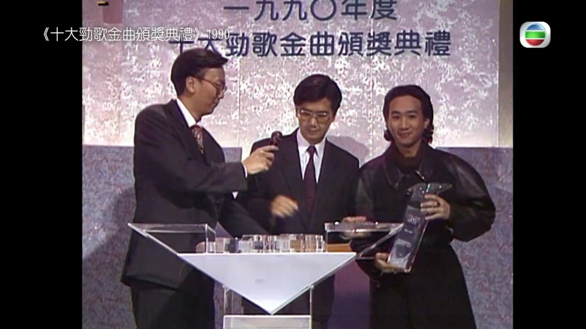
節目中記錄了不少Beyond及家駒的珍貴昔日片段。（節目畫面）

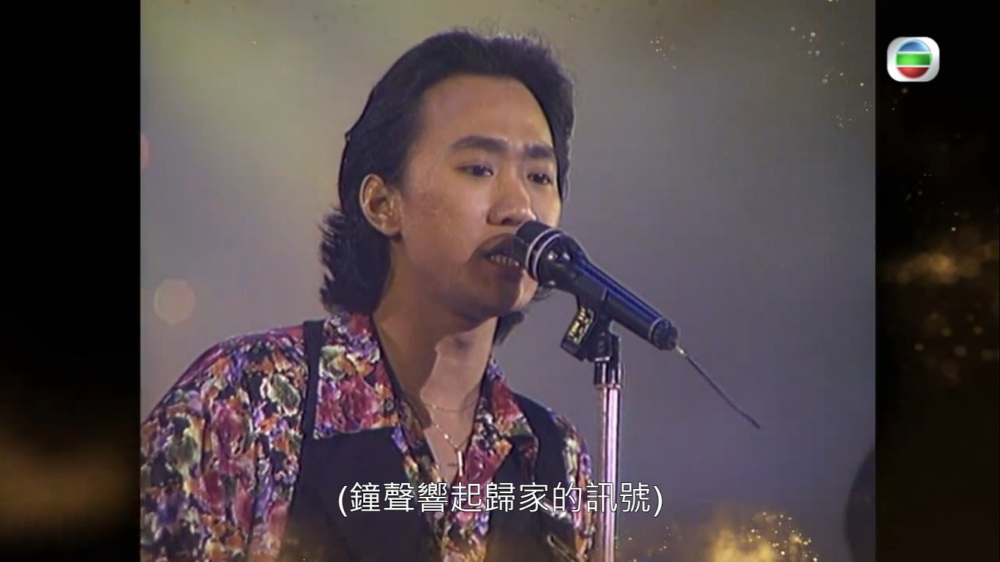
節目中記錄了不少Beyond及家駒的珍貴昔日片段。（節目畫面）

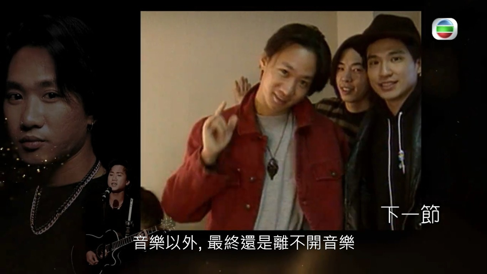
節目中記錄了不少Beyond及家駒的珍貴昔日片段。（節目畫面）
