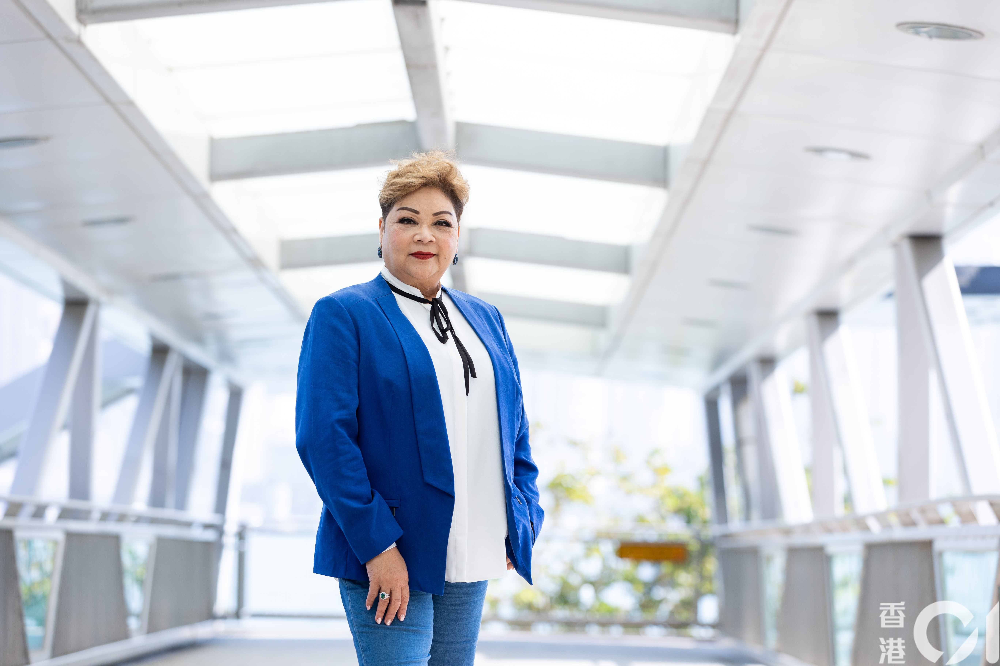

為了紀念BEYOND靈魂人物黃家駒逝世30年，周六晚（24日）無綫播出特備節目《永遠光輝 黃家駒》，記錄了不少Beyond與家駒生前的珍貴片段。當中肥媽在節目中透露黃家強曾找她，表示哥哥家駒生前寫過一首歌給自己，不過這番話卻惹來黃家強的不滿，更公開炮轟肥媽。

沒有家駒的日子已三十年。（節目畫面）

其實肥媽日前曾經在抖音拍過一段片，內容與特備節目的版本有少許出入。肥媽表示當年家駒還未到日本發展前，寫了一首歌，不過找她唱這首歌的人，並不是黃家強，而是BEYOND的經理人。肥媽說：「家駒有一首歌是寫給你，麻煩你可不可以唱？」肥媽當時二話不說便答應，亦大讚歌寫得很好，更即席清唱了一段，並表示由於歌曲仍未發行，不能唱太多，希望發行的時候，大家能關注一下。

原來係BEYOND經理人邀獻聲，而不是黃家強。（資料片段）
