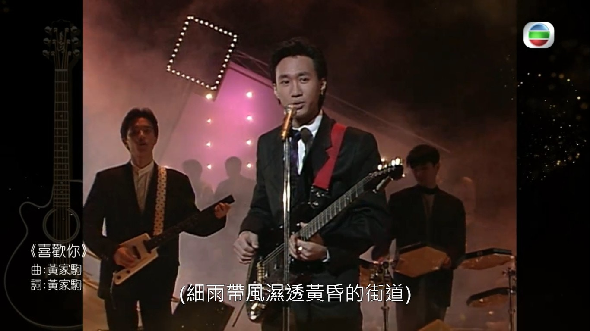
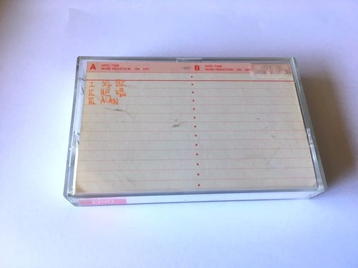
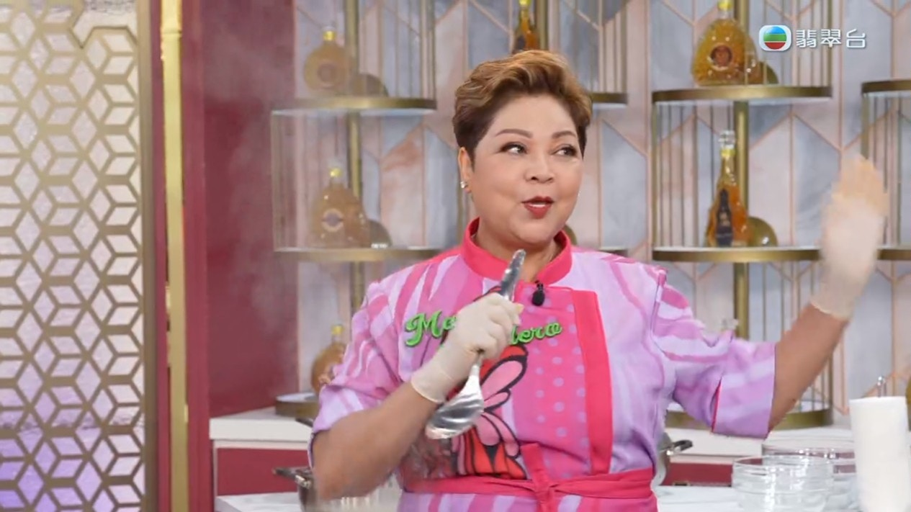

為了紀念BEYOND靈魂人物黃家駒逝世30年，周六晚（24日）無綫播出特備節目《永遠光輝 黃家駒》，記錄了不少Beyond與家駒生前的珍貴片段。當中肥媽在節目中透露黃家強曾找她，表示哥哥家駒生前寫過一首歌給自己，不過這番話卻惹來黃家強的不滿，更公開炮轟肥媽。

沒有家駒的日子已三十年。（節目畫面）

肥媽於今日（26日）傍晚時份再出post澄清，並貼出一張錄音帶盒的相片，盒上的字是肥媽所講當年家駒錄製好的歌曲名。

肥媽說：「對於今天有關於網上的指控，我想藉此回應一下。其實可以錄制《感激這對手》這首歌，源於年初的時候收到家駒經理人Leslie的通知，並話收到手上的錄音帶，是家駒生前留下並寫上肥媽兩字，希望我可以完成這首歌。

而早於二十多年前，我和家強出席一個event 時，他曾經跟我提過家駒作了一首歌送給我的。至於最近我在TVB中的訪問中是提到  有一天家強跟我說，但不知最後經某網媒報章轉述我的講話時，就變成   最近收到家強的來電 。作為專業的傳媒人，希望該網媒報章編輯重新和認真留意節目內容，並修正和發佈正確的訊息。

整件事就是這麼簡單，作為朋友，我只是想完成家駒的心願，完成他未完成的作品，希望大家都將焦點放回在家駒的作品上，謝謝。」

肥媽出post澄清。(《肥媽李鼎》截圖)
