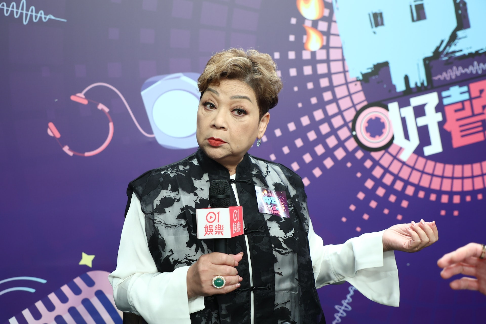
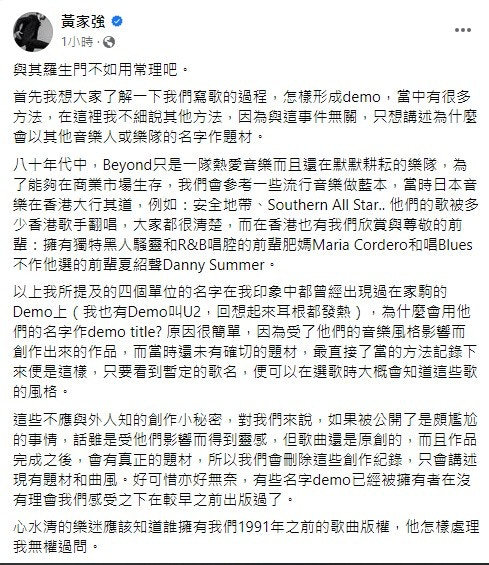

日前肥媽 （Maria Cordero）與黃家強為黃家駒的一首歌於網上罵戰，到今日傍晚時間又有新發展。原來黃家強在2008年5月出席樹仁大學「別了家駒十五載 - 舊日的足跡座談會」做訪問時，的確提及到家駒作曲予肥媽。當時他正在家駒的展覽，並展示了穿過的衣服、眼鏡、飾物及音響樂器等，當中最特別的就是家駒手寫樂譜，他說：「作品的歌名是人名，他當時想作給誰便起那人的名字，其中一個譜是給肥媽瑪利亞，估計當時他們曾傾談合作。」

*肥媽表示自己唔需要抽水。（資料圖片）*

肥媽於無綫節目中曾透露黃家強向她表示哥哥家駒生前寫過一首歌給她，但二人各執一詞，此話一出便引來多日隔空罵戰。今日（27日）黃家強長文回應肥媽，肥媽堅持黃家強有向她提及家駒首作曲予她，還因為此事而大動肝火，於社交平台反撃及貼上連結：「我肥媽唔需要抽水，都不需要藉此做任何宣傳，我唱這首歌只有一個原因，我欣賞家駒， 亦欣賞家駒的音樂。」

*圖片出自2008年 家駒的紀念展覽*
「由黃家強提供生前遺物，取名「舊日的足跡」，全六月供有心人士免費入場追思，舉辦地址牛棚藝術村。」

**黃家強facebook講咗咩令肥媽堅持？**

黃家強在長文中指自己記憶健康，自己條RAM無事，他亦有解釋他們寫歌的過程，怎樣形成demo：「我所提及的四個單位的名字在我印象中都曾經出現過在家駒的Demo上（我也有Demo叫U2，回想起來耳根都發熱），為什麼會用他們的名字作demo title? 原因很簡單，因為受了他們的音樂風格影響而創作出來的作品，而當時還未有確切的題材，最直接了當的方法記錄下來便是這樣，只要看到暫定的歌名，便可以在選歌時大概會知道這些歌的風格。」

黃家強說到公開這個做法會很尷尬，亦指有些名字demo已經被擁有者（經理人）在沒有理會感受之下較早之前已經出版過。家強再指這首叫「肥媽」的歌曲，只是一首靈感來兒肥媽的唱腔demo，而並不是作曲予肥媽的意思。

*黃家強在長文中指自己記憶健康。（微博圖片）*

*黃家強原post全文。(fb截圖)*
