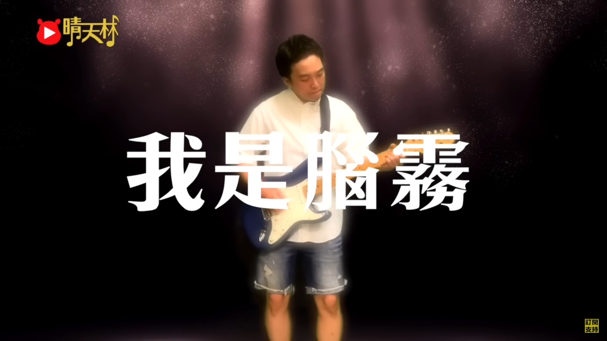
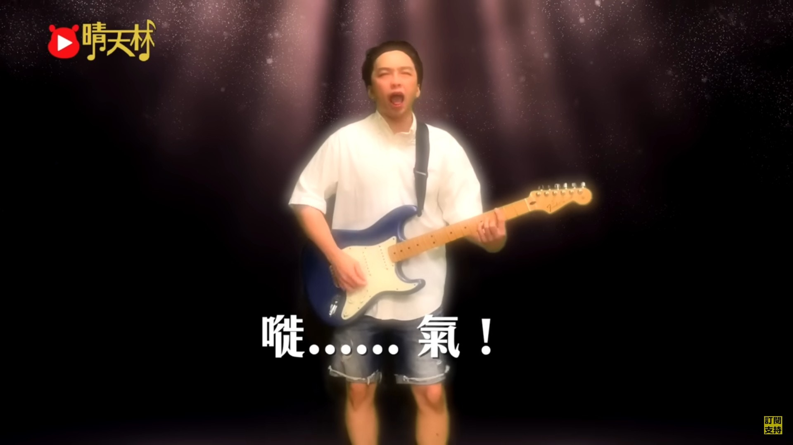
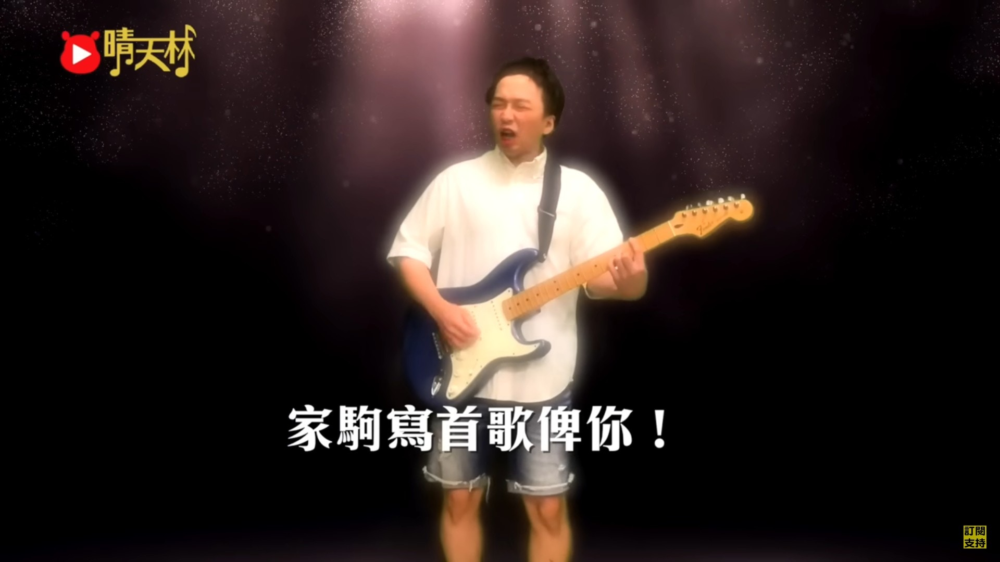
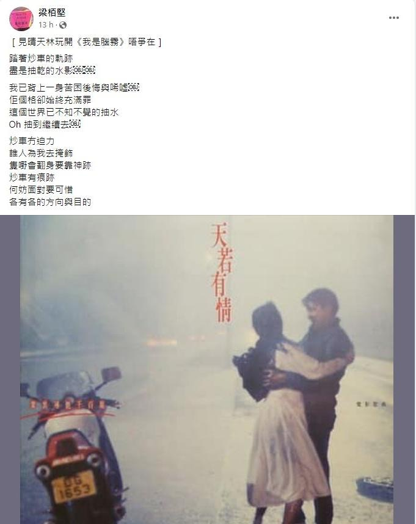

為紀念BEYOND靈魂人物黃家駒6月30日逝世30年，上周六（24日）無綫播出特備節目《永遠光輝 黃家駒》，記錄不少家駒及BEYOND的珍貴片段。節目中肥媽透露黃家強曾找她，表示哥哥家駒生前寫過一首歌給自己，不過這番話卻演變成家強與肥媽的記憶角力。兩人連日在Facebook隔空罵戰，各執一詞，更成為網民密切跟進的熱話。

肥媽貼黃家駒生前手稿反擊 指黃家強貴人善忘︰我肥媽唔需要抽水

沒有家駒的日子已三十年。（節目畫面）

肥媽貼出證據反擊家強。(資料圖片)

黃家強質疑肥媽得到歌曲的途徑。（微博圖片）

肥媽昨晚（27日）貼出錄音帶照及2008年5月家強出席樹仁大學「別了家駒十五載 - 舊日的足跡座談會」做訪問時，的確提及家強表示有首歌給予肥媽，更有當年有關報道的截圖做證。事件獲網民高度關注，對此網絡創作歌手晴天林就將BEYOND的《我是憤怒》惡搞成《我是腦霧》，當中的歌詞更暗嘲家強「炒車」、「加多少RAM都不夠 都會輕機」、「我是腦霧 好想推翻的憶記」。

網絡創作歌手晴天林將BEYOND的《我是憤怒》惡搞成《我是腦霧》。（YouTube片段畫面）

歌詞暗嘲家強「炒車」。（YouTube片段畫面）

惡搞版本上載不足半日，已經累計了6萬多瀏覽量。（YouTube片段畫面）

另外，填詞人梁栢堅亦在Facebook出Post表示：「見晴天林玩開《我是腦霧》唔爭在」並將黃家駒為經典電影《天若有情》的插曲《灰色軌跡》作曲的歌詞進行二次創作，暗諷家強炒車。

，填詞人梁栢堅亦在Facebook出Post將黃家駒為經典電影《天若有情》的插曲《灰色軌跡》作曲的歌詞進行二次創作。（YouTube片段畫面）
