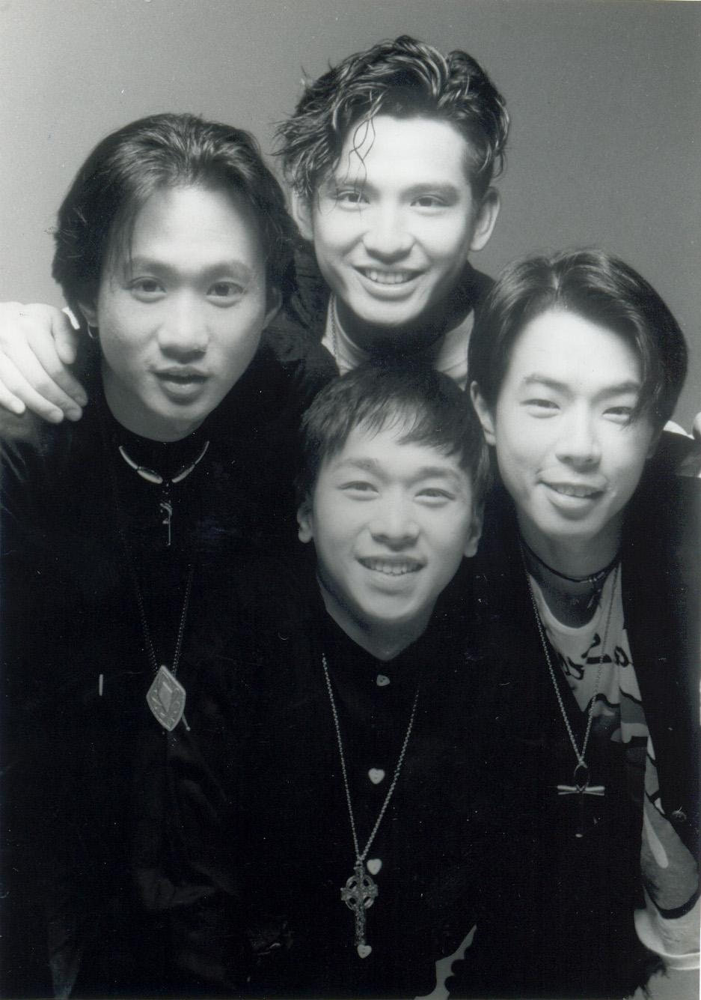

不經不覺香港著名搖滾樂隊Beyond 主音歌手黃家駒（koma)今年逝世30周年，曾創作多首經典好歌的他，是無數人心目中的偶像代表之一。近日，就有一名內地女粉絲因太思念他的關係，在參觀蠟像館時就抱着他的身體不放，而且還當場泣不成聲，頓時成為網上熱話。

Beyond的音樂影響不少人。（視覺中國）

從網上曝光的片段可見，該名女粉絲在參觀蠟像館時，見到偶像黃家駒後心情非常激動。其雙手環抱着黃家駒的頸部，深情看望着他，一邊痴望一邊流淚，及後再度正面看望着偶像，細心觀望偶像的臉孔，似乎愈看思念之情更湧上心頭，整個人仰後聲嘶力竭痛哭，哭到幾乎臉容扭曲，整個畫面相當動容，看來黃家駒的音樂影響好深。不少網友看見後都表示好感動，但另有人質疑該名女粉絲似在炒作，認為她哭得太假不像真心，大家留言表示：「太裝了」、「有點假了吧」、「真想念不至於這樣」等，認為有人為了增加流量而已。

女粉絲見到偶像泣不成聲。（影片截圖）

無論是真心還是炒作都好，無可否認黃家駒創作的音樂的確影響不少人，就好似《大地》、《海闊天空》、《樂與怒》等，至今都是經典流傳的好音樂。

黃家駒創作的音樂的確影響不少人。（黃貫中微博圖片）

女粉絲見到偶像激動啊！（影片截圖）

參觀蠟像館時就抱着黃家駒身體不放。（影片截圖）

泣不成聲。（影片截圖）

（影片截圖）

（影片截圖）

（影片截圖）

（微博截圖）

（微博截圖）
