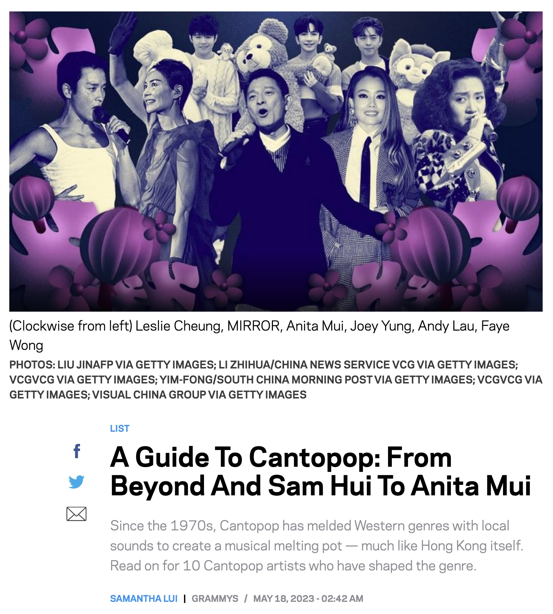
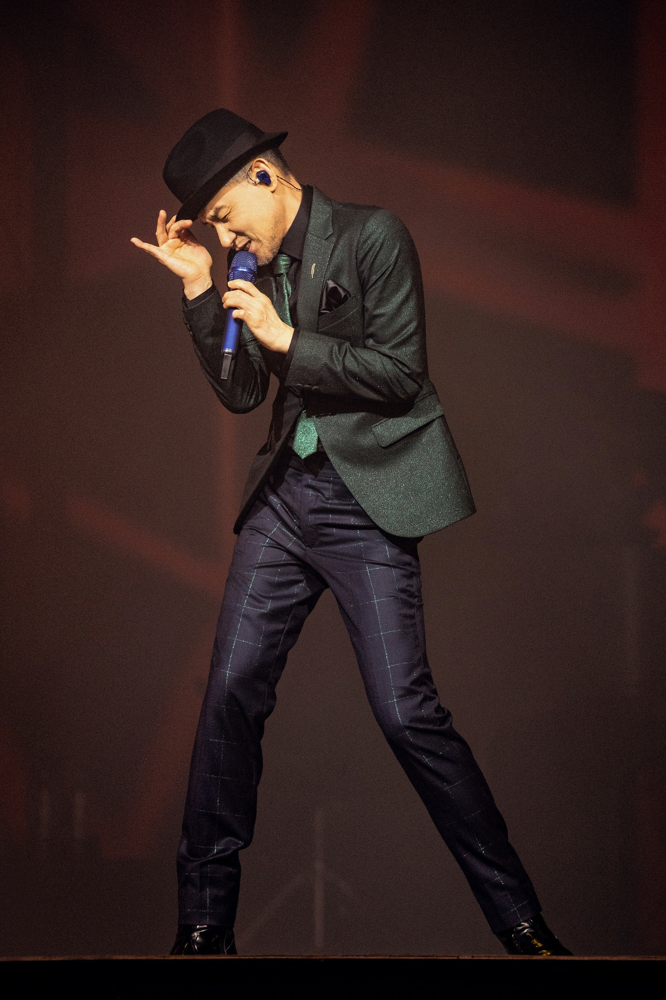
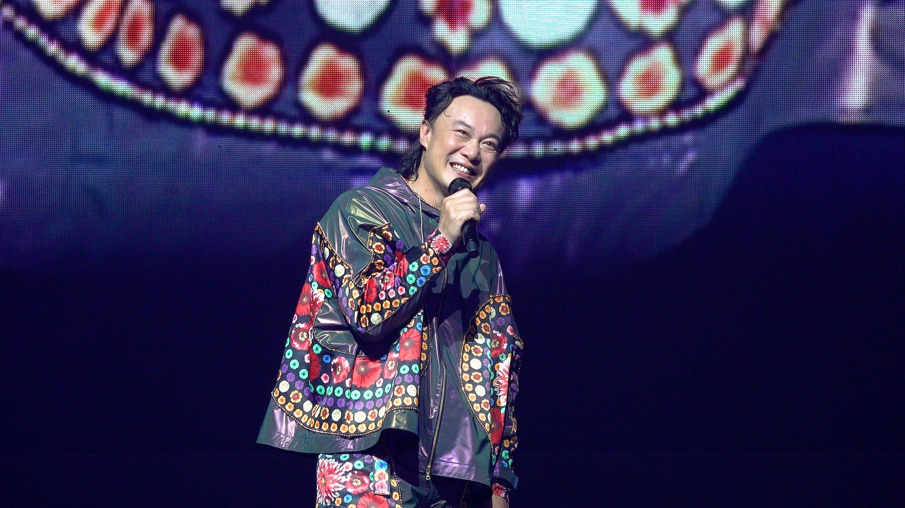
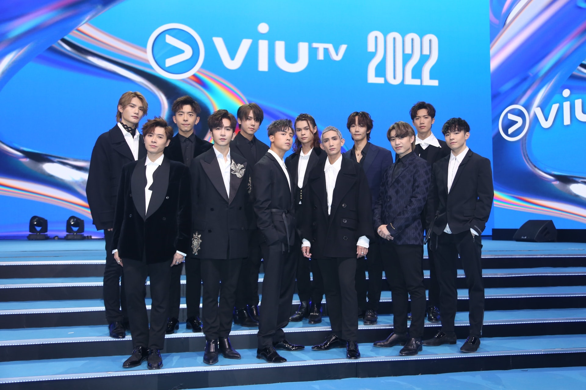
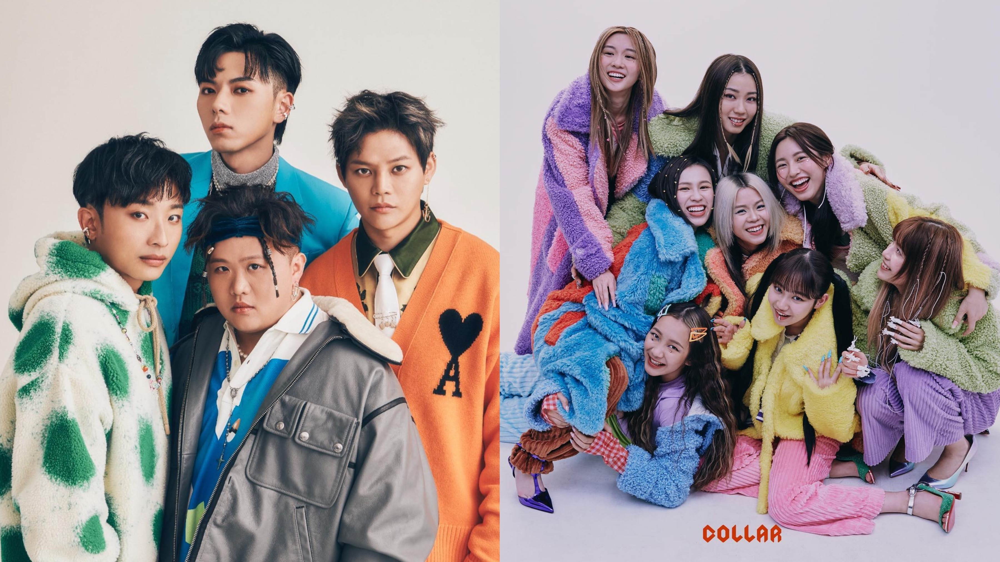

該文章講到粵語歌70年代起出現，到8、90年代是黃金年代，梅艷芳、張國榮、劉德華等四大天王紅透半邊天，全亞洲都識，不過自千禧年代，就有衰落趨勢。內文提到，隨住社會運動、疫情等，過去幾年粵語音樂文化又變得多人關注，多位新一代本地歌手爆紅。

*格林美獎網站上，刊出了有關廣東歌歷史的文章。（Grammy Awards）*

作者點名介紹10個歌手單位，依次為：許冠傑、Beyond、梅艷芳、張國榮、劉德華、王菲、容祖兒、COLLAR、ERROR、MIRROR，指他們有份塑造廣東歌文化。不少網民睇完都驚訝：「作者識唔識㗎？」名單前幾位全是殿堂級歌手，當然冇異議，但ViuTV的三個造星組合COLLAR、ERROR、MIRROR全部上榜，讓不少人驚訝。

首先，網民指出四大天王中，歌神張學友一向最出名唱得，但文中有關四大天王的篇幅中，卻重點著墨在劉德華，指他90年唱完《可不可以》就爆紅，更早在2000年就因累計收穫292個音樂獎項成為粵語歌手之冠，榮登健力士世界記錄。不過其實這項成就的確不是輕易能超越，所以劉德華有一定代表性，上榜也說得過去。

*四大天王中，歌神張學友未有上榜，但就有劉德華。*

不過，網民卻震驚為何連陳奕迅都冇！陳奕迅由90年代到現在仍然穩坐天王寶座，代表香港去過多個國家表演，是首位站上O2 Arena的華人歌手、碟都出過幾十隻，但內文居然對他隻字不提。

*陳奕迅對廣東歌的貢獻可以說是劃時代，絕對是近幾十年的天王，但文中居然對他隻字不提！*

除此之外，內文一次過列出COLLAR、ERROR、MIRROR三個新生代組合，有人問作者是否ViuTV打手。《全民造星》系列無可否認對創造新星有著重要地位，當中MIRROR爆紅、重新燃起對香港歌手的追星文化，甚至大街小巷都有他們的廣告等，佔一席位可以理解；不過ERROR出歌不多，對很多人都說是綜藝男團多於歌手，好像未夠資格上榜。至於COLLAR，雖然確實是久違出現的女團，但以粵語史上的女子組合來說，千禧年代的Twins反而更具代表性。

*MIRROR的確改寫了香港的追星文化。（資料圖片）*

這篇文章中，九十至千禧年代許多當紅歌手完全斷層，如：張敬軒、古巨基、陳慧琳、鄭秀文等，似乎說不過去。不過有網民就認為，作者不是用「Top 10」字眼，只是純粹提及粵語史演化，但有人亦回覆：「明白唔係話Top 10，不過有啲真係冇代表性。」此外，有人則認為這只是特定撰文者的個人立場，與格林美獎無關。
