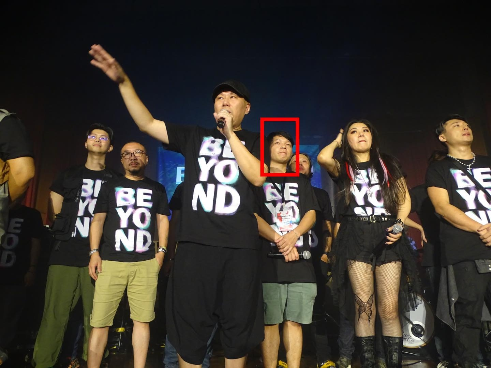
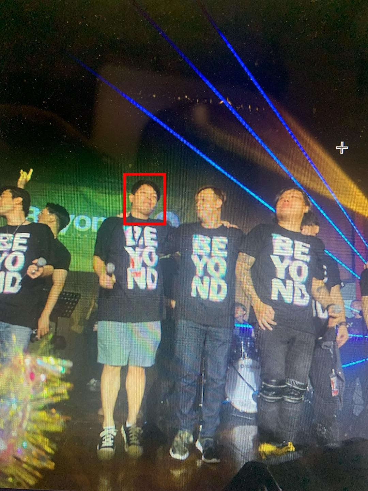
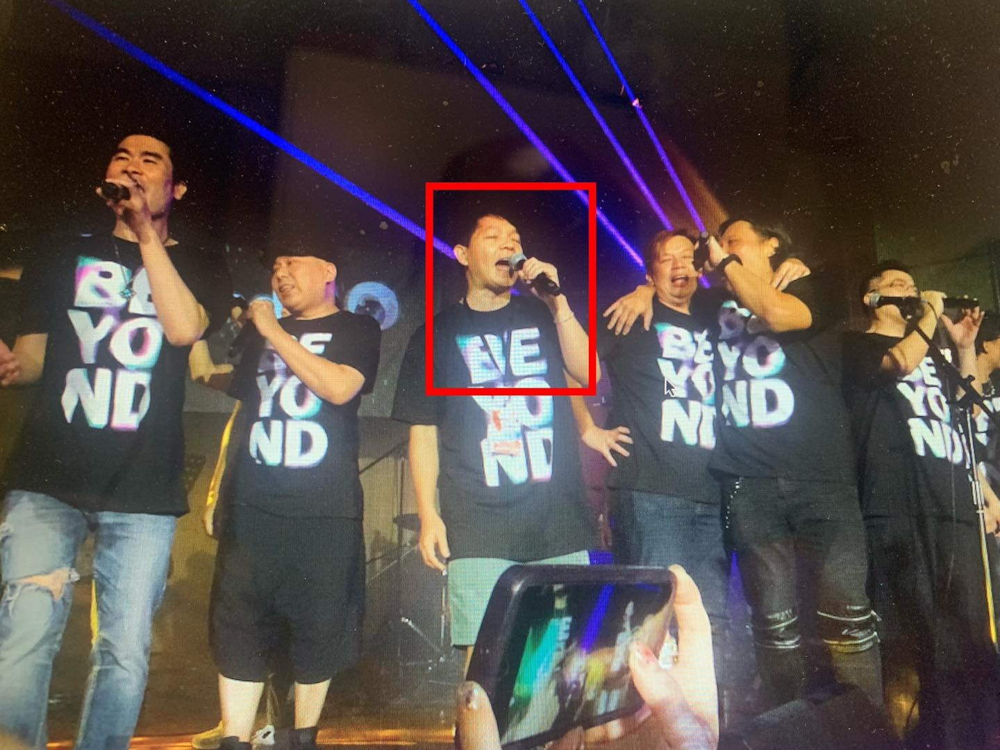
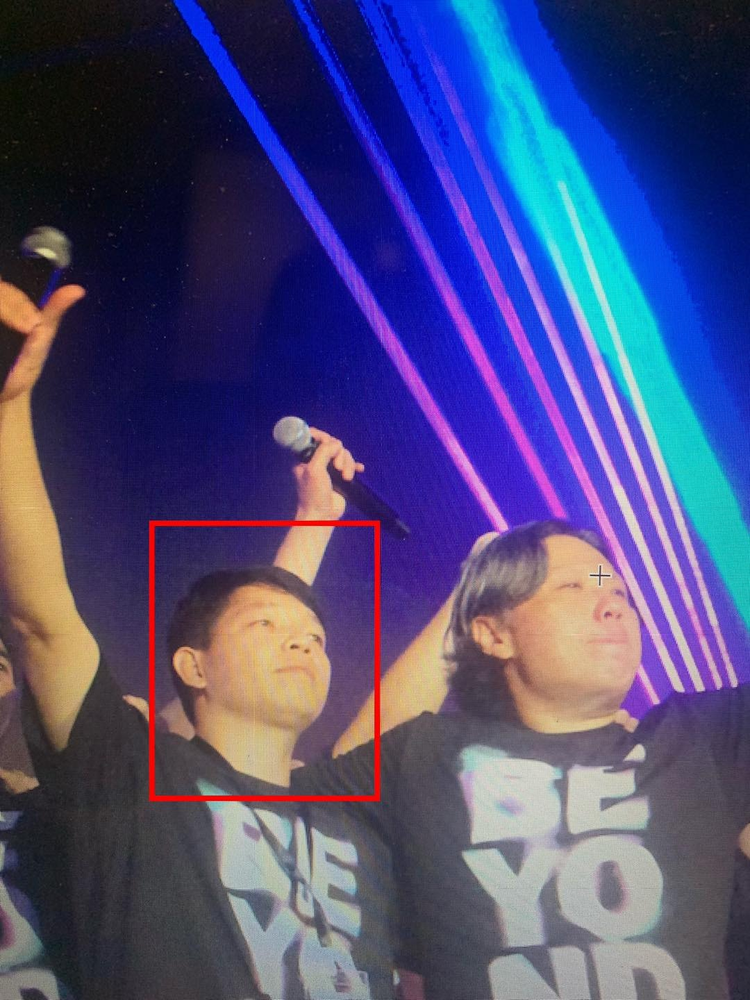
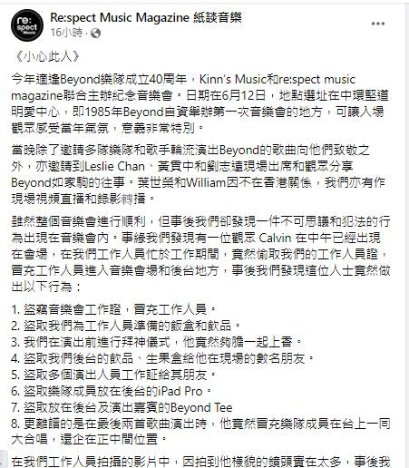
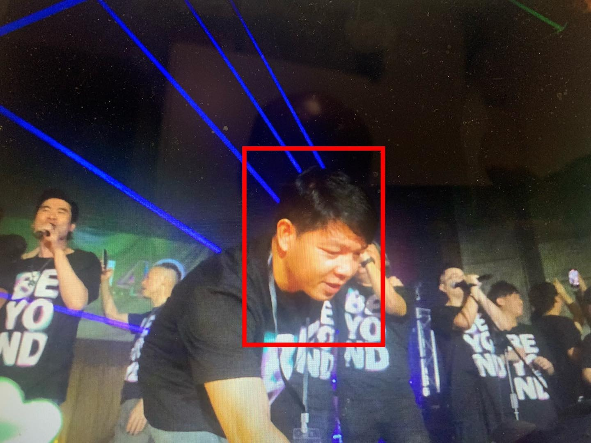
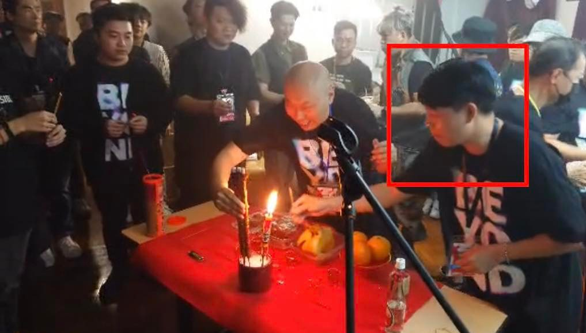
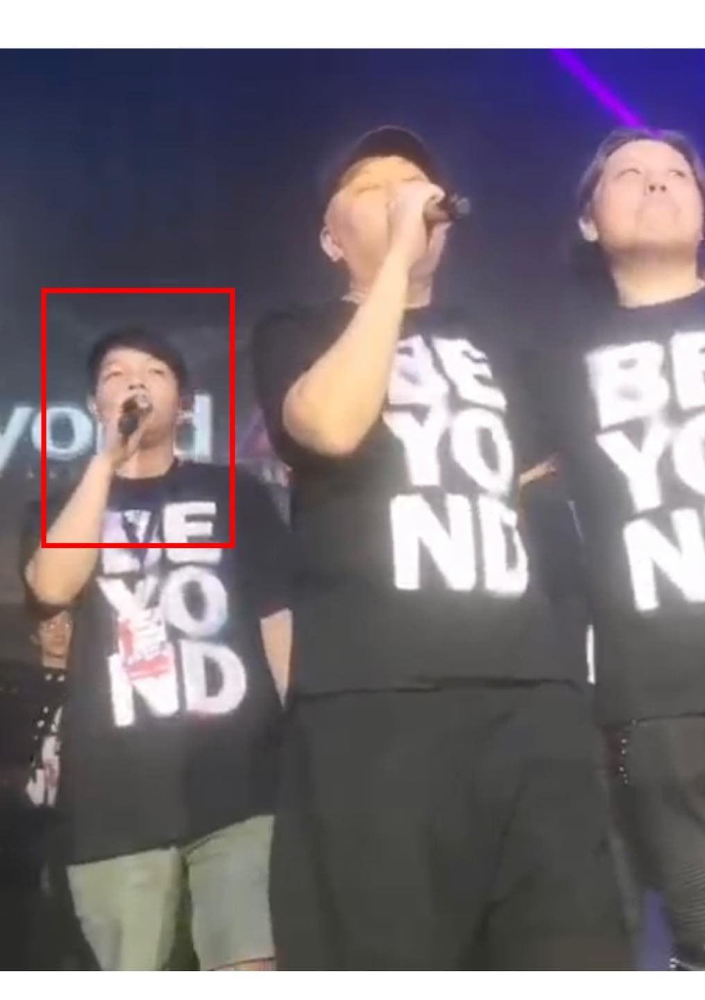
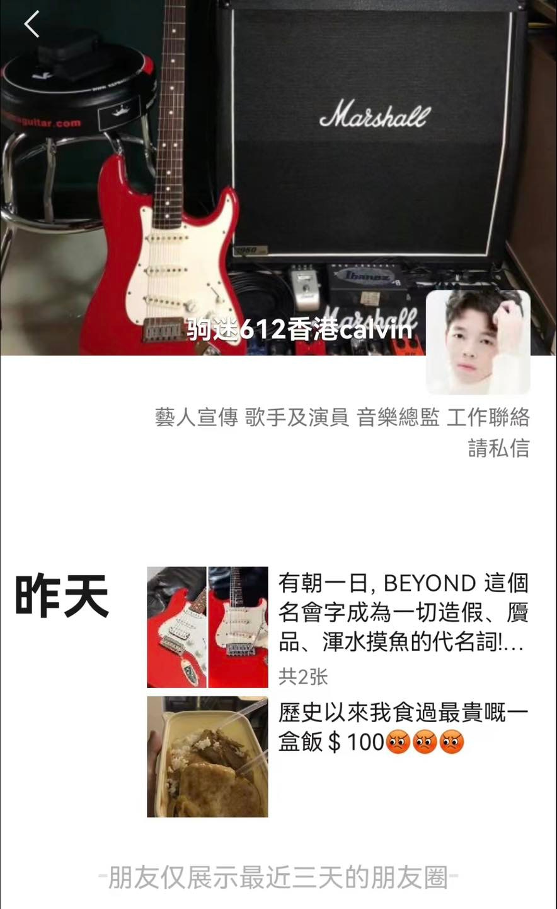

香港著名搖滾樂隊Beyond。

紀念騷選址在堅道明愛社區中心，這個地方是Beyond誕生之地，1985年自資第一次舉辦音樂會的地方。當日黃貫中及Beyond前經理人Leslie陳健添都有出席，分享Beyond和家駒的往事。未料到有不速之客闖入：「在音樂會內。事緣我們發現有一位觀眾 Calvin 在中午已經出現在會場，在我們工作人員忙於工作期間，竟然偷取我們的工作人員證，冒充工作人員進入音樂會場和後台地方。」

BEYOND紀念騷大會發文，指有人混入工作人員團隊。（FACEBOOK：@re:spect music magazine 紙談音樂）

此人更做出八大不可思議事件，除偷取飯盒飲品、多個演出人員工作証給其朋友，又盜取樂隊成員放在後台的iPad Pro及演出嘉賓的Beyond Tee，更甚者混入團體拜神上香：「更離譜的是在最後兩首歌曲演出時，他竟然冒充樂隊成員在台上一同大合唱，還企在正中間位置。」及後大會聯絡上此觀眾：「拍攝的影片中，因拍到他樣貌的鏡頭實在太多，事後我們要花兩天時間才能剪走有他出現的鏡頭。我們曾經跟他電話聯絡過一次，他亦承認偷取我們飯盒等盜竊行為，並作出部份賠償。我們亦要求他賠償兩天的剪輯工作額外費用，並要求他書寫道歉信，他亦一一答應。」惜最後失去蹤影故公開事件警剔大眾。

**點擊睇BEYOND狂迷奇葩行為：**

BEYOND紀念騷大會發文，指有人混入工作人員團隊。（FACEBOOK：@re:spect music magazine 紙談音樂）

BEYOND紀念騷大會發文，指有人混入工作人員團隊。（FACEBOOK：@re:spect music magazine 紙談音樂）

BEYOND紀念騷大會發文，指有人混入工作人員團隊。（FACEBOOK：@re:spect music magazine 紙談音樂）

BEYOND紀念騷大會發文，指有人混入工作人員團隊。（FACEBOOK：@re:spect music magazine 紙談音樂）

BEYOND紀念騷大會發文，指有人混入工作人員團隊。（FACEBOOK：@re:spect music magazine 紙談音樂）

BEYOND紀念騷大會發文，指有人混入工作人員團隊。（FACEBOOK：@re:spect music magazine 紙談音樂）

BEYOND紀念騷大會發文，指有人混入工作人員團隊。（FACEBOOK：@re:spect music magazine 紙談音樂）

BEYOND紀念騷大會發文，指有人混入工作人員團隊。（FACEBOOK：@re:spect music magazine 紙談音樂）
