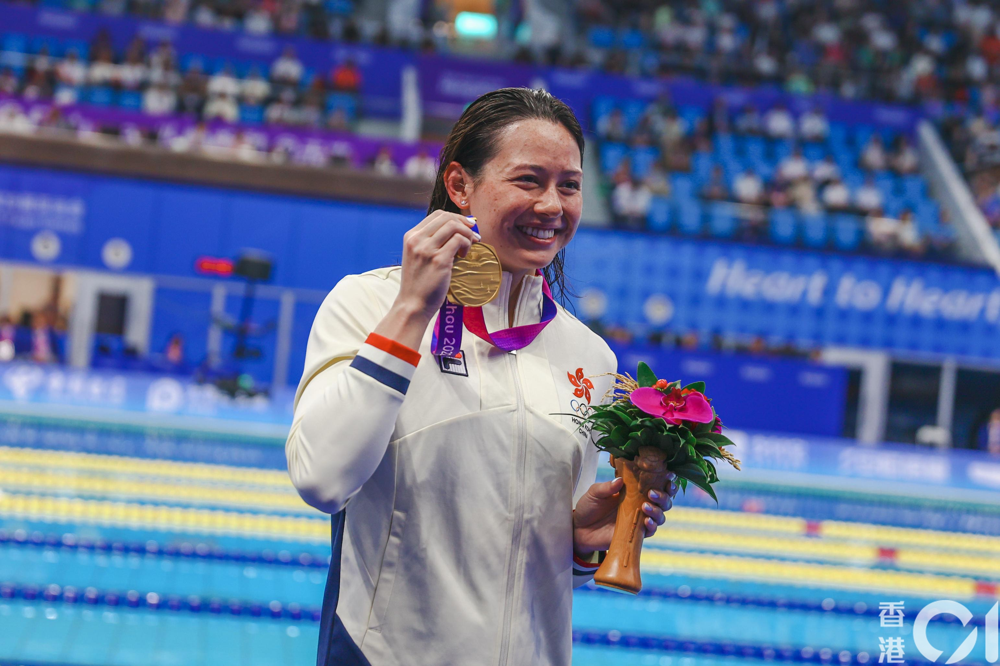
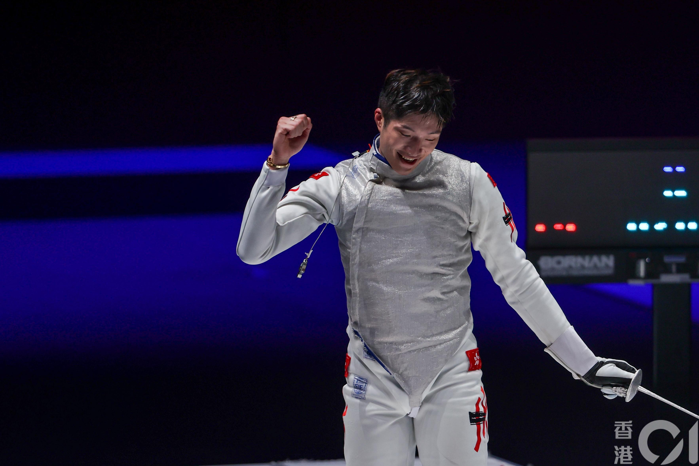
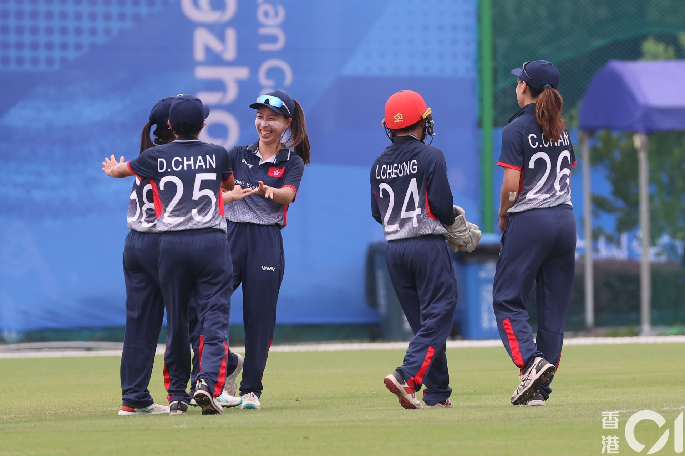
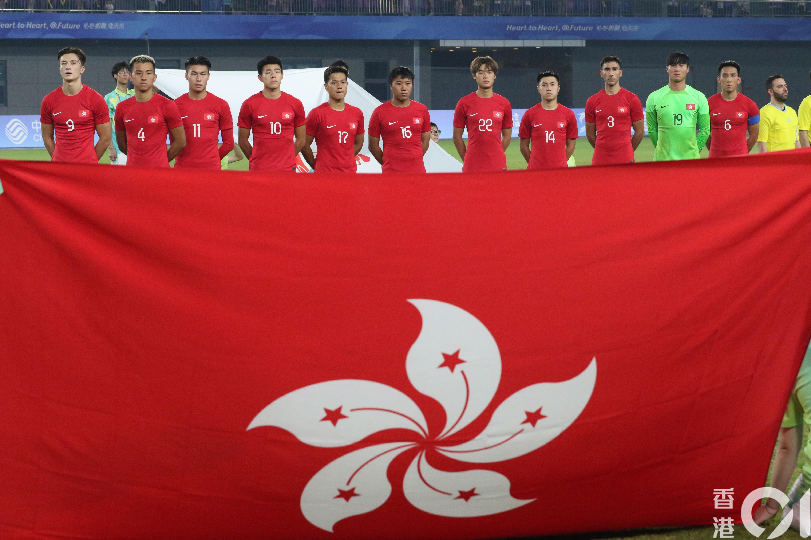

杭州亞運專頁 追蹤港隊 緊貼熱話（按此進入）

杭州亞運男子足球賽事，港隊在淘汰階段先後擊敗巴勒斯坦及伊朗，歷史性晉身準決賽。（袁志浩攝）

> 繼續上 全力上 無懼每個對手招式多誇張
不怕跌傷 要用雙腿創造我理想
無論進 無論退 無論哪個領先都不必慌張
只管再進攻 決心奮力圖強
對付我 攔截我 還是破網哨子聲吹走風霜
將我領土 九十分鐘裏盡量擴張
仍舊控球直上 來日我與你穿起金靴一雙
請給我信心 以衝勁做能量
周國賢《黃金入球》歌詞

**Beyond兩大神曲天天熱播**
香港與杭州之間，相隔1066公里，杭州小隊同事天天忙於奔走各大場館，我們在香港肉緊地在電視旁看直播，由林新棟、王瑋駿的男子雙人單槳賽艇第一金，到劍擊館的獎牌雨；從何詩蓓與各位泳將表演的游泳館，到姚錦城、李卡度衛冕男子七人欖球激情強呼；還有三人籃球場、場地單車館、乒乓球和羽毛球館……背景突然響起的一首首流行曲，成為兩地同事交稿與收稿之間、香港記者與運動員另一連結點。

「今天我……」只需三個字，黃家駒獨特的滄桑聲線，已教人毛管直豎，港人熟悉不過的《海闊天空》成為杭州亞運場館為香港選手、記者以至入場觀眾振奮士氣的「主題曲」。

當何詩蓓摘下100米自由泳金牌後，現場在播放《我的驕傲》。（楊宇翹攝）

**送給何詩蓓的《我的驕傲》**

香港殿堂級樂隊Beyond兩大神曲《光輝歲月》、《海闊天空》各個賽場輪流熱播，在游泳館，當何詩蓓摘下100米自由泳金牌後，傳來容祖兒的歌聲：「See me fly I'm proud to fly up high」，《我的驕傲》四個字，大概正是香港人對這位本地史上最佳泳手的心聲。之後還有Beyond另一名曲《喜歡你》，不過是鄧紫棋（G.E.M.）翻唱的版本，「喜歡妳 那雙眼動人 笑聲更迷人……」選曲原因，再清楚不過了。

何詩蓓一屆賽事奪得2金1銀3銅6面獎牌，不單創下香港運動員單屆亞運最多獎牌紀錄，連同2014仁川那屆3面接力銅牌，追平施幸余的9面獎牌紀錄。

> See me fly I'm proud to fly up high
不因氣壓搖擺 只因有你擁戴
Believe me I can fly
I'm singing in the sky
假使我算神話 因你創更愉快
容祖兒《我的驕傲》歌詞

張家朗摘下男子花劍個人賽金牌、再與隊友一起贏得團體賽銅牌。（楊宇翹攝）

**懷舊金曲 VS 新一代打氣歌**

今屆香港劍擊隊總共獲得9面獎牌，男子花劍個人賽金牌（張家朗）、銅牌（蔡俊彥）、男花團體銅牌、女花個人銅牌（陳諾思）、女花團體銅牌、女重個人銅牌（江旻憓）、團體銀牌、男重個人銅牌（何瑋桁）和團體銅牌，是香港劍擊隊史上獲得最多獎牌的一屆亞運會。

劍擊館播放的「港樂」比較「懷舊」，《光輝歲月》、《海闊天空》以外，尚有陳慧嫻紅極一時的《千千闕歌》。板球場的大會工作人員相當有心，為港隊找來《無盡》以及棒球電影《點五步》的主題曲《沙燕之歌》兩首樂隊Supper Moment金曲振奮士氣。然而最精彩的歌單，還是足球場館。

板球場的大會工作人員相當有心，為港隊找來《無盡》以及《沙燕之歌》兩首樂隊Supper Moment金曲振奮士氣。（趙子晉攝）

**足球場不同年代金曲大串燒**

足球賽事整整90分鐘，賽前等待開場、中場休息15分鐘以至賽後散場，都是播歌好機會，歌單亦最長。男子足球16強香港對巴勒斯坦一仗，在蕭山體育中心體育場上演，大會為港足預備的歌單，橫跨1980、1990到千禧年代香港流行曲。

羅文、甄妮一首《鐵血丹心》，曾是時代經典，香港早已不再流行，可是1983年由黃日華、翁美玲主演的電視劇《射鵰英雄傳之鐵血丹心》，在內地亦紅極一時，至今每逢有新版本《射雕》作品，網民依然會懷念那個版本以及這首經典主題曲，身處現場的年輕同事對大會選播此曲有點不明所以。同一年代來自張國榮的《Monica》節奏明快，也許較易理解。

杭州亞運香港隊男足16強賽事惡鬥巴勒斯坦，現場不同年代香港金曲輪流播。（袁志浩攝）

「即使身邊世事再毫無道理 與你永遠亦連在一起」，一跳跳進90年代，揀陳小春的《相依為命》，大概也沒什麼道理可言，喜歡便好；李克勤的《紅日》又是節拍強勁而雄壯，最適合當打氣歌。

容祖兒的《我的驕傲》是千禧年代的代表，那一夜香港1：0擊敗巴勒斯坦晉級八強，當時追平港足史上最佳紀錄。那仗兩天後是中秋節，那晚同時加播歌后鄧麗君的《但願人長久》。9月29日中秋節正日，游泳館電子屏幕添上月亮圖案，輪流播放各首與中秋有關的應節歌曲，為現場添上中秋氣氛。

至港足八強大戰伊朗一役，上城體育中心體育場為港隊特別預備近年港足主場賽事經常播放的周國賢名曲《黃金入球》，陪伴港足昂然首度晉身四強。10月4日（周三）準決賽港足對日本，重返蕭山體育中心體育場，不知大會會否為港足再次準備新歌單？
更新：現場同事回報，蕭山體育中心體育場在香港對日本賽事在播放鄭伊健的《友情歲月》。

> 杭州亞運為港隊預備熱播歌單（不定時更新）：
>
> Beyond 《光輝歲月》、《海闊天空》
> 容祖兒《我的驕傲》
> 鄧紫棋《喜歡你》
> 陳慧嫻《千千闕歌》
> 周國賢《黃金入球》
> 陳小春《相依為命》
> 張國榮《Monica》
> 李克勤《紅日》
> 羅文、甄妮《鐵血丹心》
> Supper Moment《沙燕之歌》
> Supper Moment《無盡》
> 鄧麗君《但願人長久》
>
> 10月4日
> 鄭伊健《友情歲月》
