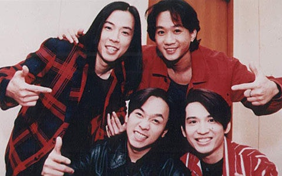

import YouTube from '@/components/patterns/YouTube.astro';

香港著名搖滾樂隊Beyond。

## 成長的主題曲

「70後」樂迷關栩溢小時候和當時的普羅大眾一樣，平日愛賴在收音機旁聽電台DJ的選曲。在小學時期，他第一次聽到Beyond的歌曲——〈亞拉伯跳舞女郎〉。歌中夾雜一些他聽不明白的英文歌詞「Arabian dancing girl」，縱然一知半解，但歌曲馬上深深刻印在腦中。八十年代的香港樂壇興盛，當紅歌手如譚詠麟、張國榮、梅艷芳等，粒粒皆星。但當時仍是小學生的關栩溢感覺到，大多數流行歌曲都是談情說愛，並以娛樂消費性質為主，但Beyond的歌卻探索到歷史文化，還有深層次的生命意義，讓他十分震撼。關栩溢猶記得，自己小學畢業時，一班同學一起給老師獻唱〈真的愛妳〉，成為動人回憶。到中學高考時，「當時考11日，我為每一個考試日配一首Beyond的歌，作為當日的主題曲。考試前，不是讀雞精筆記，而是戴上headphone，反覆聽著那首歌，為自己打氣。」直至大學畢業年，他連日通宵趕功課，辛苦到情緒崩潰，心中響起的「主題曲」，也是Beyond的「校歌」〈再見理想〉。

《踏著Beyond的軌跡 I——歌詞篇》

> 香港電台文教組節目《開卷樂》由馮傑、鄭政恆、黃怡、鄒芷茵、唐睿主持，逢週六晚上8時30分至9時，港台第二台播出。節目重溫 : https://podcast.rthk.hk/podcast/item.php?pid=541

## 以文字向Beyond致謝

多年來，Beyond的歌深入到關栩溢的生命之中，對他的重要性不言而喻。2008年，也就是家駒離開15週年的時候，坊間紛紛舉辦紀念活動。那個時候，關栩溢亦希望以己之所長，向這隊影響自己一生的樂隊致謝。他發現當時很少人嚴肅地分析Beyond的歌曲，於是他便開始了「踏著Beyond的軌跡 」這個項目，持續地為Beyond撰寫樂評。後來他的樂評更在音樂雜誌上，以專欄形式發表了5年之久，寫了一百多篇文章。及後，關栩溢兩次重寫文章，加入資料考據，又在架構上滲入文化研究方式，重新擬定這批樂評文章的視點，再把內容分為不同主題。15個寒暑過後，終於在2023年，也是Beyond成立40週年、家駒離世30週年的日子，出版了《踏著Beyond的軌跡 I——歌詞篇》。

## 〈早班火車〉中的感官嘉年華

《踏著Beyond的軌跡 I——歌詞篇》一共收錄了55篇Beyond不同時期作品的評論文章，以歌詞為載體，側寫Beyond發展史，同時見證時代及思潮的轉變。講到Beyond歌詞賞析，其中一首讓關栩溢奉為教材的歌，是林振強填詞的〈早班火車〉。林振強巧妙運用關於火車的各種虛實意像，道出一個暗戀故事。

<YouTube id="PE9IUuRrTFU" />

> 天天清早最歡喜 在這火車中再 重逢妳
> 迎著妳那似花氣味 難定下夢醒日期
>
> 玻璃窗把妳反映 讓眼睛可一再纏綿妳
> 無奈妳那會知我在 凝望著萬千傳奇
>
> 願永不分散 祈求路軌當中 永沒有終站 Woo-Oh
> 盼永不分散 仍然幻想一天 我是妳終站 你輕倚我臂彎
>
> 火車嗚嗚那聲響 在耳邊偏偏似 柔柔唱
> 難道妳教世間漂亮 和默令夢境漫長
>
> 多渴望告訴妳知 心裏面我那意思
> 多渴望可得到妳的那注視
>
> 又再等一個站看妳意思 三個站盼你會知
> 千個站妳卻似仍未曾知

BEYOND組成初期曾有不同成員，於1988年結他手劉志遠離隊後，由黃家駒﹑葉世榮﹑黃貫中和黃家強的Beyond組合最為人熟悉。（網上圖片）

關栩溢言，「這份詞的其中一個特點，是詞人刻意用上不同的感官去描寫場景及人物」。讀者不難發現，當中有描寫「嗅覺」（迎著妳那似花氣味）、「視覺」（玻璃窗把妳反映／讓眼睛可一再纏綿妳）、「聽覺」（火車嗚嗚那聲響／在耳邊偏偏似柔柔唱）、「觸覺」（你輕倚我臂彎）。

關栩溢還注意到，「在這感官嘉年華中，詞人甚至用上『感觀通感』 （Synesthesia，又稱「移覺」）的修辭手法，把一種感官移植到另一種感官上」。你又能否從〈早班火車〉之中，找到應用了「通感」的歌詞呢？

Beyond的音樂影響不少人。（視覺中國）

2016年，美國流行音樂典堂級名人Bob Dylan獲頒贈諾貝爾文學獎。近年出版的《香港文學大系》中亦有〈歌詞卷〉。由此可見，流行音樂的歌詞的文學性及社會意義已受到肯定。而更多Beyond音樂的歌詞賞析，下回繼續分解。

（本文原刊於報章專欄《開卷樂》，此為加長版。圖片及標題為編輯所擬，本文不代表藝文格物立場。）

【開卷樂其他文章：哲學小說《里斯本夜車》：旅行是一場自我發現的過程】

【開卷樂其他文章：介乎野貓與家貓之間 舖貓處境反映城市裡人對動物態度】

