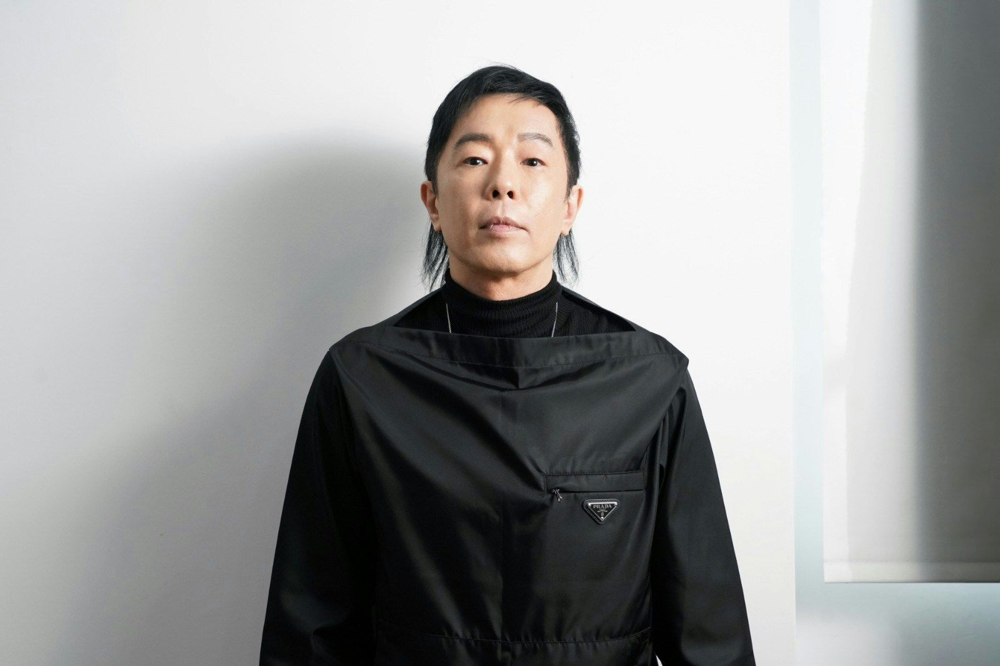
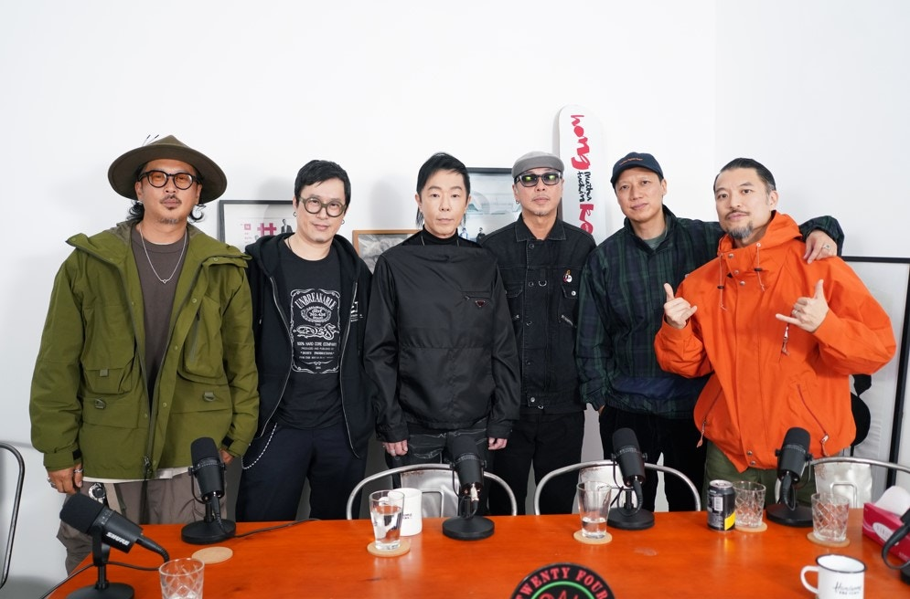
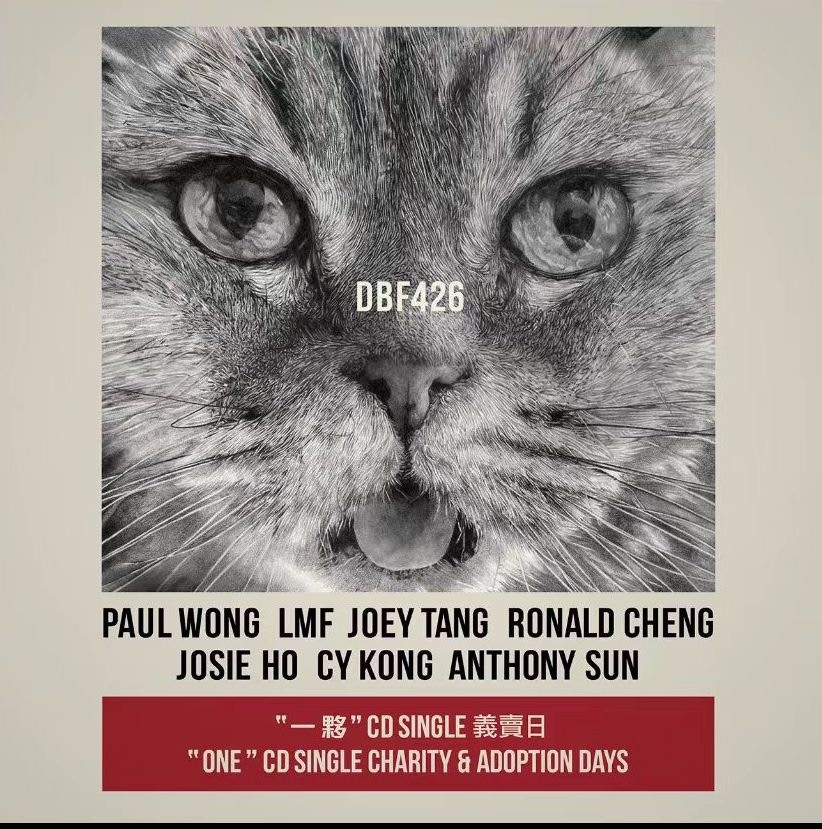
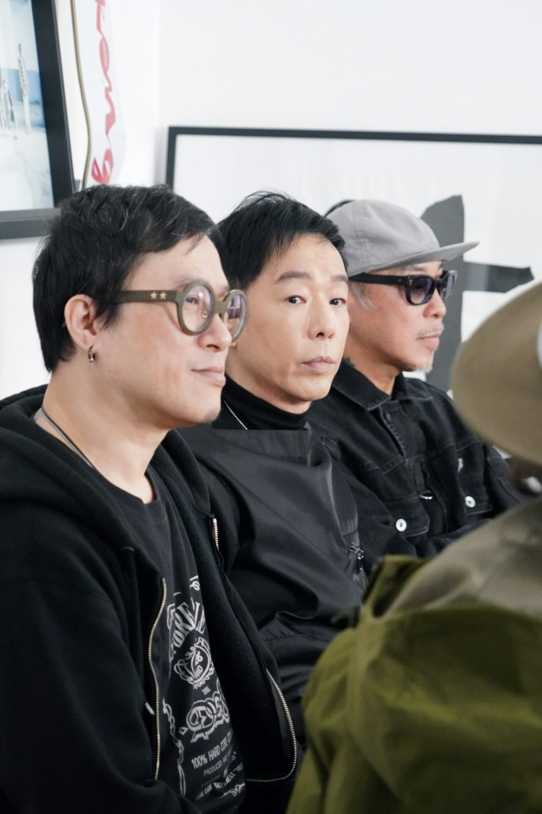
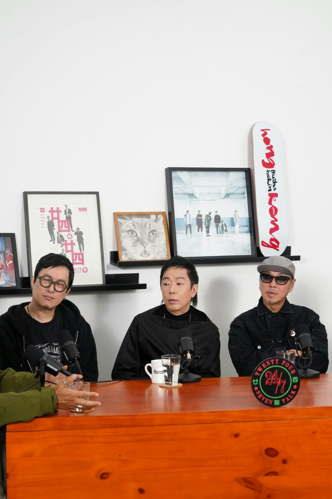
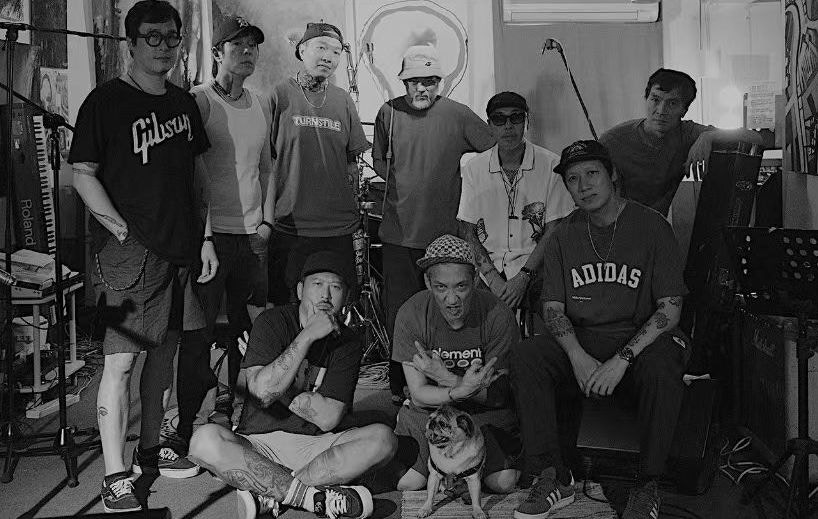

LMF成員陳匡榮（大飛）去年因病突然離世，消息震驚音樂圈，為紀念亡友，黃貫中（Paul）為大飛創作了一首新曲《一夥》，並找來大飛生前好友鄭中基、何超儀、鄧建明及LMF成員：陳偉雄（阿肥）、麥文威（老占）、梁偉庭（阿庭）、梁永傑（阿傑）及陳廣仁(MC仁)一起灌錄歌曲，而歌曲的打鼓部份，更由C.Y. Kong把大飛的錄音作品剪輯而成，令大飛在這首歌亦參與其中，成為大家的「一夥」。

黃貫中推新歌《一夥》。（資料照片）

黃貫中成就亡友行善遺願集合兄弟。（資料照片）

**捐收益救毛孩**

新曲《一夥》MV於今天（1日）在Paul的YouTube頻道首播，Paul表示大飛生前有個心願，希望LMF舉辦一場慈善演唱會，並將所有收益撥捐拯救貓狗的慈善組織，為延續大飛的心願，今次歌曲會印製3000隻CD於本月16、17日作慈善義賣，部份參與製作的單位更會身體力行出席慈善義賣，而義賣收益將不扣除成本，全數撥捐香港拯救貓狗協會、SAA保護遺棄動物協會及毛守救援等三個機構。

為延續大飛心願，《一夥》會印製CD於本月16、17日作慈善義賣。（資料照片）

對於今次創作新曲《一夥》，Paul直言對於大飛離世，感到十分痛心，他希望透過歌曲抒發心情，在《一夥》中加入大飛的打鼓部分，代表大飛無論在那一個世界，他們仍能繼續夾Band，Paul表示：「佢走咗，我先計數同佢識咗幾耐呢？我係透過細佬介紹而認識對方，佢好有音樂才華，原來我同佢識咗30幾年。」Paul指大飛的音樂才華，令他自己的音樂生色不少，而在Paul即將推出的大碟中，大飛亦是監製之一，Paul遺憾對方未能看到大碟的成績。

黃貫中推新歌《一夥》紀念亡友大飛。（資料照片）

**難忘一起打拳**

提到與大飛的生活點滴，Paul形容對方是無所不談的好兄弟，除了音樂，二人亦會一起打拳，他謂：「就連我搬屋，佢都會嚟幫手，好有義氣，我哋一齊打拳，一齊成為拳館榮譽會長，一齊參加拳賽，呢段時間真係好開心。」

問到在推出《一夥》的過程中，可有遇上困難？Paul表示非常順利，所有事情都一呼百應，而在印製CD的成本上，各人亦各自「籌旗」，未有遇到任何難題，Paul說：「大飛嘅朋友全部都係行動派，我哋一班兄弟就話，邊個『離開』，我哋就會為『離開』嗰個寫隻歌，如果走最尾嗰個就冇人寫歌，所以大飛係幸福嘅。」

麥文威（老占）、黃貫中、梁偉庭（阿庭）。（資料照片）

麥文威（老占）、黃貫中、梁偉庭（阿庭）(1)。（資料照片）

黃貫中為大飛創作新曲《一夥》，紀念亡友。（資料照片）

。（資料照片）
