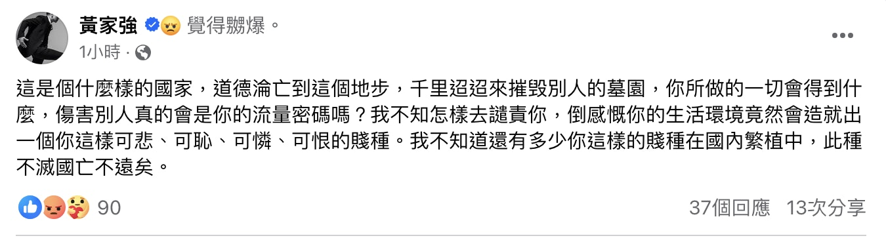

樂隊Beyond主音黃家駒1993年離世後，安葬於將軍澳華人永遠墳場，今早（19日）11時許，其墓碑竟遭一名自稱「社會破壞者光頭Bob」的男子瘋狂破壞，該男子一邊唱《海闊天空》，一邊向墓碑淋汽水、塗污墓碑，又用鐵錘重擊碑上照片等，行為簡直人神共憤。

由葉世榮、黃家強、黃家駒、黃貫中組成的Beyond，永遠都是香港殿堂級樂隊。（資料圖片）

狂徒對墓碑照片做出不敬行為。（小紅書）

他用鐵錘狂敲黃家駒碑上的照片。（小紅書）

狂徒對墓碑淋汽水，連旁邊的墓碑也遭殃。（小紅書）

狂徒用筆塗污黃家駒的照片。（小紅書）

家駒的照片被嚴重破壞，狂徒更在墓碑上簽名。（小紅書）

早前，黃貫中與葉世榮先後回應事件，黃貫中怒斥破壞墳頭的人會有報應，小則肚痛、大則橫死。而葉世榮就在社交平台表示：「今天發生在家駒墳墓的事情實在可惡，這兩個人已經被逮捕，必須受到法律的制裁，家駒在天之靈也不會放過他們！！」

黃貫中、葉世榮都怒斥狂徒！（資料圖片）

葉世榮嬲爆：「家駒在天之靈也不會放過他們！！」（微博）

而下午4時許，黃家駒的弟弟黃家強，都有在社交平台表達憤怒，他怒轟狂徒：「這是個什麼樣的國家，道德淪亡到這個地步，千里迢迢來摧毁別人的墓園，你所做的一切會得到什麼，傷害別人真的會是你的流量密碼嗎？我不知怎樣去譴責你，倒感慨你的生活環境竟然會造就出一個你這樣可悲、可恥、可憐、可恨的賤種。我不知道還有多少你這樣的賤種在國內繁植中，此種不滅國亡不遠矣。」

黃家強就家駒墓碑被毀表態。（fb@黃家強）

黃家強發文轟狂徒傷害別人去換流量密碼，認為他不滅就會亡國。

其實黃家駒的墓碑歷年來屢遭破壞，今次已是第四次，過往於09、18、19年都曾遭塗污，身為家人的黃家強曾報警處理，家強曾表示這是家駒住的地方，希望大家能將心比心、保持理智，但他亦曾表示對事件感到相當無奈：「都唔知邊個做，冇得嬲，愛家駒的不會做。」

黃家強對於黃家駒的墓碑屢遭破壞感到非常無奈，亦曾報警處理。（VCG）
