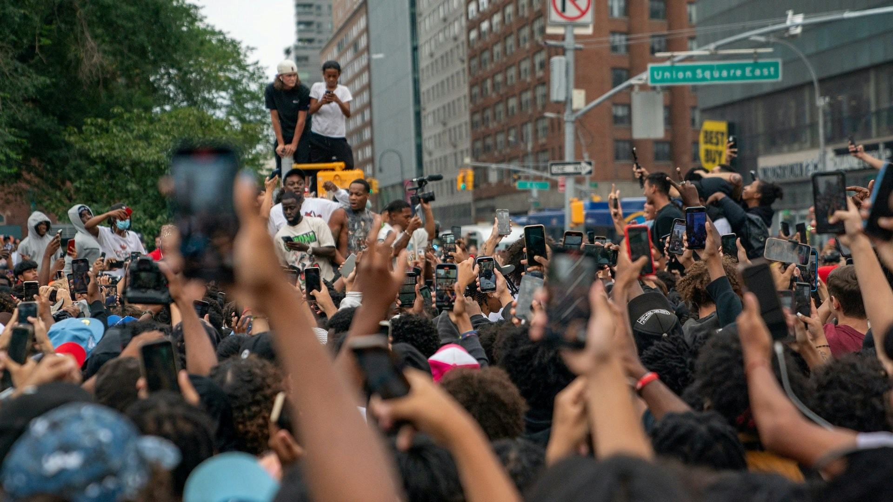

龍心及劉馬車曾被邀請打擂台。（資料圖片）

在這個網絡世代，幾乎每個人都有社交帳戶。相信大部分人都希望自己的帖文受到關注，有朋友認同和「畀like」。自然地就衍生的就是為「呃like」而講及、分享特定的話題、照片和內容，以尋求朋友之間的認同感。

外國網紅的行為更誇張，派錢派禮物時有發生。（網上圖片）

這一種行為並沒有所謂的對與錯，倒不如說是天性所然。於網紅來說，最常見的例子就是網紅、藝人為like數而分享泳衣、性感照，甚至男藝人知道網民愛睇肌肉而分享自己的肌肉照。客戶、粉絲、經理人、公司都睇「你有幾多followers幾多likes」，「追數」似乎是不想做也得做。

劉馬車。（網上圖片）

就以「網紅」劉馬車為例，就是將「追數」做到極致到「過晒界」的產物。因涉及心理學觀點，這裡不便探討他的性格，行徑言論有多瘋狂，多麼過份。不過，就可以討論一下「為何出位網紅會受網民歡迎」。

首先，網民還會討論網紅瘋狂行徑，大多數都為了一時快感。快感泛指觀能刺激，即情況就似是睇電影《狂野時速系列》之類時帶來的悅愉、爽快感。睇劉馬車粗口橫飛，到處惹事的影片所帶來的，也有相似效果。

外國網紅的行為更誇張，派錢派禮物時有發生。（網上圖片）

外國最流行的，大多數是這種整人影片。因為簡單，成本低，看上去好笑，就算被投訴後果也不嚴重。（網上圖片）

其二，不得不說某部分活躍於網絡的香港人就喜愛幸災樂禍，即「睇人X街最開心」。是因為看見別人比自己慘，從而產生「自己都唔係咁慘」的心態，還是純粹出於好奇心？那就不得而知了。大家可以捫心自問，反思一下自己是不是愛看「血腥、暴力、色情」的新聞及影片？例如某某某墜樓身亡，某某某欠債被追斬，某某某穿比堅尼上圍超澎湃 等等，是不是比某小學學生贏得國際賽事冠軍更吸引？

最後一點，這些「出位網紅」之所以願意繼續做出位事，甚至變本加厲，其實就源自於有支持，而流量，點擊和討論即為支持。例如劉馬車拍片鬧人，有人會留言，有人睇完覺得太過火就會反對，亦會有人忍唔住留言「鬧幾句」。

早前出現一名15歲青年涉嫌毀壞樂隊Beyond已故主音黃家駒的墳墓而被捕。（網上圖片）

流量兩個字本就無分支持或反對，所以包含支持的還是反對的，一概都會被系統認定為「佢好多人睇，要加重推送」。在這個惡性循環底下，就只會出現劣幣驅良幣。明明是大部分人都討厭，不想見到的網紅，不知怎的就總會出現在視線之內，怎樣也搣不甩。或者，並不是因為「出位網紅會受網民歡迎」，而單只是因為大家都鬧才令他們變成愈來愈出名，愈來愈「紅」。

不想見到這些「出位網紅」的話，可以怎樣做？簡單！直接封鎖，遠離一切關於他們的影片，帖文就可以了。不過，你，又能否抵受得了那一份好奇心呢？
