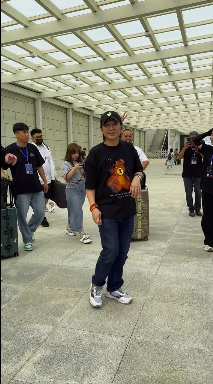
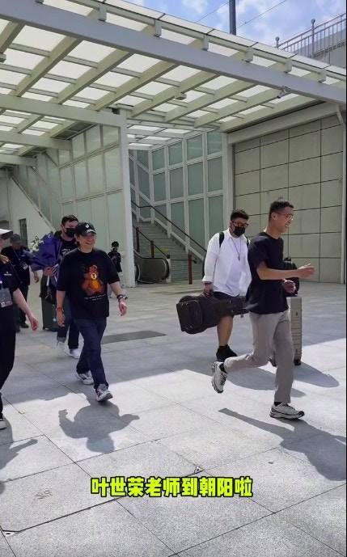
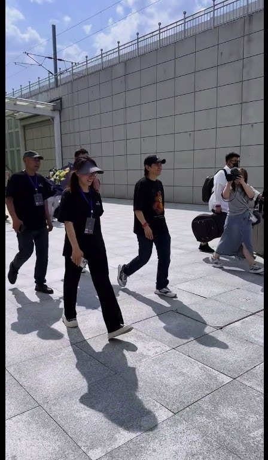
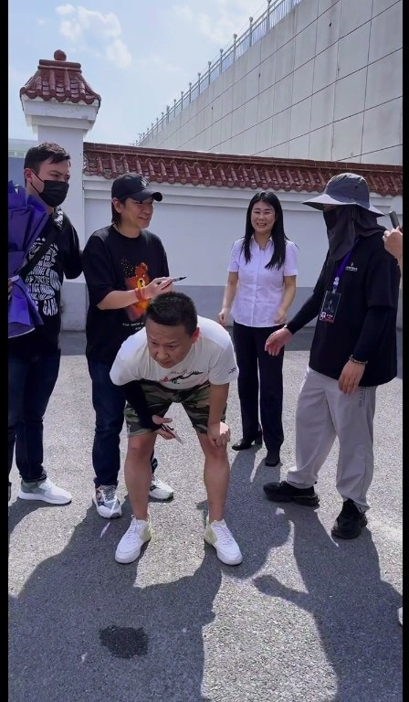
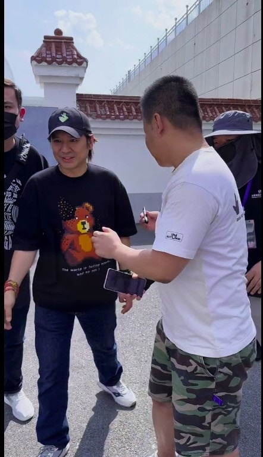

60歲的葉世榮，是港人熟悉的殿堂級樂隊前Beyond成員，在黃家駒意外離世後，三子各有發展，世榮性格較為低調，發展看似不及其他成員，但原來世榮在內地非常紅，被網民讚他是繼家駒後，最有才華的音樂人，近日他在內地開演唱會，現場有不少粉絲支持，更有人叫他在背脊簽名，確是讓人意想不到。

葉世榮在內地開演唱會，被大批粉絲包圍。（小紅書）

Beyond在1993年6月到日本宣傳時，黃家駒意外從舞台墮下身亡，之後三子各有發展，家強領了家駒的意外賠償，基本上已經上岸唔使做。黃貫中不時上內地音樂真人騷，又有個靚老婆朱茵，令人羨慕。至於世榮卻給人發展不順的錯覺，其實只是美麗的誤會，他不時在內地舉行演唱會，首本名曲有《喜歡你》及《不再猶豫》，世榮雖然主力是打鼓，但他的歌聲就帶有家駒的影子，甚受內地歌迷歡迎，近日他被大批粉絲集郵，更有歌迷叫他在背脊簽名，現時他被讚是繼家駒後，Beyond樂隊中最有才華的音樂人。

世榮在內地原來好紅。（小紅書）

要保安開路。（小紅書）

世榮在粉絲背脊簽名。（小紅書）

世榮在內地甚受歡迎。（小紅書）

黃家強、黃貫中及葉世榮曾以三人樂隊繼續發展，但最後亦宣告解散。（視覺中國）

殿堂級樂隊！（視覺中國）

曾以三人樂隊繼續發展。（視覺中國）

Beyond在「The Story Live 2005」世界告別巡迴演唱會後正式解散。（視覺中國）

Beyond在「The Story Live 2005」世界告別巡迴演唱會後正式解散。（視覺中國）

Beyond在「The Story Live 2005」世界告別巡迴演唱會後正式解散。（視覺中國）

Beyond在「The Story Live 2005」世界告別巡迴演唱會後正式解散。（視覺中國）

樂迷希望他日Beyond能夠重組，但家強認為機會微乎其微。（視覺中國）

Beyond三子每年都會在社交平台紀念家駒生忌。（視覺中國）

黃家駒至今逝世二十八週年，其作品依然被人翻唱無數次。（資料圖片）

Beyond在「The Story Live 2005」世界告別巡迴演唱會後正式解散。（視覺中國）

已故Beyond樂隊主音歌手黃家駒及其弟黃家強也曾在蘇屋邨長大的知名兄弟班樂隊。（IG@kwkpbeyond）

唐寧1991年參演電影《Beyond日記之莫欺少年窮》，與黃家駒飾演兄妹。（電影劇照）

Beyond主音黃家駒在日本拍攝節目時因意外離世，享年31歲。遺體運回香港後，於北角香港殯儀館設靈。同日晚上香港商業電台舉行「永遠懷念家駒」悼念音樂會，全場坐滿2600人外，大部分參與者情緒激動。翌日，靈車駛出殯儀館時，行人路上數千名樂迷衝出馬路圍着靈車，情況一度混亂。（影片截圖）

唐寧上載合照悼念黃家駒。（IG：leilakong1205）

唐寧1991年參演電影《Beyond日記之莫欺少年窮》，與黃家駒飾演兄妹。（電影劇照）

唐寧說合作過的巨星中跟黃家駒最親近。（電影截圖）

黃家駒（網上圖片）

2013年6月30日，黄家强上傳微博懷念黃家駒。（黃家強微博）

黃家駒永遠留在大家心中。（黃家強微博）

過往有支持者在Beyond演唱會現場表達對家駒的思念。（視覺中國）

過往有支持者在Beyond演唱會現場表達對家駒的思念。（視覺中國）

家駒離世後，Beyond改以3人樂隊發展。（視覺中國）

家駒離世後，Beyond改以3人樂隊發展。（視覺中國）

家駒離世後，Beyond改以3人樂隊發展。（視覺中國）

家駒離世後，Beyond改以3人樂隊發展。（視覺中國）
