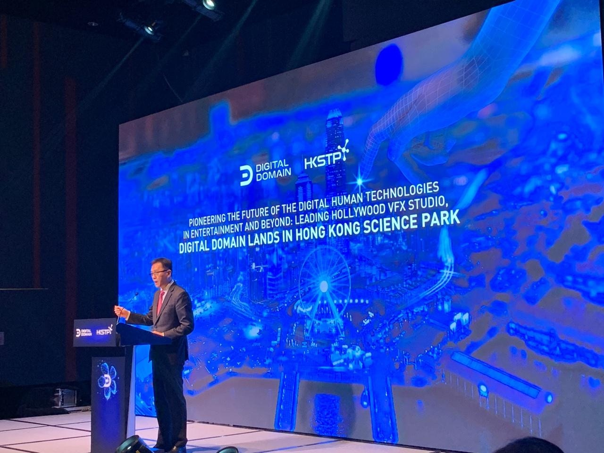
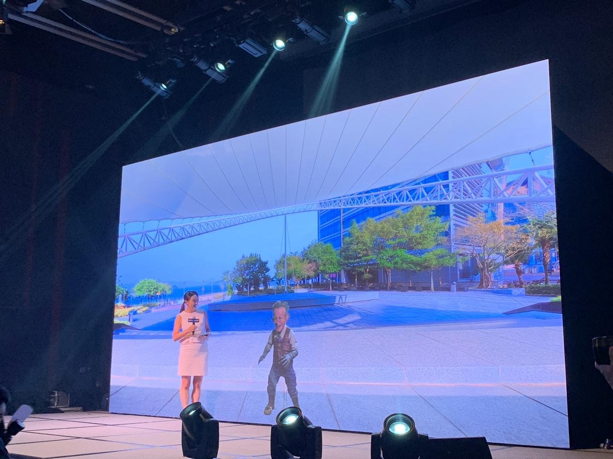
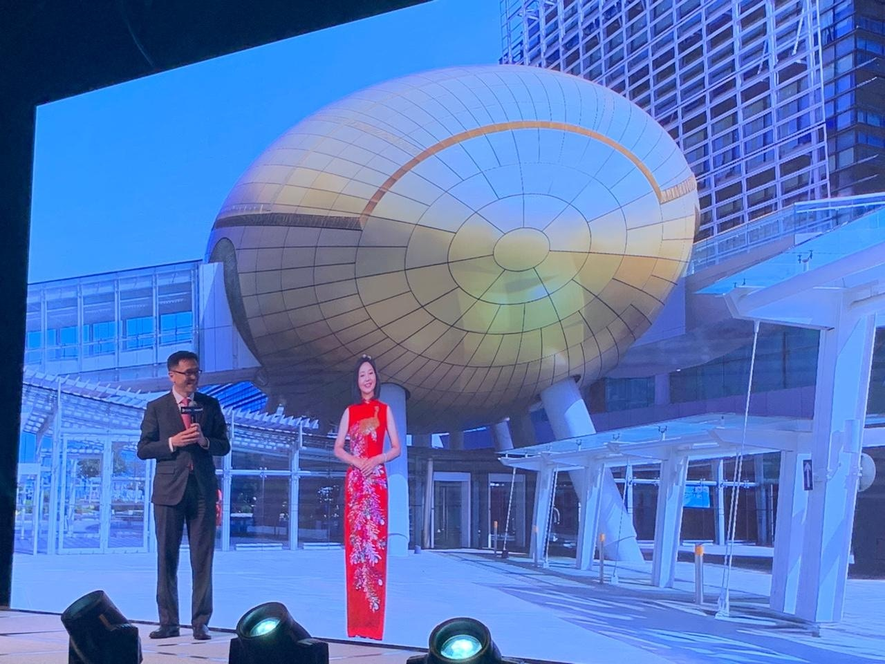
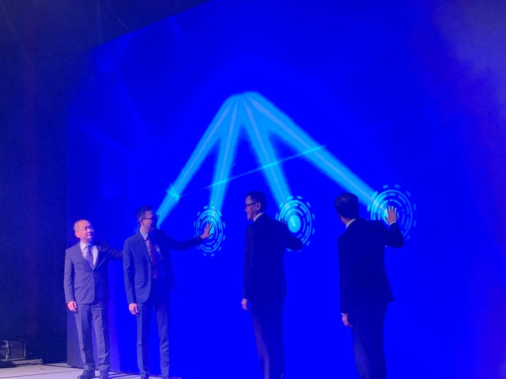
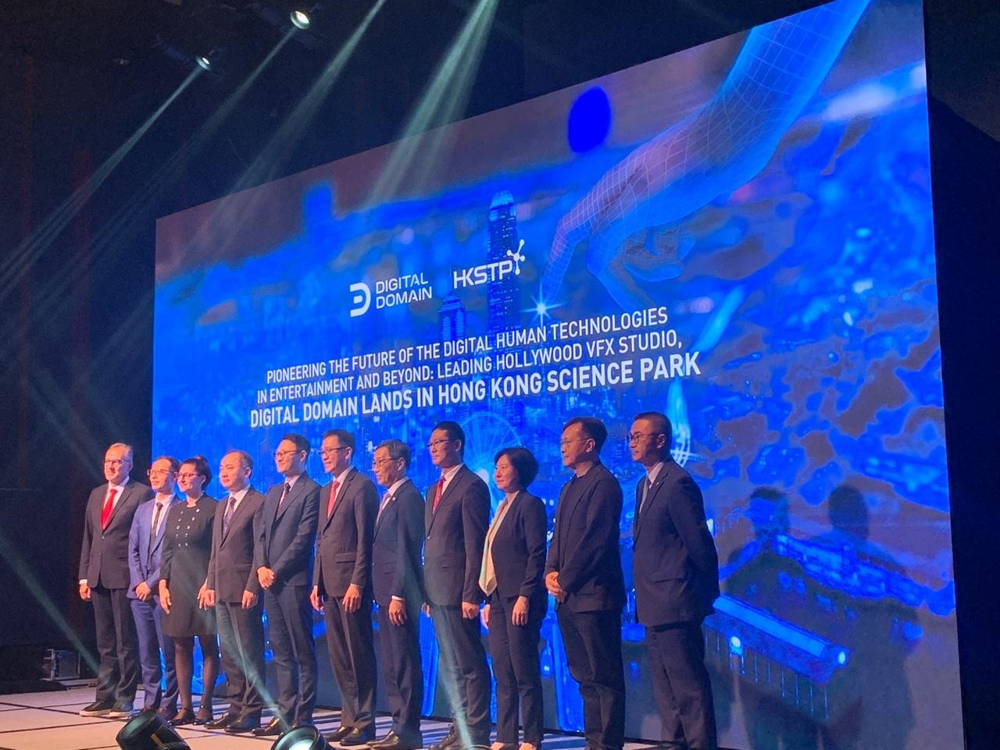
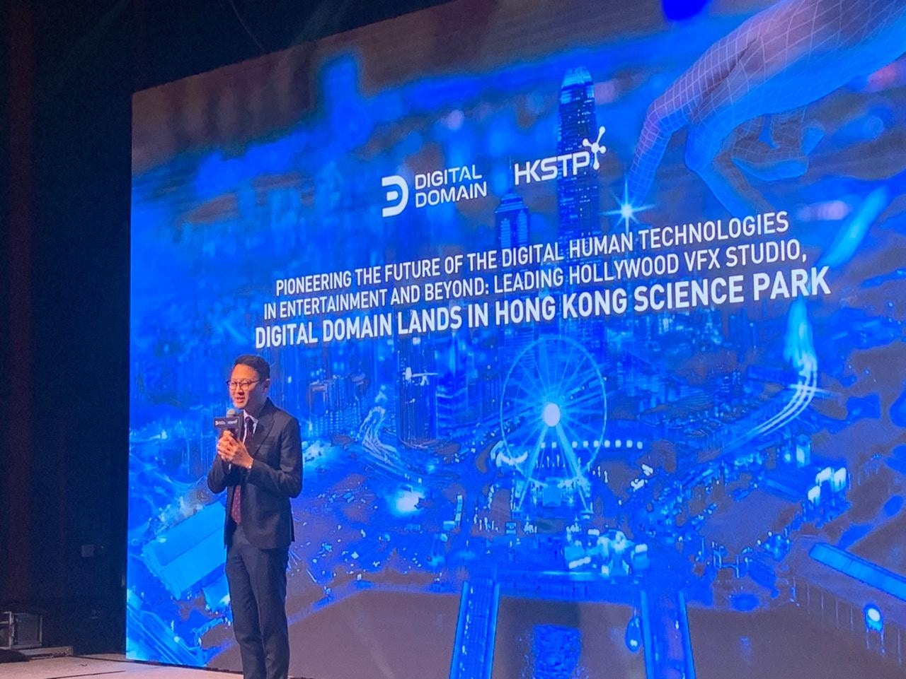

*創新科技及工業局局長孫東表示，香港科技園與數碼王國的合作，標誌着數碼娛樂的一個重要里程碑，推動了創意領域的發展。（陳麗娟攝）*

數字王國正式進駐香港科學園，設立國際創新研發中心，計劃2029年前投入合共逾2.04 億元，專注推動人工智能AI虛擬人VH、視覺特效和數碼資產VFX，以及AI影片製作AVP，預料會提出5個香港專利申請，打造香港成國際人工智能及AI虛擬人技術研發中心，亦將以AI虛擬人技術創造數碼角色，強化香港的「東方荷里活」地位。此外，亦計劃將AI虛擬人技術推廣並應用於銀行業、教育、長者服務也及旅遊業。

*數字王國的虛擬人Elbor與司儀有問有答。（陳麗娟攝）*

*虛擬人鄧麗君與創新科技及工業局局長孫東實時對話，又獻唱《我怎能離開你》。（陳麗娟攝）*

*數字王國將不斷以 AI 虛擬人技術創造數碼角色，推動「香港製造」電影的繁榮發展，強化香港「東方荷里活」地位。（陳麗娟攝）*

*數字王國將不斷以 AI 虛擬人技術創造數碼角色，推動「香港製造」電影的繁榮發展，強化香港「東方荷里活」地位。（陳麗娟攝）*

今日（24日）的啟動儀式上，虛擬人Elbor與司儀有問有答，虛擬人鄧麗君更與孫東實時對話，又獻唱《我怎能離開你》。數字王國行政總裁謝安表示，數字王國定位不單是電影公司，還是科技發展公司，又透露除了鄧麗君，還計劃將張國榮、Beyond的黃家駒等港人共同回憶帶回來。

*數字王國行政總裁謝安表示計劃將張國榮、Beyond的黃家駒等港人共同回憶帶回來。（陳麗娟攝）*

被問為何選擇香港落戶，謝安指有被不同國家及地區邀請，「最積極是新加坡」，最終選擇香港原因在於「香港是避風港」，不受地緣政治影響，且多元文化兼具活力，讓他不感覺到自己是外國人。

孫東表示，香港已做好充分準備，迎接人工智能革命帶來的機遇和挑戰。香港科技園與數碼王國的合作，標誌着數碼娛樂的一個重要里程碑，推動了創意領域的發展。
