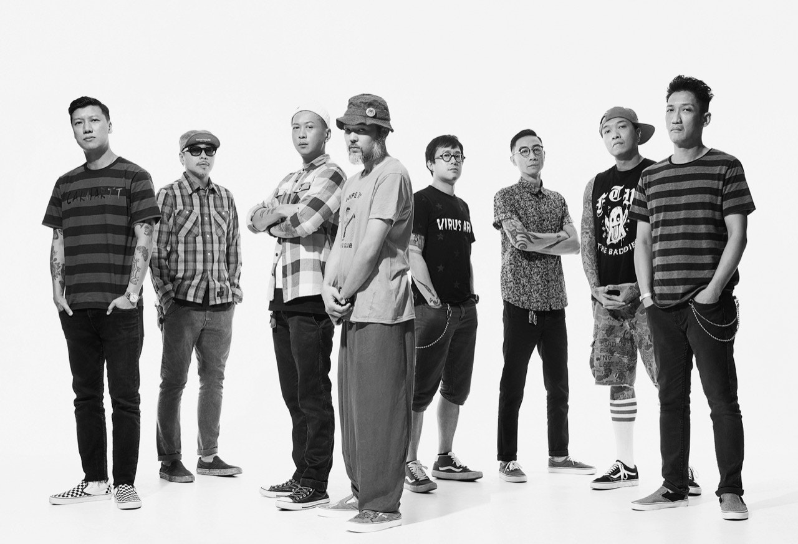
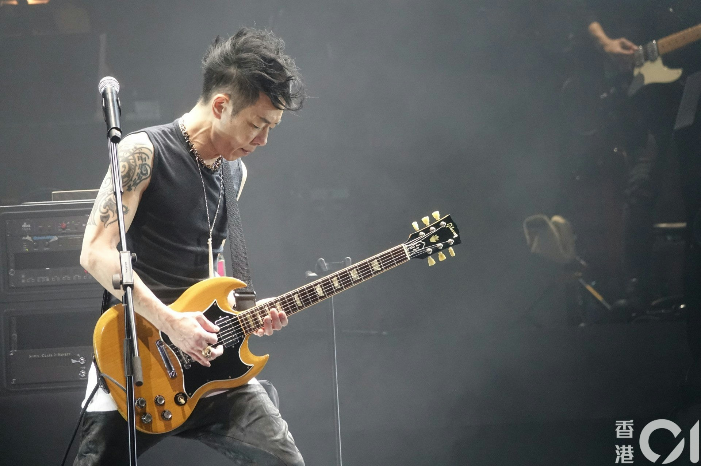

何超 (即何超儀) 發起全港最強搖滾班霸登陸英國，與一班歌手好友包括LMF、黃貫中、24Herbs、Josie and the Uni Boys一起演出，眾人齊心集氣，可說是史無前例。近年不少香港流行歌手都如雨後春筍般相繼在英國開騷，唯獨一直欠缺搖滾音樂類型。而在英國一直致力推動本港音樂文化的華通娛樂近日終於突破此缺口，決心把香港獨有的搖滾音樂帶到英國，早前主辦方便聯絡上何超，邀請她來英國演出，何超不但一口答應，更主動提出帶同她的一眾好友前來英國。

LMF

何超儀

在何超的推波助瀾下，最終把香港最殿堂級的搖滾班霸黃貫中、LMF、廿四味、及何超與其樂隊Josie and the Uni Boys一起往英國，齊上齊落，何超更聲言要讓外國人見識香港搖滾音樂的力量。而所有單位當知道何超這舉動，無不興奮不已，全部第一時間答應，而LMF的阿庭 (梁偉庭) 更主動為演唱會構思了名字Dragon Rock，並用了短短兩天的時間設計及繪畫了代表演唱會的龍頭logo。據阿庭表示Dragon Rock寓意過江龍的意思，以李小龍猛龍過江的精神，令英國的樂迷親眼見證香港搖滾音樂的勁道。而此消息一出，在當地KOL界引起一場哄動，大家對這樣超班的搖滾組合竟可在英國出現，感到非常不可思議。Dragon Rock演唱會定於明年2月27日於倫敦Indigo at O2舉行，只此一場。

黃貫中 (資料圖片)
