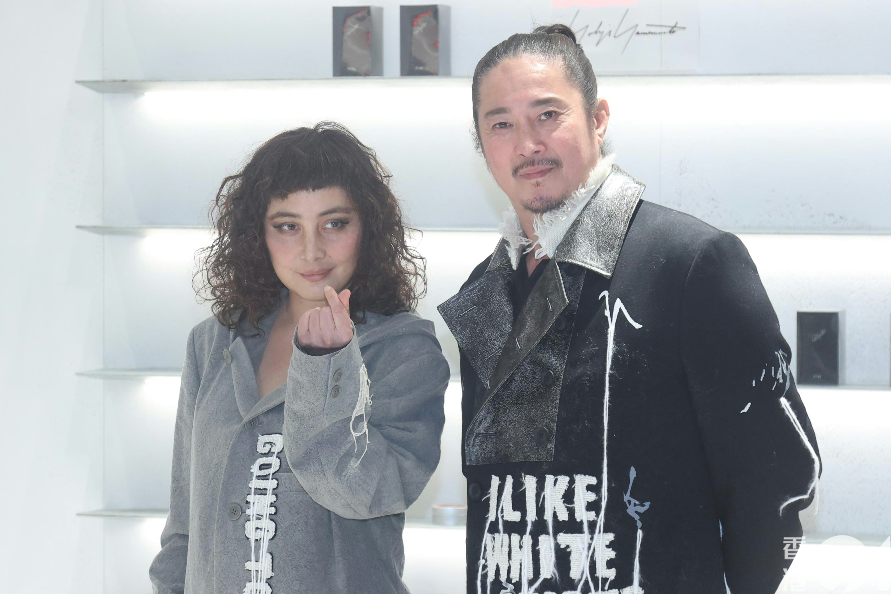
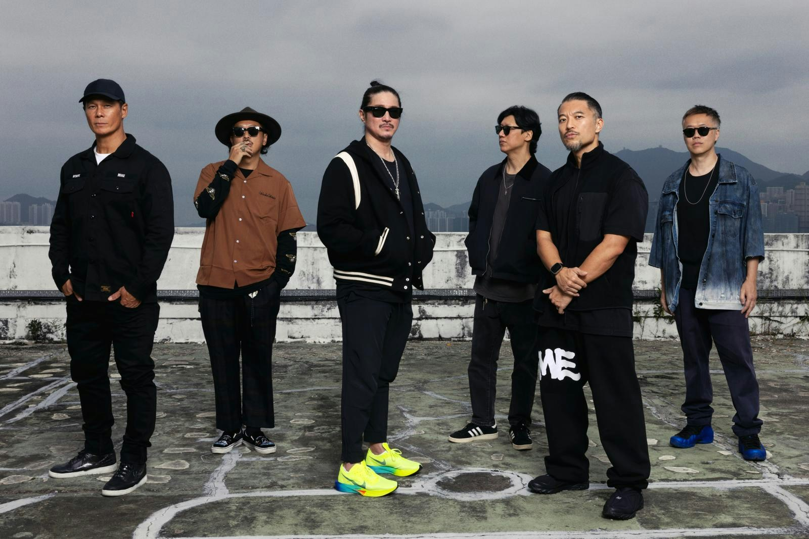
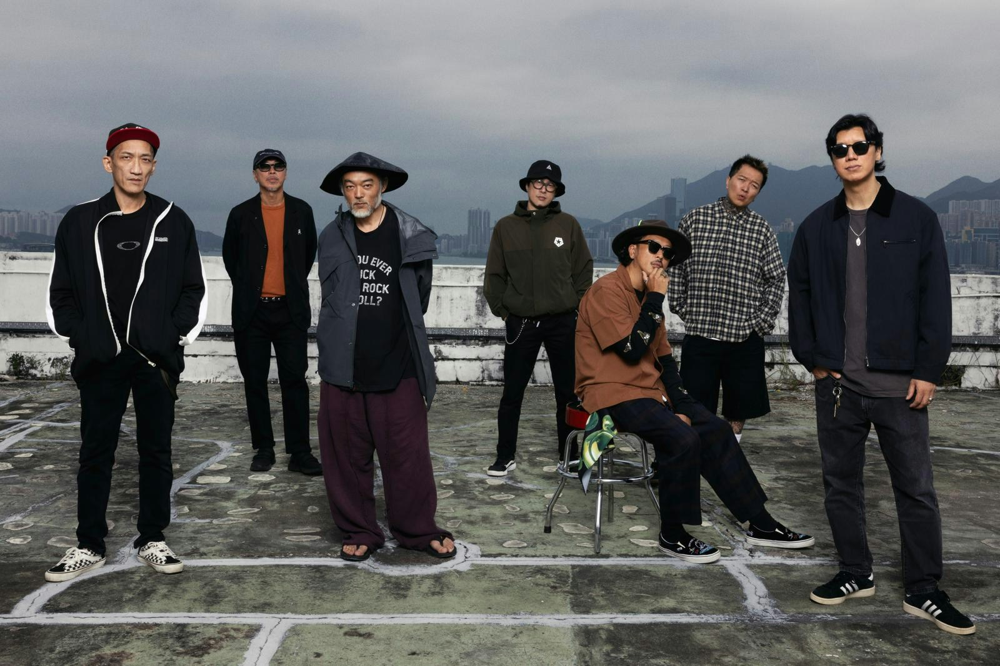

何超 (即何超儀) 自從宣布在明年2月27日拖隊往英國倫敦Indigo at O2開騷後，所有參與單位黃貫中、LMF、24Herbs及Josie and the Uni Boys均興奮不已。除了LMF阿庭（梁偉庭）主動為演唱會構思名字Dragon rock及設計龍頭logo外，何超也有感如此盛事，大家難得濟濟一堂，當然要為此次演唱會拍攝官方海報。

何超儀和老公陳子聰現身尖沙咀出席品牌活動。（梁碧玲攝）

原本以為要集齊四個單位10多人，在度期上會十分困難，豈料每個單位當知道何超這看法後，立刻放下手上的工作，抽時間出來拍攝此張海報，而阿Paul黃貫中更主動提供自己Band房的天台作為拍攝場地，也讓眾人在自己Band房內更衣化妝及休息。拍攝當日，眾人均十分有默契，自動埋位，完全不需討論誰左誰右誰前誰後的企位問題，甚至不用攝影師及監製指導眾人擺pose及做表情，在鏡頭後有說有笑的眾人，一埋位大家便統一自動來張撲克臉，非常一致，也非常有趣，結果原定要3小時的拍攝時間，只用了1小時便完成。事後阿庭亦只用了一天時間便把攝影師的相片設計成海報。海報出街後，樂迷及網友一致大讚有型。大家齊心完成了一次壯舉，難怪何超說：「有今生冇來世。」指的不單是這次演唱會，還有這份友情。

大家齊到天台拍海報。

大家齊到天台拍海報。

好有型。
