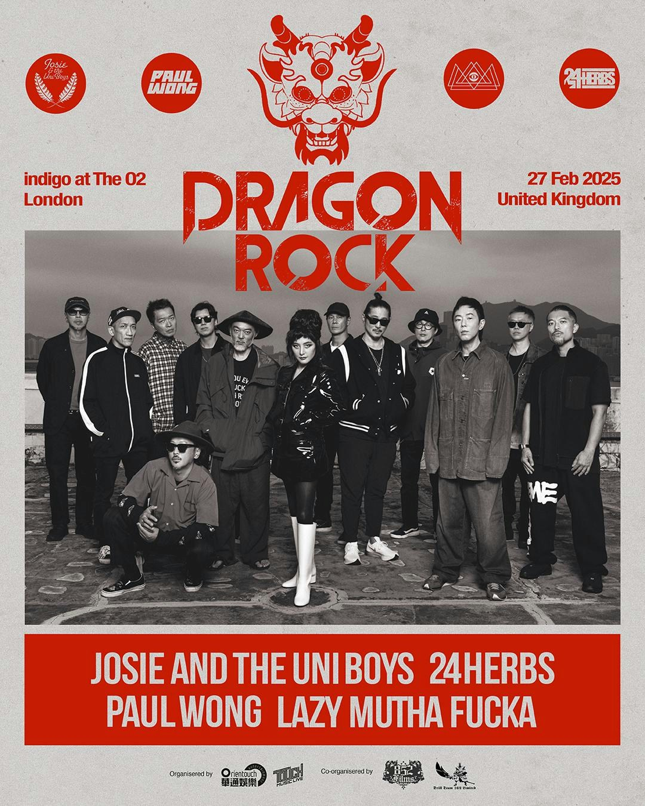
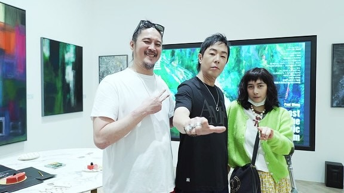
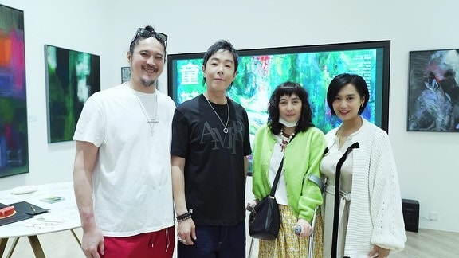

由何超領軍，史無前例地集結了香港的搖滾精英黃貫中、LMF、24味及她的樂隊Josie and the Uni Boys，在2月27日倫敦indigo at O2舉行名為《Dragon Rock》的搖滾騷，被譽為香港音樂人在倫敦舉行最具能量最具爆炸性的一次音樂會，當中不但見證四個單位多年來的共同理念，其中何超與阿Paul黃貫中，更是亦師亦友，友誼跨越20年。何超說要像過江龍般令外國知道香港也有很出色的搖滾樂，阿Paul則說︰「要為在英國的香港人帶來家鄉的感覺。」

黃貫中、LMF、24味及她的樂隊Josie and the Uni Boys，在2月27日倫敦indigo at O2舉行名為《Dragon Rock》的搖滾騷。（《Dragon Rock》海報）

這次英國之行，對阿Paul來說意義重大︰「我是第一次來英國開騷，亦是第一次這麼多搖滾單位一齊去，我知有很多香港人在那邊，我希望把以前香港的感覺帶給他們，能讓他們feel到家鄉的親切感，這對我來說特別有意義。」

何超則希望音樂會能像Dragon Rock的名字一樣，做到像香港過江龍一樣︰「我希望有多些英國甚是歐洲的樂迷來觀看，好讓我們的歌聲及音樂，令大家知道香港也有很好的搖滾樂。」

何超與阿Paul黃貫中亦師亦友，友誼跨越20年。（何超IG圖片）

去年何超赴腳傷都要去撐黃貫中的畫展。（何超IG圖片）

阿Paul更事先張揚為了這個音樂會，會特別挑選些很適合給英國港人聽的歌，回憶秒殺全場。Paul說︰「我會玩些很久沒有玩過的歌，希望能喚起大家的回憶。」其實何超與阿Paul也深受80年代的英倫文化影響，阿Paul說：「香港曾經長久以來是英國的殖民地，我們很多文化都來自英國，尤其是我們這代玩搖滾的，很多都是聽英國音樂長大，英國對我們玩搖滾的影響深遠，所以作為香港樂隊，特別希望能夠到英國來表演。」
