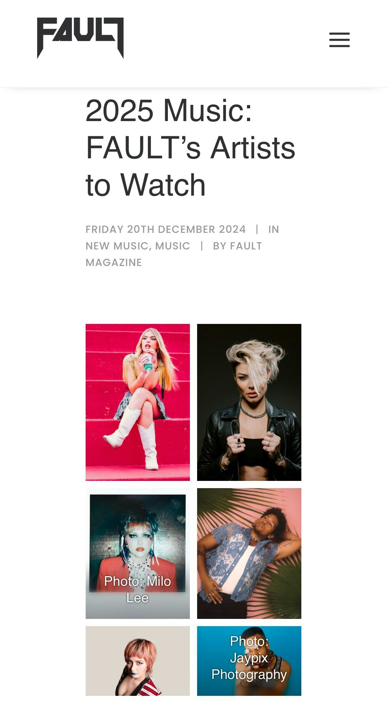

由何超領軍，夥拍兼貫中、LMF、24味及其Josie and the Uni boys等四組合，27號將在倫敦 Indigo at O2舉名為《Dragon Rock》的搖滾樂會。何超揚言要讓外國識香港搖滾樂力量。這不單是口號，更將成為事實。而當地有9間音樂媒體都對這次表演高度關注，已向主辦單位報名前來採訪及觀看。

*由何超領軍，夥拍兼貫中、LMF、24味及其Josie and the Uni boys等四組合，27號將在倫敦 Indigo at O2舉名為《Dragon Rock》的搖滾樂會。(大會提供)*

英國樂界對這次樂會深感興趣，因華人樂界在英國開騷，近年如雨後春筍，但多只局限於流行歌，能夠集結香港這麼多殿堂級搖滾樂隊來英國表演可謂史無前例，對當地的音樂平台來說是件稀有及絕對難得的事，故紛紛慕名前來觀看。

當晚的英國九媒體包？＂＂＂括Media Eye, Influencer Intelligence, PA, Fault Magazine,Mundane, V13, TML, Rival Magazine 及Music Republic Magazine ，更包括當地的唱公司。有個別媒體亦已提出希望完＇騷後能在後台採訪各樂隊，對此何超非常雀躍謂︰「定盡全力不會丟香港人架。」

*新歌《沒完沒了的完美》早前也被外國樂化雜誌Kaltblut選作編輯推介，默默地在樂圈引起關注。（網頁截圖）*

*不少英國媒體都有報道是次音樂會。（網頁截圖）*

事實上何超的樂在海外的化界也備受注意，如在剛出版的Fault 樂雜誌及Galore雜誌已把她及其樂隊Josie and the Uni Boys列作2025年必須關注之列，更推介其在27號的Dragon Rock 音樂會，稱為本年別具意義的音樂會之一。其新歌《沒完沒了的完美》早前也被外國樂化雜誌Kaltblut選作編輯推介，默默地在樂圈引起關注。

27號在倫敦的dragon Rock進入倒數階段，何超與其樂隊正密鑼緊在綵排，何超捧的新人Iman到時也會上台與何超合唱，何超更讃Iman節奏感比她好，跳舞節拍很準，非常有天份。另外這次亦是陳子聰完成所有手術後，第一次以最佳狀態回歸24味，比起他在兩個月前在來亞的演出，這次可謂是以全新姿態，他們表示：「這次肯定好嘈，好迫，大家要儲定energy 來開這個party 。」

*這次亦是陳子聰完成所有手術後，第一次以最佳狀態回歸24味。(大會提供)*
