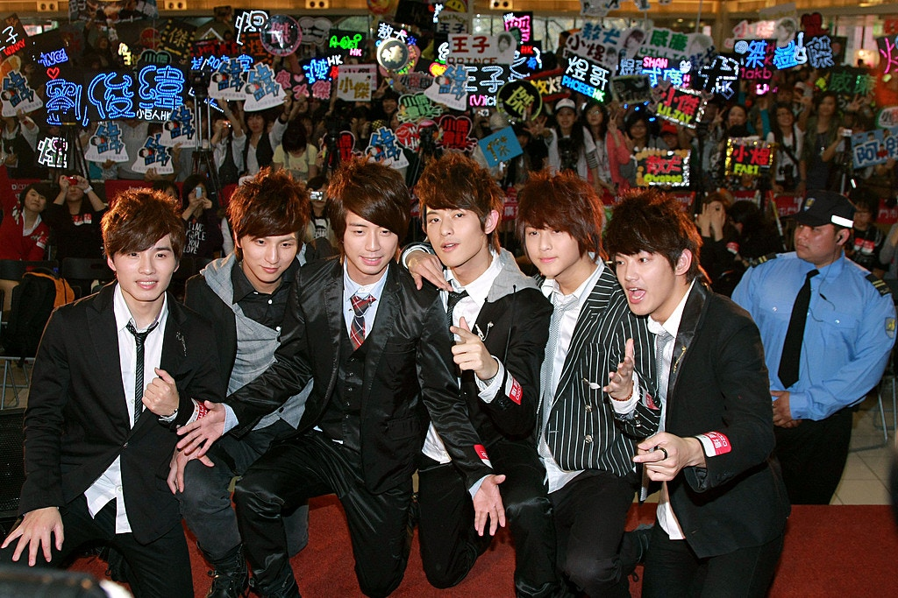
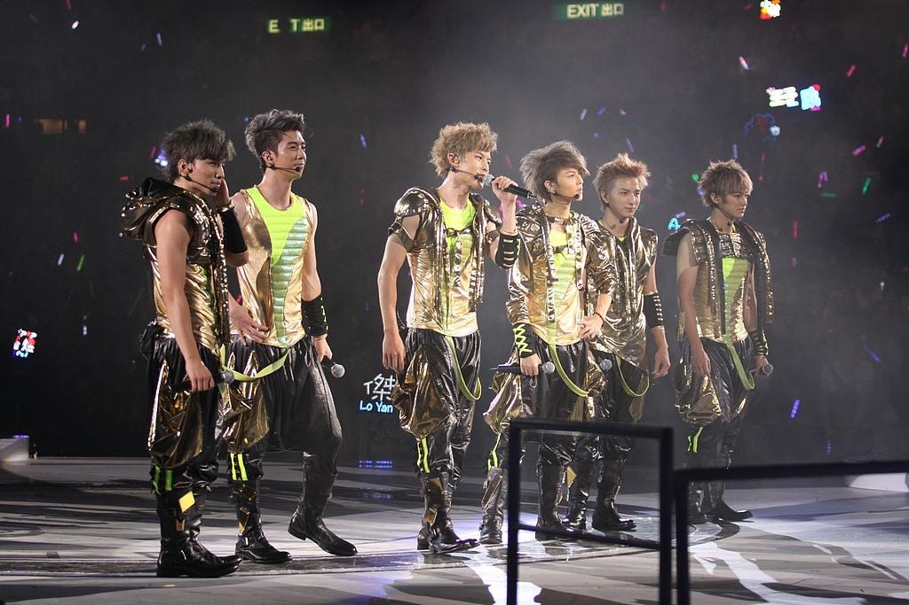
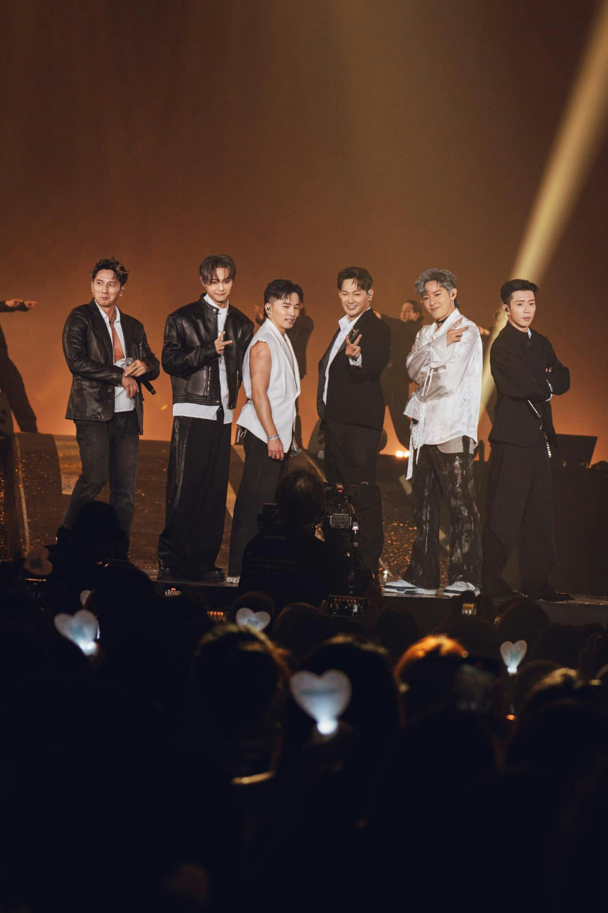
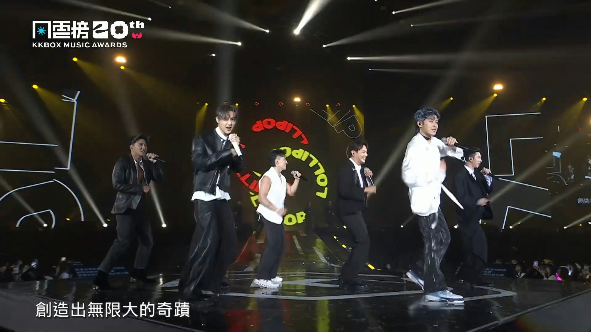
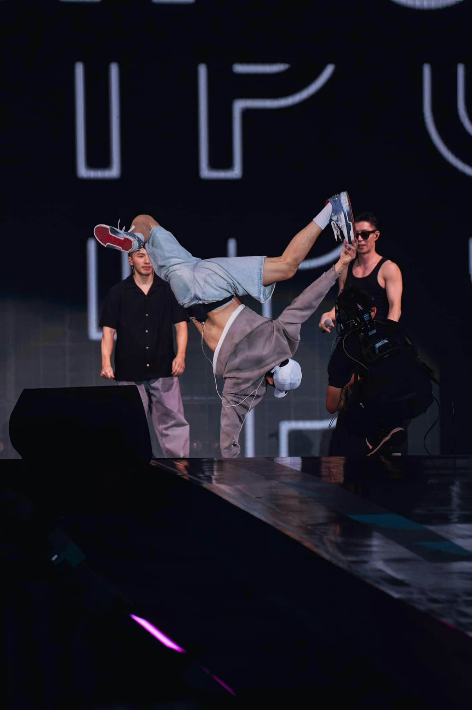
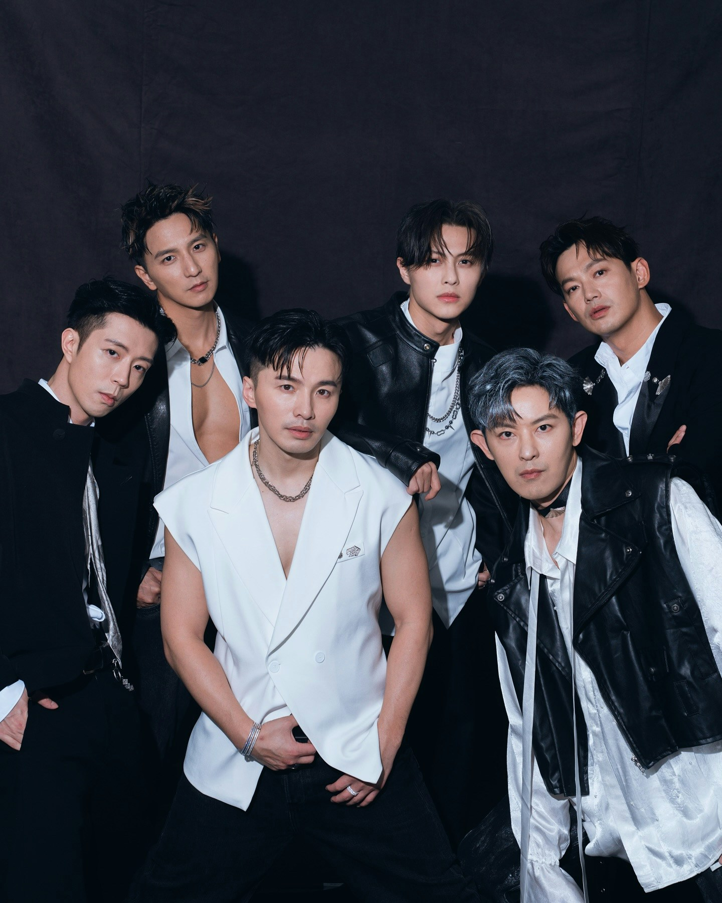
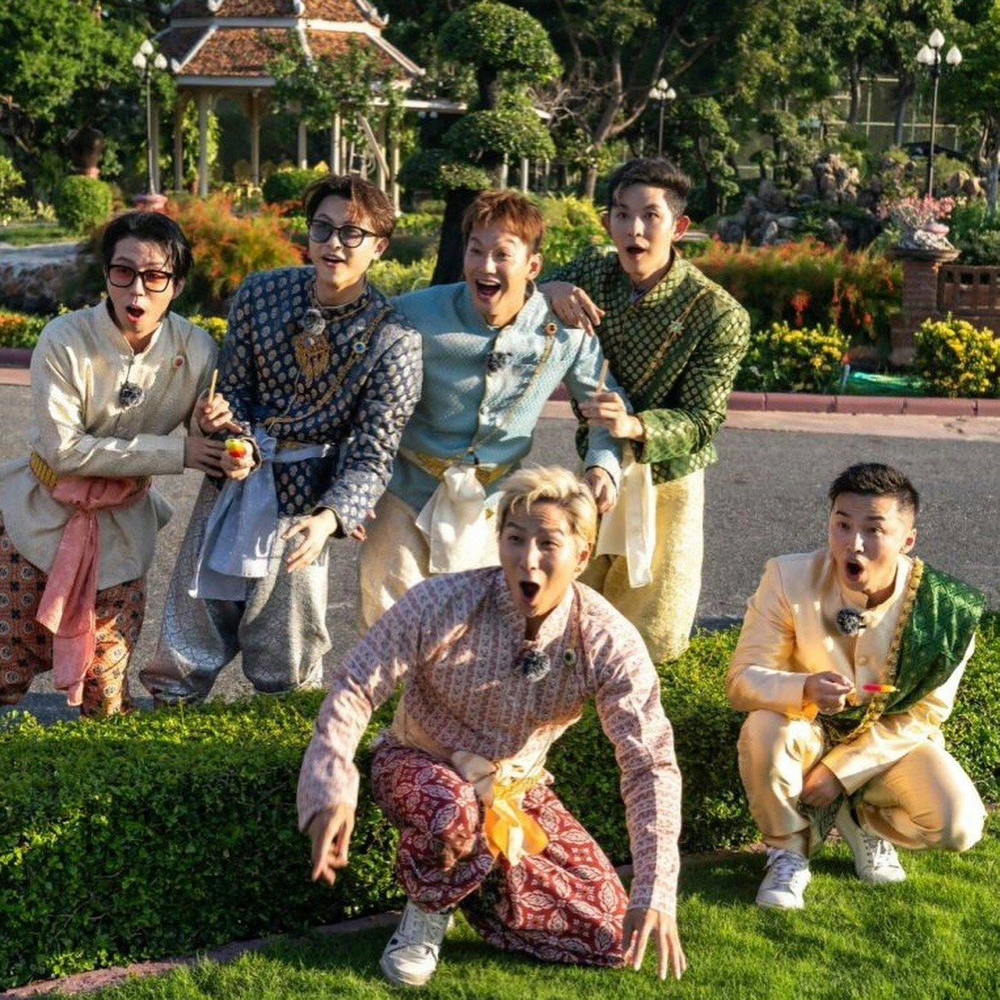
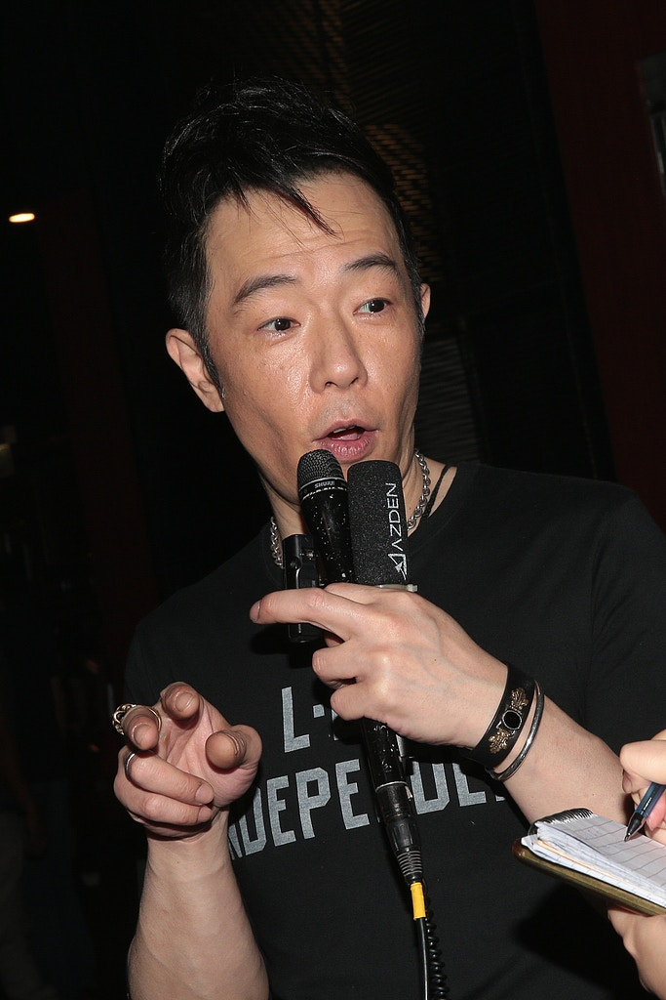

台灣男團棒棒堂（Lollipop）自2006年憑節目《我愛棒棒堂》爆紅，是不少8、90後回憶，當年人氣極盛，更曾攻佔香港紅館舉行演唱會。不過自2010年後，團員各散東西單飛發展，甚至已成家立室，直到昨晚（19日）驚喜現身於台灣《第20屆KKBOX風雲榜演唱會》，相隔15年再度合體，掀起觀眾滿滿回憶殺，台下粉絲感動得爆喊。

棒棒堂當年好紅，在香港搞簽名會逼爆商場。（VCG）

棒棒堂亦曾在香港開紅館演唱會。（VCG）

不過棒棒堂在2010年分家，敖犬、威廉、小煜、阿緯組成Lollipop F。（VCG）

小杰、王子則另起爐灶，與王子的弟弟毛弟組JPM。（VCG）

早在去年，棒棒堂已經開始應邀參與TVBS綜藝《來吧！哪裡怕》，再度活躍於幕前，除了多年忠粉們興奮之外，更吸納了一堆新支持者。棒棒堂在昨晚的演出上，一連表演經典歌曲，包括〈我是傳奇〉、〈電司〉、〈那不是雪中紅〉、〈七彩棒棒堂〉等，最後再以當年紅極一時的偶像劇《黑糖瑪奇朵》插曲〈苦茶〉作結尾，當中敖犬及阿緯更重現當年標誌性嘅地板動作「大風車」，讓粉絲熱血沸騰。

棒棒堂相隔15年再度合體，在《第20屆KKBOX風雲榜演唱會》，演出！（fb@敖小犬小敖）

棒棒堂一連表演〈我是傳奇〉、〈電司〉、〈那不是雪中紅〉、〈七彩棒棒堂〉、〈苦茶〉等歌曲，台下粉絲激動落淚。（KKBOX）

敖犬及阿緯更重現當年標誌性嘅地板動作「大風車」，阿緯笑言年紀大，做到手腕痛。（fb@敖小犬小敖）

成員透露為了這次回歸，特意花了一個月密集訓練，積極減肥、健身及練舞；王子及阿緯表示，今次以「最後一舞」心情上台，希望透過表演，將大家拉回20年前的青春、熱血時代。隊長敖犬演出後於社交平台感慨表示：「上一次6人舞台是2010，這一次6人舞台是2025，這一圈我們繞了15年，因為2025-2010=2015，是不是有點怪怪的，我也不太確定，但很開心你們來看我們表演，我們也唱得很爽！」棒棒堂亦在舞台上透露，接下來會有更多合體計劃，包括明年20週年有望舉辦演唱會，新歌亦將於暑假推出。

明年是棒棒堂出道20周年，他們預告很快會出新歌，亦希望有演唱會。（fb@敖小犬小敖）

棒棒堂去年開始合體，錄製真人騷《來吧！哪裡怕》。（fb@廖允杰Jaydaone）

今次棒棒堂回歸，在香港一樣有很多討論，亦有人重提當年黃貫中的言論。2009年，他們的紅館演唱會曾因「咪嘴」疑雲遭Beyond成員黃貫中公開批評，棒棒堂Fans憤而瘋狂洗版，鬧黃貫中「老」、「窮」、「軟飯王」等眼字頻繁出現，而黃貫中則還擊，表示要跟對方學習咪嘴，因為「咪得似真的好難」，最後他更在接受傳媒訪問提及棒棒堂時講出一句「三年後仲喺度先同我講」。不過事隔16年，棒棒堂不僅再度合體，更仍然受到粉絲熱烈支持，令黃貫中當日的「預言」被網民重提，更笑言：「真係仲喺度喎！」

黃貫中曾狠批棒棒堂咪嘴，揚言：「3年後仲喺度先同我講」如今棒棒堂相隔15年再合體，網民笑言：「真係仲喺度。」（VCG）
