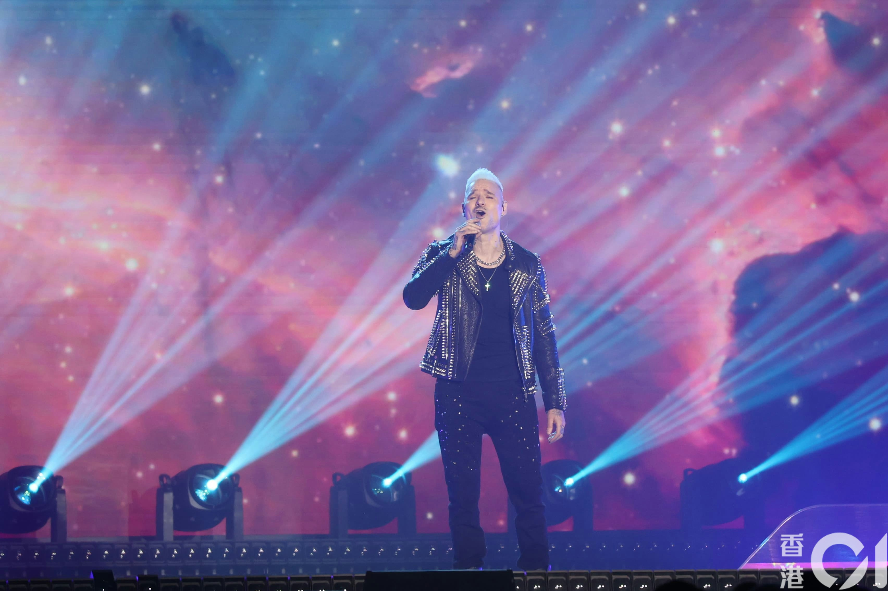
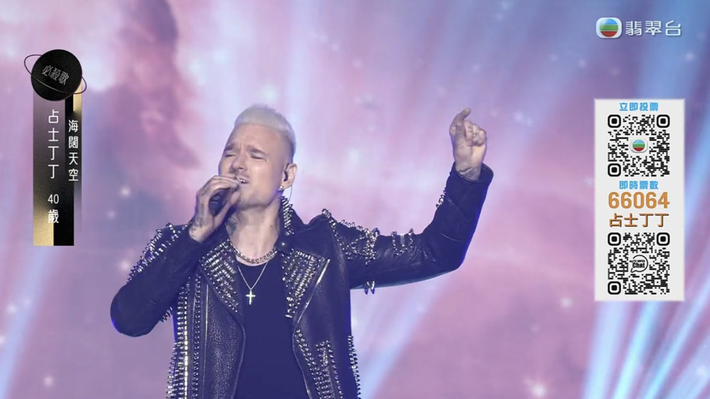
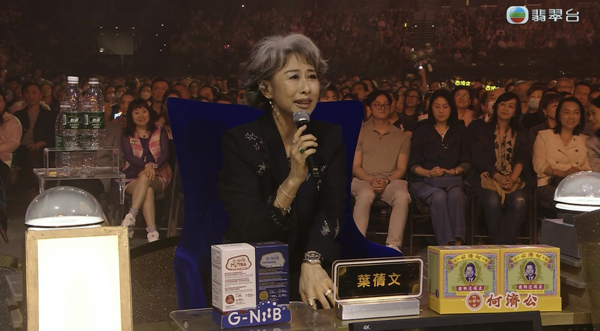
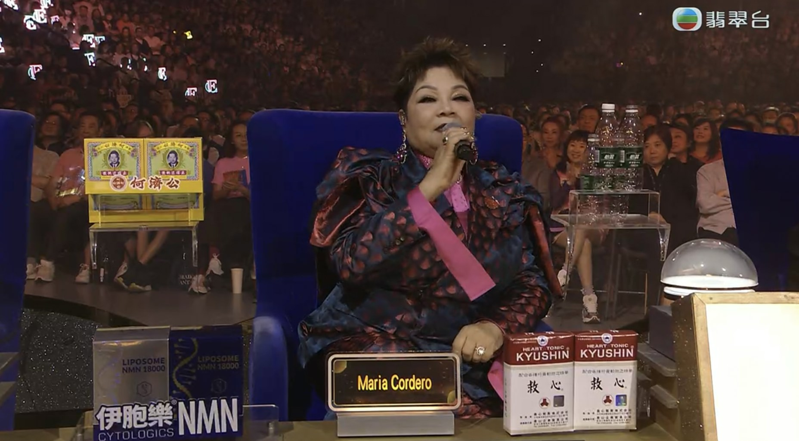
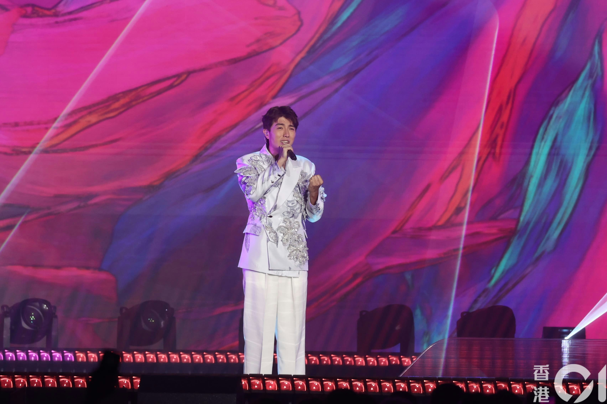
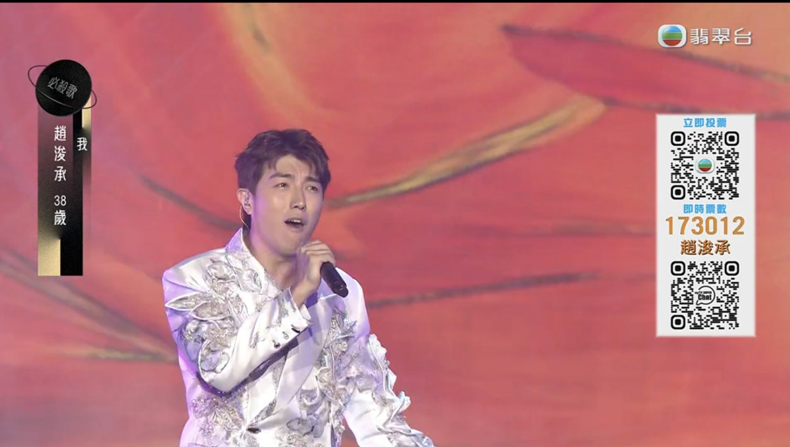
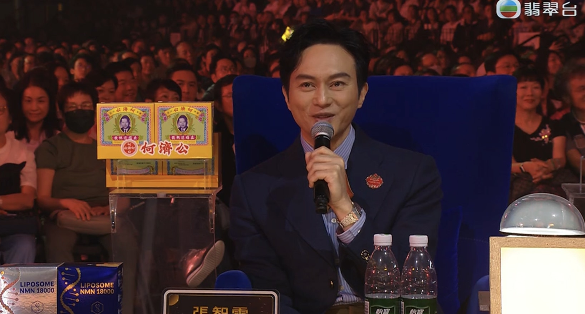

無綫（TVB）歌唱選秀比賽《中年好聲音3》今晚（11日）在啟德舉行決賽《中年好聲音3登峯之戰》，首名選手為占士丁丁，占士丁丁選唱Beyond經典歌曲《海闊天空》。占士丁丁以近乎完美廣東話激情演唱，更舉手引全場大合唱揮手。占士丁丁中段加了一段Rap，內容是感謝香港讓他夢想成真。

*占士丁丁。（葉志明 攝）*

*占士丁丁《海闊天空》。（TVB截圖）*

事後占士丁丁表受車婉婉訪問，被爆將搬來香港。而今次只揭露名評審分數，葉蒨文及肥媽均給予18分。葉蒨文先大讚占士丁丁「好有passion」，並以英文鼓勵占士丁丁。肥媽則讚占士丁丁是「現場表演者」，她說：「一出嚟將自己識hip hop，識Rap表現出嚟先。」但肥媽建議：「呢首Big song嚟，應該先擺多啲心機唱呢首歌。」

*（TVB截圖）*

*肥媽認為占士丁丁應多花心思練歌。（TVB截圖）*

第二名則由趙浚承演唱張國榮的《我》，趙浚承指近日好多聲音，希望借這首歌表達我就是我。羅志祥給予趙浚承18分，張智霖則給予19分。張智霖直言趙浚承「好打動到我。」而羅志祥亦指：「每一字每一句都很打動我，希望你未來可以做自己。」

*趙浚承。（葉志明 攝）*

*趙浚承演唱張國榮的《我》。（TVB截圖）*

*張智霖坦言趙浚承打動了他。（TVB截圖）*
