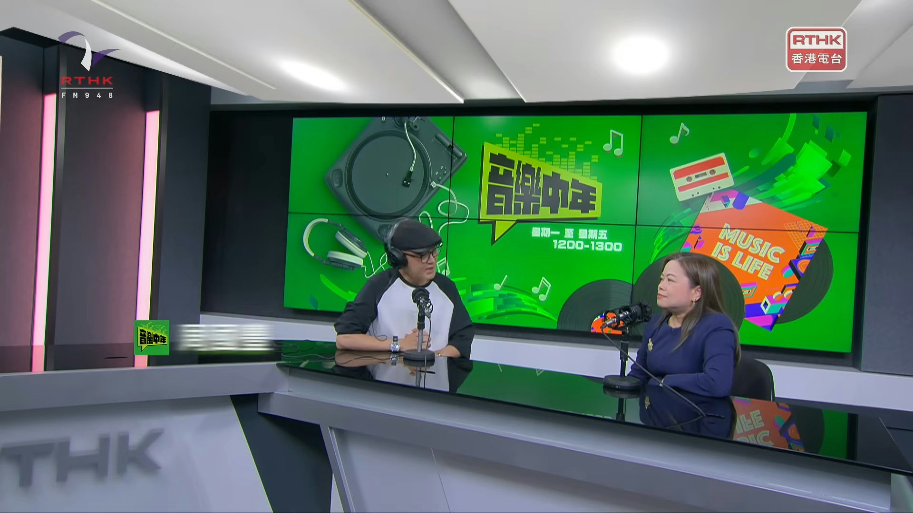
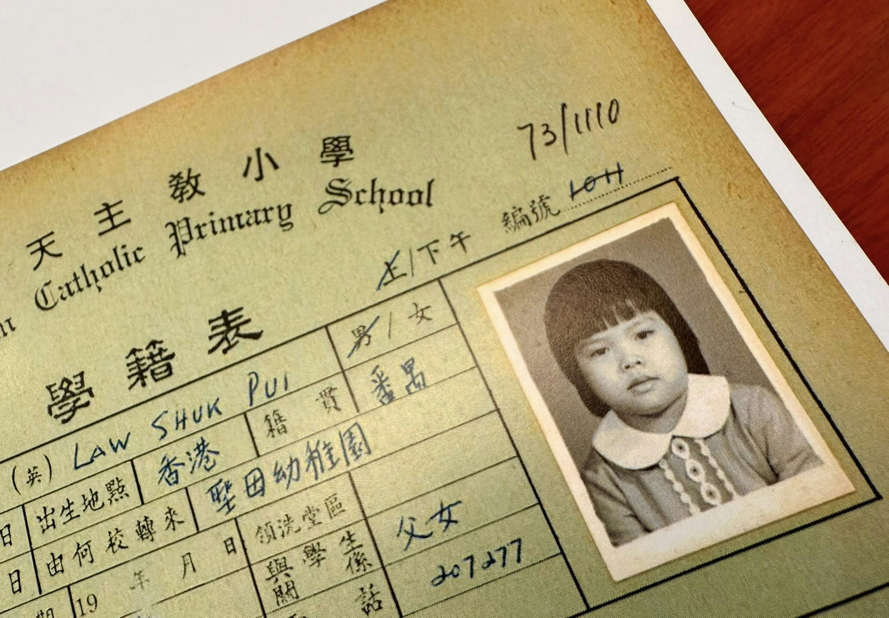
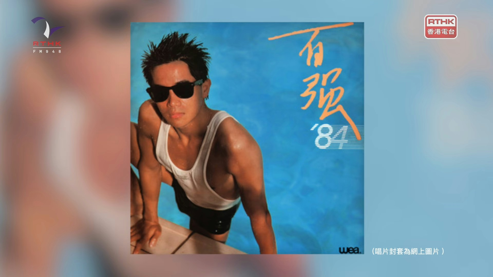
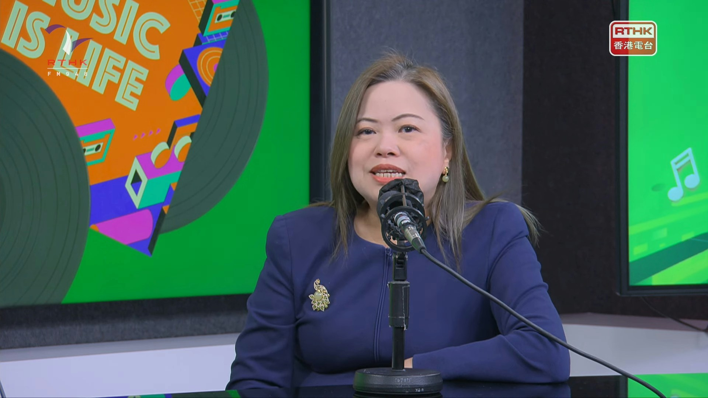
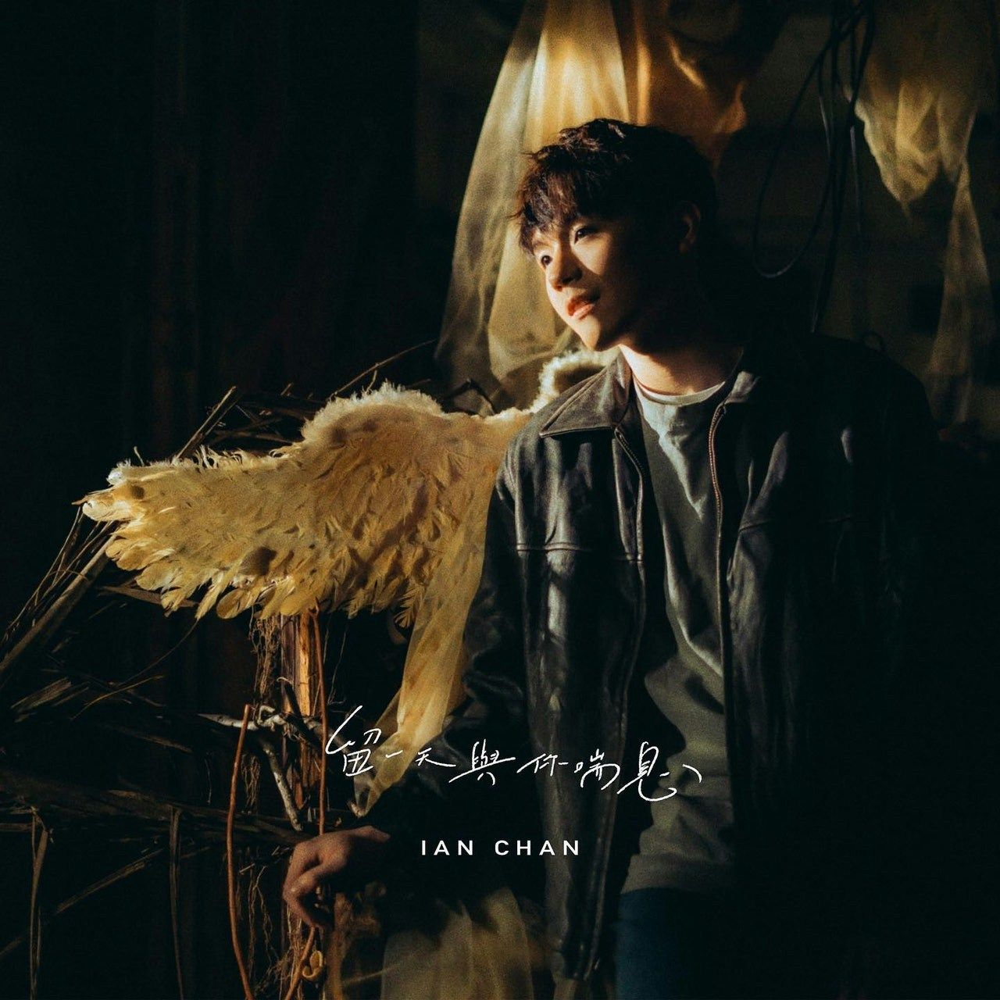
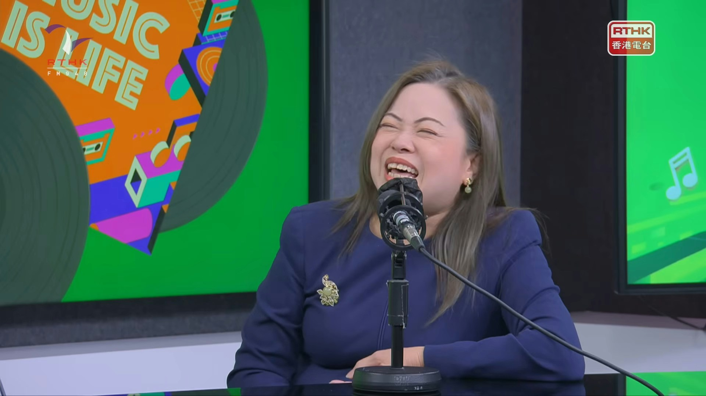

羅淑佩局長接受周國豐主持的《音樂中年》訪問。（香港電台）

羅局長指自己從小喜歡聽歌，因她是家中獨女，沒有兄弟姊妹，兒時最大娛樂就是聽收音機。她第一首推薦的是溫拿《好學為福》，認為黃霑將《論語》「好仁不好學，其蔽也愚」等填到歌曲裡，用輕鬆形式將中華文化傳開去是很好的事，自己亦曾研習此曲的歌詞，認為香港有著能影響全華語地區的流行文化十分幸福。第二首是陳百強的《摘星》，讚這首歌很鼓舞，給人一種動力。問到在譚詠麟與陳百強之間會選誰，局長直言：「咁Danny喎，Danny唔係依個時候先鍾意，係佢《眼淚為你流》已經開始鍾意，嗰啲係所有女仔都覺得好型，有個男仔彈鋼琴、自彈自唱又唱得好聽。」她又自爆有買陳百強《太陽花》唱片：「佢喺唱片裡面張歌詞紙另一面有個鋼琴譜，係《有了你》嘅鋼琴譜，我彈琴唔係好叻，六級咁啦，嗰時見到個譜咪練吓囉。」

羅局長兒時試過因為剪「冬菇頭」被同學改花名「冬菇」。（fb@Rosanna Law）

除了溫拿的《好學為福》，羅局長第二首推薦歌曲是陳百強的《摘星》。（香港電台）

羅局長分享自己童年的「我的志願」是律師，不過會考後中大開始收「暫取生」，她是第一屆，既然不用考A-Level，就順理成章入讀中大的政策與行政系，周國豐問她可有感到後悔，她表示：「又冇得咁樣諗嘅，咁或者我未必係一個好成功嘅律師呢，又唔係話而家好成功，但起碼做咗30幾年，我到而家都可以好起勁，證明係一份啱我做嘅工。」

而分享第三首歌Beyond《真的愛你》前，她說母親是嚴母，打到她一身藤條印，但自己能理解，因為她是獨女，學壞了、縱壞了就冇：「如果佢唔打我，我諗我變飛女㗎喇。」周國豐問她到底有幾曳，她笑說：「反叛又駁嘴，你知反應又快，講一句頂十句，都幾乞人憎！同埋我鍾意睇《天若有情》，你都諗到啦，如果你唔管教，會跟咗啲唔知咩人去邊度㗎。」不過小學、初中後羅局長已經冇再被打，她解釋：「我都係同佢講你再打我，我打電話報警㗎！」

羅淑佩指自己小時候都頗為反叛，常被媽媽打，又笑言：「如果佢唔打我，我諗我變飛女㗎喇。」（香港電台）

來到第四隻歌，終於輪到Ian，局長選了《留一天與你喘息》，她指自己是在疫情第五波時聽到這首歌，回憶當時不能出街、外出吃飯、旅行，沒有活動就睇電視和聽電台：「我諗係嗰時咁嘅環境之下，有一種治癒嘅感覺，我亦都覺得我哋呢啲年紀，會想聽療癒啲嘅聲音，老實講時間又唔係咁多，如果聽完之後覺得舒服啲或者可以放鬆啲，或者有些少共鳴，又係嚟得好似啱數啲。」

羅局長認為自己到了這個年紀，說不上是「鍾情」Ian，用「欣賞」會較合適，自己會聽新一代的歌曲都是被契女所薰陶，對方曾往她家暫住，用其YouTube賬戶聽K-Pop，令她開啟了全新的世界；她又透露，自己當時都未睇過Ian、MIRROR等節目，都是之後才重溫而已：「我覺得好嘅一樣嘢就係，我會同可能叫做後生啲嘅人，或者我少接觸嘅樂迷，了解佢哋或者起碼認識佢哋，原來仲有呢啲嘢，個世界好似闊咗啲。」

眾所周知羅局長是Ian頭號粉絲，她最愛Ian的歌原來是《留一天與你喘息》，認為歌曲很療癒。（IG@ian_koalabb）

局長（左四）與Ian（右二）曾在倒數活動同場，兩人都著紫色衫襯到絕，可惜大合照時隔兩個身位。（資料圖片）

講到《留一天與你喘息》是Ian作給外婆的歌，表達對她的掛念，而Ian其實也曾受情緒問題困擾，周國豐問羅局長會如何鼓勵情緒困擾的人，她說：「《留一天與你喘息》呢首歌入面有一句歌詞我係好有共鳴，叫做『不必太煽情 太過悲壯』，我諗其實我哋好多時，特別大家都年輕過，有啲時候，攞個簡單啲嘅例子，失戀，當你第一次失戀係個天冧落嚟，當你人生行得比較長啲，經歷過唔同悲歡離合嘅時候，再失戀可能其實都傷心，但係你會知道真係唔使太煽情、太悲壯。我諗年青朋友隨住閱歷越來越多，係會有機會成熟啲嘅時候，會處理得好啲。」此外，她覺得要懂得找人開解，不要一味覺得自己搞得掂或別人不明白，「呢種嘅同行，呢種令你知道你唔孤單，有人願意花時間去同你同行，你自己個價值喺嗰度，每一個人都好有價值，亦都有啲人覺得你好有價值，你唔需要理嗰啲唔知因為咩原因要去令你覺得自己好冇價值嘅人。」

羅局長又藉《留一天與你喘息》去勉勵失戀的人：「當你第一次失戀係個天冧落嚟，當你人生行得比較長啲，經歷過唔同悲歡離合嘅時候，再失戀可能其實都傷心，但係你會知道真係唔使太煽情、太悲壯。我諗年青朋友隨住閱歷越來越多，係會有機會成熟啲嘅時候，會處理得好啲。」

羅局長認為人要忠於自己，近年公眾從訪問中對她認識多了，她覺得是好事，形象會變得立體，但同樣地有些印象、認識抹不走，因此她亦感謝一些善意的提醒，表示：「的的確確社會上唔少朋友係覺得，公務員轉做局長，一言一行更加受人關注，所以應該更加謹慎，我非常多謝，絕對會將呢啲意見擺埋入去我平時考慮自己嘅言行嗰度。」問到要如何拿捏，局長笑言：「而家都係見步行步啦！譬如今日呢個節目咁，如果我話國豐老師搵我去揀五隻歌，我避開啦，唔好揀某一個邊個人嘅歌，出面一樣有人講嘅啫，都會問『咁假嘅？明明又話鍾意，咁都數唔出呀？』我又覺得冇需要，所以點解呢一輯裡面每隻歌，其實都係我有幾確實嘅原因點解要揀呢隻歌，歌手譬如阿倫、Danny、Beyond、Ian，以前都有喺公眾頻道、媒體有講過，我細個鍾意呢啲，我後來鍾意呢啲，而家鍾意呢啲，我都有講。」

談到在「忠於自己」與「謹言慎行」之間要如何拿捏，局長笑言：「而家都係見步行步啦！」（香港電台）

至於最後一首，他本來有猶豫過周深還是周杰倫，因為自己覺得周深的《達拉崩吧》很有特色，不過因為近日周杰倫在啟德主場館開演唱會，因此她選了其《一路向北》，並自爆是《頭文字D》超級Fans，翻看了很多次，連配樂也喜歡。她又透露自己喜歡揸車，甚至想過學飄移：「其實我想學㗎，不過後來做咗運輸署長，咁更加唔可以學，但係《頭文字D》係2005年出，我07年就去做運輸及房屋局嘅首席助理秘書長，已經主管運輸事務、交通事務，咁都唔係好可以去學飄移，所以冇話特登搵門路去學，都知喺香港呢個地方唔係幾合法嘅，所以冇做到，但係好Fascinating（令人著迷），好吸引人。」

羅淑佩是車迷，人生第一部車是四門車，之後又揸過開蓬車，會自己去郊外遊車河。（fb@Rosanna Law）

羅局長原來是《頭文字D》fans，翻看過很多次，更想學飄移！（劇照）
