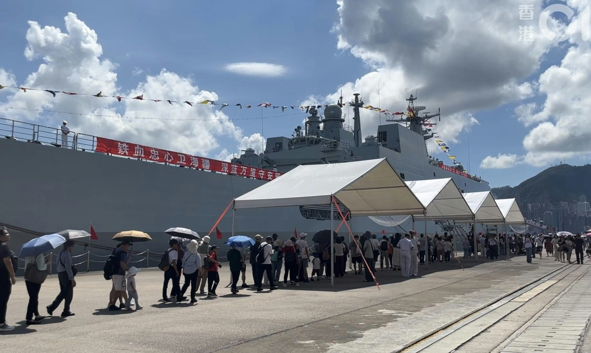
正停泊在昂船洲軍營的解放軍海軍戚繼光艦及沂蒙山艦，今日（2日）繼續開放予已預約的市民參觀。（林遠航攝）

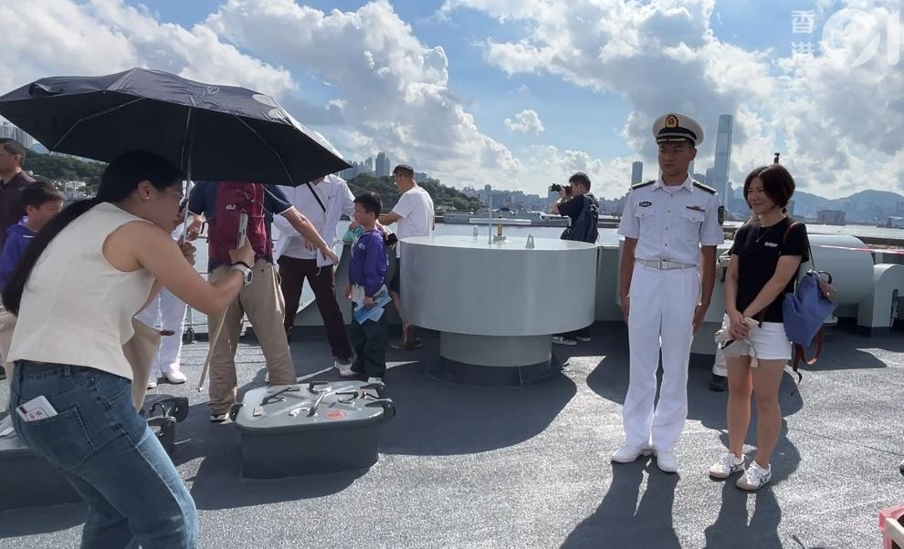
正停泊在昂船洲軍營的解放軍海軍戚繼光艦及沂蒙山艦，今日（2日）繼續開放予已預約的市民參觀。（林遠航攝）

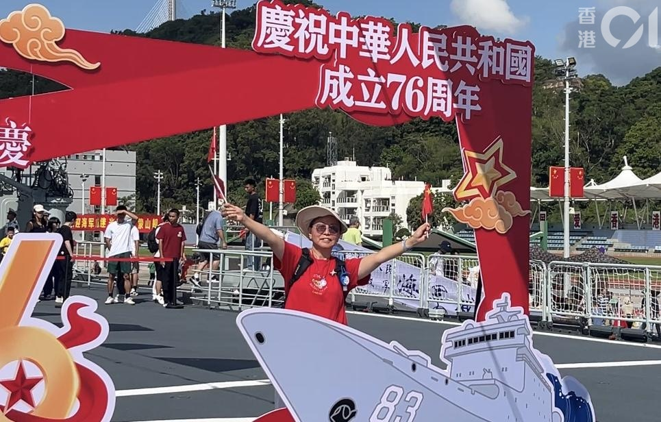
正停泊在昂船洲軍營的解放軍海軍戚繼光艦及沂蒙山艦，今日（2日）繼續開放予已預約的市民參觀。（林遠航攝）

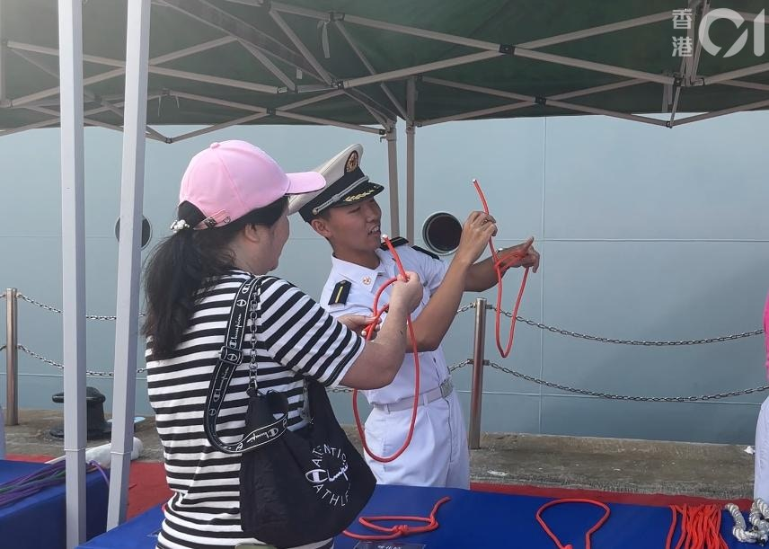
正停泊在昂船洲軍營的解放軍海軍戚繼光艦及沂蒙山艦，今日（2日）繼續開放予已預約的市民參觀。（林遠航攝）

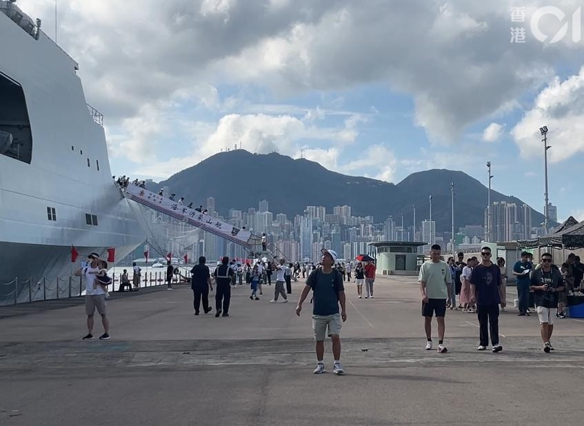
正停泊在昂船洲軍營的解放軍海軍戚繼光艦及沂蒙山艦，今日（2日）繼續開放予已預約的市民參觀。（林遠航攝）

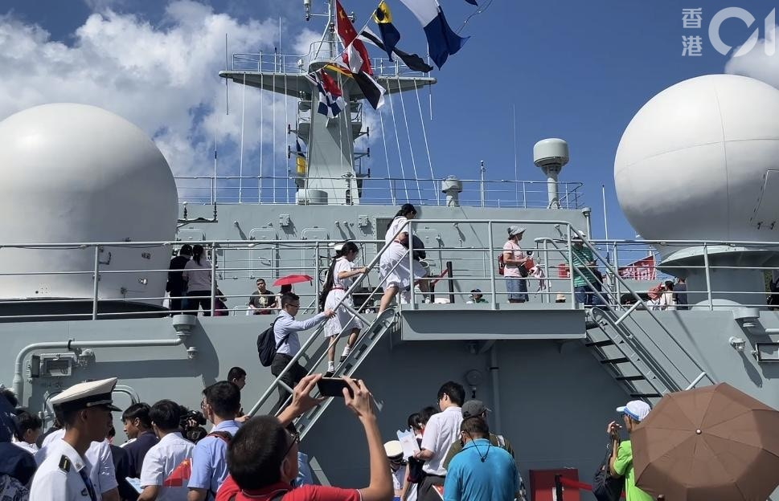
正停泊在昂船洲軍營的解放軍海軍戚繼光艦及沂蒙山艦，今日（2日）繼續開放予已預約的市民參觀。（林遠航攝）

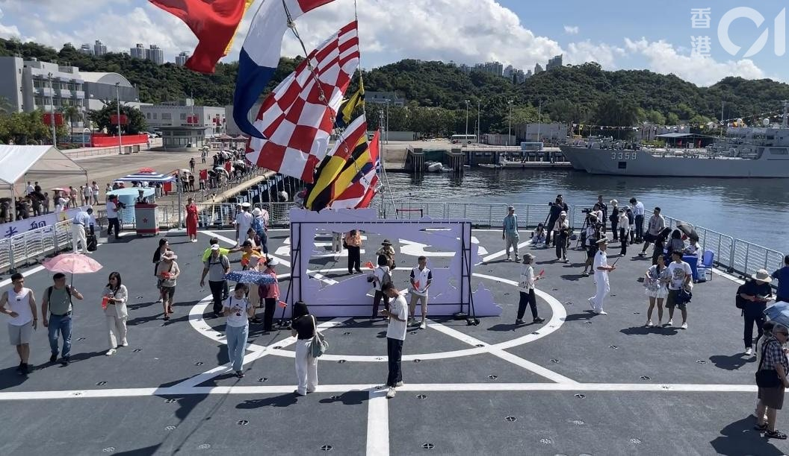
正停泊在昂船洲軍營的解放軍海軍戚繼光艦及沂蒙山艦，今日（2日）繼續開放予已預約的市民參觀。（林遠航攝）

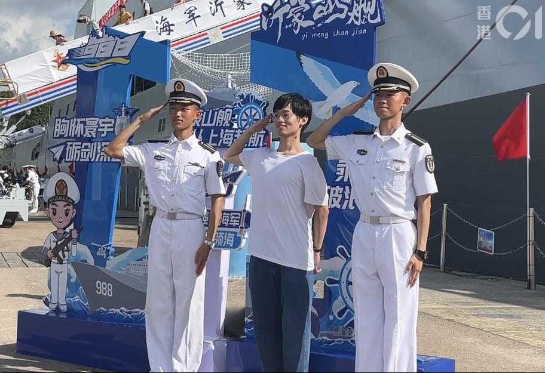
正停泊在昂船洲軍營的解放軍海軍戚繼光艦及沂蒙山艦，今日（2日）繼續開放予已預約的市民參觀。（林遠航攝）

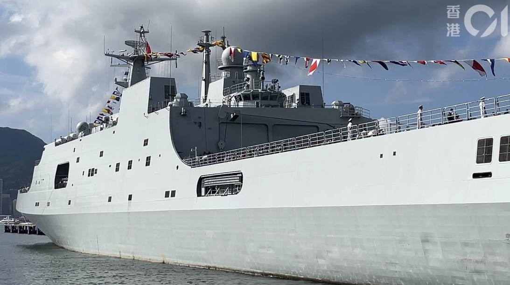
正停泊在昂船洲軍營的解放軍海軍戚繼光艦及沂蒙山艦，今日（2日）繼續開放予已預約的市民參觀。（林遠航攝）

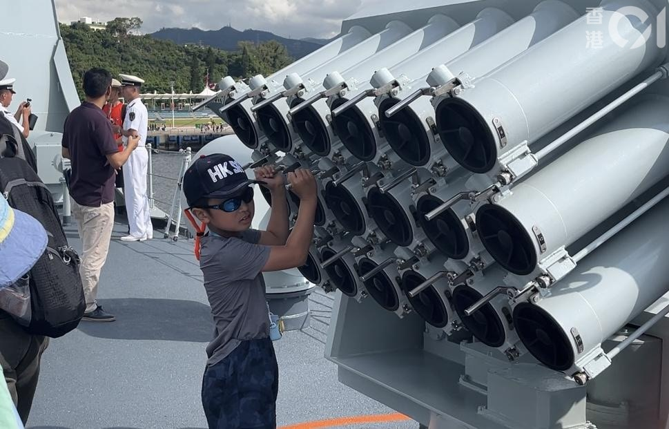
正停泊在昂船洲軍營的解放軍海軍戚繼光艦及沂蒙山艦，今日（2日）繼續開放予已預約的市民參觀。（林遠航攝）

解放軍海軍戚繼光艦及沂蒙山艦第二日開放市民參觀，在早上八時正式開放前半小時，已有超過50名市民在昂船洲軍營門外排隊。入場後，兩隻軍艦登船位置都大排長龍，不少人都主動找身穿白色軍服的海軍成員「打卡」，亦有不少市民見到海軍便作出敬禮手勢。

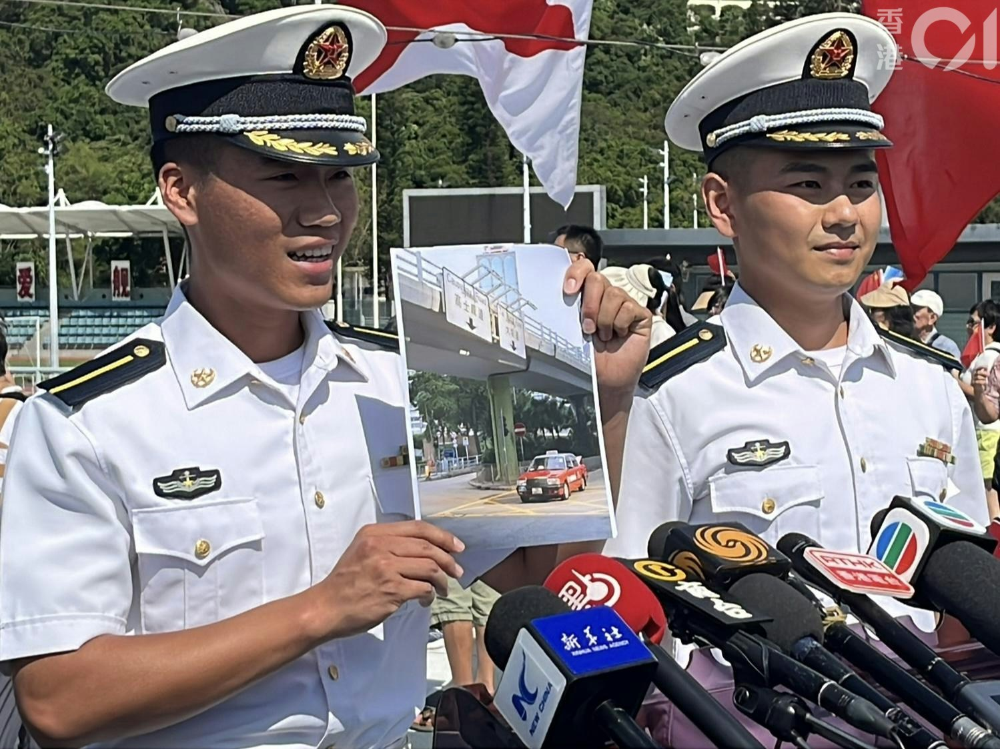
海軍學員駱嘉毅（左）展示前日到銅鑼灣拍攝的街景照片，稱果然隨手一拍即「出片」。（林遠航攝）

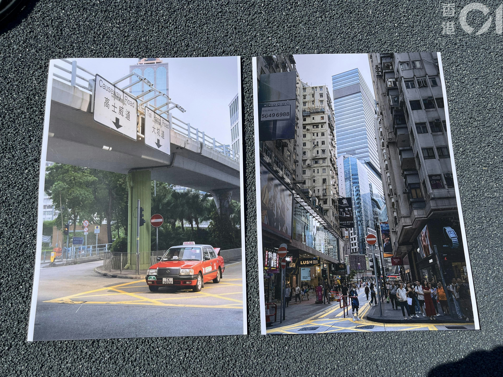
海軍學員駱嘉毅前日到銅鑼灣拍攝的街景照片。（林遠航攝）

## 來自廣東學員駱嘉毅稱現在才第一次來香港有點遲

海軍學員駱嘉毅是廣東人，笑言自己現在才第一次來港有點遲，但對於可以穿上軍裝、由國家將他「帶」到香港，感到榮幸。他向記者展示前日到銅鑼灣拍攝的街景照片，稱令他感受到香港這個大都市的繁榮。

## 喜歡周星馳電影是陳奕迅歌迷 Beyond黃家駒的精神一直激勵著他

他又提到受香港文化影響，小時候很喜歡看香港的電視劇、電影，非常喜歡周星馳的電影，亦是陳奕迅歌迷，「Eason嘅歌基本上每首都識唱」，因此心情非常激動，又唱了Beyond的《無悔這一生》形容自己的心情，稱歌曲令陪伴他渡過高考時的迷惘，主唱黃家駒的精神一直激勵著他，直到現在考到軍校。

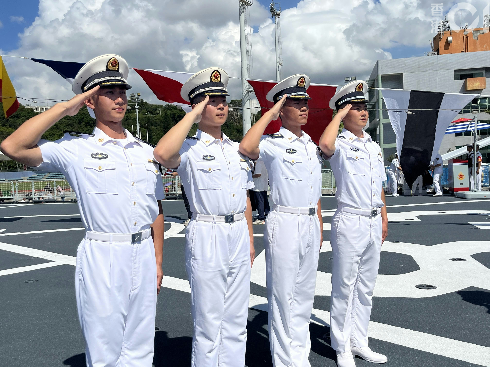
海軍學員，左起：程嘉銘、張子涵、駱嘉毅、李春良。（林遠航攝）

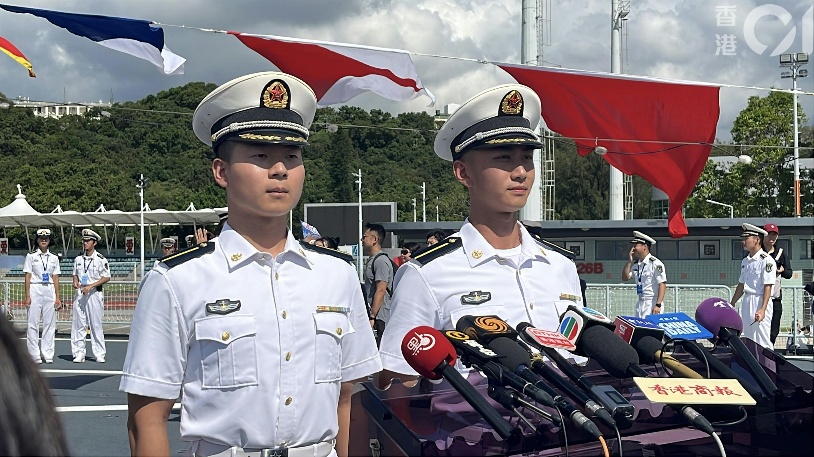
海軍學員程家銘（左）表示，海軍學員們昨晚有在碼頭及艦上甲板觀看國慶煙花滙演，令他感受到香港濃厚的國慶氛圍。（林遠航攝）

## 海軍學員程家銘10.1艦上甲板看國慶煙花：感受到香港人愛國熱情

另一名海軍學員程家銘則表示，海軍學員們昨晚有在碼頭及艦上甲板觀看國慶煙花滙演，令他感受到香港濃厚的國慶氛圍，以及香港人的愛國熱情，體會到「國安家好」的意義。

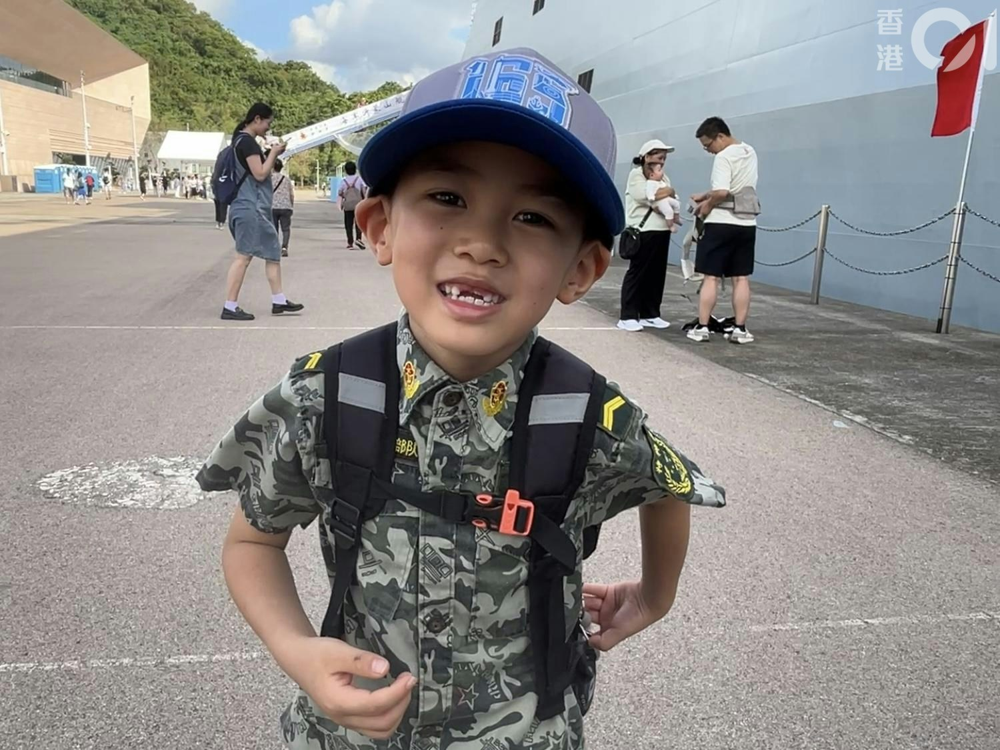
劉小朋友大讚艦上的艦炮、直升機起降台等「好酷」。（林遠航攝）

## 穿迷彩上衣登艦 6歲男童想長大後當兵

6歲的劉小朋友是居於深圳的港人，特意因為今次兩艘軍艦而回港。他大讚艦上的艦炮、直升機起降台等「好酷」，又指今次是他第一次看到軍艦，覺得好開心。他今日身穿迷彩上衣，稱因為想穿到像解放軍的樣子，又指想長大後當兵。他又表示，深圳較少開放有艦艇或軍營開放，稱有點羡慕香港。

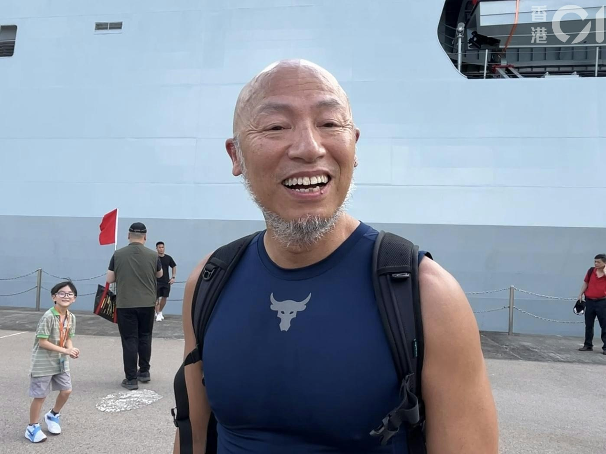
吳先生表示，以往只能透過媒體了解國家軍事，但今日登艦後，更確信國家軍事實力「唔好話第一，絕對無人敢話第二」。（林遠航攝）

吳先生今日登上沂蒙山艦後，笑言與山東艦相比，沂蒙山艦「未算型」，但亦感到壯觀。他又指自己今次「捱咗半日先搶到」，笑言「最慘佢（門票）又唔可以賣」，否則任何門票價錢都願意付，「（解放軍）佢話幾多錢就幾多錢」；只要有票，「請假都要嚟」。

吳先生又表示，以往只能透過媒體了解國家軍事，但今日登艦後，更確信國家軍事實力「唔好話第一，絕對無人敢話第二」，又稱解放軍的成員都非常年輕，對國家未來軍事實力充滿信心。

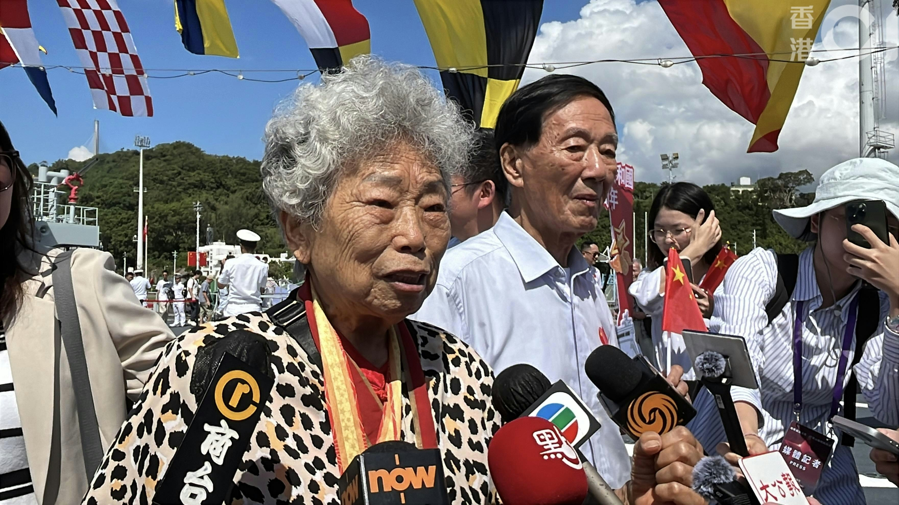
原東江縱隊港九獨立大隊老游擊戰士聯誼會會長林珍今日亦有到場。（林遠航攝）

另外，原東江縱隊港九獨立大隊老游擊戰士聯誼會會長、現年90歲的香港抗日老兵林珍今日亦有到場，登上戚繼光艦。林珍表示，「我們一定要經常宣揚我們強國的精神是為了和平，是為了人類命運共同體」，期望讓更多群眾來參觀，更認真地親眼看到強軍力量和保衛世界和平的力量。
