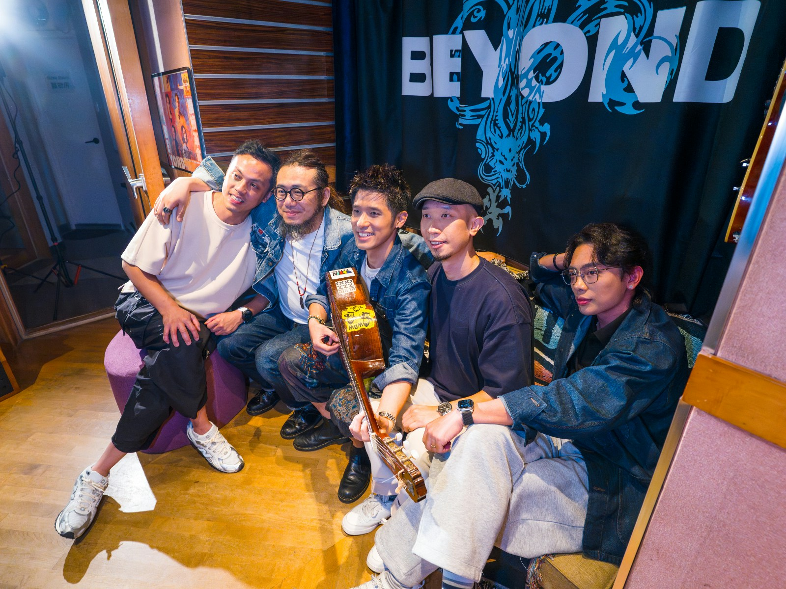
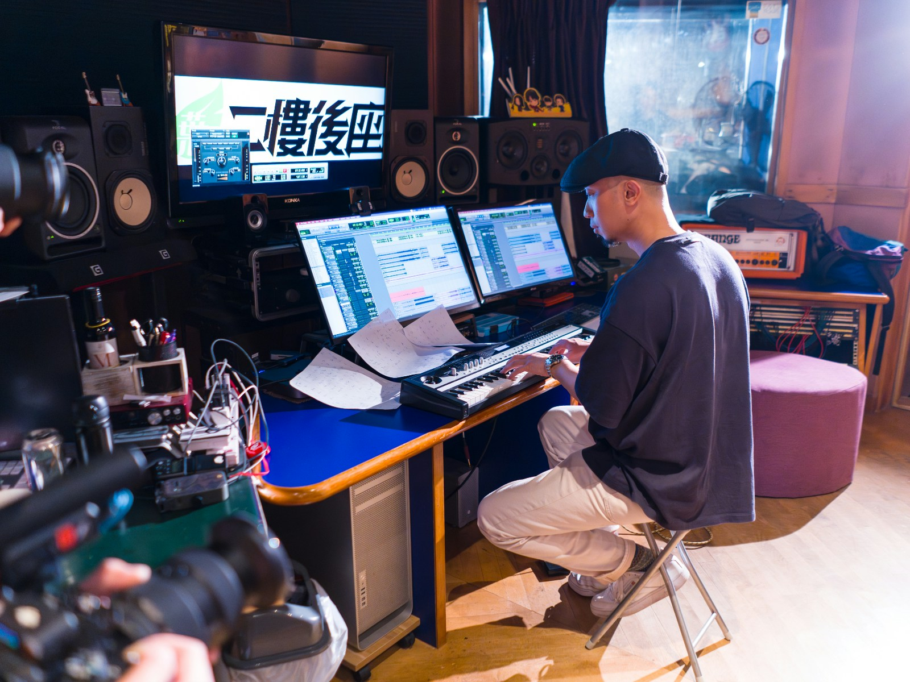
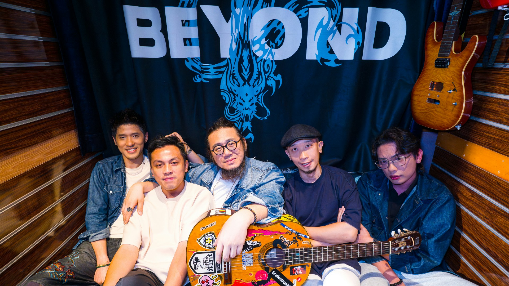
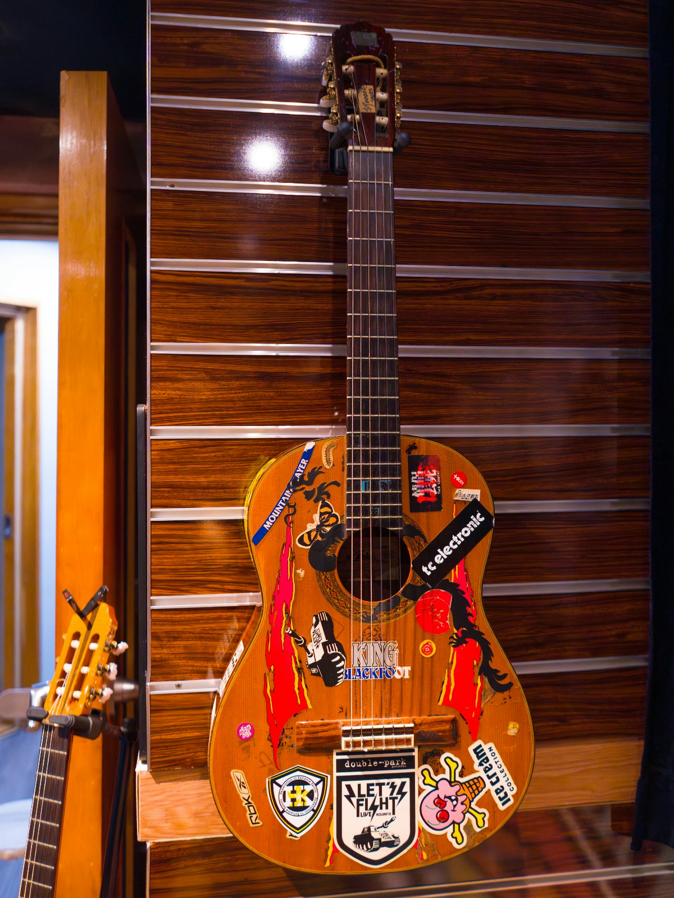

樂隊Nowhere Boys成員來自不同成長背景，但他們同樣深受香港Band壇傳奇Beyond的影響。Beyond專屬錄音室，位於旺角花墟的「二樓後座」，因市區重建歲月無聲地面臨清拆，緣份讓Nowhere Boys 一次偶然，用已故Beyond靈魂人物黃家駒最愛的木結他「小妖」創作了一首歌，在錄音室停止運作前順利完成錄音。《二樓後續》MV紀錄了「二樓後座」每個曾經有著Beyond與Nowhere Boys不同時空交錯的逝去日子，同時延續Beyond的光輝歲月！

*Nowhere Boys一次偶然，用已故Beyond靈魂人物黃家駒最愛的木結他「小妖」創作了一首歌。（官方提供圖片）*

## 「二樓後座」清拆前用家駒專屬結他

Nowhere Boys作為Beyond的忠粉，身處偶像專屬錄音室「二樓後座」，創作新歌《二樓後續》及錄音，心情如赤血熱血般興奮與期待。結他手Ken說：「呢度係『二樓後座』，呢支木結他叫『小妖』，係黃家駒生前用嘅結他，我無親眼見但睇相見過佢玩，佢話『得閒就彈，唔得閒都會彈』。」結他藏於「二樓後座」，可以讓音樂人使用。Ken說：「有一次我好得閒，所以就攞嚟彈，之後Van話啲Rhythm可以用到，不如我哋試吓用。」

Van憶述：「聽到Ken彈我已經諗到啲旋律，所以即刻用電話錄低咗用呢支結他彈嘅嘢。呢首歌《二樓後續》絕對唔係因為呢度冇啦而去做啲話題，只係純粹因為Nowhere Boys對呢個地方有感情，好想喺佢完結之前，用我哋嘅音樂紀錄呢個地方。」Ken強調：「用我哋嘅方法紀錄呢個地方嘅聲音、呢支結他嘅聲音，我唔知道下次係幾時可以再錄到佢（小妖），但好肯定，下次就算我再彈到呢支結他，亦唔會喺呢個地方。」

*「二樓後座」清拆前用家駒專屬結他。（官方提供圖片）*

## 《二樓後續》延續Beyond音樂精神

親手寫上每段得失樂與悲與夢兒，Van認為這是上天賜予的命運派對，於是堅持信念不再猶豫，懶理現時市場主流旋律，衝開一切以充滿90年代Indie Rock風格創作《二樓後續》，以紀念Nowhere Boys在「二樓後座」用「小妖」最後一次在錄音室的灰色軌跡。

Ken更點名要由鍾說（鍾雪瑩筆名）填詞，他說：「睇佢做戲，啲內心戲好強，年紀輕輕但對世事有好深感受、好細膩。」他更寫了千字文，向鍾說細緻描述「小妖」的故事、「二樓後座」的燈光、器材等，希望她能為這首歌譜上Nowhere Boys與「二樓後座」這次無聲的告別，他說：「最重要係呢度嘅『精神』，就算呢度要拆，Beyond嘅精神永永遠遠都喺度，透過歌詞傳達呢個訊息。好難相信，原來我細細個聽Beyond、去學結他、組band、喺度錄音，感覺好似無幾耐之前發生，原來已經30年，好amazing！每次嚟呢度錄嘢都有好強嘅感覺，可能acoustic好好，每次都可以好集中精神，好易諗到，好快作出決定。」

*《二樓後續》延續Beyond音樂精神。（官方提供圖片）*

鼓手Nate非常認同，他說：「我哋嚟到呢度好易『撻著』，呢度嘅engineer輝哥（鄧衍輝）好犀利，佢好集中用耳仔聽住我哋做咩，好順利錄到好好嘅作品。」低音結他手Hansun笑說：「喺度錄音，肯定好過喺我哋Band房！我好鍾意呢度個鼓聲，配合埋Nate，啲聲夠punch，錄音好有feel！」

Nate說：「任何藝術都一樣，一定要學習之前嘅嘢，先至知道依家要做啲咩，熟悉Beyond好重要，喺香港彈音樂走唔甩，好多機會去彈Beyond嘅作品，我每次睇到香港市民嘅反應，就知道呢啲音樂對呢班人有幾重要。」他表示有一次戶外表演，因同場另一隊band缺了鼓手，他被臨時拉夫上場，而當晚這場俾面派對，表演全是Beyond 的歌，圍觀者由零到爆棚，全賴高溫製造氣氛，即使已上年紀的觀眾亦變得活躍起來，他說：「可想而知Beyond做咗啲好重要嘅音樂，留低咗好嘅影響畀其他人，Beyond嘅影響係無限大，可能香港彈結他嘅人有一半因為佢哋，我覺得Beyond喺本地嘅影響力相等於Beatles，一樣係最高嘅Level！」雖然「二座後座」已成為舊日的足跡，但Beyond的打不死音樂精神就像東方寶藏，過去與今天，抗戰二十年、四十年，依然活在Nowhere Boys和廣大樂迷的心內。

*Nate覺得Beyond喺本地嘅影響力相等於Beatles。（官方提供圖片）*
