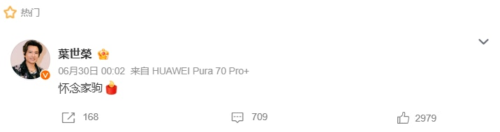
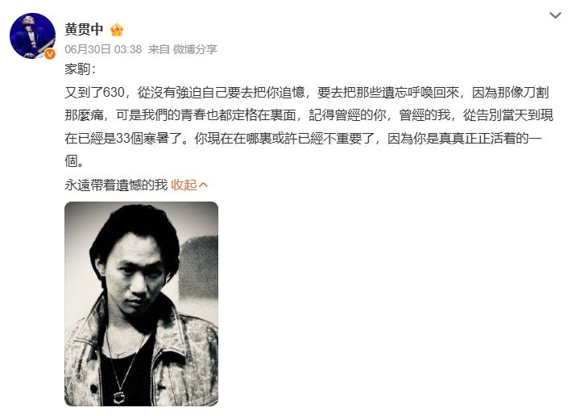
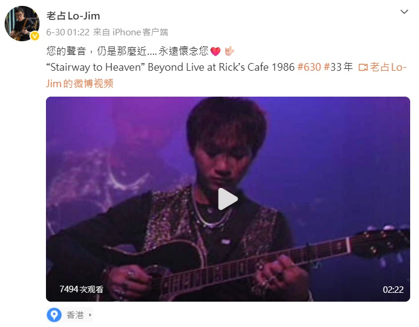
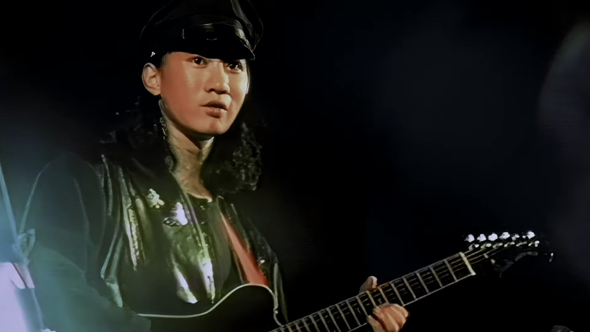
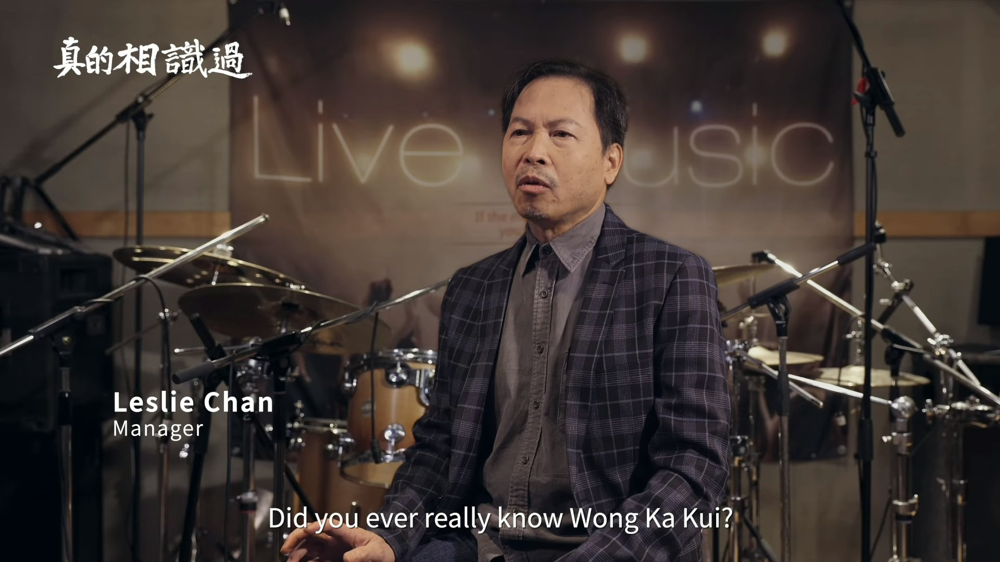
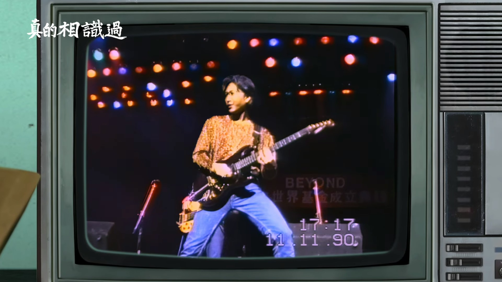
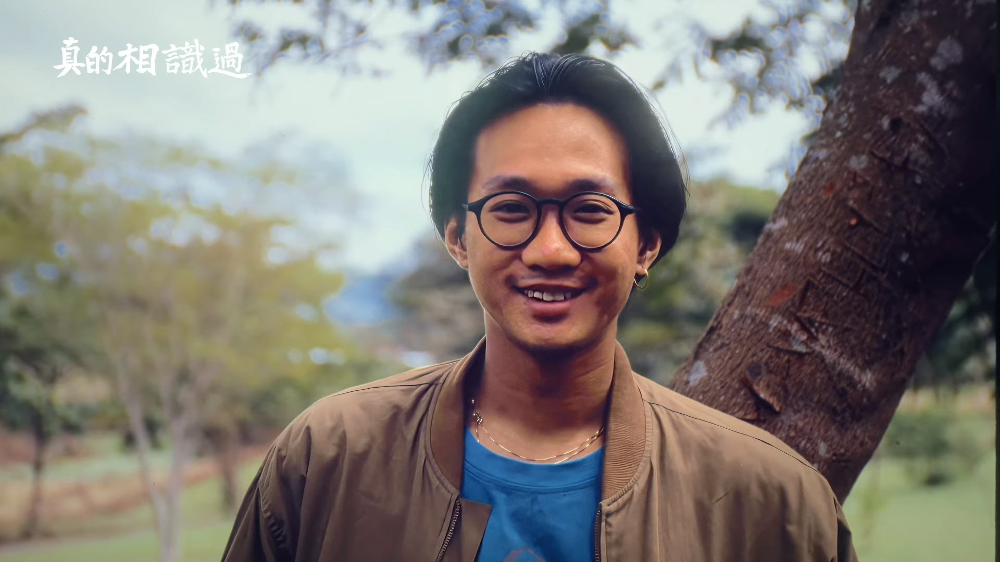
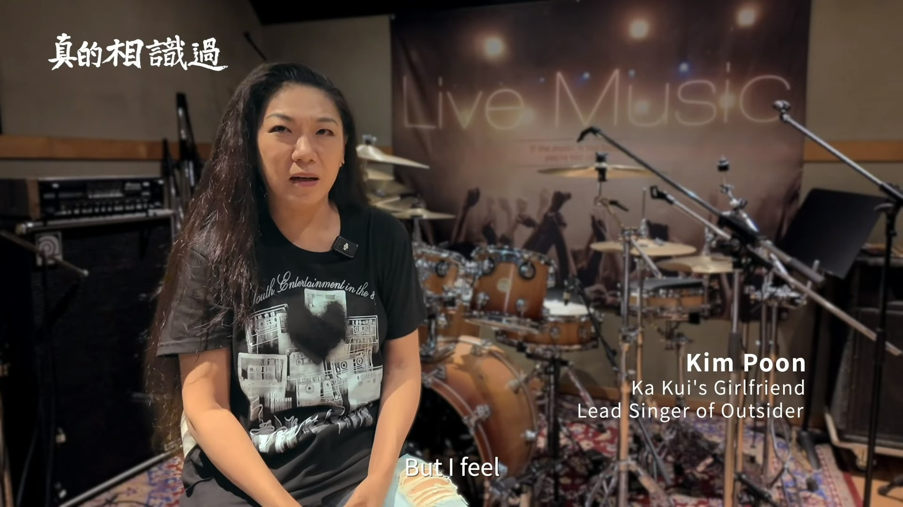
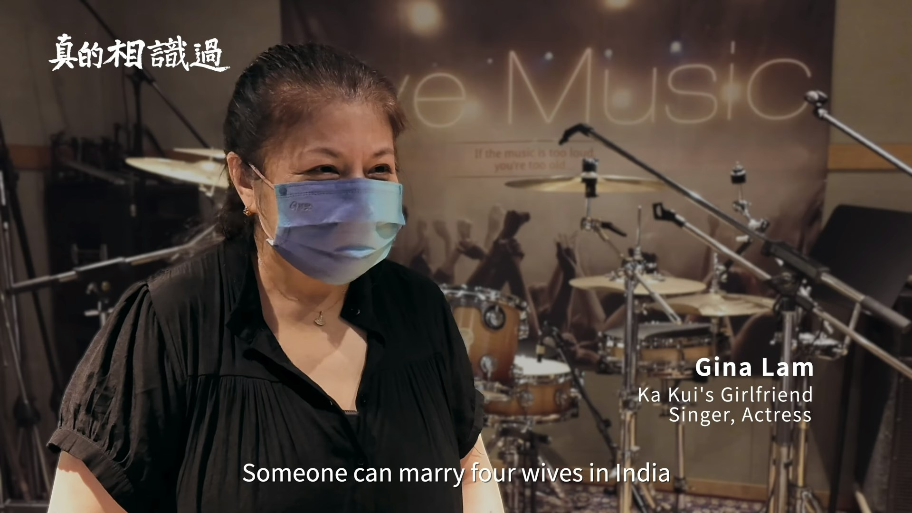

每年的6月30日，都是華語樂壇一個隱隱作痛的日子。殿堂級樂隊Beyond的靈魂人物黃家駒，於1993年6月24日在東京富士電視台錄影遊戲節目時不幸從高台墮下，頭部重創，留醫數日後於6月30日與世長辭，終年僅31歲。

BEYOND組成初期曾有不同成員，於1988年結他手劉志遠離隊後，由黃家駒﹑葉世榮﹑黃貫中和黃家強的Beyond組合最為人熟悉。（網上圖片）

黃家駒在日本錄影節目時從高處跌下後腦着地，留醫六天後於日本時間1993年6月30日逝世，終年31歲。（網上圖片）

晃眼間，家駒已離開了我們整整33個寒暑。在今天這個特殊的日子，Beyond的隊友以及無數樂迷紛紛表達追思，而家駒的首部傳記紀錄片亦在近日正式公佈上映，再度勾起無限回憶。

黃家駒逝世33年，在華人樂壇仍然有著崇高的地位。（微博圖片）

## 隊友黃貫中、葉世榮凌晨發文悼摯友

Beyond成員黃貫中（Paul）與葉世榮一如既往，在30日凌晨準時發文悼念摯友。葉世榮以簡單而沉重的「永遠懷念」四個字致意；

黃貫中與葉世榮（資料圖片）

葉世榮以「永遠懷念」四個字致意。（微博圖片）

而黃貫中則寫下一段令人動容的感性長文，坦言那種痛楚至今仍宛如刀割：「又到了630，從沒有強逼自己要去把你追憶，要去把那些遺忘呼喚回來，因為那像刀割那麼痛，可是我們的青春也都定格在裏面，記得曾經的你，曾經的我，從告別當天到現在已經是33個寒暑了。你現在在哪裏或許已經不重要了，因為你是真真正正活着的一個。」

字裏行間滿溢著對昔日並肩作戰歲月的懷念，令無數樂迷瞬間淚崩。

黃貫中則寫下一段令人動容的感性長文。（微博圖片）

黃家駒的戰友老占亦發文悼念。（微博圖片）

## 黃家駒首部紀錄片《真的相識過》已上映

為了紀念家駒逝世33周年，由葉世榮與Beyond前經理人陳健添（Leslie）共同監製的官方紀錄片《真的相識過》（Because of You Ka Kui），已於今年6月25日正式上映。

黃家駒首部紀錄片《真的相識過》（Because of You Ka Kui）已經上映。（《真的相識過》影片截圖）

紀錄片由葉世榮和Beyond前經理人陳健添（圖）共同監製。（《真的相識過》影片截圖）

這部珍貴的紀錄片全長129分鐘，包含超過30分鐘從未曝光的珍貴演唱會片段、音樂影像及幕後故事。攝製隊親自走訪香港、北京、台北、東京、多倫多及倫敦，訪問了二十多位曾在不同時期與Beyond合作的成員、團隊人員及家駒的生前摯友，製作誠意十足。

紀錄片全長129分鐘，包含超過30分鐘從未曝光的珍貴演唱會片段、音樂影像及幕後故事。（《真的相識過》影片截圖）

紀錄片還訪問了二十多位曾在不同時期與Beyond合作的成員、團隊人員及家駒的生前摯友。（《真的相識過》影片截圖）

遺憾的是，Beyond另外兩位成員黃家強與黃貫中並未參與是次訪問；不過，片中卻罕有地訪問了家駒生前的兩位舊女友——潘先麗與林楚麒。

黃家駒的舊女友潘先麗都有現身。（《真的相識過》影片截圖）

林楚麒是當年黃家駒唯一認愛女友，紀錄片中都有現身。（《真的相識過》影片截圖）

## 林楚麒曾因「未亡人」身份掀黃家強怒火

在受訪的舊愛當中，最引人注目的莫過於當年與家駒相戀、亦是其唯一公開承認過的女友林楚麒。家駒當年離世後，曾傳出林楚麒欲以「未亡人」身份出席喪禮，但遭到黃家人的強烈拒絕。黃家強早年曾忍無可忍在微博痛斥對方利用家駒的名號宣傳、欺騙歌迷，並直言：「只希望她不要再提家駒了！」

林楚麒曾被指借跟家駒過去式的關係抽水。（網上圖片）

對此，林楚麒坦言全屬誤會，強調自己早已退居幕後，根本不需要博眼球或自我宣傳，只是偶爾在大家苦苦哀求下才會分享往事。林楚麒更感性透露，自己花了足足10多年的時間才真正接受家駒的離開，更深情告白：「在我心中已和家駒成為夫妻。」

林楚麒亦是《曾經擁有》的填詞人。當年家駒的遺體從日本運返香港，林楚麒頭戴一朵白花，身份仿似未亡人。但她的身份卻不被家駒家屬承認，家強更指她「很對不起家駒」才導致分手。 (網絡圖片)
