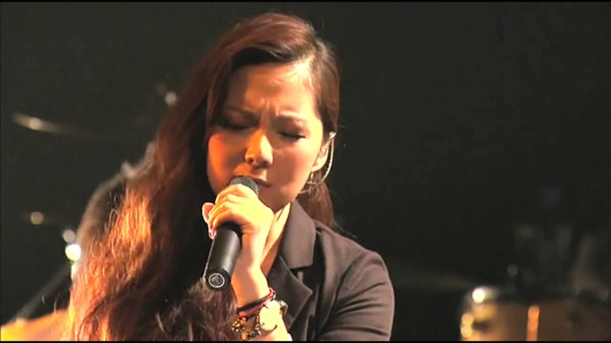
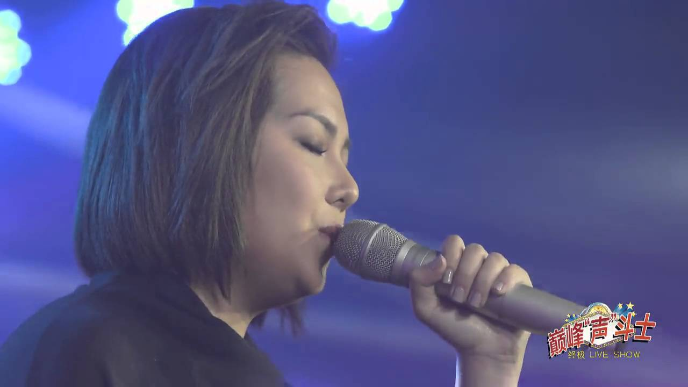

import YouTube from '@/components/patterns/YouTube.astro';

衛蘭（Janice）明天將於紅館舉行《衛蘭 Oh My Janice World Tour 2018》首場演出。早前在網上投票獲得「最靚聲歌手」榮譽的她每次開演唱會，門票都會極速售罄，今次也不例外。不少觀眾均認為Janice的現場演繹相當出色，也甚具渲染力。擁有靚聲的Janice不但擅於演繹自己的作品，就連翻唱其他人的歌也能滲進自己的風格，即使是男歌手的歌也表現得游刃有餘！以下幾首就是Janice’s style的翻唱作品，你最喜歡哪一首？

## 情深說話未曾講

<YouTube id="tPMGNCPBrB8" />

《情深說話未曾講》（原唱：黎明）

Janice原本是擔任黎明的和音，後來被雷頌德賞識而獲簽約成為歌手。初出道時以翻唱黎明的經典作品《情深說話未曾講》而引起極大迥響。當時她只推出歌曲，並沒有露面。樂迷都對這位女新人的真面目相當好奇，只因她的演出一鳴驚人，令人非常期待屬於她的出道曲。

## Moov Live 2010 情人

<YouTube id="pumuIt8OaDw" />

《情人》（原唱：Beyond）

這首歌早已被翻唱過很多次，除了G.E.M.於《我是歌手》表演的激昂版本外，Janice將這首歌的深情、含蓄以一把溫婉的聲線唱出。她並沒有使用太多技巧，全力投入感情，結果成功感染了不少聽眾。亦有網民表示Janice的聲線像是在自己的耳邊說故事般溫柔，聽得非常舒服。

## 誰明浪子心

<YouTube id="41S68WPElCg" />

《誰明浪子心》（原唱：王傑）

前兩首都是較深情的慢歌，原來Janice也能勝任搖滾風！Janice曾多次在演唱會上準備翻唱環節，帶給觀眾不一樣的驚喜。她坐著電單車，以一身型格風現身舞台。唱王傑的《誰明浪子心》所需要的激情、霸氣，Janice都沒有輸蝕。反而更將氣氛推到最高點，展示她舞台強者的一面。

## 記得 QQ音樂巔峰"聲"鬥士"終極LIVE SHOW

<YouTube id="BL4RSh3U-Uw" />

《記得》（原唱：張惠妹 林俊傑）

Janice簽了新公司後較常露面，較新的翻唱作品就是這首《記得》。她了解自己聲線的特點，故曾公開表示她並不喜歡力竭聲嘶。相比起爆發型歌手，她更喜歡娓娓道來的感覺。這首《記得》完全能發揮Janice聲線的優勢，就是帶有濃烈情緒的感染力。

聽晚開騷，樂迷都非常期待。不知加入了新公司的Janice會否再次帶來突破，在演唱會上展示不一樣的自己呢？相信已買票的觀眾都十分好奇。而翻唱環節似乎都會是必備部份，雖然Janice日前在Instagram上表示正在生病中，但她也向歌迷保證，無論如何都一定會盡力演出，Janice加油！
