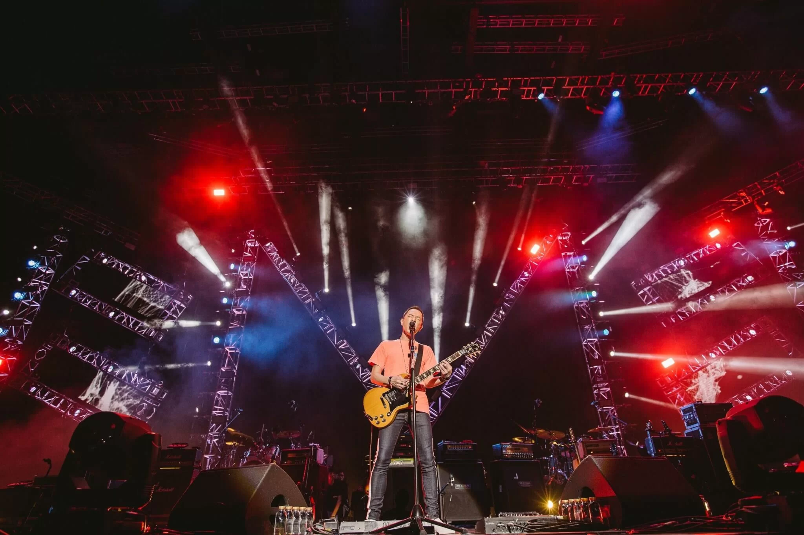
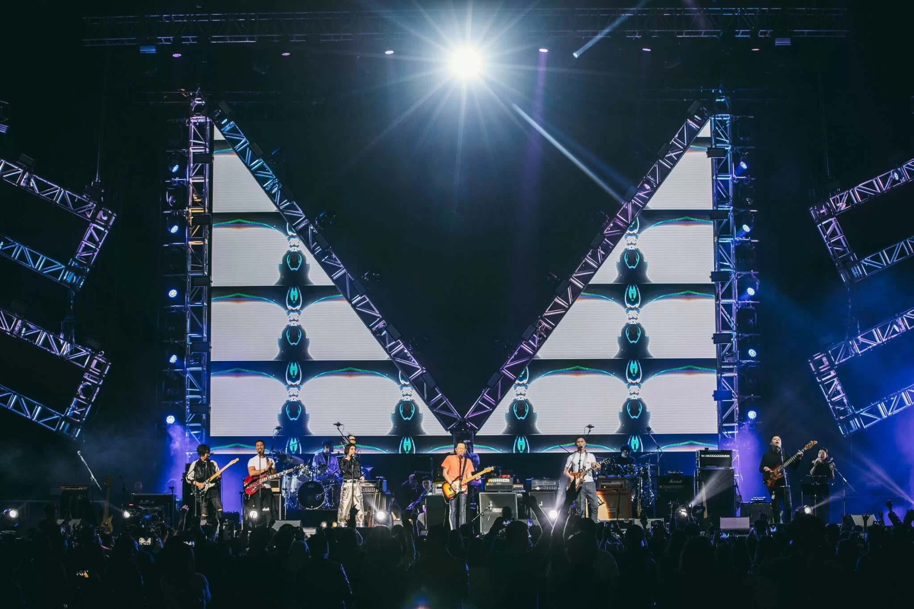
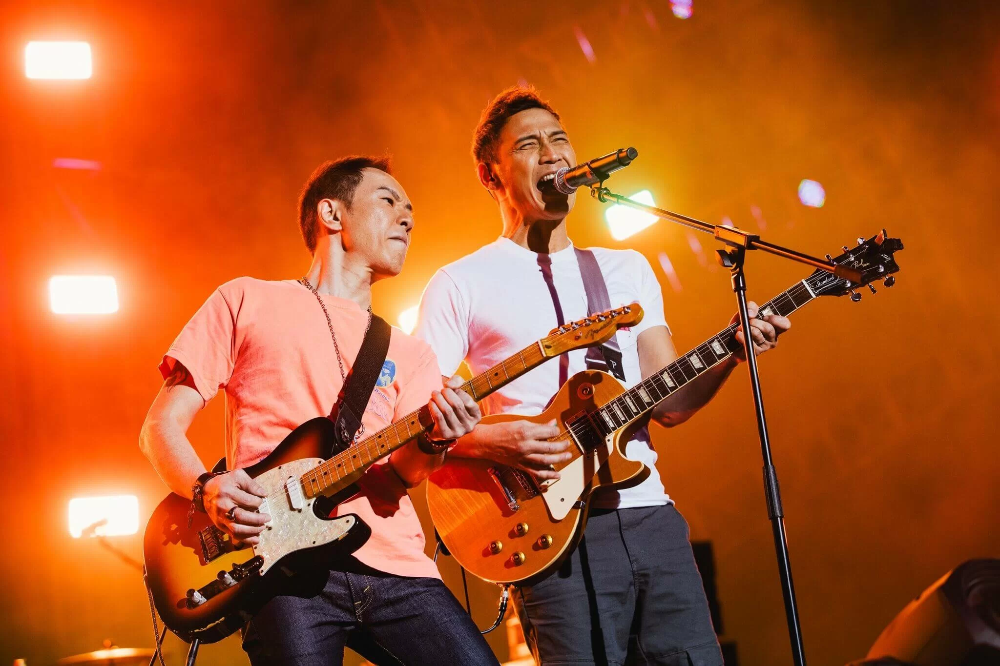
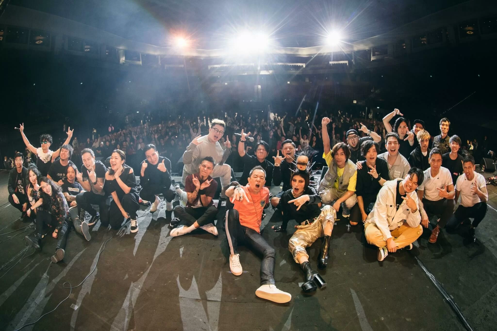
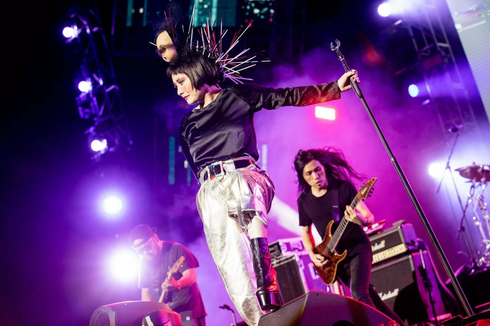

殿堂級搖滾樂隊Beyond的主音結他手黃貫中（Paul）日前率領香港6大搖滾樂隊好友（何超儀）Josie & The Uni Boys、Soler、ToNick、Cassette、秋紅、逆流到澳門舉行《Let’s Mixture Rock Party融洽搖滾派對》，他們更聯手唱出《海闊天空》，場面超震撼！

由樂隊Soler 開場，隨即獻唱《失魂》和《海嘯》，繼而crossover樂隊逆流獻唱《毋忘我》。Tonick與逆流Crossover 殿堂級搖滾樂隊 Beyond歌曲《我是憤怒的金屬狂人》，令粉絲按耐不住要起身跳埋一份，之後Tonick再唱自己歌《長相廝守》，主音恆仔更叫觀眾們開手機燈，營造燈海，讓人感動。Tonick再獻唱新歌《好想拯救地球》，觀眾即時起身High爆全場。

黃貫中（Paul）於中場出場，粉絲們個個手持手機衝到台前，為拍到Paul的風采。Paul一出場，全場粉絲即時熱情企起身跳舞又和唱。Paul唱出歌曲《Can’t bring me down》，帶起粉絲們的Rock心，粉絲們隨著音樂而搖動。唱畢第一首歌後，Paul說：「Show Me Your Power Please！」全場粉絲們即尖叫，將Rock Party帶到高潮，他再唱出《踩界》、《夜長夢多》、《丟架》和《Purple Haze》。在歌與歌之間，Paul不是到後台更換服裝，而是即時台上換結他演奏，可見Paul對音樂嘅堅持和要求。

繼秋紅出場後，Josie & The Uni Boys現身與樂隊秋紅Jam歌《城內入夜》。何超儀造型突出，除了頭上掛著一個被蒙眼的BB人頭面具，頭髮後面則插滿箭支，如將「海膽」放在頭上。隨後，有粉絲在台下大叫「超儀」，超儀即笑言自己是來搞笑的，「如果唔係，點嚟做小丑。」之後唱出《天眼通》和《黑超》。

*何超儀為搶鏡訂製娃娃頭面，「我當初聽到有這個騷，知道好多人，我又生得細粒，就要諗下法子搶鏡。有日，我係見到有時裝設計師的作品，見到些公仔做返出來，都是made in 香港，啲箭就是一支支油上去的。」*

最後，黃貫中與6大搖滾樂隊唱出多首知名樂隊的歌曲，向不同地方樂隊致敬。記者問超儀哪隊是她自己的偶像，她表示個個都是偶像，各有不同的個性、聲帶等。至於最後大合唱《海闊天空》會否覺得感動，超儀直言好感動，而且好感恩、感激、感謝Paul給機會由自己帶出這首歌，作為焦點！
