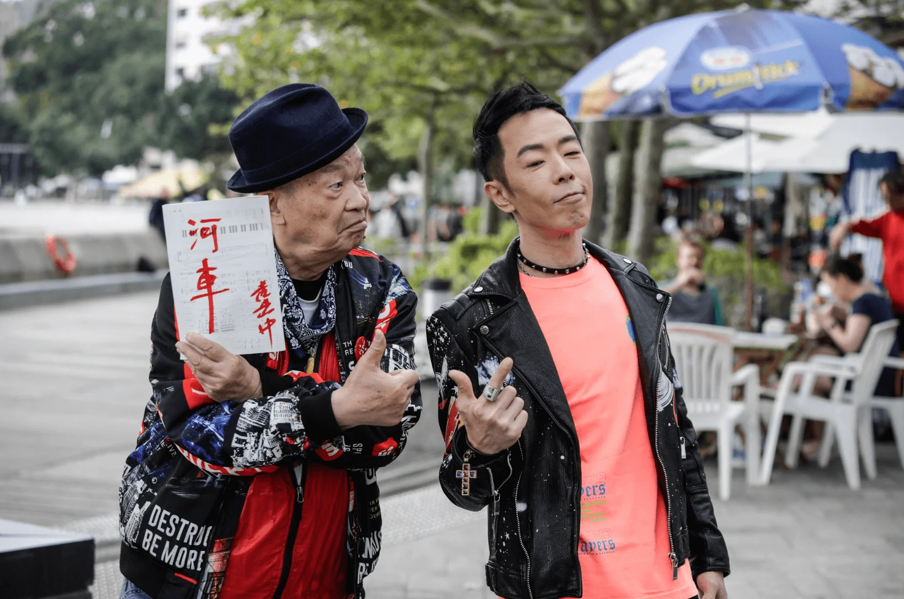
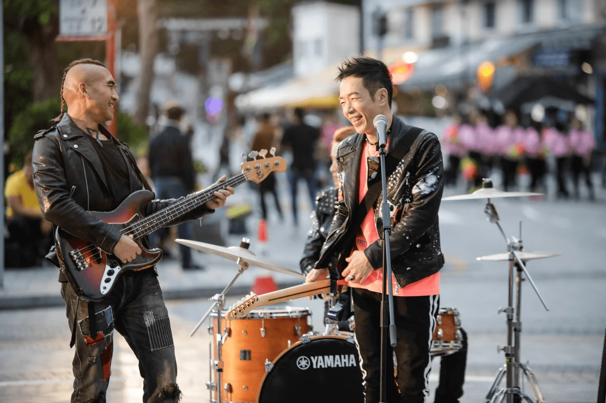

黃貫中（Paul）月前推出全新個人單曲《何車AHEM》，引起樂迷關注，由泰迪羅賓（Teddy）主理的《何車AHEM》MV今日（10日）終於出爐！為了拍攝《何車AHEM》MV，Paul於百忙中抽出時間，走訪了極具特色的中環碼頭和赤柱廣場等香港街景，進行拍攝取材；為此他更大打人情牌，邀得好友Kolor、ToNick恆仔跨刀演出，並聯同十數名型格band友在街頭jam歌，場面非常震撼！一班「後輩」更求好心切，MV由早上拍到天黑也絕不呻攰，盡展義氣仔女一面。

Paul又在MV中，親自執起畫筆和調色盤作畫，大曬藝術細胞。另外，他亦特地邀請了不同年齡、不同行業的藝術工作者參與拍攝，當中包括年輕街舞團、扇子舞表演團體、中式樂團和搖滾樂隊等，帶出中西文化雖有差異。而MV最後一幕，Paul率領數十名舞者和樂隊成員，在中環碼頭熱烈開唱，正好切合「何車 風格最標青」的意思，反映了所有藝術都值得尊重。

