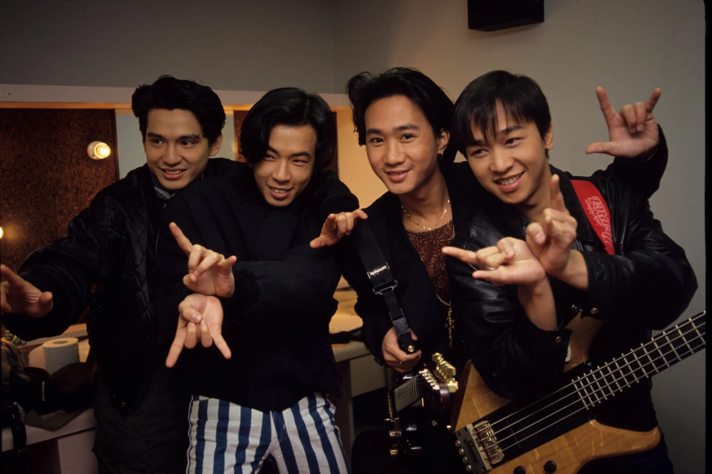
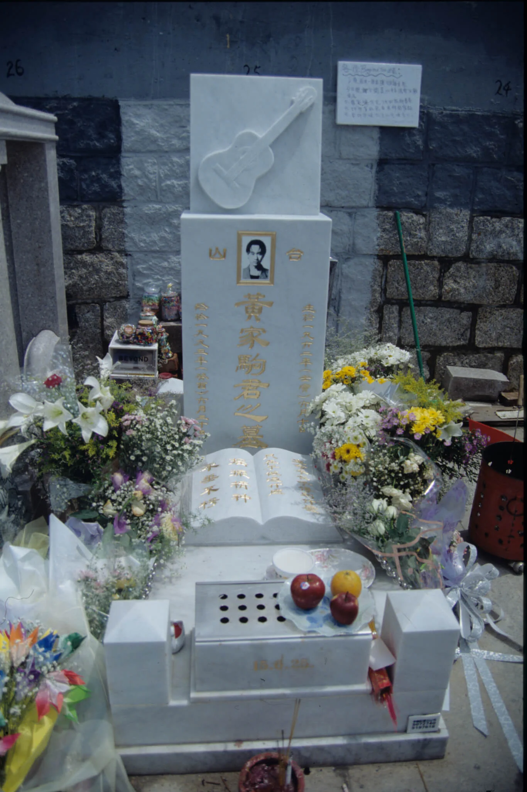
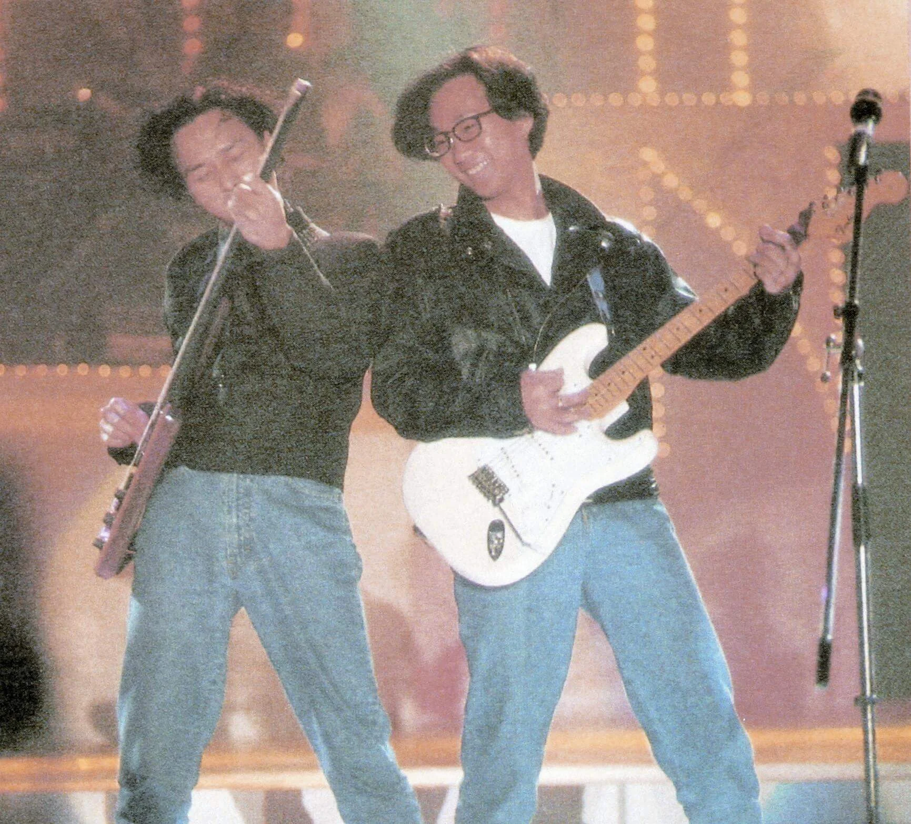
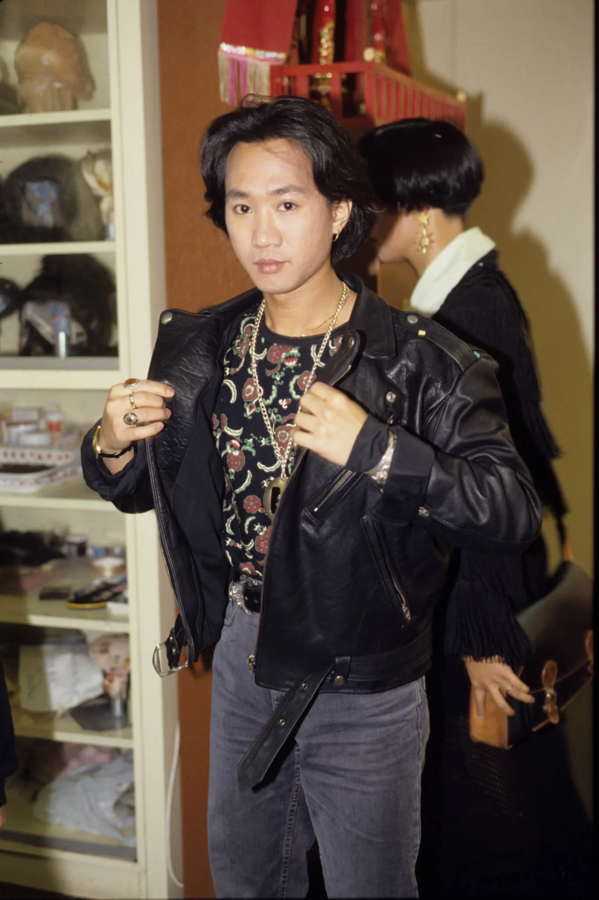
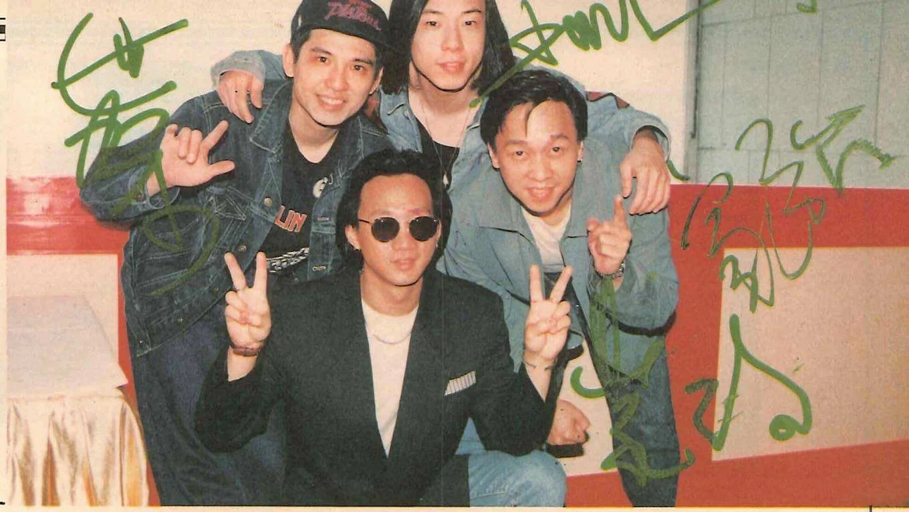
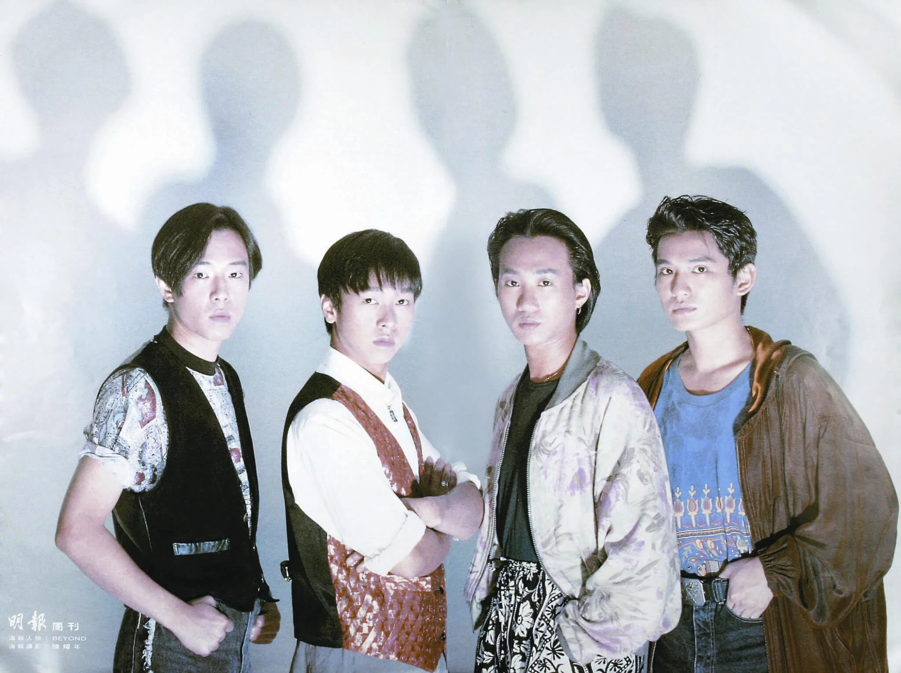

黃家駒是Beyond的靈魂人物，寫過不少好歌，黃貫中曾說：「他的靈感似乎說來便來。」他對音樂有抱負有理想，為了開拓日本市場，不得不上電視做宣傳，玩遊戲，沒料到竟從三公尺高的舞台墮下，頭先着地，昏迷不醒，一星期後（九三年六月三十日）與世長辭。家駒深信，「生命並不在於你得到什麼，而在於你做過什麼。」短短三十一載的人生，在家駒而言，無疑是豐富的。

黃家駒的音樂，總予人「憤怒」的感覺；但接觸過他的人，都會用「隨和」去形容他。不過，當談到香港的樂壇，他不禁激動，「這樂壇很奇怪，一首歌被人認識，很大程度上需要靠電台這些媒介，但為什麼我的作品要被一些對音樂沒有認識的人批評？」經過八年努力，九○年Beyond已踏上坦途，《大地》帶來了不少知音，更令他們躍登銀幕，「其實我們已有空間發表創作，實在沒有必要再花時間拍電影、MTV和做宣傳。」但人在江湖，身不由己，他不可能做一個純粹的音樂人，他於是想，「也許有人因為看了我們的電影而有興趣認識我們的音樂。」

*黃家駒於九三年六月三十日不幸逝世，轉眼十三年。他的百年居所，位於將軍澳華人永遠墳場，背山面海，地價二十二萬餘。*

## 在家掘地耕田

我從來沒訪問過家駒，我所認識的他，完全來自他大姊黃小瓊的憶述。家駒出生以來，一直與家人住在蘇屋邨，直至九一年才開始獨居。由於雙親管教嚴厲，小時候，孩子不許隨街跑，小黃說：「我們便在家裏玩耕田，把水泥地都掘爛了，常惹媽咪生氣。」她這樣形容兒時的弟弟，「頑皮、衝動、不算乖。」她印象最深刻的舊事，發生在家駒十一歲那年，「有一次，媽咪買了一條塘虱魚回來養在膠面盆裏，準備晚上煲湯，家駒拿來玩，一不小心，魚掉到街上，被樓下『推車仔』的老闆拾了，家駒帶着家強下樓問他拿，那老闆說：『地上執到寶，問天問地都攞唔到。』家駒很生氣，跑回來拿了個螺絲批，再去找那老闆，跟他說：『我把你的車輪拆掉，然後，我在地上拾到車輪，地上執到寶……。』家駒人仔細細，但他的膽量和堅持，終於令那人投降，把魚交還給他。」

*誰料到一個電視台的遊戲節目，會奪去家駒年輕的生命？*

## 曾做保險推銷

家駒十四、五歲，已瘋狂愛上音樂，完全沒有別的嗜好，他把零用錢儲起，買了一枝二手木結他，每天放學回家便抱着結他彈呀彈，直至睡覺。他參加過結他班，學會基本功便靠自己摸索進修。兄弟姊妹當中，真正能夠闖進家駒世界裏的是家強，兩人的感情特別好，家強更成為了他音樂上的好拍檔，「家強比較孩子氣，常覺得自己比不上哥哥，家駒要照顧他、勸導他。」家駒的二姊雖然沒跟他一起走在音樂的路途上，但她是他的知音、fans。家駒與家強起初組成地下樂隊，首次開地下音樂會的時候，向家裏借了幾百元，從設計海報到張貼海報，都親自動手。「當時家駒做保險推銷，他倔強的性格，令他不容易找生意。他節衣縮食，就是為了買更好的電結他和樂器。」

*家強受到家駒影響愛上音樂，他們曾經是好拍檔，家駒的離世，對家強打擊甚大。*

## 憤怒自信心強

當家駒從地下走到地上，真正踏足娛樂圈，小黃給他分析，「人家的歌像唸口簧，容易上口、容易流行；你玩的音樂這麼偏門，很難走紅，很難去到很高的位置。」但家駒堅持走自己的路，不過，為了遷就市場，也作了一定程度的妥協，「他最hit的歌，都不是他最喜愛的。他喜歡很rock的音樂，是我聽來『得個嘈字』那種。」成名的代價是忙得跟家人見面的時間也幾乎騰不出來，但他們一家人每星期總聚在一起吃頓飯，「他很疼爸爸媽媽，每個月都給家用，數目沒規定，但他給的比我們多。Beyond的收入是四個人均分，家駒不算富有，只屬於比上不足比下有餘。」小黃覺得這個弟弟非常有性格，「他不出聲，但很憤怒，自信心強，沒有人能夠把他動搖。」

*Beyond大受年輕人歡迎，九○年，踏上了十大金曲頒獎禮的舞台。*

*家駒充滿音樂才華，他把他的憤怒發洩在音樂上。*

*這幀Beyond四子的簽名合照，令人欷歔。*

## 俾面派對

Beyond四子都喜歡作曲，平日各自埋頭寫歌，當準備出碟，每個人都拿出幾十首作品一起挑，落選的再等機會。他們也有替同行作曲，有些的確是度身訂造，但當他們愈來愈忙，黃貫中坦言：「有些歌是早已寫好，我們出碟時『揀剩』的。」「遺珠」也有人欣賞，可見有一定水準。 Beyond有一首大hit的歌曲叫《俾面派對》，曲是黃家駒寫的，填詞的是黃貫中。背後，原來有個故事。 話說有一天，他們正在錄音室忙着，經理人忽然要他們馬上去出席一個宴會，因為要「俾面」替主人家邀請賓客的人。 四子很不情願地放下工作，參加了這個連主人家也不認識的派對，無無聊聊地浪費了一個晚上。 派對之後，黃貫中有感而發，寫成了這首非常口語化的歌詞。黃貫中說：「本來我希望填得文雅一點，但家駒寫的調子輕快佻皮，寫來寫去也格格不入。」他於是把心一橫，「咪話唔俾面，咪話唔賞面……」他得到了發洩，也得到了歌迷的共鳴。

*九○年十月，Beyond替《明周》拍了一輯海報。這四張年輕的臉孔，當時已成為樂壇上一股新動力。*
