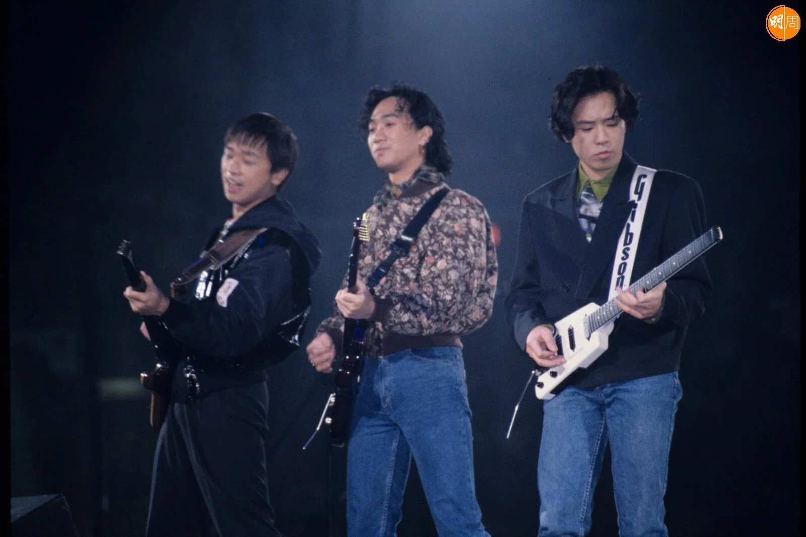
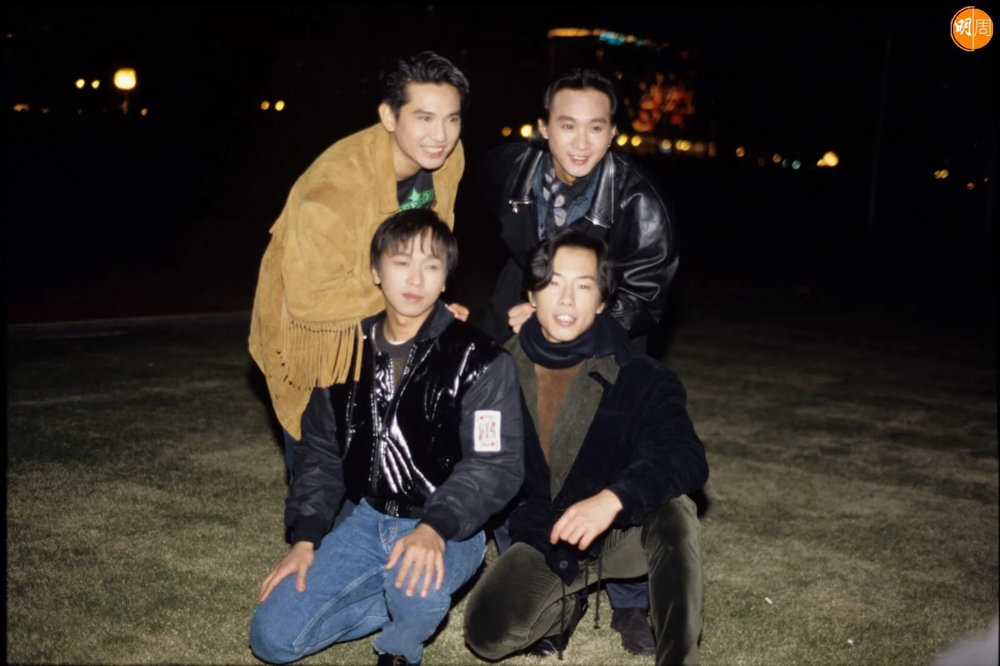

*黃家駒*

2011年滾石唱片公司，將《海濶天空》官方MV上載到YouTube ，時至今日播放數衝破一億，成為\第一首點擊次數突破一億的廣東歌；Beyond這首歌1993年面世，收錄在專輯《樂與怒》中，由已故主音黃家駒作曲和填詞，是Beyond四人時代的最後專輯，過去二十九年，全球各地有不少人翻唱，歌迷都為家駒自豪，更封Beyond為神級天團！

*Beyond*

*Beyond*

*Beyond*
