import YouTube from '@/components/patterns/YouTube.astro';

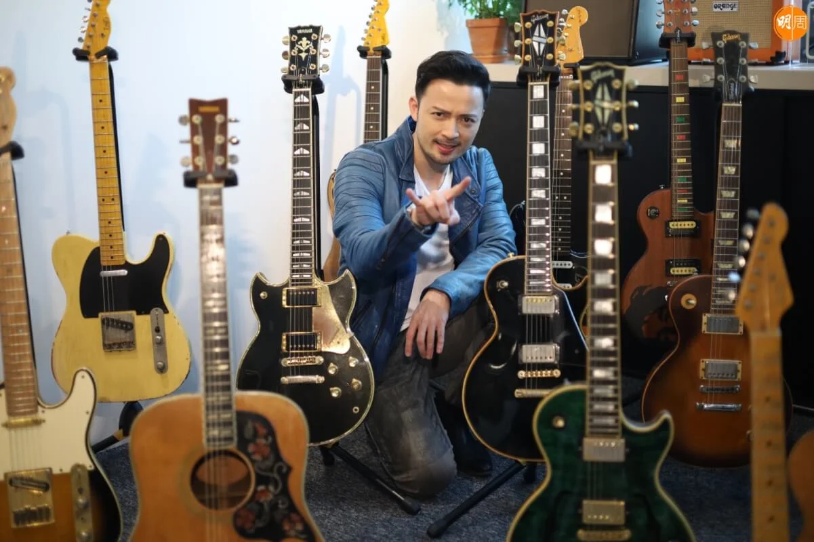

黎澤恩（Ronny）是Mr.的結他手，不過近幾年主力在演戲方面發展，早前就在《法證先鋒V》飾演一名日本廚師，獲得不少好評。雖然現在已很少在台上表演結他，不過黎澤恩閒時亦會在網上分享彈結他片段，現在還擁有十多支結他。他笑言跟結他始終有一份情意結，有些雖然已經不常用，但到現在也不捨得賣掉。Beyond是香港樂隊的經典，很多人的音樂啟蒙都是受他們影響，黎澤恩也不例外。「小時候很喜歡Beyond，一開始沒有想過玩結他，家駒過身後，就問自己，為什麼不去玩結他？不過一開始也沒有真正去學過，因為我們這一代多數都是自學，又不能說沒有師傅，個個都是我的師傅，我會問很多人，去到琴行會問人怎樣彈？見到那個彈得勁，也會走過去問他，很多都是慢慢累積才有今天的經驗。」

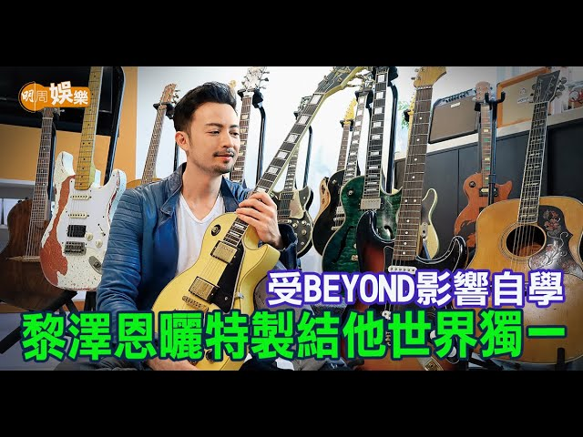

<YouTube id="1lXe0zzTSFE" />

黎澤恩記得，自己第一支結他是由朋友轉讓，用了二百多元。「但那支結他亂七八糟，是一支西班牙結他但上了鋼絲線，是錯的設定，我那時彈到手指出血，當時都還不知原因，後來有點錢，就買一支千多元的結他，一開始都是買低檔小小的，當時對結他的興趣實在太過濃厚，會每日在家八小時的不停彈，甚至彈到連飯也不吃，被阿媽鬧，真的很熱血。我記自己第一首彈的歌是《天空之城》那段音樂，我那代的人很多都識這首歌，亦令我最有滿足感，因為只是彈melody都已經很好聽。」

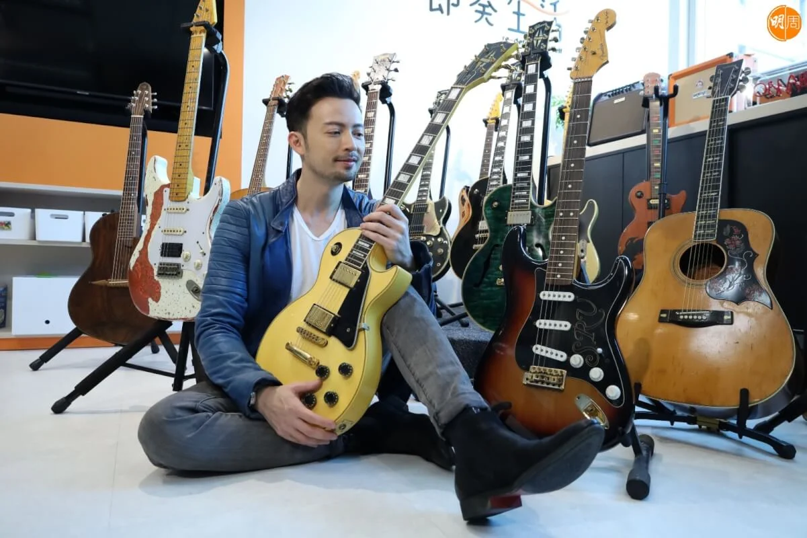

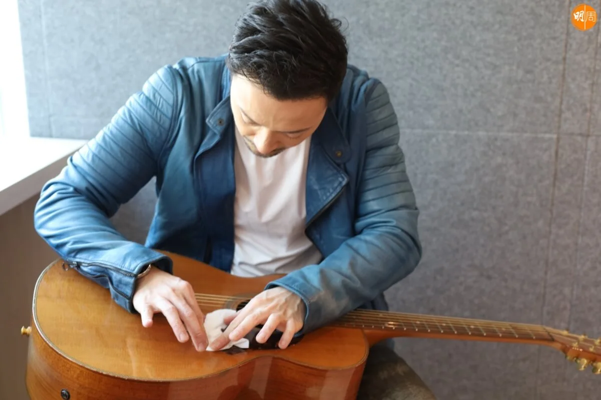

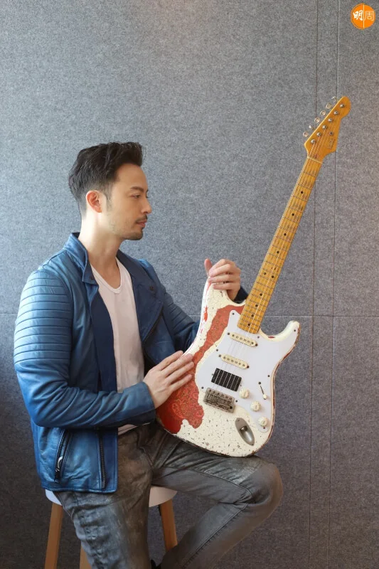

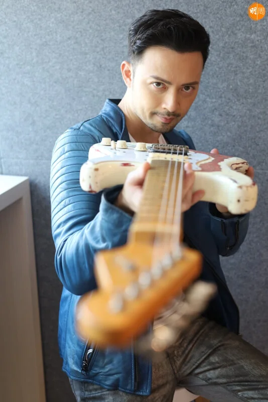

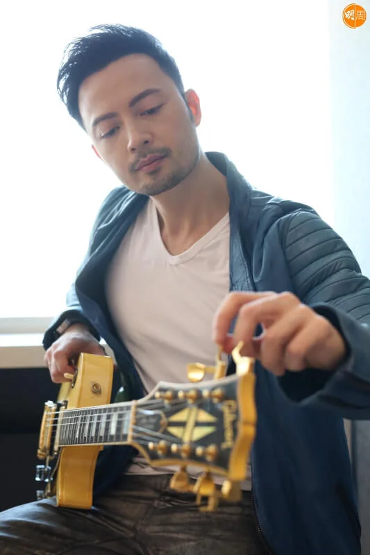

過了不久，黎澤恩就由木結他轉玩電結他，他說是很自然的過程，「聽什麼就會學什麼，當時聽Rock ＆ Roll，是以電結他為主，所以過了一、兩年就買電結他，因為那些歌要電結他才能彈到，但原來彈電結他不只需要一支結他，還有很多其他輔助的設備。我第一支電結他買了千多元，是在琴行的特價場，在最平的時間買，當時還不知道要買AMP（擴音器），回到家，奇怪為什麼沒有聲，後來才知道要買AMP。」不過黎澤恩強調，身為音樂人，就算愛玩電結他，也一定要擁有的木結他，「木結他是最有靈性的，會陪伴你，我很多創作都是由木結他寫，例如Mr.的《自言自語》、《遇到了》等，還有是在家中很難經常用AMP，扭大音量會給人投訴，木結他可以控制音量，所以木結他一定要有，但大部分結他手，儲得最多的是電結他。」

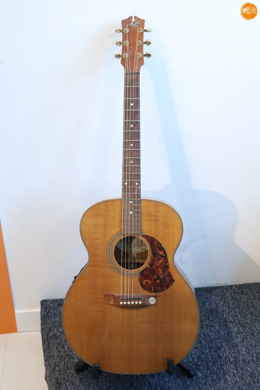

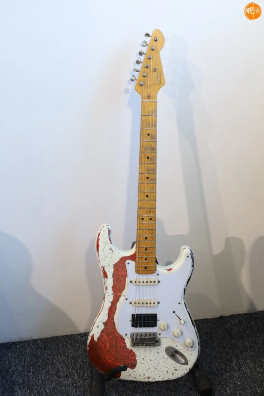

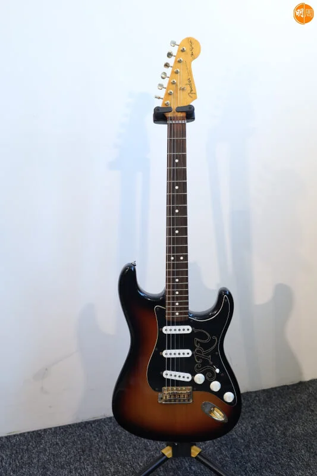

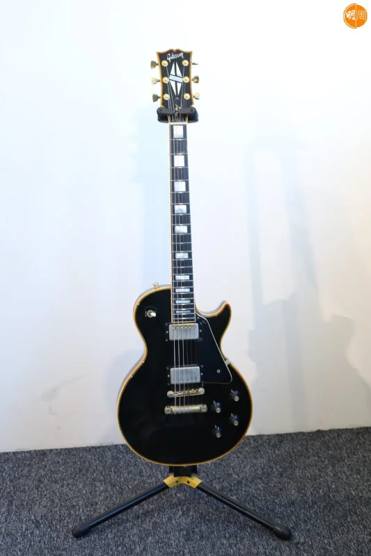

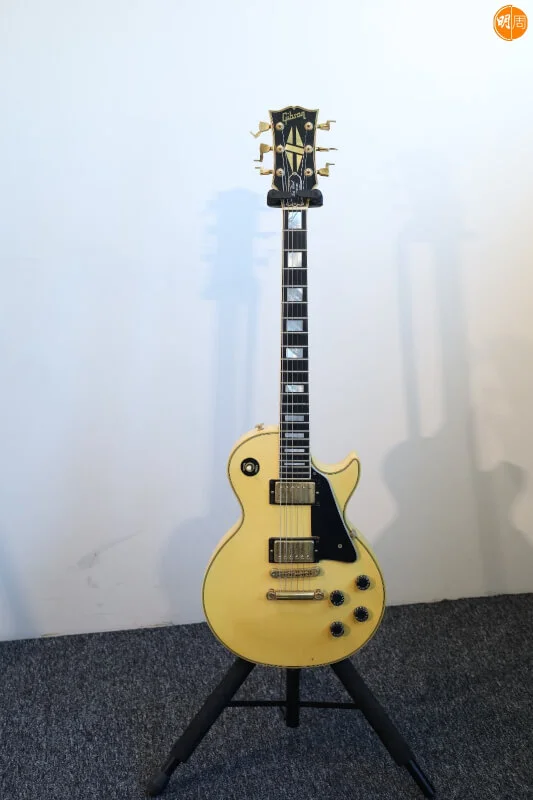

這次訪問，黎澤恩花了兩天時間，搬了十五支結他出來拍照，他笑言自己都沒有見過那麼多結他放在一起，「結他基本上全部都收藏在盒中，放在雜物房，開着抽濕機，令它保存好少少，還有兩支沒有拿出來，高峰期是Mr.那階段，有十八、九支，有些隊員會儲錢，或是做其他投資，我就是拿來買結他，我還有買其他，例如AMP、結他效果器，有些effect設備等，那些都好大件，現在是找其他錄音室、band房去放。當時有BAND房又夠大，我和MJ（譚傑明）都會鬥買，現在他應該賣走很多，我還有很多不捨得賣，可能將來窮都會賣，現在也不會再買，甚至望都不望，其實很多時，買是一時衝動，人大了沒有想擁有更多。」黎澤恩說，以前買結他時以為好值錢，但原來賣出就不值錢，「因為有價無市，買時想保值，因為很多都是古董，現在回看，概念錯了，現在是紀念價值比較多，每支都有很多回憶，我都有幫它們取名，什麼名都有，純粹想它更人性化。」

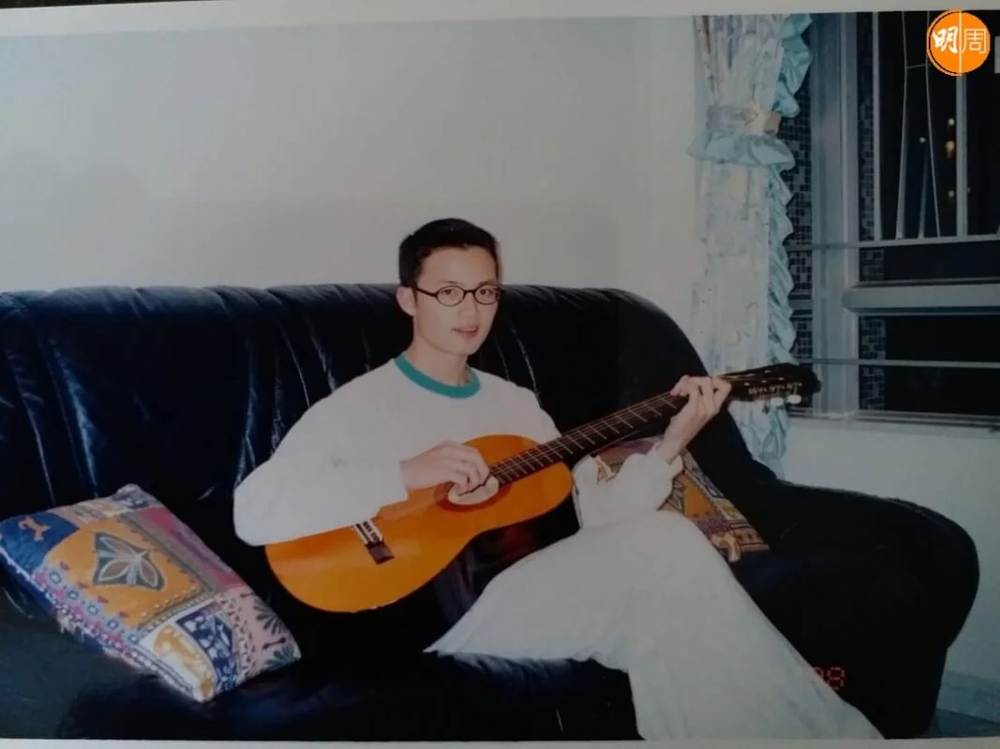

十七歲開始玩結他，也是到現在唯一學過的樂器，當年用了二百多元買來第一支結他。

問到當中最貴的一支，黎澤恩拿起一支白色，結他面有紅色圖案的結他，「應該是它了，因為它的價值是無價，是指定特製的結他，全世界獨一無二，是我自己去工場做，揀什麼木、用什麼線，全部都是自己一手一腳去選擇，所以不能定價，尤其是做結他面圖案的那位太太，已經過身，當時是做給一個自己很喜歡的女生，結他上有她的名字，這支結他在紅館演唱會時，亦有拿上台演出，紀念價值非常珍貴。」
