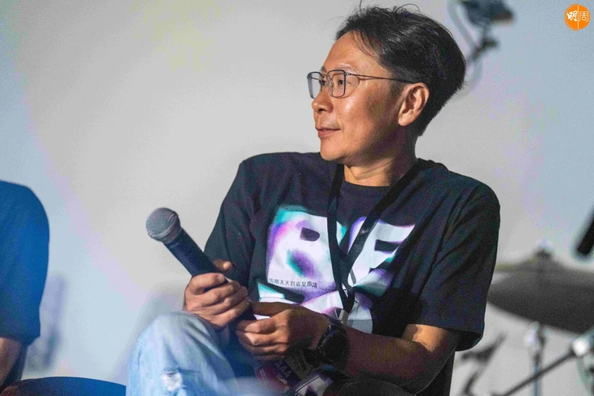
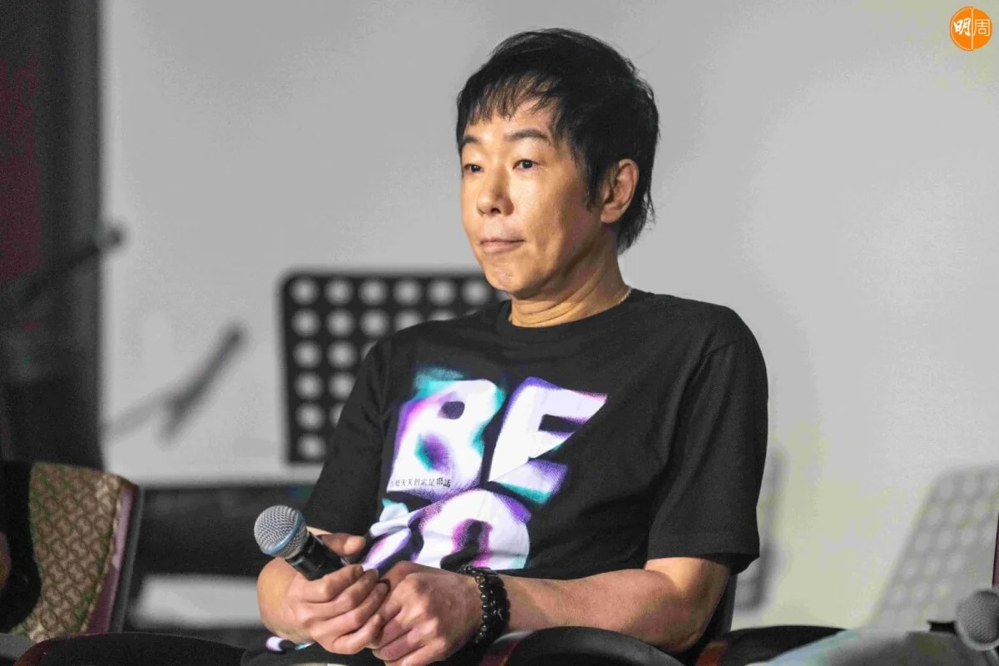
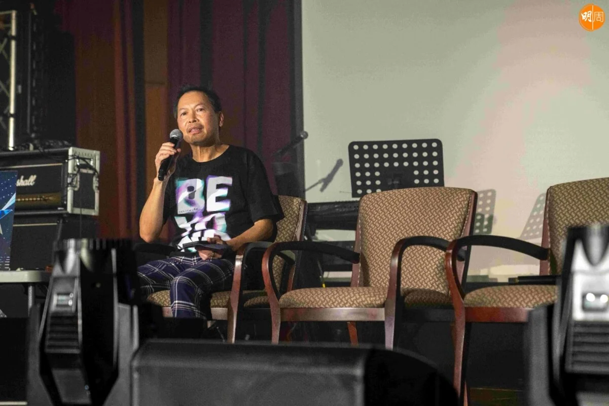
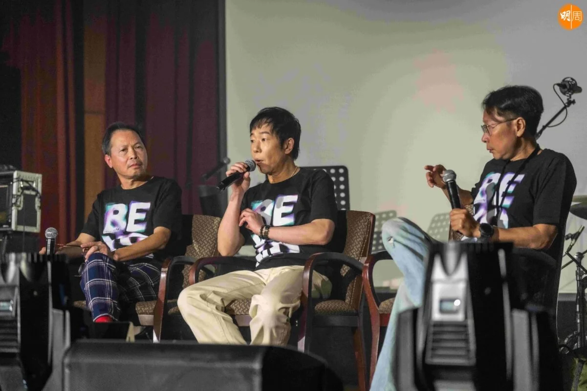
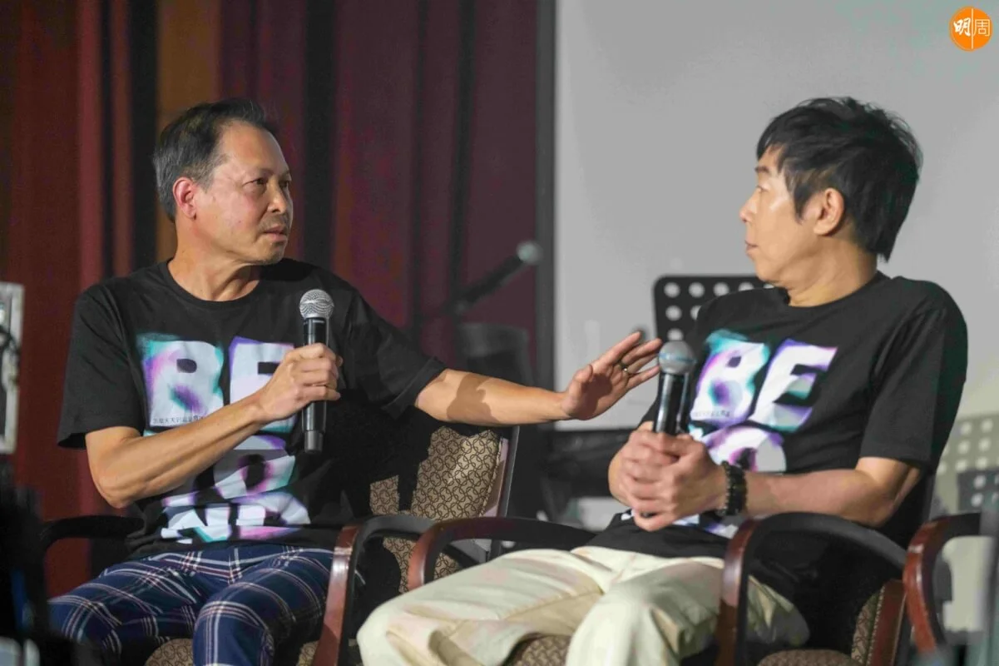
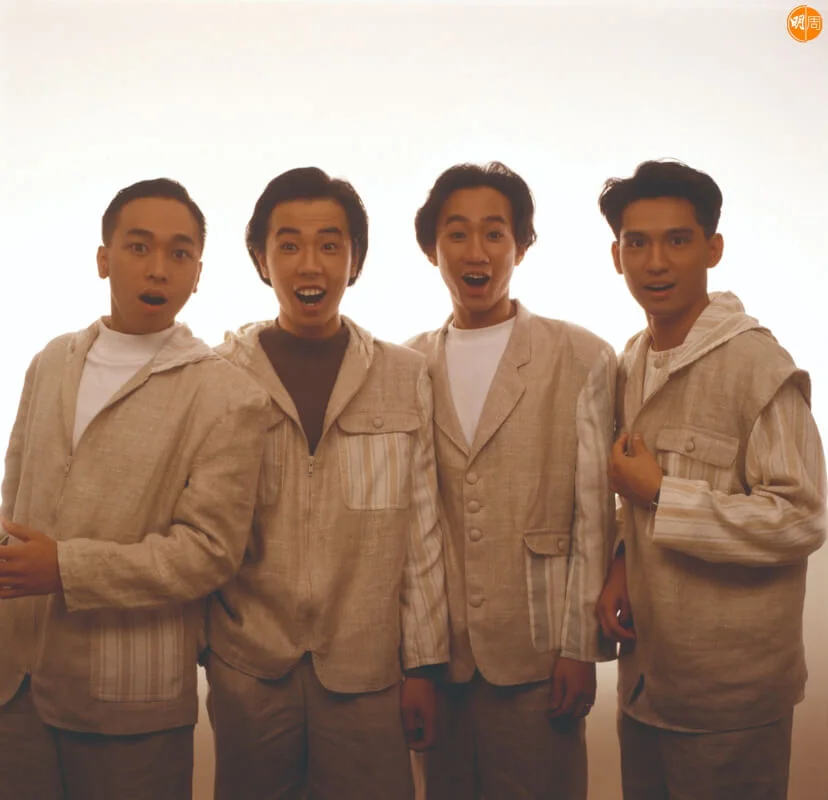
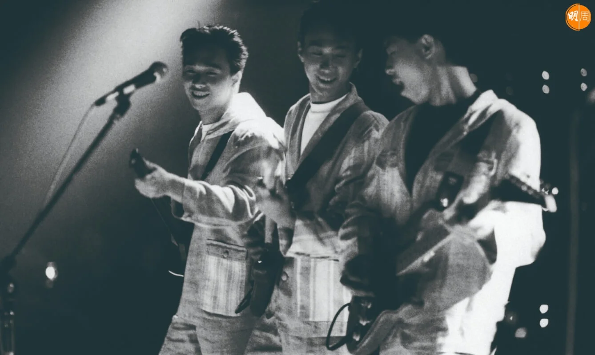
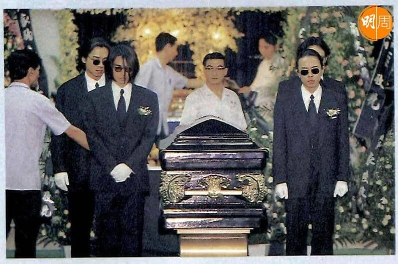
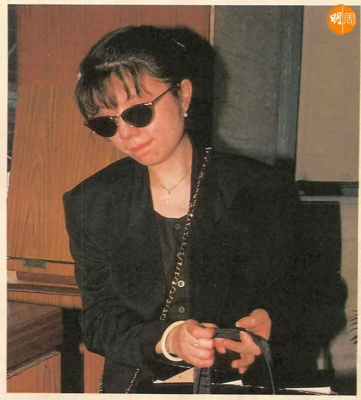

import YouTube from '@/components/patterns/YouTube.astro';

今年Beyond成軍40周年，本周五(30日)亦是黃家駒逝世30周年，已移居澳洲的Beyond前經理人Leslie陳健添，原來本月低調返港，於12日為Beyond舉行了一場紀念騷，選址在堅道明愛社區中心，這個地方是Beyond誕生之地；這晚，黃貫中、前Beyond成員劉志遠亦有出席，而身在北京的葉世榮亦以live形式現身，唯獨未見家強的蹤影，Leslie接受《明周》獨家訪問，詳述「Beyond 40」的project，亦為近日的demo大戰解話。

*Leslie從澳洲返港，與阿Paul和劉志遠出席Beyond紀念騷。*

本周三，身在澳洲的Leslie接受本刊訪問，他說本應不想在這個星期發表任何東西，考慮了一整天，亦有感事件已變質，他才肯開腔：「如果大家是尊重家駒，有啲乜嘢都好，需唔需要呢個星期講？有啲你認為唔高興嘅，或者你覺得想講嘅，講遲一個星期得唔得？我冇指明講邊個，依家包括我自己，原本我係打算下星期在YouTube講返關於嗰首歌，同埋點解搵肥媽？我做成件事係好單純嘅啫。」

本周五是家駒的死忌，連日來有關demo事件已發酵成是非，Leslie是事件的關鍵人物。其實，Leslie在去年初開始，已開始籌備一個名為「Beyond 40」的project，他說：「40周年喎，係咪要做返啲嘢呢？我的出發點是一個好單純的方式，但整個過程真係勞心勞力，錢又唔夠，過程中一定有少少唔好嘅爭拗，有啲意見對方未必聽你講，去到最尾想搞個音樂會，但我哋冇經費搞，我去搵sponsor，同sponsor傾咗三個月都係拖住拖住，整個過程充滿好大嘅挑戰。」Leslie強調自己的出發點：「世界應該是美好的，可以做些令人覺得美好的事情，我相信是一件更美好的事。」

<YouTube id="AyNm4RGumeI" />

最終，Leslie找了音樂平台re:spect合辦，在本月12日於堅道明愛舉辦了一場非常低調的紀念騷，「有些人質疑點解在一個咁細嘅場地做？因為明愛是Beyond誕生的地方，大家明唔明？」85年7月，Beyond在這裏自資舉行一場音樂會，當時目的是希望吸引唱片公司的注意，Leslie透露，當時Beyond留了頭兩行座位給唱片業人士來觀賞，可是事與願違，結果頭兩行都是空櫈，Leslie當日也沒有到場；這場音樂會，Beyond足足蝕了八千蚊，後來是小島樂隊開騷，堅持要請Beyond做嘉賓，Leslie才第一次與Beyond見面，亦成為Beyond日後的經理人。

Leslie說：「38年前沒有到明愛，今次感受好深，場地同當年冇乜大變化。」這晚紀念騷，所有入場觀眾都不能拍攝和錄影，沒有邀請媒體，這晚黃貫中、前成員劉志遠亦有出席，而身在北京的葉世榮更以live形式現身，連已移民到英國的鄧煒謙William(創隊成員)亦有錄影片段，唯獨未見家強的蹤影，Leslie解釋：「我有邀請佢嘅，我相信係時間就唔到，不過音樂會尾聲，我都有代家強講一個口訊。」大家應該充滿黑人問號？「Beyond跟Leslie不是鬧翻了嗎？」Leslie說：「好搞笑，做完這場show之後，阿Paul撞到一些朋友都被問：『點解你要上台？你哋唔係唔妥咩？』我喺邀請佢哋咁多位嘅過程，係完全好smooth嘅。」

今次「Beyond 40」project，家駒生前的兩位女朋友潘先麗Kim和林楚麒都有參與；林楚麒參與《Jambo Jambo》這首歌，Leslie透露，「原本希望林楚麒唱一首、Kim唱一首，但林楚麒幾個月前做了一個扁桃腺手術，只可以輕輕唱幾句和音，但感覺似和家駒合唱，她是忍痛錄完的，我有問她，錄這首歌驚唔驚俾歌迷鬧？她說唔驚。」當日，林楚麒再次前往位於旺角洗衣街Beyond專屬Band房「二樓後座」錄音。

至於Kim在6月12日舉行的紀念騷唱出三首《曾是擁有》、《你的故事》和《過去與今天》，將收錄於唱片的歌曲， Leslie說︰「《曾是擁有》是Kim和家駒分開後，家駒錄好後，叫Mike Lau(家駒生前好友)親手拎盒帶給Kim，是家駒特別為Kim而寫。而《你的故事》原創版本是《Southern all star》，這首歌是回應《海闊天空》，《海闊天空》是家駒離開我們前，一個最坦白的自述，大家多年以來都以為《海闊天空》是一首勵志歌，錯！其實係家駒一首情歌，Beyond在日本時候，他們四個是分開住的，家駒一定有孤獨寂寞的時候，家駒是recall返以前的畫面、他的女朋友，『原諒我這一生不羈放縱愛自由』，是寫給以前所有的女朋友，希望大家不要介意他一世都愛自由，好坦白。」原本Leslie是希望由Kim為《你的故事》寫上歌詞，但最後Leslie唔收貨，結果找了關栩溢填詞。

*家駒前度潘先麗現身紀念音樂會，唱出三首Beyond歌曲。*

*1993年6月24日，家駒應邀參加日本富士電視台錄製節目，從高台跌倒撞擊後腦，留醫六天後於6月30日逝世，終年31歲，遺體運回香港後，於7月4日在北角香港殯儀館設靈。*

*黃家駒曾經歷幾段感情，最為人熟悉的戀情，相信是他跟林楚麒。*
