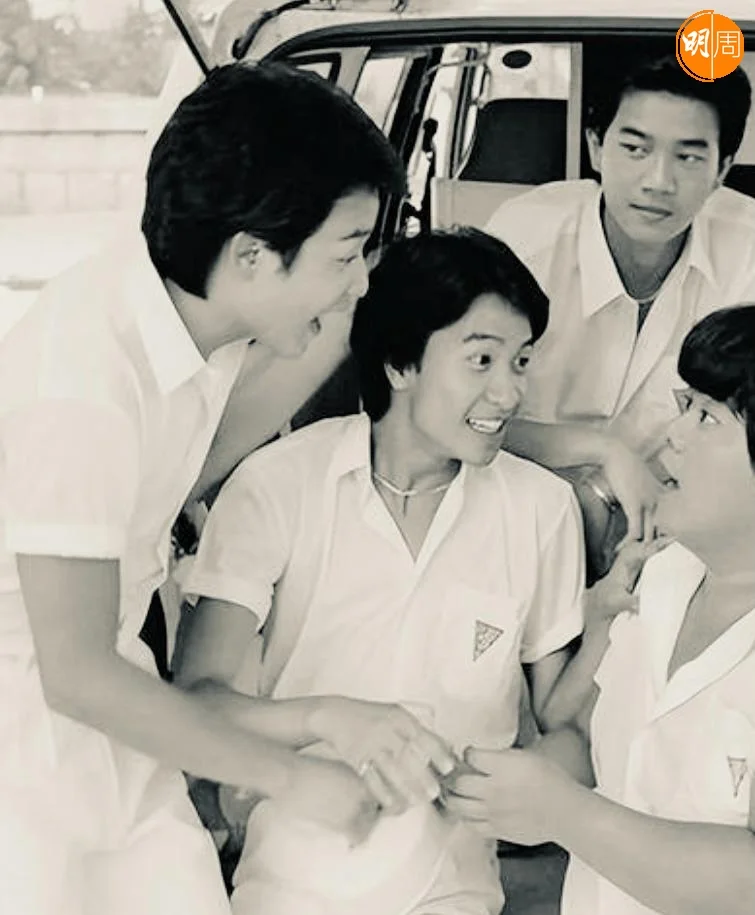

一九六四年，我才五歲，已隱約有一大事搖撼了身邊會引導我去模仿「甚麼是可愛」的大人們。是在他們的目光裏，我最早找到讚賞和寵愛，因為從一張唱片被放到轉盤上，家喻戶曉的電影主題曲《不了情》，便成了我人生中的「首本名曲」。私房童星，生涯短暫，是因憑該片拿下四屆影后的林黛，在那年的七月十七日服毒自殺，萬人空巷的送殯場面，從此載入史冊，身為大人物的她，才二十九。

此後，安眠藥三字，是星塵。

之後兩年也有女明星走上自殺之路，一是服藥加上滴露的莫愁，死於一九六五年十二月廿七日，才三十二歲，同是仰藥的還有丁皓，死於一九六六年五月廿三日，才廿七歲。一是從台灣來到香港，一是從香港去到美國。小小年紀，我已初識客死異鄉，身世淒涼。

但慘絕人寰還在後頭，一九六六年八月廿八日邵氏女星李婷在影城宿舍上吊自殺，報上對於死狀的恐怖繪影繪聲。李父在女兒死後一年因貧病交迫步她後塵。亮麗光鮮背後的絕望，加上片場的厲鬼傳說沸沸揚揚，便在七歲的我的心靈上劃下陰影——才廿一歲的夭折，想甘心也難。

那幾年，都說女明星自殺是傳染病。林黛的閨密是樂蒂，婚姻觸礁似是同途命運，一九六八年十二月廿七日傳來家庭與事業不盡如意的古典美人「在住所裏昏迷不醒，被送至醫院仍回天乏術，經調查後認定為安眠藥引起心臟休克而身亡」，引人扼腕，因她才卅一歲。但樂蒂是自殺嗎？後來該死因為同是演員的兄長雷震否認。

不到一年後，前邵氏女星，後轉拍粵語片的杜娟又因自殺「轟動一時」：「一九六九年十一月三十日，杜娟與同性好友何小姐被發現倒臥在九龍寓所，兩人氣絕多時」。十五歲便出道的「熱女郎」，以反叛形象博得青睞，偏在乍露鋒芒時下嫁富二代，婚姻失敗的結果，是留書辭世：「忍受不住現實環境的打擊」。傳聞兩女皆穿黑旗袍赴死，是以驚世駭俗對炎涼世態還以顏色？生無可戀，那年杜娟才廿七歲。

不久，驚天動地的「噩訊」又要來襲：「李小龍於一九七三年七月二十日猝死於女星丁佩九龍塘家中」。消息是中午傳來，正在打暑期工的我，周圍陽盛陰衰，感覺如森林失去萬獸之王，尤其當「過度服用催情藥物」，「死於馬上風」的風聞甚囂塵上，李與丁的關係還未得到確定，本來的悲劇，早已被渲染成任人投射的「死亡性遊戲」。誰叫男主角壯年早逝，才三十二？

翌年，又是一樁自殺新聞牽涉「性醜聞」。「一九七四年七月廿二日，李翰祥力捧的新人白小曼被發現在住所內死亡，警方透露是因過量服用安眠藥致死，輕生原因眾說紛紜，至今仍是個謎」，例如，「有傳言說她和家人起衝突，還有一說是黑社會看她走紅，便拿裸照威脅索討鉅款，才迫她走上絕路。」

「處女作」便是遺作，女主角才十九歲。

兩年後，在拍攝《少年十五二十時》外景歸來的車程中，收音機的新聞如是報道：「『銀壇玉女』林鳳於渣甸山谷柏道寓所因服食過量安眠藥逝世」，除了婚姻不美滿的求解脫，一說是愛美的她「色衰愛弛」，首先過不了自己一關，既傳整容失敗，也傳減肥無效。萬念俱灰，萬事皆休，一九七六年的八月廿八日給林鳳的人生劃下休止符，她才三十六。

不過是九年之後，又一位青春玉女自我了斷。曾屢次被傳言是「林鳳的女兒」，選美出道的翁美玲，十四歲便移民英國，若不是與荷籍男友交往不被母親接受，可能便不會回港發展。雖與港姐三甲無緣，卻因中選黃蓉一角一飛冲天。一九八二年入行，一九八五年五月十四日死於煤氣中毒，是現實中郭靖難覓？這小東邪才活了廿六個春秋。

女明星自殺多是為情，男同行自殺有「李志中為狄娜仰藥」，但也有不是為情是為錢。導演秦劍在五、六十年代為粵語文藝片聖手，奈何「改投邵氏後他執導的國語文藝片並不賣座，再加上個人財政問題，多方陷入困境。一九六九年六月十五日，秦劍在邵氏宿舍自縊身亡」，他才四十四歲。

二十年後，在無線總部工作的我，某下午第一時間接報金牌司儀何守信接班人鍾保羅從高樓一躍而下。才三十歲，鍾的死因曾被揣測為「無法償還賭債」，及後終被法庭裁定為「綜合各方證供，鍾是因為有經濟困難而自殺」。

與鍾保羅簽約同一經理人的還有陳百強與張國榮，綽號「三劍俠」，陳百強在一九九二年五月十八日「酒前服藥中毒入院」，九三年十月二十五日死於逐漸性腦衰竭，才三十五。十年後張國榮魂斷文華酒店。是在唱片店的電視機上傳來六點半新聞報道，又一次教人感覺浮生若夢。曾是我校學長的他，才四十六。

同受抑鬱症與情緒病所苦而跳樓，盧凱彤卒於二○一八年五月八日，才三十二。陳寶蓮卒於二○○二年七月卅一日，才二十九。

一九九三年六月，人在外地，打報釘得悉黃家駒在日本意外從高台墜落，才三十一。

女歌手何其早逝的，有一九九五年五月八日死於氣喘病發作的鄧麗君。才四十二。二○○三年，梅艷芳因癌病離世，才四十。

至於林翠，導演秦劍前妻的她，一九九五年二月廿二日，也是突發氣喘病歿家中，才五十八。她的兄長曾江，二○二二年旅遊回港隔離期間，「酒店職員發現他倒臥在房間內昏迷不醒，警員及救護員到場後證實他不治」，享壽高齡，惟生前仍獨步大江南北的他，留下的印象是，才八十八歲。
