近年香港出現不少獨立音樂人，沒有大公司支持，在現今自媒體世界，卻意外找到一條新出路！過去一年，香港獨立樂隊Pandora打造了一張十分亮眼的成績表，推出的三首歌《緊急應變逃生法》、《反引力塵》及《粉紅泡泡防護罩》反應都十分好，出道7年的Pandora終於走上主流舞台。

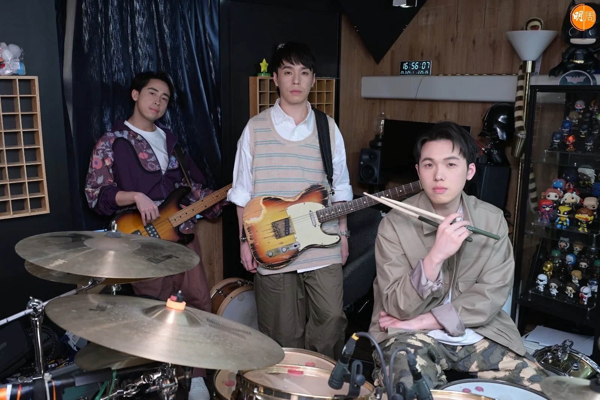

歷經數次重組的Pandora，三位現任成員包括主音及吉他手Tony、低音結他手Anakin（阿勤）與鼓手Michael（細佬），而Tony和Michael是親兄弟，因一個暑期班而認識了Anakin，自此種下Pandora這粒種子，Michael說：「嗰年我9歲，同阿哥去參加一個暑期樂器班，有日準備上堂，夠晒鐘就『爆門』入去啦，但Anakin就坐低繼續打鼓，過咗鐘都唔出去，咁我哋兩兄弟學緊彈結他，佢就開問，有冇興趣一齊夾band呀？就係咁認識咗！」

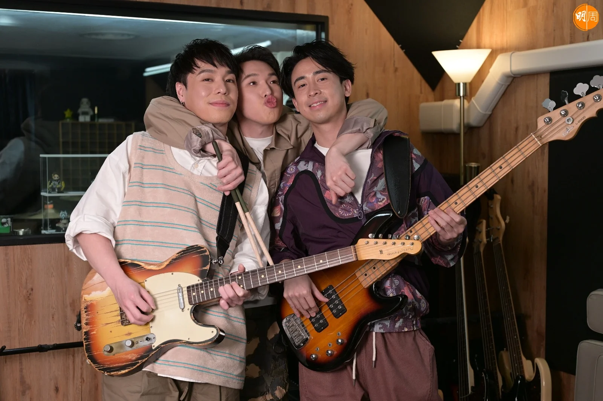

三個大男孩都是Gen Z一代，阿哥亦只是31歲，在成長之路，他們深受Beyond的歌曲影響，Tony說︰「因為父母都係聽Beyond，學結他時又係教Beyond嘅歌，一開頭我哋玩好多Beyond嘅cover歌，我哋三個人，一個結他、一個Bass、一個鼓，係我哋可以做到嘅音樂，《不再猶疑》呢首歌玩得最多，亦影響我哋最深。」

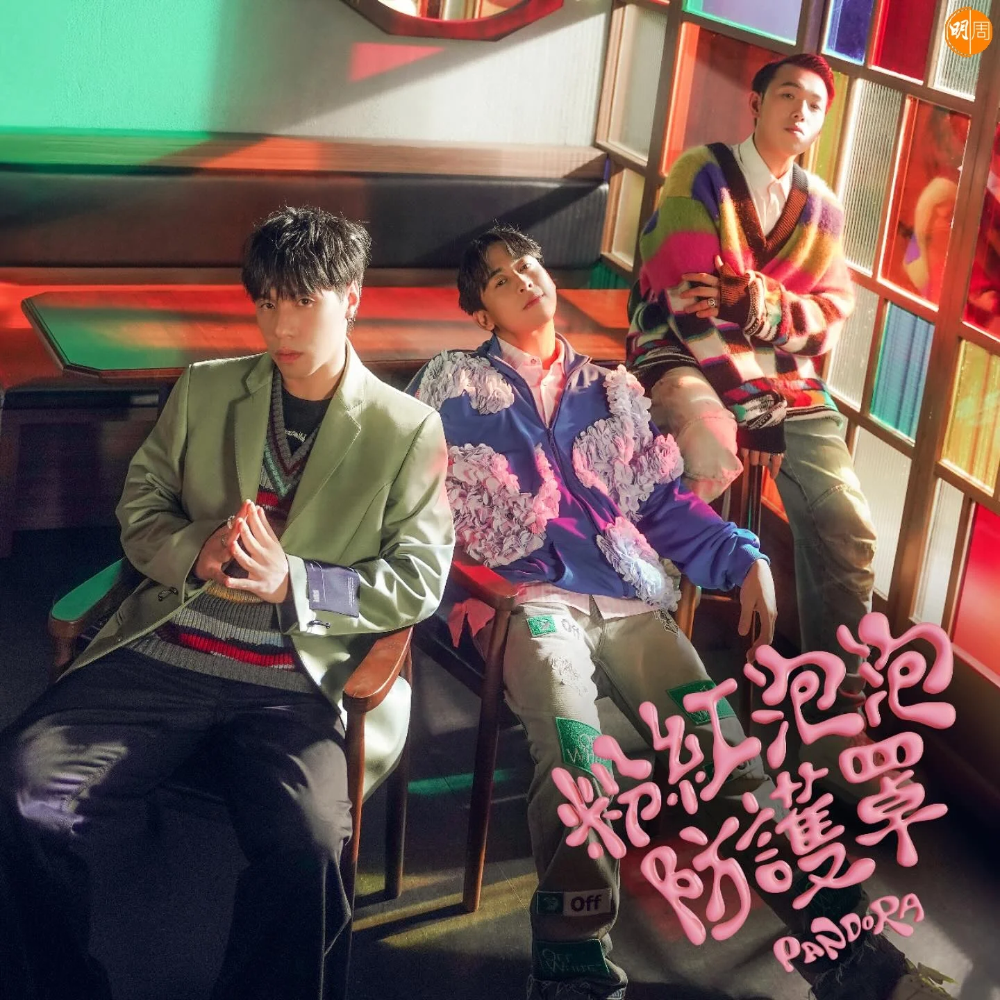

在香港夾band，都必須經歷「捱」的階段，Pandora亦不例外，他們起初各有正職，「做過PR，三個都做過樂器老師，因為覺得喺工作時都接觸到音樂，維持咗幾年，每日放工就即刻去夾band，因為讀完書就出嚟，日日都想對住啲樂器。」問他們在香港夾band搵唔搵到食？他們目標十分明確，「其實睇你想要咩生活，如果你想買三棟別墅、六架跑車，咁就冇乜可能，但如果話生活得到，就可以囉！我地都覺得其實夾band係一個夢想，除非你嘅夢想係想發達，如果唔係呢兩樣未必永遠都平衡到，足夠生活，我哋已經覺得係最好嘅安排，目標希望可以做到世界巡演。」

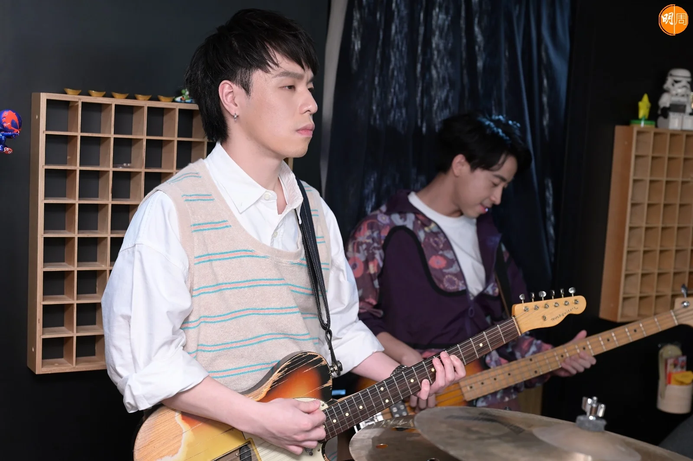

*主音及吉他手Tony*

Pandora的band房位於土瓜灣，Anakin說︰「開頭我哋係出去租band房，旺角又租過、紅磡又租過，慢慢開始多嘢，鼓呀、結他呀，要搵個地方store，最後就揀咗呢度，都已經8年喇！」三子幾乎每日都在band房見面，其次就是樓下的足球場，「以前我哋讀書一放學就出去，踢波又好，或者出去打機，都係我哋三個人一齊，讀完書出嚟工作，放工又係一齊玩，基本上每日都見，樓下個球場都係我哋聚腳點。」

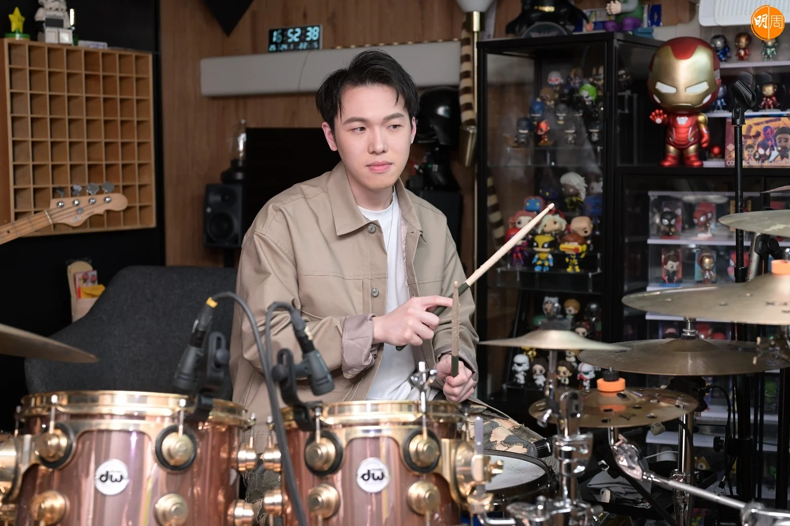

*鼓手Michael（細佬）*

於2017年正式派上第一首歌《捉緊心跳》，Pandora正式出道。先後推出專輯《The Opening》及《Ain’t Stopping》，近年作品《安全距離》、《緊急應變逃生法》與《反引力塵》，讓樂隊吸納更多不同聽眾層面支持，去年更打入《叱咤》「我最喜愛的組合」10強。

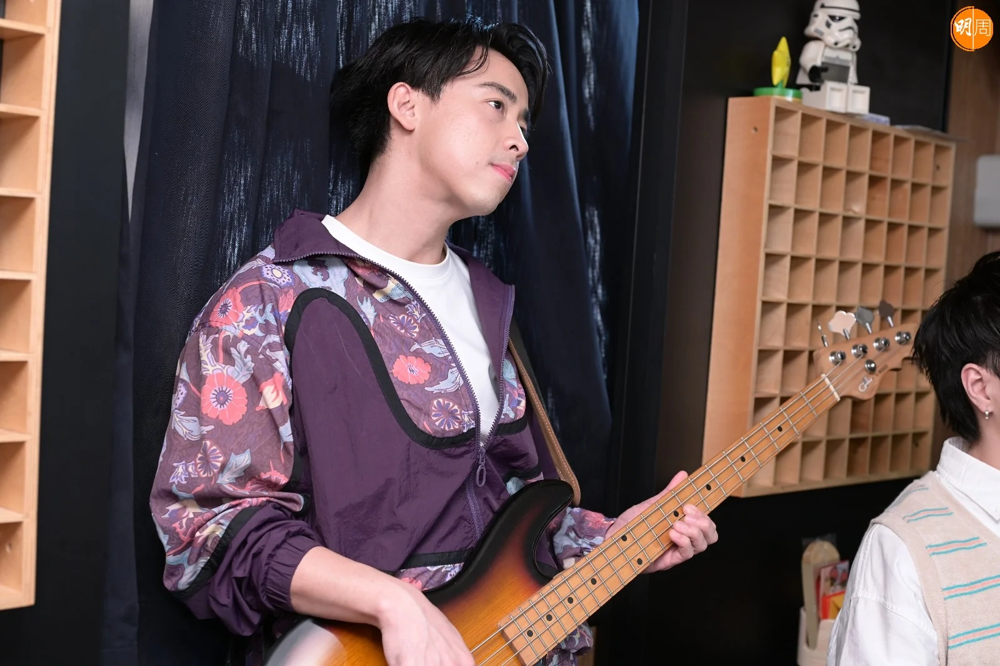

*主音及低音結他手Anakin（阿勤）*

直至2021，Pandora與唱片公司滿約後，三人以獨立樂隊身份繼續音樂旅程，「其實最大分別係好多嘢都要一腳踢，但我哋覺得獨立好in control，好多嘢都係迫住你去學，學咗之後你發現，就連剪接原來自己可以in control嘅時候，原來啲嘢係可以再personal啲，音樂又可以做到自己心目中嘅嘢，反而我覺得獨立嘅過程，自己成長咗唔少，我覺得呢個係樂隊成長好重要一環，大公司會有支持，但同時當然亦有掣肘，我哋希望忠於自己音樂，我哋都由細夾到大，希望可以keep住呢樣嘢，獨立對於Pandora，可能係比較舒服嘅一個方式。」

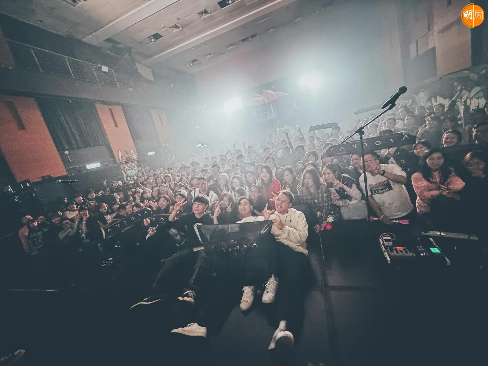

今年Pandora推出的三首歌分別《緊急應變逃生法》、《反引力塵》及《粉紅泡泡防護罩》，都深受年青人歡迎，令外界開始留意這個樂隊，即將再推出新專輯的第四首新歌，是關於生命的循環，「今次專輯概念都係關於成長，以大自然為主題，無論生物又好、植物又好，我哋希望借鑒大自然，有啲嘢，雖然我哋人類好文明，但其實我哋好多嘢同時忘記咗，尤其心態上，原來我哋可以還原基本步，嚟緊推出新歌叫《花之生命》，係講一個生命循環，好似蒲公英咁，飄散去唔同地方，唔代表佢嘅生命已經完結，佢哋種子會再萌芽，希望令到大家明白生命循環，好多嘢唔需要好執著。」

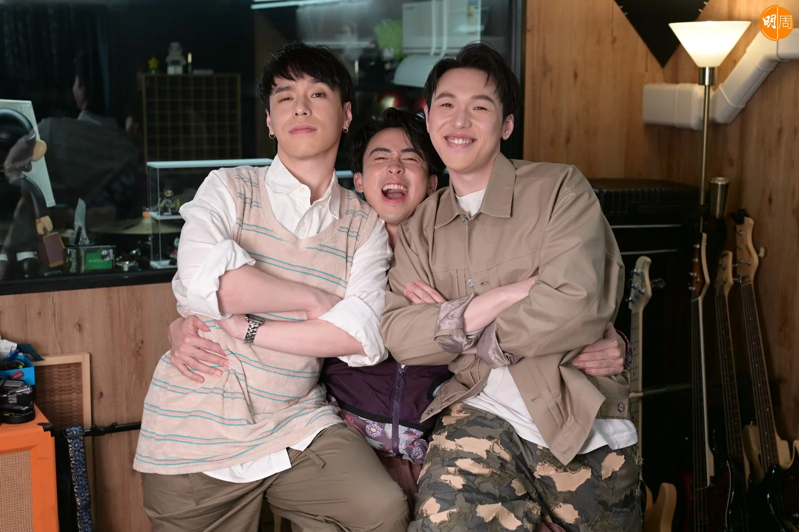

樂隊愈做愈好，Pandora開始向他們的目標進發，年底將會舉行首個大型音樂會，「今年10月，今次個場地喺鬧市之中，依家已經開始做緊準備，我哋都好期待。」不用為市場需要而創作，一切從身邊事物找出靈感，做自己喜歡的事，這就是獨立樂隊的優勢。

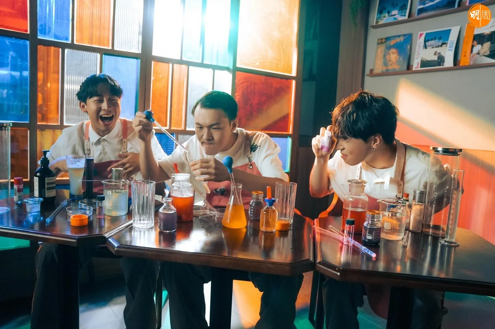

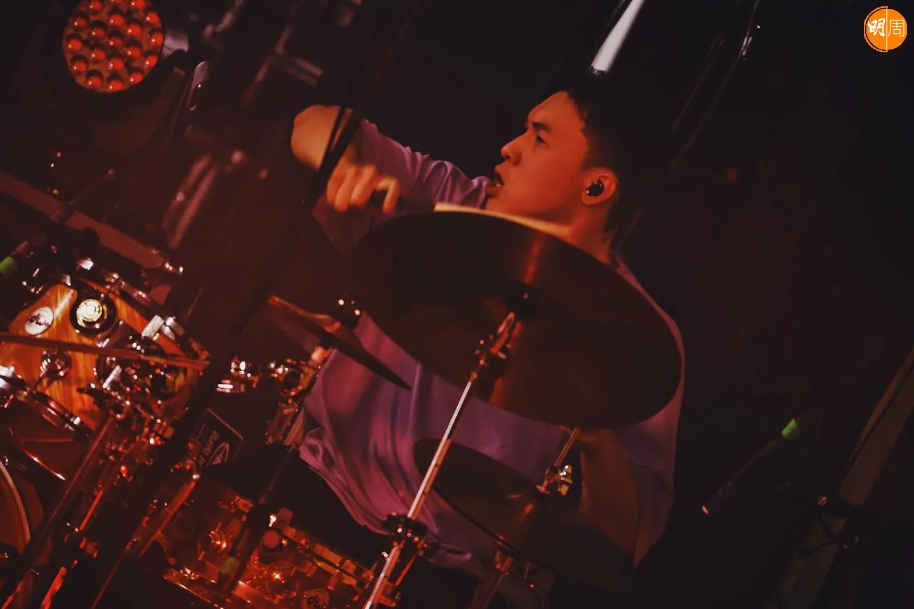

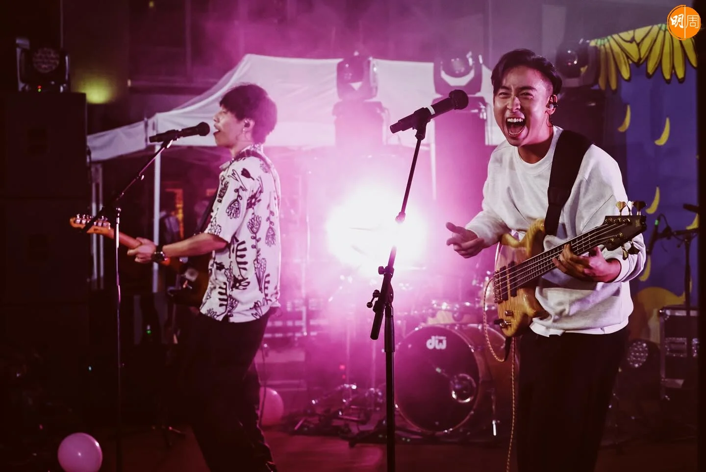

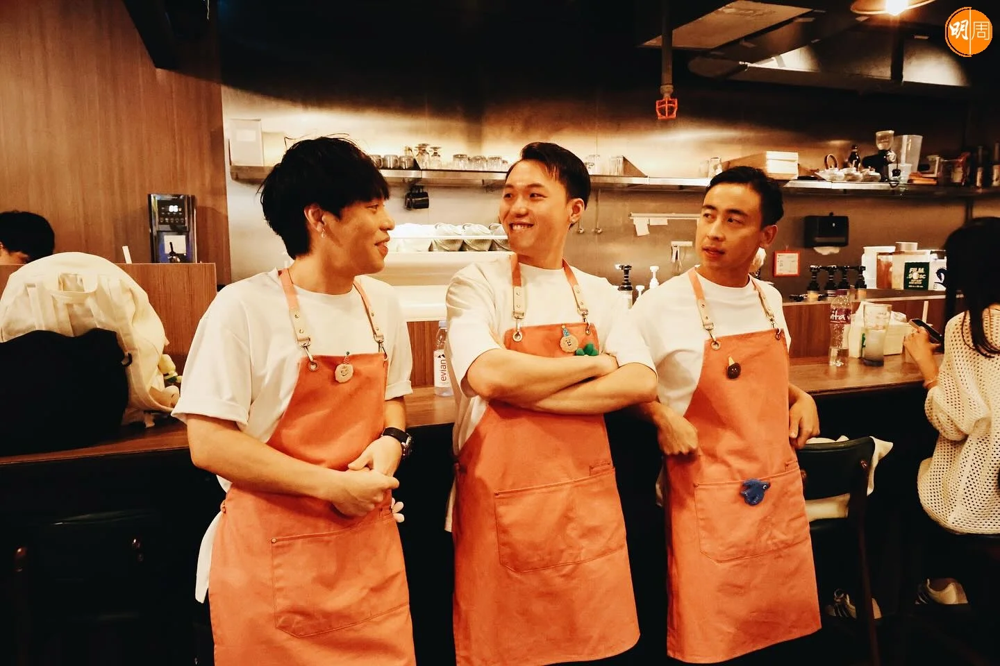

-   化妝︰Jenny Fung & Katherine Li
-   髮型︰Anson Ho（TwoTwo.hair）
