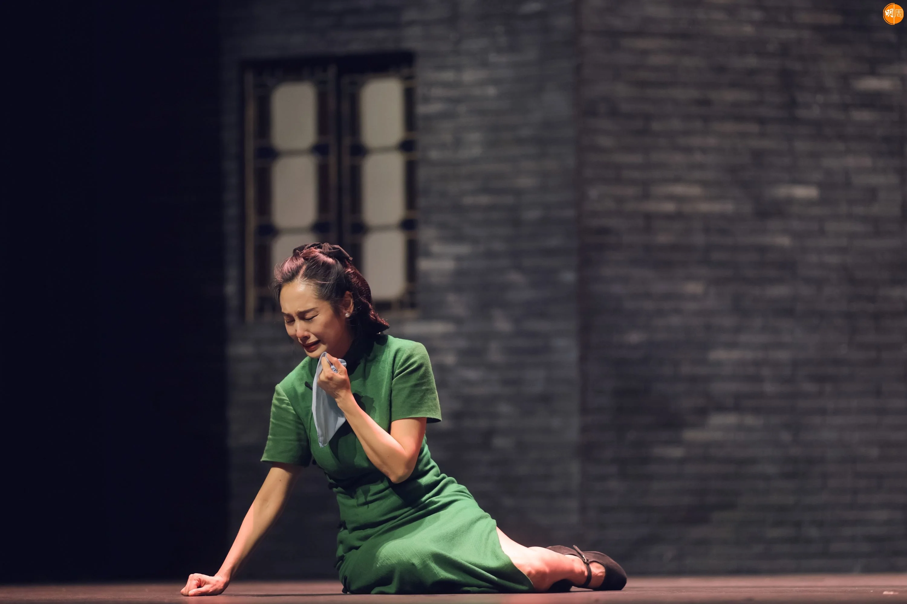
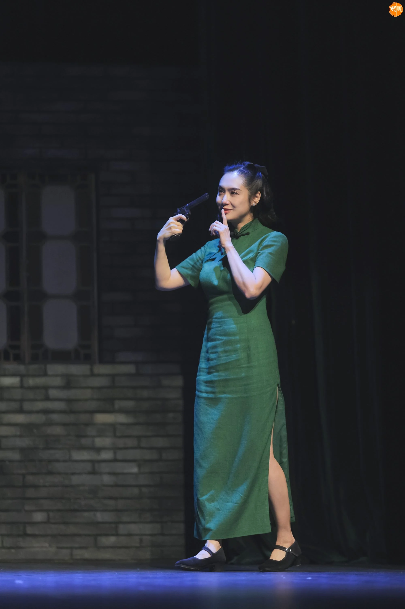
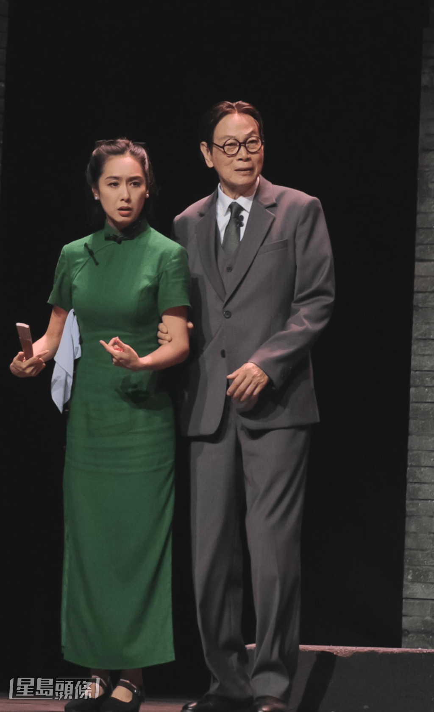
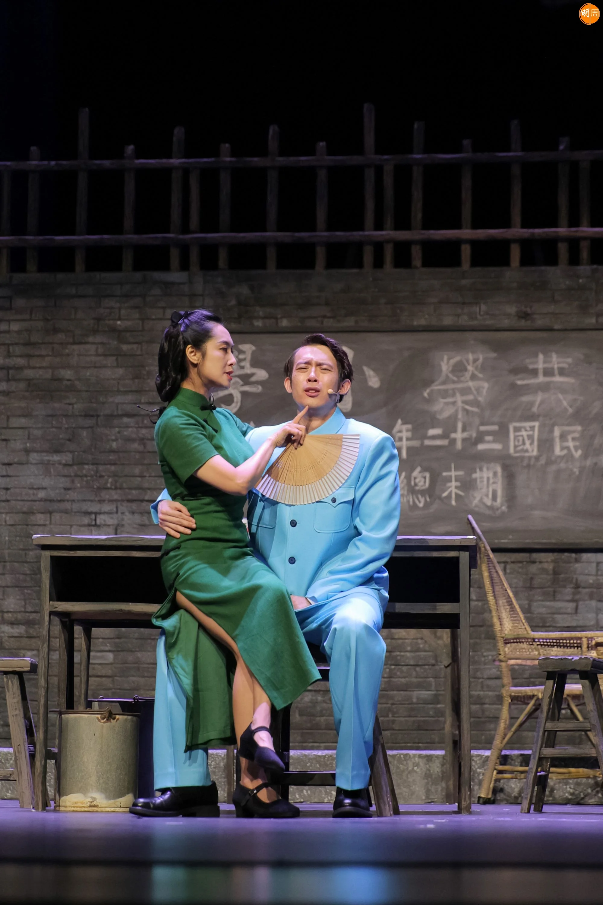
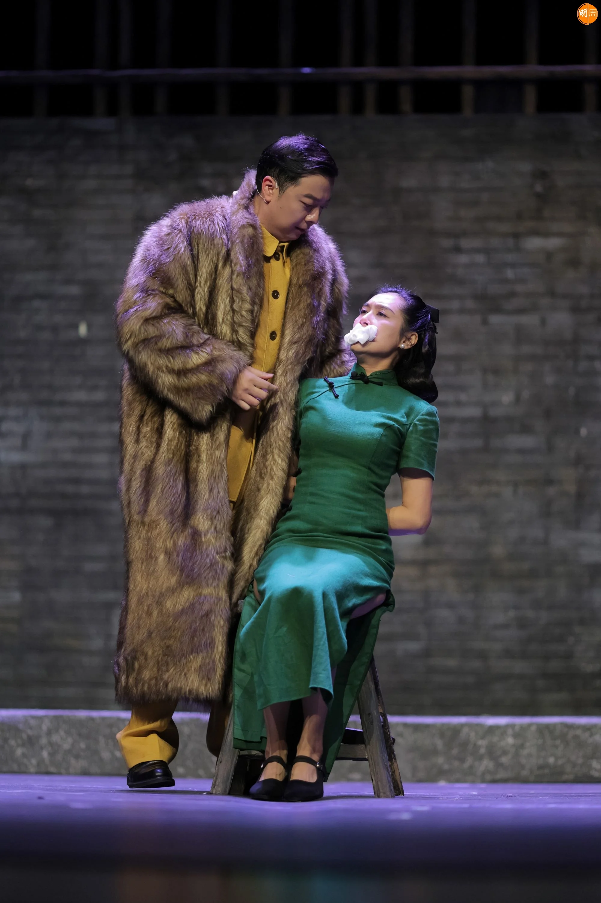
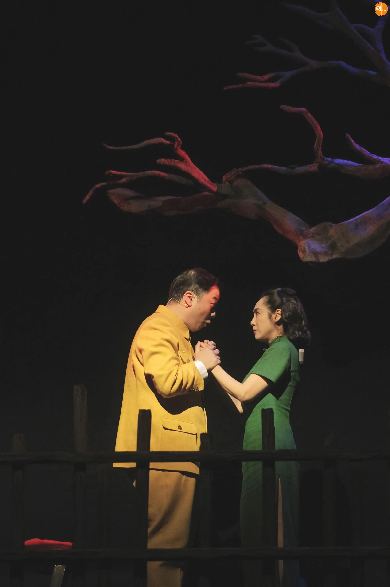
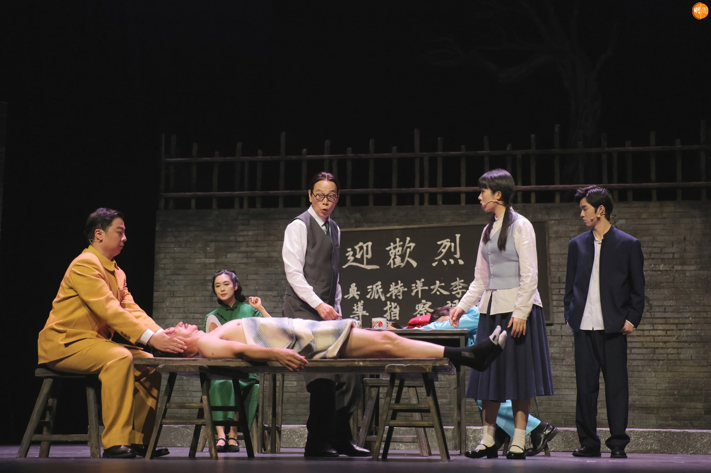
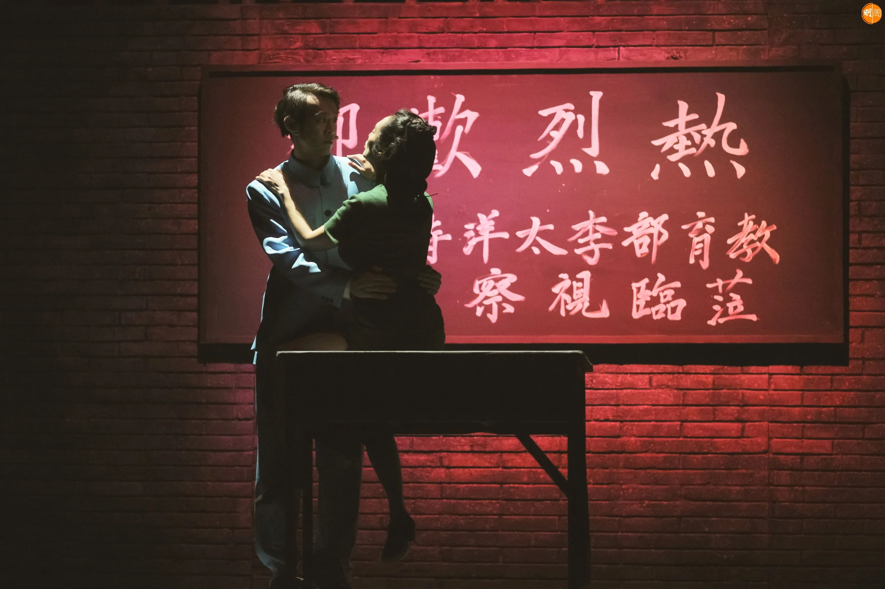
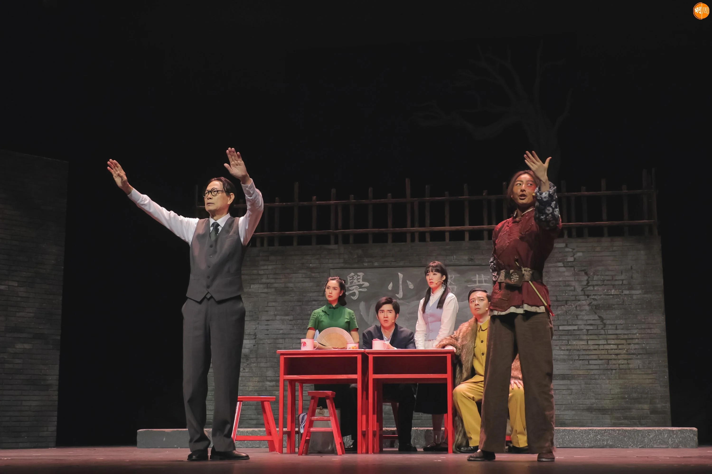
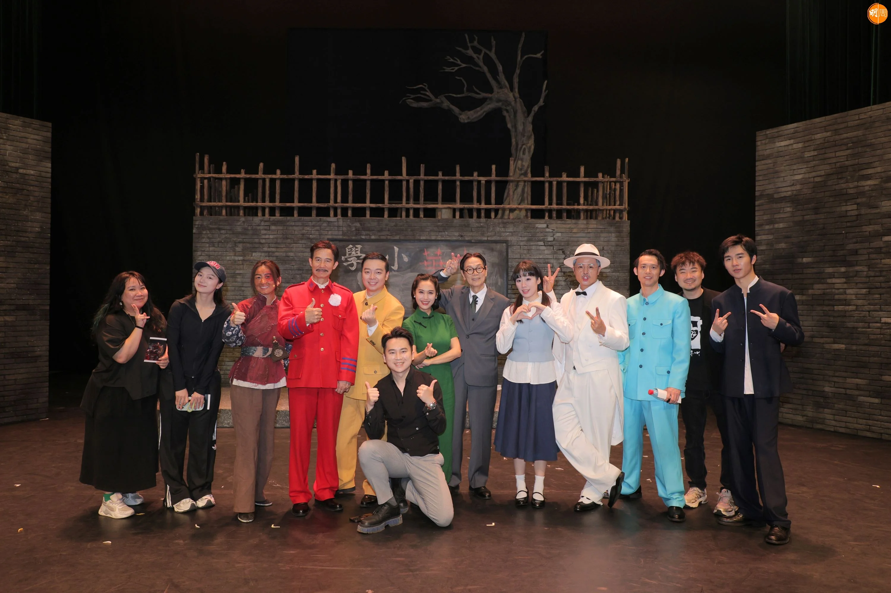

*朱茵演繹一位從原本浪漫主義到後期變成悲劇人物的女生。*

朱茵與羅家英、李子雄一同參演內地舞台劇《驢得水》，日前（25日）於深圳一連三晚公演，稍後更會在內地不同地方巡演。擔任女主角「張一曼」的朱茵，演繹一位從原本浪漫主義到後期變成悲劇人物的女生，難度甚高，朱茵坦言在入組前花了4個月時間分析角色，到排戲時已對角色非常了解。

今次是朱茵與羅家英自電影《西遊記大結局之仙履奇緣》中「紫霞仙子」與「唐三藏」的經典合作後，相隔30年、首次在話劇舞台重逢，令觀眾掀起一輪「回憶殺」。朱茵直言能與家英哥再次合作深感與奮：「大家多年無沒有合作，今次難得同台有種莫名的親切感！家英哥真的非常厲害，一踏上台板便狀態大勇，非常專業；另外子雄哥（李子雄）都很厲害，演繹反派嘅特派員，相當淋漓盡致。」

*同羅家英相隔30年再合作。*

提到舞台劇中最具挑戰的章節，朱茵坦言是劇中一場需要自摑及處理心痛極致情緒的戲份：「為力求完美，每場演出後都會同導演開會，好似自摑呢場好重要戲，大家商量後為了讓對手更有壓迫感，由試演時自摑7至8下，到正式公演改成十幾下瘋狂自摑，難度更高，練習了很久，要摑的聲音夠響，同時不可以打到耳朵，加上角色上張一曼要面對連番被背叛，開頭我準備角色時試過喊去表達，但後來發覺用忍住唔喊又熱淚盈眶嘅演繹更能展現角色倔強，令人心痛嘅一面，讓觀眾更加動容。」

朱茵又透露另一種挑戰是穿旗袍和皮鞋演出，整齣舞台劇歷時3小時，要著皮鞋在台上跑來跑去，又因為旗袍戲服，讓她時刻要好好控制身型，朱茵不諱言戲外需要鞭策自己大感壓力：「因為由第一幕到最後一幕都要保持激昂的狀態，所以每每完成後都筋疲力盡，見到自己的樣子似足熊貓一樣。」她笑言在首次試演後下班回家即倒頭大睡，「好耐無試過連續睡足8小時，可想而知消耗體能非常大，不過可以與各演員在舞台上合作，我真的十分享受。」

當被問到老公黃貫中與女兒黃鶯可會現身捧場？朱茵就表示女兒非常熱愛舞台劇，可惜囡囡要返學，時間安排上有點困難；至於Paul和同公司的黃智雯都有捧場，朱茵謂：「我之前都刻意唔俾老公睇劇照，想等他入場睇時候，讓他能在無預設嘅情況下感受角色，果然他看完之後都話被張一曼感動！」

