「原諒我這一生不羈放縱愛自由 也會怕有一天會跌倒 背棄了理想 誰人都可以 那會怕有一天只你共我」-《海闊天空》

黃家駒（1962-1993）是香港搖滾樂的代表人物，當年他領軍的Beyond樂隊，創作數百首歌曲，不少都是跨世記金曲。黃家駒和Beyond的音樂，不單影響本地樂壇，也是一代人的青春回憶，令人念念不忘。

由葉世榮和Beyond前經理人陳健添（Leslie）共同監製，黃家駒首個紀錄片《真的相識過》將於十一月推出，《明周》率先解構這部長達一百三十分鐘的紀錄片，詳盡探討黃家駒成名前後，在音樂路上的奮鬥及轉型，及至踏上事業巔峰，同時包括Beyond的珍貴現場演出片段及從未曝光影像紀錄。

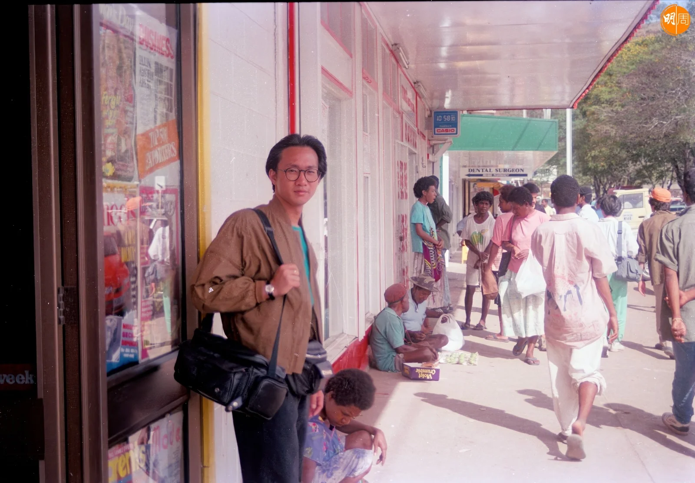

*家駒的創作靈感常來自生活，例如1990年8月他隨香港電台到新幾內亞探訪，親睹當地民眾在戰爭和災荒下的苦難生活，這次旅程對他影響深遠，改變了他對世界的看法，並促使他創作出歌曲《Amani》。*

一九九三年六月廿四日，Beyond為宣傳即將發行的日語唱片，應邀到日本富士電視台拍攝遊戲節目《小內小南的想做什麼就做什麼》，遊戲進行了十五分鐘便發生意外，家駒在狹窄並沾滿水漬的台上奔跑時不慎滑倒，強大衝力使身旁三塊佈景板的固定裝置脫落，佈景板鬆開，墜落三米高的台下。黃家駒頭部朝下摔落，後腦首先着地，隨即昏迷。

昏迷六日後，家駒於六月三十日下午四時十五分，在東京女子醫科大學醫院逝世，終年僅三十一歲。

*1991年，Beyond踏足非洲肯雅探訪當地兒童，同時將是次探訪輯錄成書。*

黃家駒離世至今三十二年，不少電視台和媒體都曾經製作過他的逝世特輯、懷念特輯等等，今次《真的相識過》紀錄片，由發掘Beyond的經理人陳健添（Leslie），與創隊成員葉世榮共同監製，香港電影製作人彭瑞祥執導，他們說，這個是黃家駒唯一一部紀錄片。

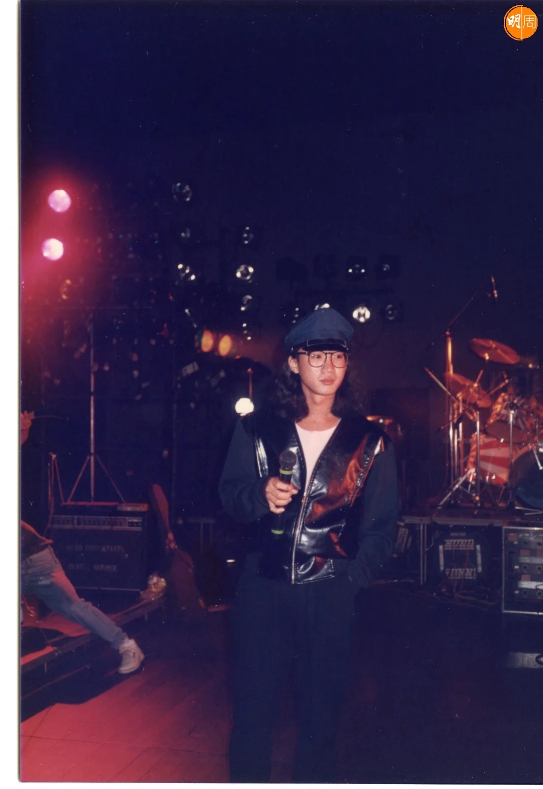

## 阿Paul家強未出現受訪

Leslie接受《明周》訪問，他說︰「這部紀錄片，其實歷史已經相當耐，在家駒發生意外之後，大概是在九三年底發行了亞拉伯演唱會（《Beyond超越亞拉伯演唱會》）的LD影碟，那時候我開始想為Beyond製作一部紀錄片，當時的構想是獻給Beyond，也是記錄家駒離開的這件事，當時手上有大量影片和相片版權，開始是以Beyond為基礎去做初步構思，但一路做落去嘅過程，有啲部分又擱置咗，一路拖拖拉拉，始終沒辦法完成呢套紀錄片。」

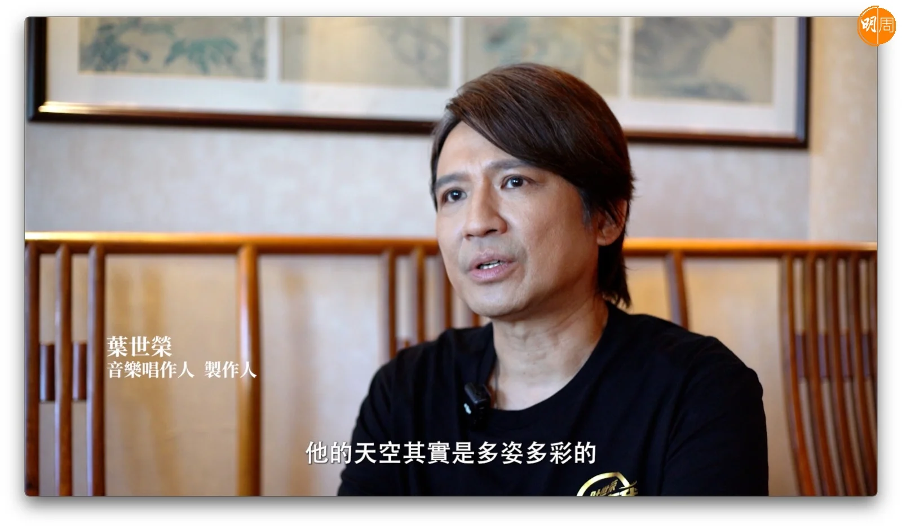

*葉世榮擔任家駒的紀錄片監製*

Leslie續說︰「疫情之前，再有一個團隊規劃整個方案，當時仍然以Beyond為核心，如果我沒記錯的話，大概都有五至六集，總長大概六小時左右，因為Beyond的故事確實很豐富，後來沒有繼續推進這個計劃，說實話，是因為籌不到資金，畢竟要拍的是這麼大規模的製作，後來疫情爆發，那幾年幾乎甚麼工作都停了，我靜下心來重新思考，是不是該繼續做Beyond紀錄片的計劃呢？」

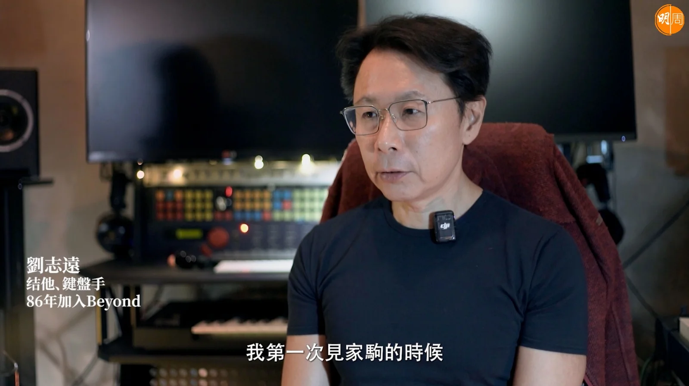

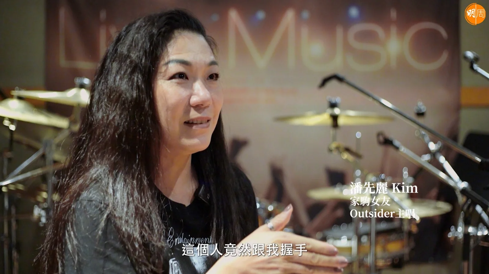

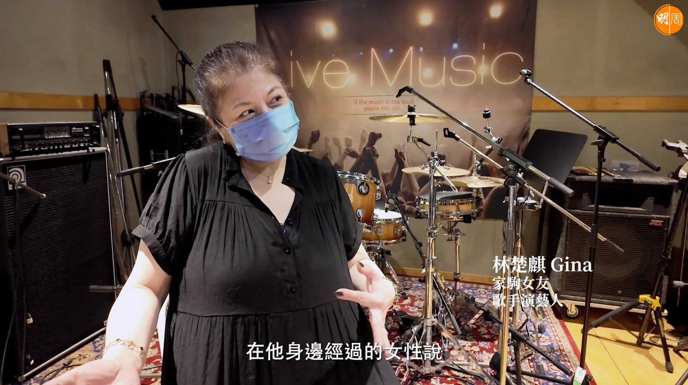

後來，Leslie決定把紀錄片的重心放在家駒，「我看了十幾部外國的音樂紀錄片，其實全部風格都不同，有很多呈現的方法，出來的效果也截然不同，這樣一想，我更覺得應該放棄原本拍Beyond紀錄片的計畫，還不如改拍家駒的紀錄片，一開始構思就成形了，而且拍攝的方向也很明確，就是邀請最核心的工作團隊，或是他最親近的朋友，不見得要找齊所有團員吧，因為當時已經知道，要所有團員受訪，並不是那麼容易的事。」

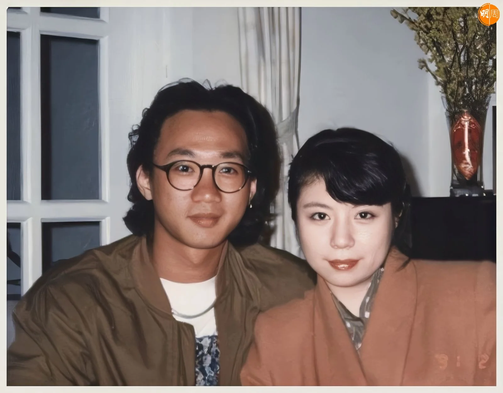

*黃家駒與林楚麒*

在家駒的紀錄片中，黃貫中（Paul）、黃家強並沒有出現受訪，Leslie解釋︰「由籌備開始已有聯絡Paul，但直至拍攝也沒有得到回覆；至於家強……我相信大家都明白，亦都了解他人在美國，但有通過他的助手通知這個紀錄片。他們未能參與，只是欠缺一份完美感，紀錄片依然可以感動，我同時深信，呢部係非常真實咁將一個非常真實嘅黃家駒紀錄落嚟！」而曾經是Beyond成員的劉志遠和鄧煒謙，就罕有現身。

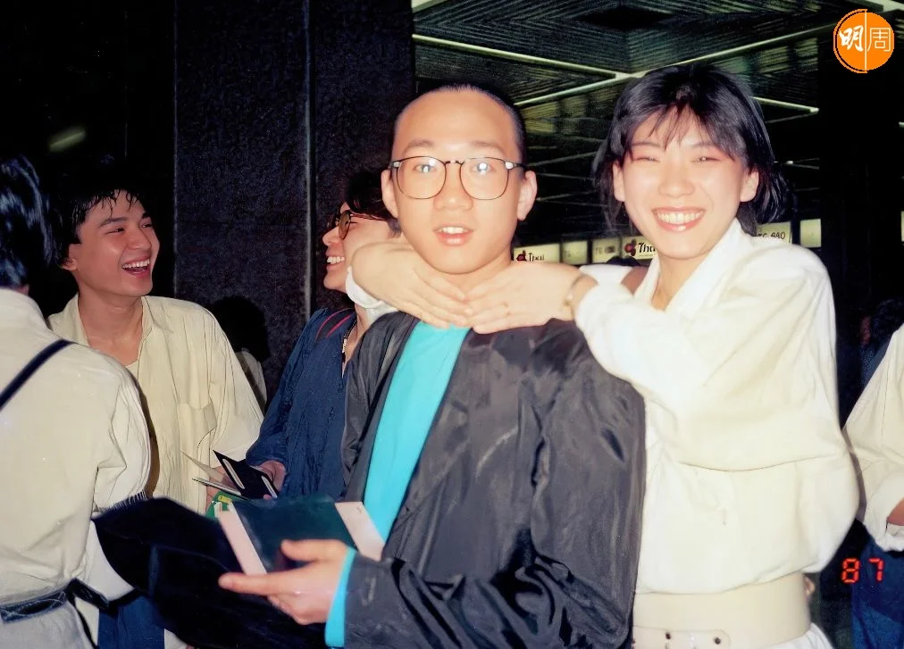

*黃家駒與潘先麗*

其他出現在紀錄片的人物，大部分都是當時跟家駒很貼身的人，由他們說出與家駒的故事亦十分真實。為甚麼Leslie沒有受訪？世榮就解釋︰「因為過去他認識家駒，可能都是在工作場合，他們主要都是在工作上的接觸，工作之餘當然也會有些聚會，例如一起慶祝生日或者一起吃飯，甚至一起旅遊都有，不過在日常生活中就比較少見了。」

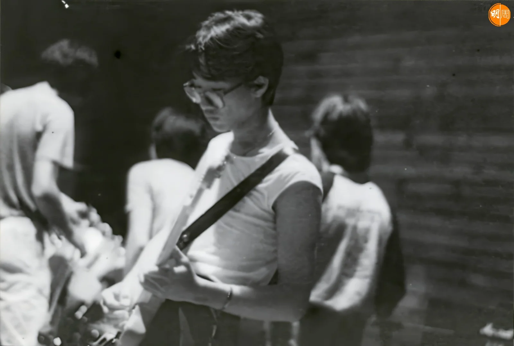

Leslie亦表示︰「我覺得我沒有參與這個決定是很正確，因為影片完成後，我看回所有拍攝素材，我發現自己對家駒有了全新的認識，這點確實讓我感到相當震撼。」

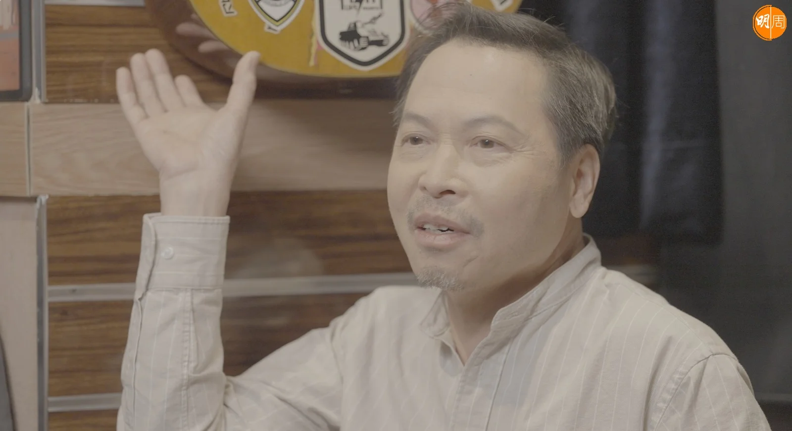

*Beyond前經理人陳健添Leslie*

在紀錄片出現的，除了工作夥伴，還有家駒兩位女友潘先麗和林楚麒，兩人罕有說出與家駒的小故事，包括她們第一次見家駒的情境，潘先麗說︰「我第一次見到家駒，那時候我幫Leslie工作，就看到一羣穿著風衣的人，他也是穿風衣的其中一員，這個人竟然主動跟我握手，當時我才十九歲，握手？當時在香港還不是很流行，心裏覺得很奇怪但又不好意思拒絕，最後只是簡單握了個手，我那時還想說他在笑甚麼？」而林楚麒則是在一九八七年拍攝港台劇集《暴風少年之黑仔強》認識家駒，她說︰「當時Paul做男主角、我做女主角，其實家駒他們也都在現場，他們扮演一羣古惑仔角色，後來有一次在港台節目的記者會上，我看到Paul當然會打招呼，家駒就走過來打了聲招呼，他突然說，我們回朋友房間練團，要不要來一起jam一下啊？他最常這樣說，我說反正沒事做，就上去玩一會兒，從那之後就常去他們那邊一起玩音樂。」

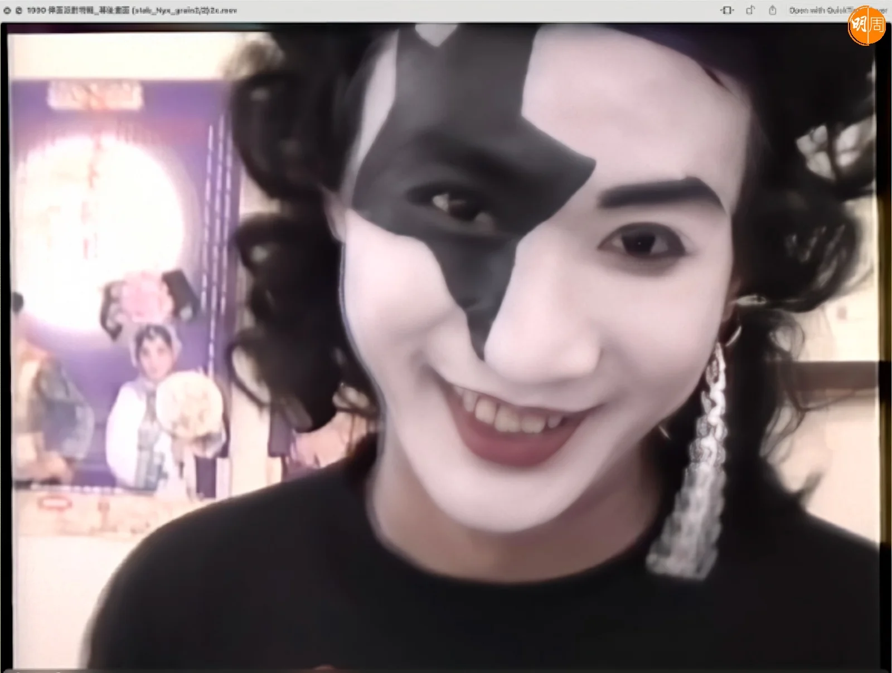

黃家駒曾經表示，Beyond知道自己在做甚麼，要在商業化的香港市場玩自己真正喜歡的音樂，就必需先打響樂隊的知名度，讓更多人聽Beyond的歌之後，就會玩回自己喜歡的音樂。

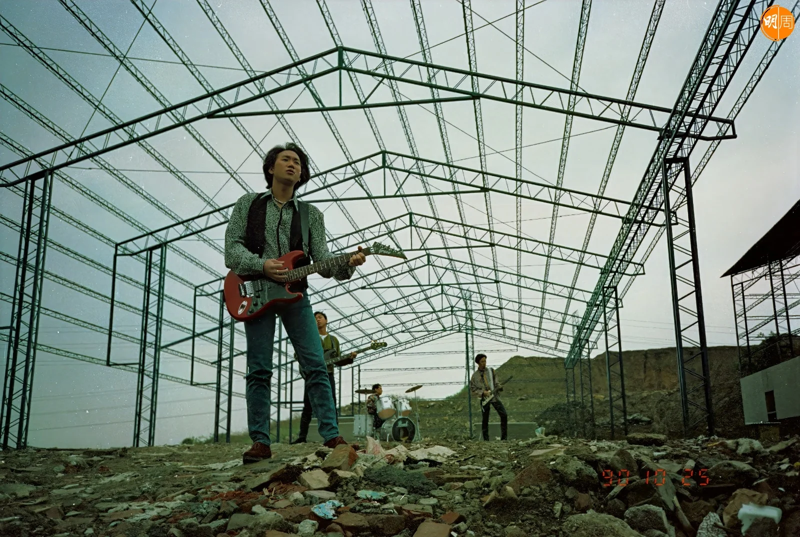

於是，樂隊成員陸續接拍電視劇及電影，甚至做節目主持，更進一步自行塑造青春健康的形象，吸引了不少年輕樂迷，而真正推Beyond上高峰的，是一九八九年以歌頌母愛為題材的《真的愛你》。

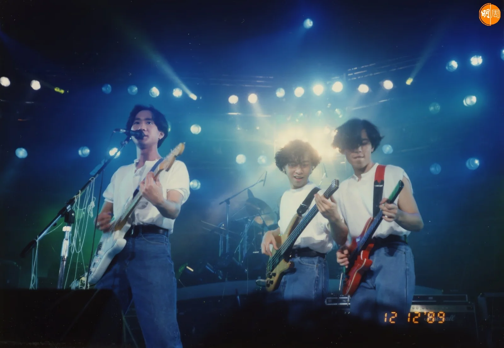

拍攝這個紀錄片，Beyond第一代主音結他手鄧煒謙（William）亦有現身，當年「Beyond」的隊名亦是由他想出來的，雖然他於一九八三年已退團，但一直與Beyond關係密切，他說︰「完成了《真的愛你》之後，家駒漸漸意識到，這首歌如果搬上舞台表演，絕對有把握能夠成功，結果當然是很成功，因為當你創作出一首歌，讓它成為經典之作，那我下一首歌該怎麼辦呢？他有一段時間甚至躲起來，我明白他在這個過程真的很折磨。」

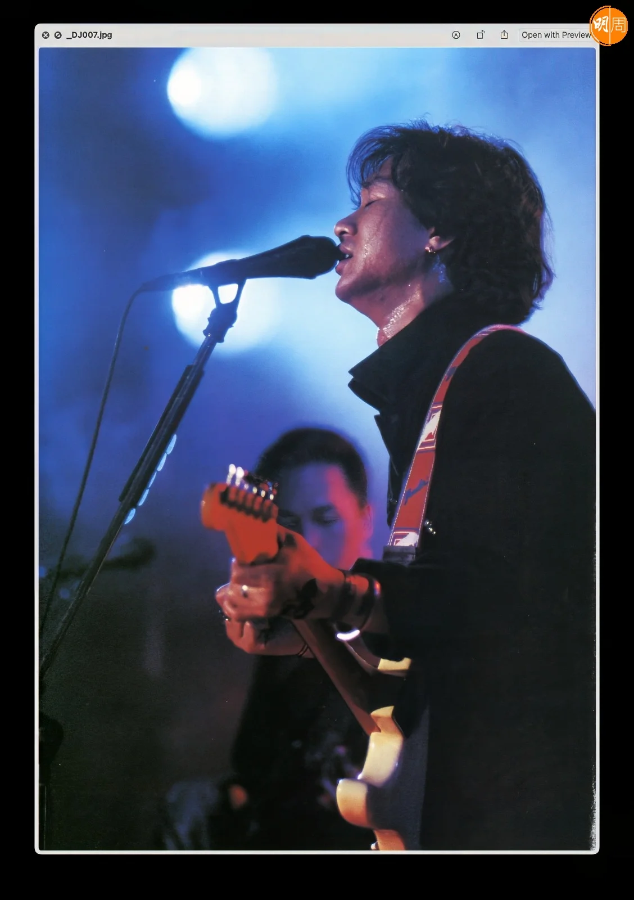

## 《海闊天空》歌詞的誕生

至於另一首經典《海闊天空》的誕生，當時Beyond已決定到日本發展，有一天家駒在日本經理人公司助理戶村章祥（Ben）的家，看到一座鋼琴他十分喜歡，Ben說他要搬家了，這座鋼琴不要了，家駒就問可否送給他？之後家駒很自然過去打開鋼琴便彈起來，Ben說︰「他彈了一段，問我好不好聽？真係好聽，就係《海闊天空》的前奏音樂。」

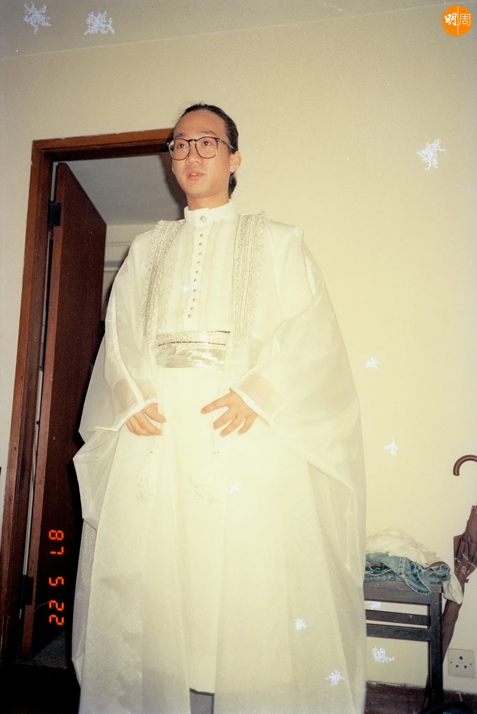

*87年家駒為《Beyond超越亞拉伯演唱會》試衫，攝於設計師家中。*

林楚麒說︰「其中有句歌詞，『原諒我這一生不羈放縱愛自由』，我諗係佢想對好多人講，不止對某一個人講，係所有從佢身邊經過的女性講的。我記得當時他們在談論在印度可以娶四個老婆，他講笑話，咁好正喎，所以佢想把心裏話寫入歌詞裏，佢心裏都知道，咁係唔啱，但佢都唔想，我就是呢種個性，你就原諒我吧！」

當年的知名DJ陳海琪被邀到華納唱片率先聽《樂與怒》這張專輯，她記得大家都揀了《海闊天空》做主打，她憶述︰「我記得行出會議室，家駒還走過來問我『你真係覺得呢首歌得？』我就話，點解你覺得唔得？明明係你自己寫出來，原來他擔心太傳統，Beyond不是搖滾嗎？」

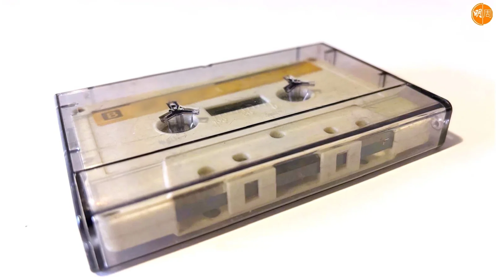

*紀錄片最珍貴，相信是家駒一段長達一分三十一秒的《demo02》。*

紀錄片有除了很多珍貴片段，還有十一張從未曝光的相片，而最珍貴的，相信是家駒一段長達一分三十一秒的《demo02》，Leslie說︰「首先要說是當時有位歌手叫李錦華，他在八七年於現代唱片出了張專輯，他當時的經理人張景謙（Clarence）開始收歌準備製作第二張專輯，後來找了家駒，最後家駒幫他寫了兩首歌，家駒給我一卷錄音帶，我就親自拿去給Clarence，這卷錄音帶裏面有兩首demo，我印象特別深刻的是寫了《他的心》和這個《demo02》，為甚麼對《他的心》印象特別深刻呢？因為當年小島樂隊出第一張專輯時，他們有首主打歌就叫《他的心》，我還特地問家駒，我說小島有首歌叫《他的心》，你為甚麼也用這個名字？他說只是隨便寫個名字而已，後來我自己也沒留着那些母帶，根本把這件事給忘了，應該是去年，籌備期間有些內容需要拍攝，加上紀錄片的部分，我也邀請了Clarence參與拍攝，但他不太願意露面，他突然就說，他那邊還有兩首家駒的demo，因為後來李錦華沒有正式錄音，可能是因為當時唱片銷量的關係吧。」

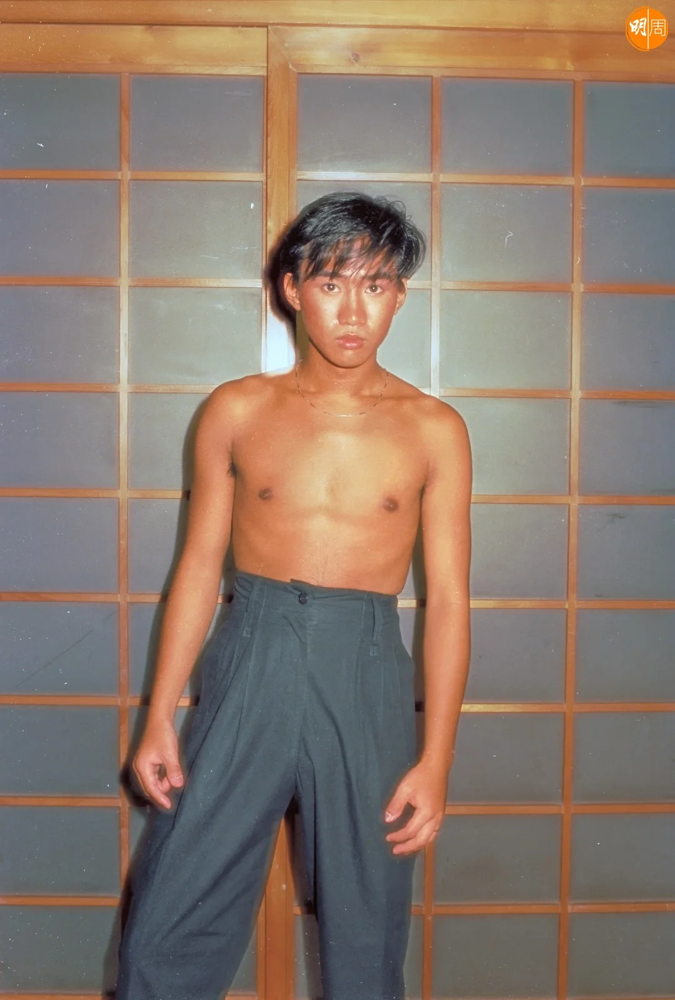

*86年的黃家駒*

## 家駒愛深夜作曲

提到家駒錄demo習慣，Leslie說︰「其實家駒這些年來，無論是寫給別人的歌，還是自己的創作，他都是在晚上家裏創作，通常在夜深人靜時拿出結他，有靈感就隨意哼唱幾句，所以很少當場寫完整首歌，通常都是先哼出旋律，會先安排時間找人填詞之後才會構思編曲，這兩首demo的創作背景都是一樣的。」

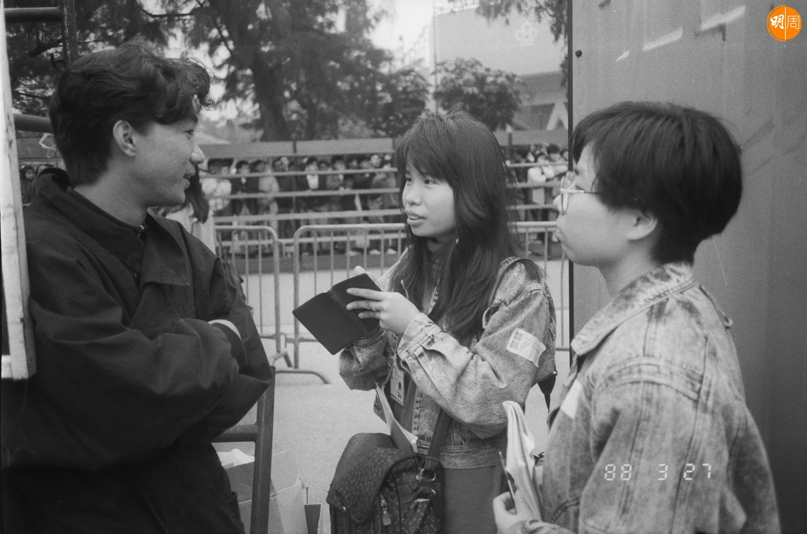

近年各地相繼出現AI歌手，二O二三年，YouTube頻道《AI家駒》引起香港網民熱討，相繼推出了多首以黃家駒聲音合成的AI歌曲，以現今科技，其實也可以把demo用AI造出一首歌曲，問版權擁有者Leslie，他說︰「其實現在，特別是歐美地區，其實他們也相當關注這個問題，我相信未來會有法律直接保障歌手的聲音，當然純粹用AI創作歌曲，只要不侵犯任何版權就沒問題，但若是盜用特定歌手的聲音，模仿他的風格創作，然後聲稱是他製作的AI音樂，我認為這種做法合法的可能性基本上不大，雖然目前還沒有相關法規來監管，但就像我剛才說的完全不會考慮這麼做，也絕對不會支持任何人採取這種做法。所以我也回覆了許多朋友的詢問，『有沒有考慮過將家駒未出版的demo，用AI把家駒的人聲重新製作成一首歌』，現在的科技確實能做到，但我絕對不會這麼做，雖然版權屬於我，因為我覺得這根本是造假，家駒已經不在了，再用AI模仿他的聲音做出來，那聲音能算是家駒的聲音嗎？」

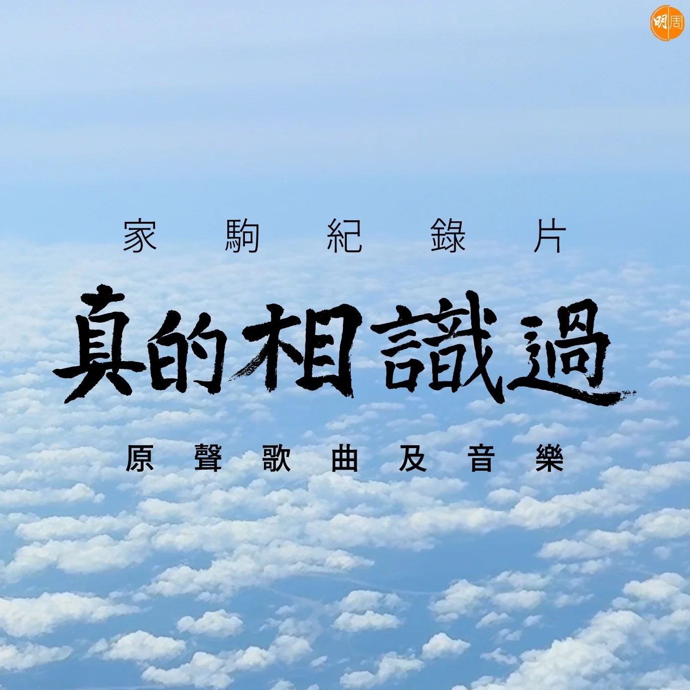

《真的相識過》暫定於十一月十八日上線，但時間、平台等細節仍未確定，觀眾可留意《明周》或beyond.com.hk，而大會亦送出三份(限量六百個印有數字的《真的相識過》boxset)，有興趣可留意《明周》Facebook、IG公告。

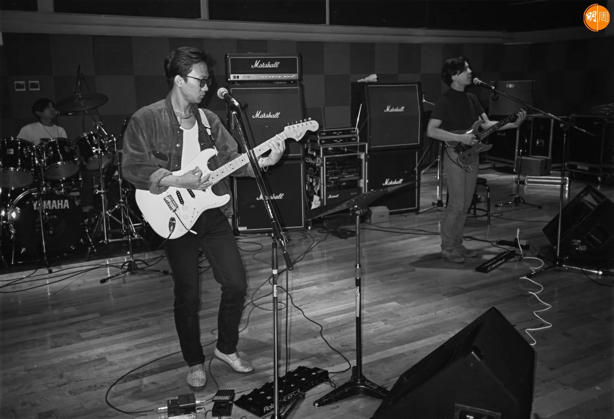

## 十一張首曝光照片背後故事

Leslie說，這十一張照片都各有故事，他特別提到一張照片，於九一年Beyond首次在紅館舉行五場演唱會後台，「當時是Beyond的事業高峰，但他們知道夏妙然來了看騷，馬上走到後台要跟她拍照，Beyond成名前後都是性格如一。」

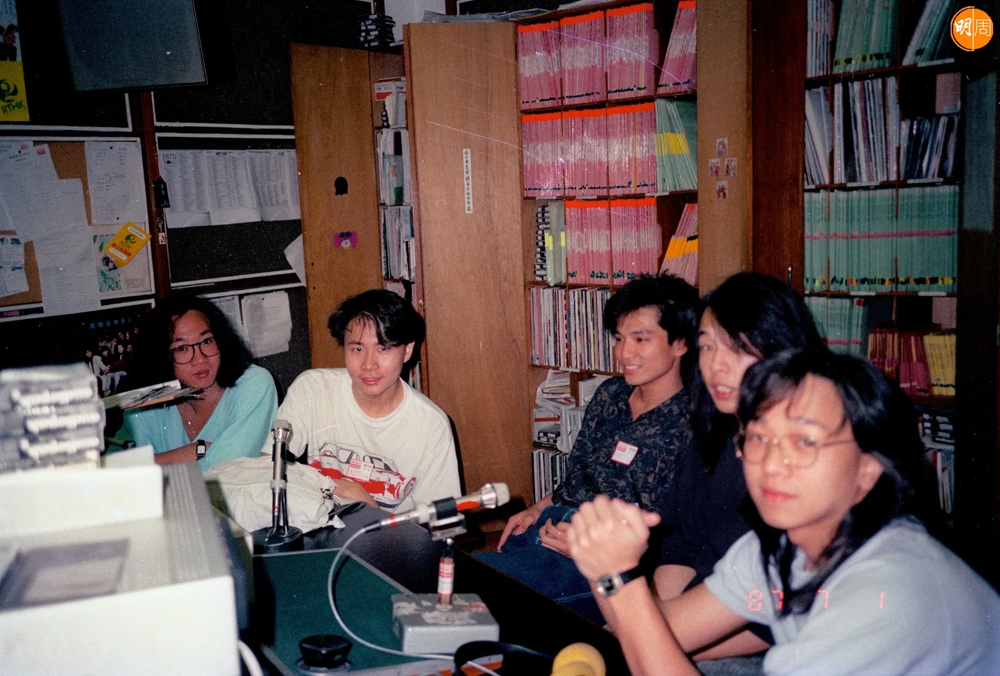

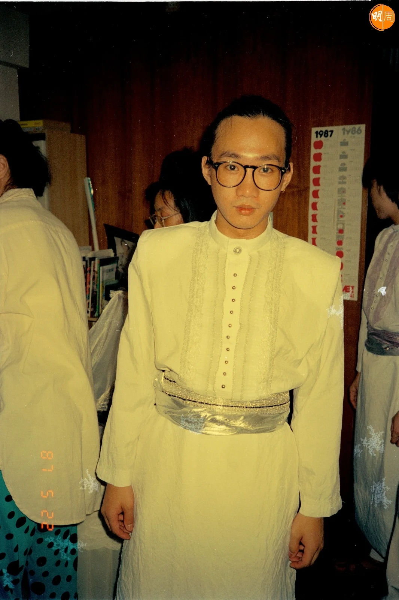

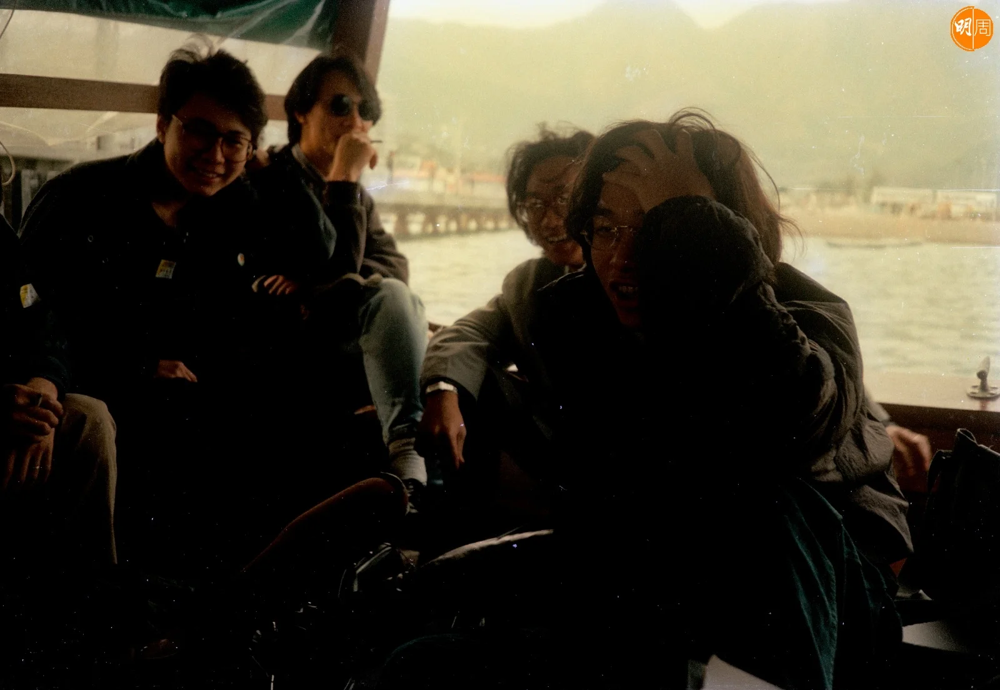

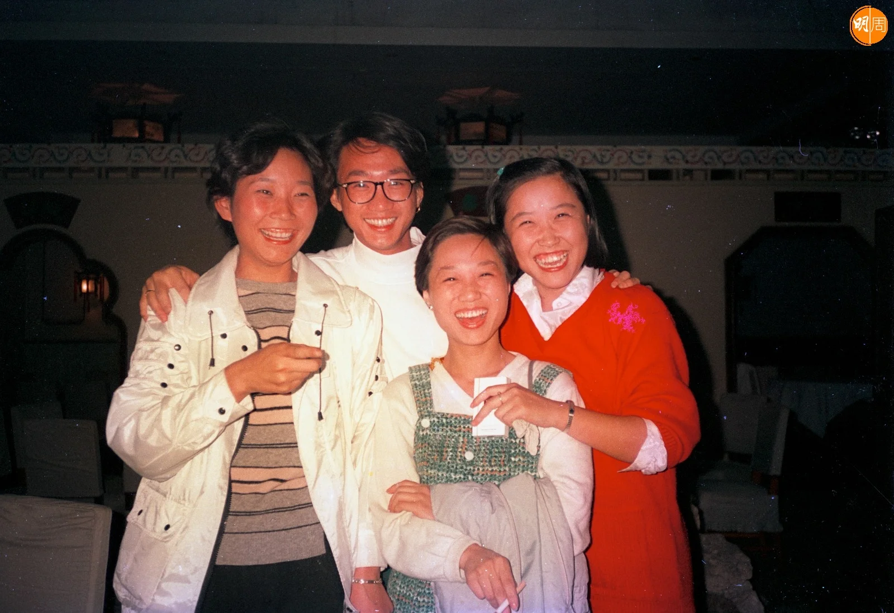

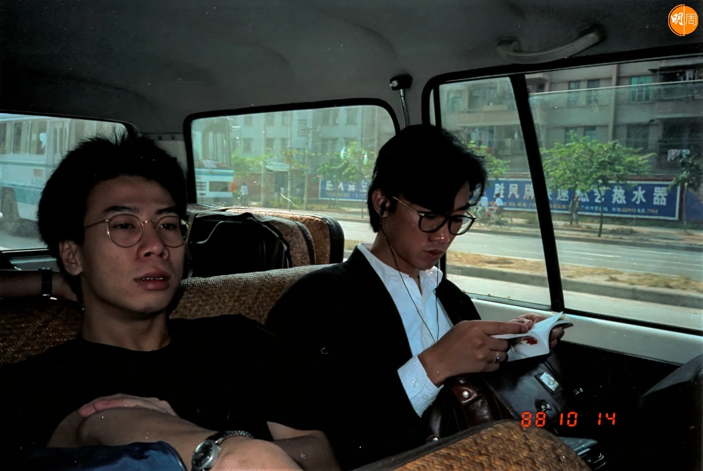

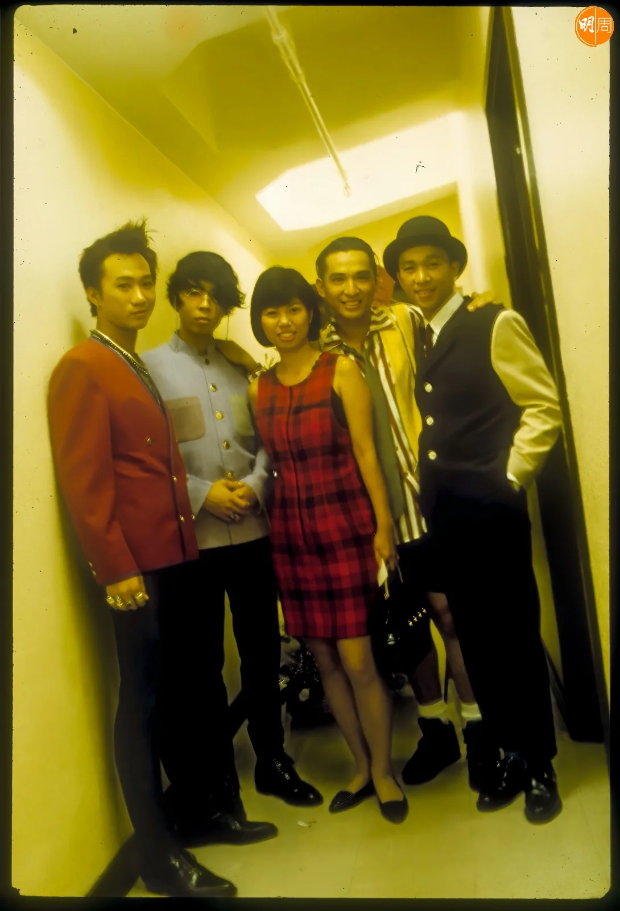

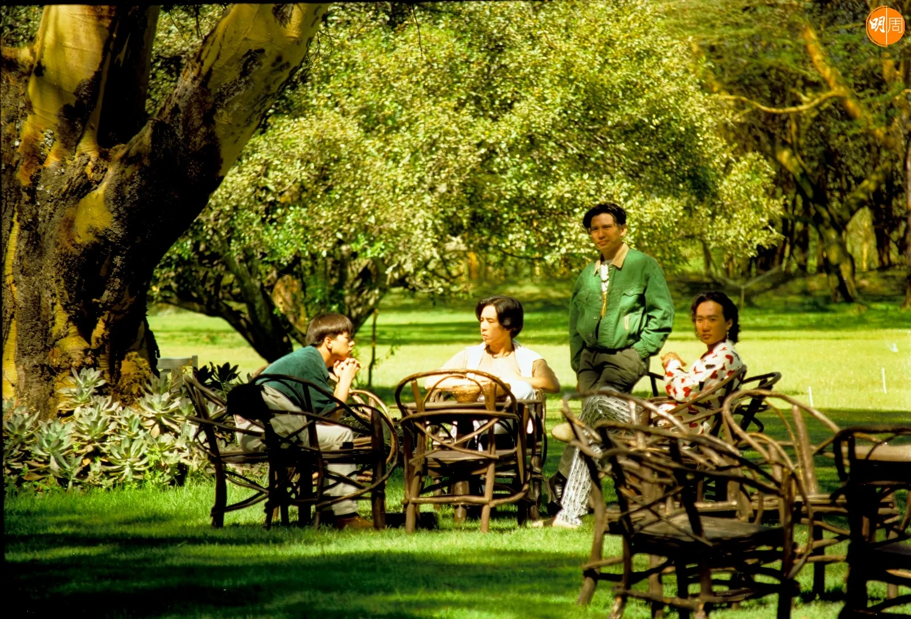

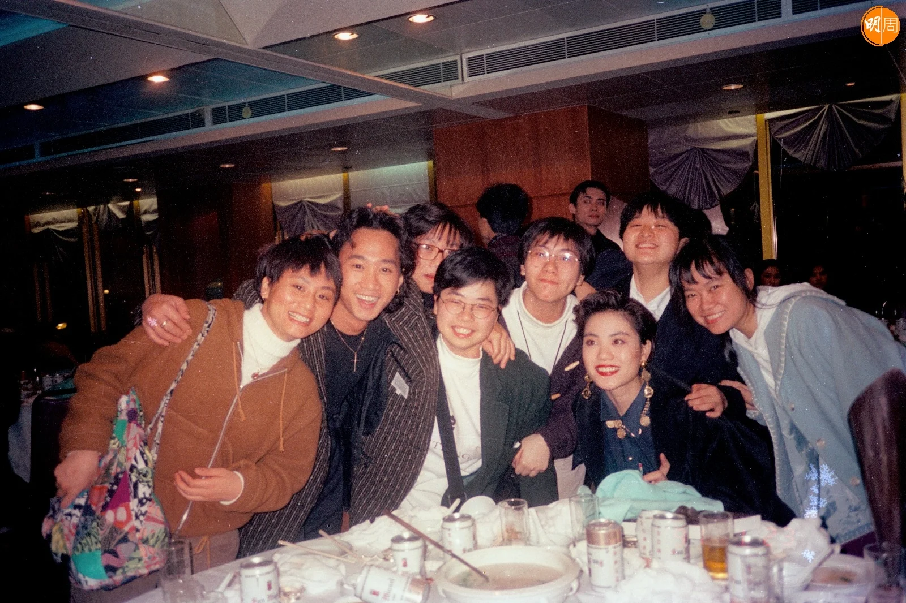
