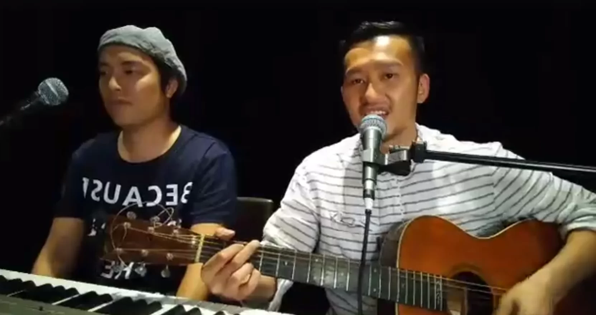
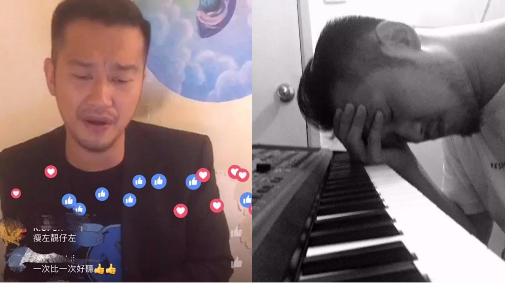
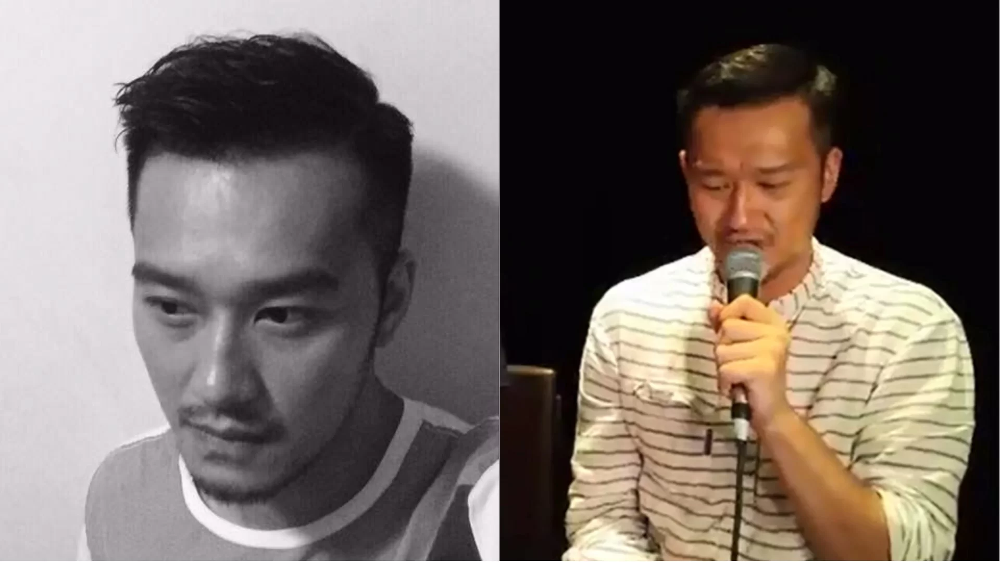

男歌手吳浩康(Deep)日前又在社交網進行深夜唱歌直播《Deep Nite Show》，觀看人數高達3萬人。片段可見，是夜的直播主題為Beyond，吳浩康演唱了《喜歡妳》、《海闊天空》、《誰伴我闖盪》、《聲音》、《再見理想》、《聲音》等經典歌曲。吳浩康在直播中表示，其實有不少人誤把《喜歡妳》檔作「冧女」歌，而這首其實是失戀歌。

Deep選擇向直播活動中不停按「嬲」的人作出友善回應，他認為自己確實參考了黃家駒的唱腔，但希望聽眾可以留言說更多的意見，讓他可以自我檢討和進步。看來時間真的可以令人變得成熟，舊日的孩子王吳浩康，懂得沉住氣面對批評，到了今天終於不再《討厭》。

