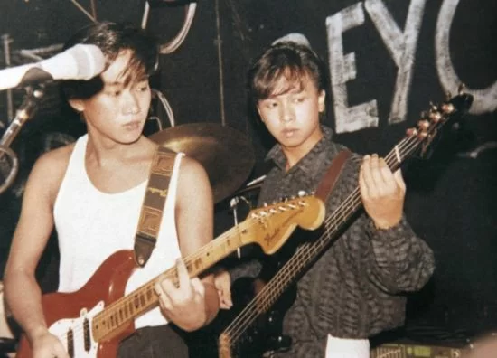

如果要說，Beyond成員黃家駒離去是香港樂壇的損失，絶對是沒錯的！試想想如果他還在，相信香港樂壇更多姿多采！ 昨天6月10日是Beyond的黃家駒55歲生忌，不少歌迷不單止在家駒墓前懷緬外 ，作為隊友及兄弟的葉世榮、黃貫中（Paul）及黃家強也分別在社交網上發文懷念。Paul上載了一張大合照並留言：「家駒無論你在那裡，兄弟們祝你生日快樂！」而世榮就留言「家駒生日快樂」，可見他們對家駒有無限的掛念。

另外，家駒的弟弟黃家強，也有在社交網上發文懷念哥哥：「我們都老了，孩子都十歲、五歲了，孩子們多希望有你看着他們成長，有你跟他們分享音樂，大兒子現在開始吹小號，他拿甚麼笛子，小號第一天就能夠吹得響，吹出音符，這點應該不是我的遺傳吧，我就是怎樣努力吹，吹到咳也沒有一個音，哈哈，不像你以前拿着笛子吹，一吹就會，在現場演奏long way without friends, 沙丘魔女，還在我腦海裏面轉，看着兒子吹小號，特別想念你，回憶都是美好的，祝你生日快樂，我們都愛你。」

