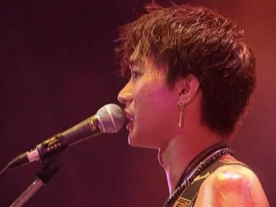

「背棄了理想 誰人都可以 那會怕有一天只你共我」《海闊天空》一曲，成為了我們香港人的主題曲，今天是香港殿堂級樂隊Beyond主音黃家駒逝世24周年，於1993年出席日本綜藝節目時意外從高台墮地，延至同年6月30日逝世。當年大家因為這位英年早逝的樂壇巨星感到婉惜，更有不少人認為他的離去影響了整個樂壇。

今天，大家再唱起《海闊天空》又會有什麼感覺？此曲以追求夢想為主題，詞中抒發了當大家受到挫折、動搖甚至要背棄理想的感慨。當時Beyond受到唱片公司限制，無法真正自由創作，導致他們對香港樂壇失望，決定遠走日本發展，但在日本卻也飽受挫折，令Beyond感到非常無奈，而黃家駒亦把這種無奈寫成歌曲，至今成為不少年青人的座右銘。

雖然已一年又一年的過去，感覺黃家駒離我們依然很近，除了《海闊天空》外，還有《喜歡你》、《光輝歲月》、《真的愛你》等等都是百聽不厭的。
