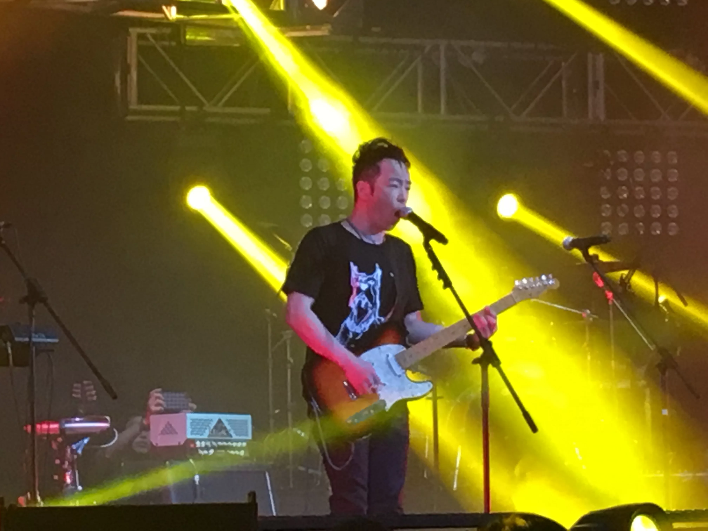
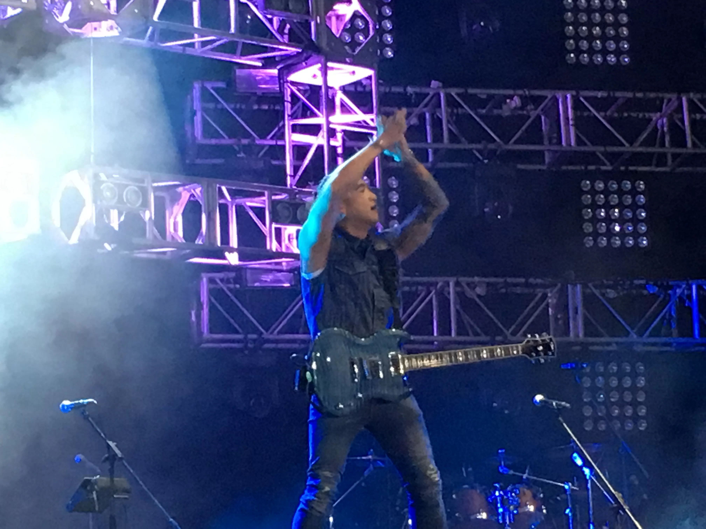
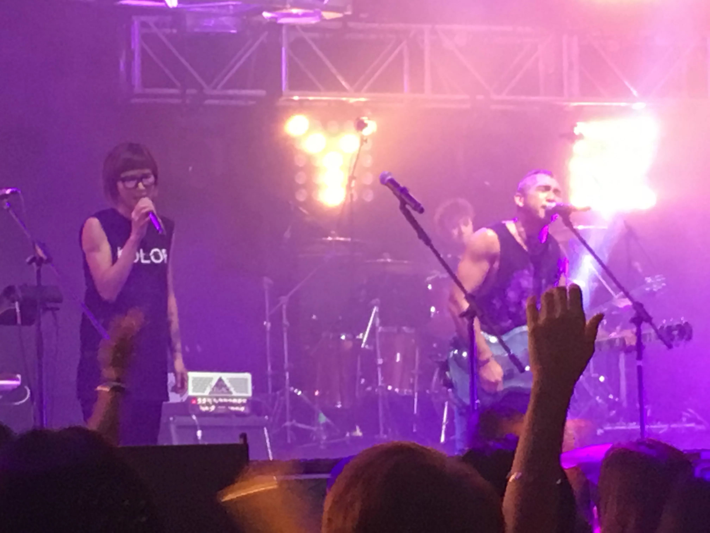

一連三晚在九展Star Hall舉行的《Yes Rock 大混戰音樂節》吸引了一眾搖滾樂迷 到場支持，第一晚先由黃貫中（Paul）率領樂隊Kolor、秋紅、Cassette 打響頭炮，先後唱出多首搖滾歌曲，包括Kolor向家駒致敬的《愚公》 、 《時差》 ，而Paul慨嘆今年很多傳奇音樂人相繼離世，包括Prince、David Bowie及Sound Garden主音Chris Cornell 等等，更唱《Black Hole Sun》 向Chris Cornell致敬。之後，Paul更與眾樂隊一齊唱出Metallica的《Enter Sandman》 、《歲月無聲》 及《永遠等待》 ，令全場氣氛推至頂峰！

*Kolor也有温柔的一面，唱出人與人之間的感覺歌曲《時差》*

*Kolor開騷，作為主音Sammy的太太盧巧音當然上台支持下老公啦！而朱茵亦有現身支持老公黃貫中。*
