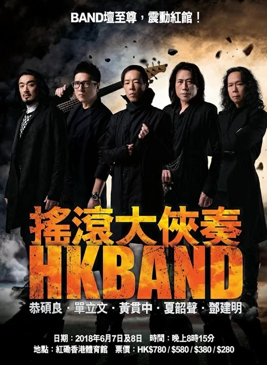
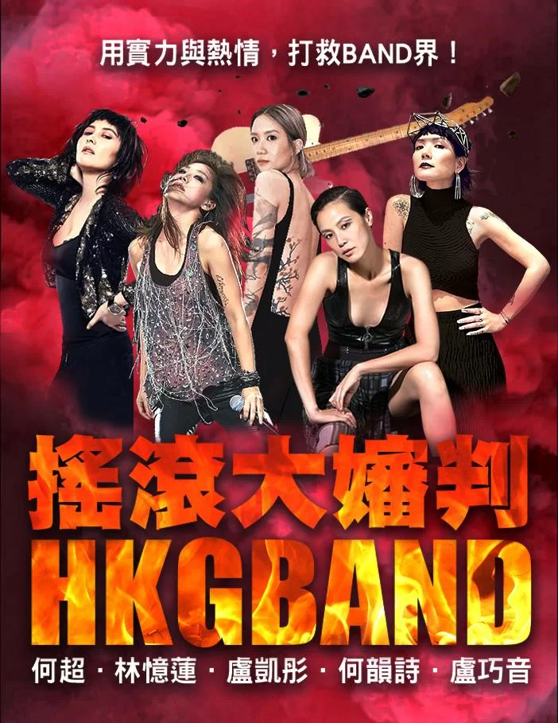
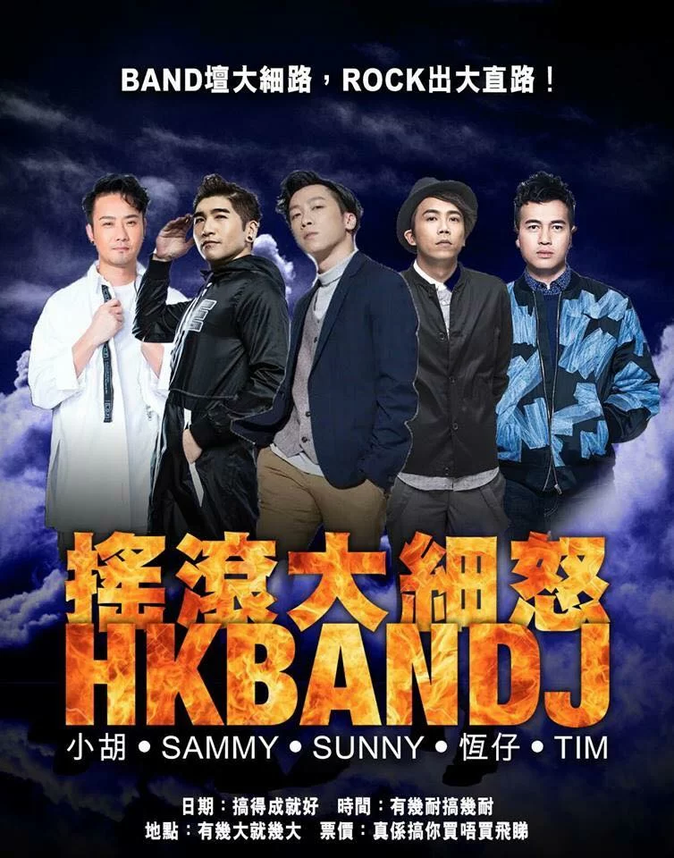

*Joey、Paul、豹哥、夏韶聲同Jun組成HK BAND，準備舉行「搖滾大俠奏」演唱會，大家覺得張海報是有型定搞笑呢?*

*網民將何超儀、林憶蓮、盧凱彤、何韻詩同盧巧音變做「搖滾大嬸」，令人噴飯!*

*後生版「搖滾大細怒」有野佬嘅小胡、Kolor嘅Sammy、Supper Moment嘅Sunny、ToNick嘅恆仔同Dear Jane嘅Tim，都非常爆笑。*

鄧建明（Joey）、黃貫中（Paul）、「豹哥」單立文（Pal）、夏韶聲同恭碩良（Jun）幾位香港樂壇rock友最近組成HK BAND，準備6月7日同8日喺紅磡體育館舉行「搖滾大俠奏」演唱會，張宣傳海報早兩日一出街即大受網民議論紛紛，昨日仲遭惡搞，先後出現由五位香港女歌手拼成都大玩食字嘅「 搖滾大嬸判」同由5個新一代band友砌成嘅「搖滾大細怒」，網民睇見都話笑到肚攣。

5位HK Band「搖滾大俠」主要來自80、90年代嘅香港代表樂隊，Joey係太極成員、Paul以前係Beyond結他手、豹哥以前係Blue Jeans嘅低音結他手、Jun以前係「汗」嘅鼓手，夏韶聲係當中大前輩，70年代尾已入行，以前更加入過日本樂隊Creation，位位係有實力，佢地大合奏開騷食埋字變「大俠奏」係有新鮮感同睇頭。

不過，網民對「搖滾大俠奏」同張海報嘅設計都有唔同反應，有樂迷真心覺得「大俠奏」好襯幾位rock友，亦有網民覺得搞笑，於是拿來惡搞，噚日搞出構圖一樣嘅虛擬演唱會海報「 搖滾大嬸判」，換上係藝名何超嘅何超儀、林憶蓮、盧凱彤、何韻詩同盧巧音，相中盧凱彤仲好似托起支Bass嘅豹哥咁托住支電結他，poster亦將原本句「BAND壇至尊，震動紅館!」變成「用實力與熱情，打救BAND界!」，非常爆笑。不過有網民話「男就係大俠，女就變大嬸，有啲性別歧視之嫌」，其實都係玩食字，將「大審判」變「大嬸判」，大家唔駛咁認真。

除咗「 搖滾大嬸判」外，噚日亦出現惡搞「搖滾大俠奏」嘅後生版「搖滾大細怒」，玩食字亦玩得好爆笑。海報出現新一代香港唔同band成員組成嘅HK BAND J（Junior）， 有樂隊野佬嘅小胡、Kolor嘅Sammy、Supper Moment嘅Sunny、ToNick嘅恆仔同Dear Jane嘅Tim，宣傳口號就變咗「BAND壇大細路，ROCK出大直路!」，相當勵志!
